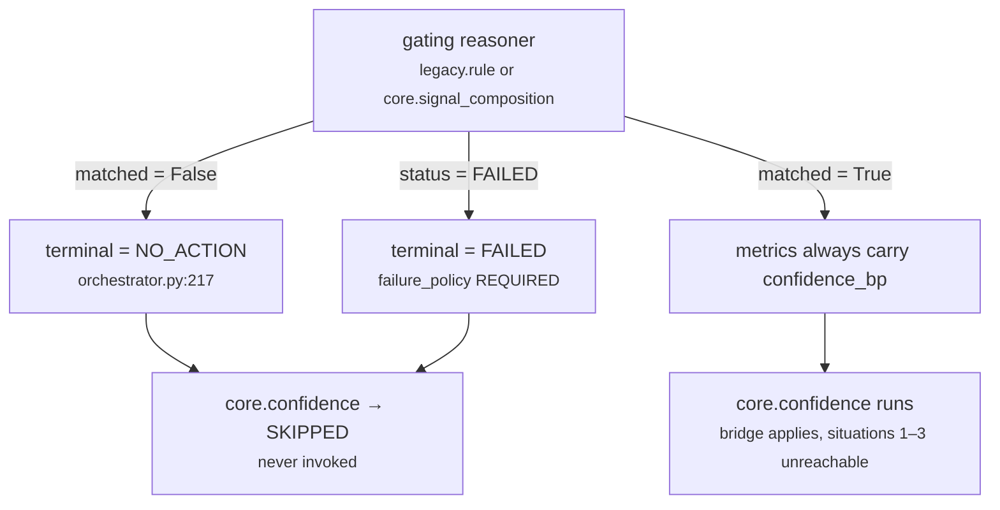

# 03c · Plugin `legacy_bridge`

**Class:** `genios_engine/reason/reasoners/confidence.py:117` — `LegacyBridgePlugin`
**`plugin_id`:** `legacy_bridge` · runs **last** (alphabetical)
**`Observation.kind`:** `confidence.legacy_bridge`
**Emits:** `confidence_bp` · **Reason codes:** none · **Evidence ids:** none

---

## 1 · The claim it makes

> *This capability's author named a reasoner and said "confidence for this decision is that
> reasoner's number". Here is that number, unchanged.*

The class docstring:

> *Used by the strangler packs, where the old rule engine still owns the number and this unit exists
> only to be its single, auditable publisher. The bridge carries the value through unchanged;
> re-deriving it here would mean two different confidences for one decision.*

The point is not compatibility. It is **authority**. `decision_maker.py:calculate_confidence` breaks
its scan at `CONFIDENCE_AUTHORITY`, so whatever this unit publishes is the decision's confidence. A
legacy pack whose rule engine already computed a confidence has two options: re-derive it here and
disagree with itself, or nominate the old engine and have this unit publish its number verbatim. The
bridge is the second option made explicit.

> *The bridge is not a fallback; it is a declaration by the capability author about where confidence
> comes from, so it wins outright and the decomposition axes are not even evaluated.* — module
> docstring, `confidence.py:22`

---

## 2 · The code

```python
# confidence.py:127
def contribute(self, view: UnitView) -> tuple[Observation, ...]:
    bridged = _bridged_confidence_bp(view)
    if bridged is None:
        return ()
    return (Observation(
        plugin_id=self.plugin_id,
        kind="confidence.legacy_bridge",
        metrics={"confidence_bp": bridged},
    ),)
```

Six lines. All the logic lives in the shared accessor:

```python
# confidence.py:82
def _bridged_confidence_bp(view: UnitView) -> int | None:
    source = str(view.config.get("source_reasoner") or "")
    if not source:
        return None
    prior = view.prior.get(source)
    if prior is None or "confidence_bp" not in prior.metrics:
        return None
    return basis_points(prior.metrics["confidence_bp"], "confidence_bp")
```

### Why not `UnitView.prior_metric`

The framework provides a dependency reader, `unit.py:UnitView.prior_metric`, which substitutes a
default when the dependency did not run, did not complete, or published a non-integer. This accessor
deliberately does not use it:

> *Read from `view.prior` directly rather than through `prior_metric`, because the legacy contract is
> stricter than the framework helper: a malformed or out-of-range bridged value is an authoring
> fault that must surface loudly, not be quietly replaced by a default.*

That is the same reasoning `core.risk` gives for its own `_published` accessor. The general rule:
`prior_metric`'s silent default is right for a unit that can proceed without the input, and wrong
for a unit that cannot.

### Dependencies

| Symbol | Defined at | What it does |
|---|---|---|
| `view.config` | `unit.py:124` | `spec.config` — Layer 3's per-capability tuning |
| `view.prior` | `unit.py:119` | **only the reasoners this spec declared as `dependencies`** |
| `basis_points(v, label)` | `common.py:47` | integral value in `0..10_000`, else `ValueError` |

---

## 3 · Config

| Key | Type | Default | Effect |
|---|---|---|---|
| `source_reasoner` | `str` | `""` — absent, `""`, `None`, `0`, `False` and every other falsy value mean *no source declared* | Truthy **and** present in `prior` **and** that result carries `confidence_bp` → this plugin fires and the other two stand down. Anything else → this plugin is silent and the computed branch runs. |

That is the only key this plugin reads, and the only key the whole unit reads.

`str(view.config.get("source_reasoner") or "")` coerces before testing, so a non-string value is
stringified rather than rejected: `123` becomes `"123"`, `["a"]` becomes `"['a']"`. Neither will
match a reasoner id, so both fall through to the computed branch **silently**. See §4.1.

---

## 4 · When it stays silent

Three distinct situations, all collapsing to `_bridged_confidence_bp(view) is None`:

| # | Situation | `source` | `view.prior.get(source)` | Silent? |
|---|---|---|---|---|
| 1 | No `source_reasoner` in config, or a falsy one | `""` | not reached | **yes** — `test_the_bridge_stays_silent_when_no_source_is_configured` |
| 2 | Named source absent from `prior` | truthy | `None` | **yes** — `test_the_bridge_stays_silent_when_the_named_source_did_not_run` |
| 3 | Named source ran but published no `confidence_bp` | truthy | a result without the metric | **yes** — `test_the_bridge_stays_silent_when_the_source_published_no_confidence` |
| 4 | Named source present with `confidence_bp` | truthy | the result | no — fires |

Situation 3 carries its own test comment: *"A source that ran but scored nothing is not a
zero-confidence source."* Silence here means *the declaration does not apply*, so the four axes take
over. It does **not** mean confidence is zero, and it does not mean confidence is neutral.

### 4.1 · Compare with `core.priority`, which decides the opposite way

`core.priority` faces the identical shape — a `source_reasoner` config key, a named prior — and
resolves the "source ran but said nothing" case in the opposite direction: `DeclaredUrgencyPlugin`
**fires** at the neutral midpoint (`priority.py:82`), reasoning that *the capability said to believe
this one unit, so the derived maximum must not take over*.

This unit falls through to the computed branch instead. Both are defensible and the divergence is
undocumented in either module. The practical difference:

| | `core.priority` | `core.confidence` |
|---|---|---|
| Source present, metric absent | fires at `5,000` | **silent** — computed branch runs |
| Source absent from `prior` | silent → derived path | silent → computed branch |
| Result | the declaration is honoured even when empty | the declaration is abandoned when empty |

Because this unit has a genuine fallback computation and `core.priority` does not, falling through is
the better answer here. But a reader who learns the pattern from one unit will get the other wrong.

### 4.2 · No status check, and why that is safe

`_bridged_confidence_bp` never inspects `prior.status`. It does not need to:
`ReasonerResult.__post_init__` (`contracts/reasoning.py:629`) forbids a non-`COMPLETED` result from
carrying metrics at all. A `SKIPPED`, `FAILED` or `INSUFFICIENT_CONTEXT` source therefore reads as an
empty metric map and reaches situation 3 through the same code path as a source that completed with
no opinion. Re-checking status here would be a second, divergent definition of the same rule.

### 4.3 · The gap: a mistyped source is silently ignored

A `source_reasoner` that names a reasoner not in `prior` — because it was mistyped, renamed, or
declared without a matching `dependencies` entry — produces **no error, no reason code, and no
telemetry**. The unit quietly computes a number the capability author explicitly said not to compute,
and the persisted result carries no `source: "legacy"` marker to show that the declaration was
dropped.

The failure is not hypothetical in shape: `orchestrator.py:158` builds `prior` from
`spec.dependencies` alone, so declaring `config={"source_reasoner": "legacy.rule"}` without
`dependencies=("legacy.rule",)` produces exactly this. All four shipped specs declare both
consistently (see [02 · Retriever](02-Retriever.md) §5), so the gap is latent.

`test_the_bridge_stays_silent_when_the_named_source_did_not_run` pins the silence. Nothing pins that
the silence is desirable.

---

## 5 · The arithmetic

There is none. In full:

```
source     = str(config.get("source_reasoner") or "")
bridged    = basis_points(prior[source].metrics["confidence_bp"], "confidence_bp")
confidence_bp = bridged
```

No scaling, no weighting, no clamping beyond the validation. `calculate` then returns it unchanged:

```python
# confidence.py:262
bridged = by_plugin.get(LegacyBridgePlugin.plugin_id)
if bridged is not None:
    return {"confidence_bp": bridged.metrics["confidence_bp"]}
```

`basis_points` is the only transformation, and it is a **type and range** check rather than a value
change:

| Source's `confidence_bp` | `basis_points` result |
|---|---|
| `7300` | `7,300` |
| `Decimal("7300")` | `7,300` |
| `"7300"` | `7,300` |
| `0` | `0` |
| `10000` | `10,000` |
| `10001` | `ValueError` |
| `7300.0` (float) | `ValueError` |
| `True` | `ValueError` |

**The check is unreachable in a real run.** `ReasonerResult.__post_init__` already runs `_bp` over
every metric name ending in `_bp` at construction (`contracts/reasoning.py:617`), so a source result
carrying `confidence_bp: 99_999` cannot be built in the first place.
`test_a_bridged_confidence_is_re_validated_even_though_the_contract_already_guarantees_it` proves
both halves — it asserts the `ReasonerResult` constructor raises, then asserts the plugin passes
`10,000` through. The test's own explanation:

> *It is kept because the pre-framework unit had it, and because the guarantee lives in a different
> module that this one must not depend on quietly.*

That is the right call. The contract could relax; this unit's correctness should not depend on the
contract's current strictness.

---

## 6 · Worked examples

### 6.1 · A legacy strangler rule — the live production path

**Setup.** `reason/adapters/legacy_pack.py:85` compiles **every rule in the legacy pack** into a
capability, and every one declares:

```python
confidence = ReasonerSpec(
    reasoner_id="core.confidence",
    dependencies=("legacy.rule",),
    failure_policy=FailurePolicy.REQUIRED,
    config={"source_reasoner": "legacy.rule"},
)
```

**Upstream.** The rule matched and `engine.py:score_rule` returned `score = 78` with
`inputs = {"C": 62, "U": 64, "I": 81, "R": 44, "terms_bp": 7100}`. `legacy_rule.py:49` converts
percentages to basis points:

```
confidence_bp = int(inputs["C"]) × 100 = 62 × 100 = 6,200
priority_bp   = score × 100            = 78 × 100 = 7,800
urgency_bp    = int(inputs["U"]) × 100 = 64 × 100 = 6,400
```

**This plugin.**

```
source        = "legacy.rule"                                   (truthy)
prior["legacy.rule"] exists and carries confidence_bp           → not None
basis_points(6200, "confidence_bp")                             = 6,200
```

```
Observation(plugin_id="legacy_bridge",
            kind="confidence.legacy_bridge",
            metrics={"confidence_bp": 6200},
            evidence_ids=(), reason_codes=())
```

The other two plugins are silent. `calculate` returns `{"confidence_bp": 6200}`,
`evaluate_meaning` adds `source: "legacy"`, and the final result is:

```
metrics = {"confidence_bp": 6200, "source": "legacy"}
```

Two metrics. No decomposition, because there is nothing to decompose — the number was measured
somewhere else, by rules this unit does not model.

**Round trip.** `62% → 6,200bp` here; `reason/authority.py:65` projects it back with
`(confidence_bp + 50) / 100 = 62` when the legacy score block is rebuilt, and
`deliver/outbox.py:card_confidence_bp` reads that `C` for the interrupt floor. The `+ 50` is
half-up rounding, so the round trip is lossless for any `confidence_bp` that started as a whole
percent.

**Three publishers, one authority.** In a legacy run, `legacy.rule` publishes `confidence_bp = 6,200`,
`legacy.score_gate` republishes it in its own metrics (`legacy_gate.py:41`), and `core.confidence`
publishes it a third time. Only the third is the authority: `calculate_confidence` takes each in
plan order and **breaks** at `core.confidence`, which runs last by dependency. The invariant holds by
execution order, not by declaration — neither legacy reasoner declares a `publishes` tuple, so
`tests/test_unit_roster.py`'s one-publisher-per-metric rule never sees them. Same structural gap the
[Unit Framework README §3.5](../../README.md) records for `urgency_bp`.

### 6.2 · `sales.deal_health` — bridging a composed signal

**Setup.** `packs/capabilities/deal_health.py:35`:

```python
confidence = ReasonerSpec("core.confidence", "1.0.0",
                          dependencies=("core.signal_composition",),
                          config={"source_reasoner": "core.signal_composition"})
```

**Upstream.** `core.signal_composition` composes several open signals for one deal. The strongest
member carries `score_inputs = {"C": 74, ...}`, and `signal_composition.py:62` converts:

```
confidence_bp = _percent_to_bp(74) = 7,400
```

**This plugin.** `basis_points(7400)` → `7,400`. Result metrics:
`{"confidence_bp": 7400, "source": "legacy"}`.

Note the metric value is the literal string `"legacy"` even though nothing legacy is involved. The
marker means *not computed here*, and its wording is frozen because *"changing it would change the
result hash of every legacy strangler decision ever replayed"*.

### 6.3 · The boundaries

| Source's `confidence_bp` | Published | Note |
|---|---|---|
| `0` | `0` | a genuine zero-confidence reading, published as such. Differential case `bridge_taken_at_zero` |
| `7300` | `7,300` | `test_the_bridge_carries_a_named_reasoners_confidence_through_unchanged` |
| `10000` | `10,000` | the ceiling. Differential case `bridge_taken_at_ceiling` |

A bridged `0` is a real and meaningful output: it says the named authority measured no confidence at
all. Contrast with situation 3 in §4, where the metric is *absent* and the unit computes instead.
**Absent and zero are different, and the unit distinguishes them.**

### 6.4 · A bridge that does not apply

```
config = {"source_reasoner": "legacy.rule"}
prior  = {"legacy.rule": COMPLETED, metrics={"score_bp": 8000}}   ← no confidence_bp
facts  = {"deal.status": "open"}, spec.required_fields = ("deal.status",)
```

```
_bridged_confidence_bp → None (situation 3)
legacy_bridge          → ()
coverage_completeness  → fires: completeness_bp 10,000 (1 of 1), coverage 0, groups 0
fact_source_quality    → fires: "deal.status" is a bare string, not a Mapping
                         → both lists empty → 5,000 / 5,000

confidence_bp = half_up(5,000×40 + 10,000×30 + 5,000×20 + 0×10, 100)
              = half_up(200,000 + 300,000 + 100,000 + 0, 100)     = 6,000
metrics       = the full six-metric decomposition; NO `source` key
```

Differential case `bridge_named_but_source_published_no_confidence`, hash-pinned against the
pre-framework implementation. The absence of `source: "legacy"` is the only signal in the persisted
result that the declared bridge was dropped — an auditor has to notice a missing key rather than read
a stated fact.

### 6.5 · A malformed fact under an applied bridge

```
config = {"source_reasoner": "legacy.rule"}
prior  = {"legacy.rule": COMPLETED, metrics={"confidence_bp": 6100}}
facts  = {"deal.status": {"value": "open", "confidence_bp": "not a number"}}
```

The run **succeeds** at `confidence_bp = 6,100`. `FactSourceQualityPlugin` returns `()` before it
reads a single fact, so `basis_points("not a number")` is never called. Without per-plugin bridge
testing this run would fail on a fact that plays no part in its answer.
`test_the_decomposition_plugins_stand_down_when_the_bridge_applies`.

---

## 7 · Where the bridge actually fires in production

| Capability | Bridge configured? | Branch taken **when the unit runs** |
|---|---|---|
| `sales.deal_cooling` | no | computed, always |
| `sales.deal_cooling_full` (v2) | no | computed, always |
| `sales.deal_health` | `core.signal_composition` | **bridged, always** |
| every compiled legacy rule | `legacy.rule` | **bridged, always** |

"Always" is provable rather than probable, and the mechanism is the gating chain:



`legacy.rule` returns `matched=False` **with no metrics at all** when its rule does not fire
(`legacy_rule.py:45`) — but it is declared `gating=True`, so the orchestrator sets
`terminal = NO_ACTION` and every later step, including this unit, becomes `SKIPPED` without being
called. `core.signal_composition` is `gating=True` for the same reason in `deal_health.py:20`. A
matched gating reasoner always populates `confidence_bp`.

**So the bridge's fall-through path — situations 1 to 3 in §4 — is unreachable in every shipped
capability that configures a bridge.** It is exercised only by the tests and by any future capability
that names a non-gating source. That is a good position to be in: the two branches are statically
determined per capability rather than varying run to run.

---

## Related

- [03 · Analyzer](03-Analyzer.md) — why every plugin re-tests the bridge condition itself
- [03a · `coverage_completeness`](03a-plugin-coverage_completeness.md) · [03b · `fact_source_quality`](03b-plugin-fact_source_quality.md) — the branch this one excludes
- [04 · Calculator](04-Calculator.md) — the pass-through, and why it is not blended
- [05 · Evaluator](05-Evaluator.md) — where `source: "legacy"` is attached
- [06 · Builder and Metrics](06-Builder-and-Metrics.md) — `calculate_confidence` and the authority scan
