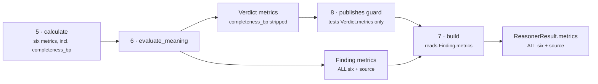
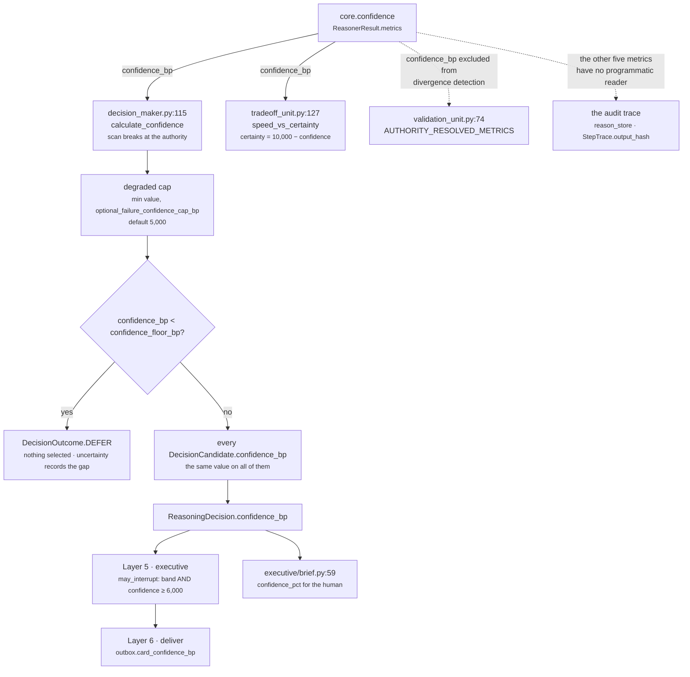

# 06 · Builder and Metrics

**Stage 7 — Builder:** `confidence.py:ConfidenceReasoner.build` (line 314) — **overridden**
**Stage 8 — Metrics:** `confidence.py:ConfidenceReasoner.publishes` (line 238) — declared

---

## 1 · What it is for

The Builder assembles the one object shape every unit returns. The Metrics stage is not code at all —
it is a class attribute that the framework enforces, so what a unit publishes is *declared* rather
than discovered by reading its body.

This is the only unit in the seventeen-unit roster that overrides `build`, and it does so for two
independent reasons, both stated in its docstring.

---

## 2 · The override

```python
# confidence.py:314
def build(self, view, verdict, observations) -> ReasonerResult:
    """Assemble the result from the decomposition finding rather than from the verdict."""
    decomposition = verdict.findings[0]
    return ReasonerResult(
        reasoner_id=self.unit_id,
        reasoner_version=self.version,
        status=ResultStatus.COMPLETED,
        matched=verdict.matched,
        metrics=decomposition.metrics,
        findings=verdict.findings,
        adjustments=verdict.adjustments,
        checks=verdict.checks,
        reason_codes=verdict.reason_codes,
    )
```

Against the base implementation:

```python
# unit.py:223
def build(self, view, verdict, observations) -> ReasonerResult:
    evidence = set(view.evidence_ids)
    for observation in observations:
        evidence.update(observation.evidence_ids)
    return ReasonerResult(
        ...,
        metrics={name: clamp_bp(value) if name.endswith("_bp") else value
                 for name, value in verdict.metrics.items()},
        ...,
        evidence_ids=tuple(sorted(evidence)),
        reason_codes=verdict.reason_codes,
    )
```

Three differences:

| | Base | This unit |
|---|---|---|
| Metrics source | `verdict.metrics` | `verdict.findings[0].metrics` |
| `_bp` clamping | every `_bp` metric through `clamp_bp` | none |
| `evidence_ids` | union of the view's and every observation's | omitted → `()` |

### 2.1 · Metrics from the finding

> *The finding carries the full decomposition, including `completeness_bp`, which cannot appear in
> `verdict.metrics` because it is not declarable in `publishes`. The result and the finding
> therefore carry identical metric maps, exactly as they always have.*

This is the second half of the guard workaround begun in
[05 · Evaluator](05-Evaluator.md) §4.2. The round trip:



The guard inspects `verdict.metrics` and never sees `completeness_bp`; the result is assembled from
the finding and carries it. `test_completeness_is_emitted_but_undeclared_and_that_is_recorded` and
`test_the_decomposition_travels_beside_the_score` pin both halves —
`dict(finding.metrics) == dict(result.metrics)`.

**The fragility.** `verdict.findings[0]` is a positional index with nothing behind it. It is correct
only because `evaluate_meaning` emits exactly one finding, and neither method asserts that. A future
edit that prepended a second finding would produce a result whose `metrics` are the *other*
finding's, silently, with no test failing unless it happened to check the metric map. A
`next(f for f in verdict.findings if f.finding_id == "confidence.decomposition")` would cost one line
and remove the hazard.

### 2.2 · No clamping

The base builder runs `clamp_bp` over every `_bp` metric. This one does not, and the difference is
observable in exactly one direction: an out-of-range `_bp` value would be **silently truncated** by
the base and **loudly rejected** here, because `ReasonerResult.__post_init__` runs `_bp` over every
`_bp`-suffixed metric at construction (`contracts/reasoning.py:617`) and raises.

The stricter behaviour is the right one, and the [Unit Framework README §3.7](../../README.md) says
so about the base:

> *A float `_bp` metric in a `Verdict` is quietly truncated instead of rejected, while a float in any
> non-`_bp` metric is loudly rejected one layer later. The stricter of the two behaviours is the
> right one.*

Whether the omission was reasoned or incidental is not recorded. `calculate` already clamps
`confidence_bp`, and every other `_bp` metric is bounded by construction, so no legal input reaches
either path.

---

## 3 · The result

### 3.1 · Computed branch

```python
ReasonerResult(
    reasoner_id="core.confidence",
    reasoner_version="1.0.0",
    status=ResultStatus.COMPLETED,
    matched=None,
    metrics={"confidence_bp": 8000, "source_quality_bp": 8500, "completeness_bp": 7500,
             "corroboration_bp": 9250, "evidence_coverage_bp": 5000,
             "independent_evidence_groups": 2},
    findings=(Finding("confidence.decomposition", "confidence",
                      metrics=<the same six>, reason_codes=("confidence_computed",)),),
    adjustments=(),
    checks=(),
    evidence_ids=(),
    missing_fields=(),
    reason_codes=("confidence_computed",),
)
```

### 3.2 · Bridged branch

```python
ReasonerResult(
    reasoner_id="core.confidence",
    reasoner_version="1.0.0",
    status=ResultStatus.COMPLETED,
    matched=None,
    metrics={"confidence_bp": 7300, "source": "legacy"},
    findings=(Finding("confidence.decomposition", "confidence",
                      metrics={"confidence_bp": 7300, "source": "legacy"},
                      reason_codes=("confidence_computed",)),),
    adjustments=(), checks=(), evidence_ids=(), missing_fields=(),
    reason_codes=("confidence_computed",),
)
```

### 3.3 · Invariants across every run

| Field | Value | Always? |
|---|---|---|
| `status` | `COMPLETED` | **yes** — the unit has no failure outcome of its own; a `ValueError` from a plugin is converted to `FAILED` by the orchestrator, not by this method |
| `matched` | `None` | **yes** |
| `reason_codes` | `("confidence_computed",)` | **yes** |
| `adjustments` | `()` | **yes** — this unit never touches a candidate's score |
| `checks` | `()` | **yes** — this unit never eliminates a candidate |
| `evidence_ids` | `()` | **yes** — see §4 |
| `missing_fields` | `()` | **yes** — the constructor default; the unit never raises `MissingContextError` |
| `metrics` | 6 keys or 2 keys | branch-dependent |

Metric key order does not matter: `platform/canonical.py:canonical_dumps` serialises with
`sort_keys=True`, so `semantic_hash` is order-independent.
`test_the_same_situation_twice_is_byte_identical` and `test_config_key_order_cannot_change_the_result`
pin determinism from both directions.

---

## 4 · Evidence — deliberately none

> *This unit reasons **about** the evidence in aggregate — how many independent groups exist — rather
> than **from** any particular item, so attaching the ids of every field it counted would assert a
> provenance it does not actually claim.*

That is a precise and unusual claim, and it is right. `evidence_coverage_bp = 5,000` is not supported
by `ev_crm` and `ev_mail` individually; it is supported by *the fact that there are two of them from
different groups*. Citing them would invite a reader to click through to `ev_crm` expecting to find
the reason confidence was 80%, and find a CRM row that says nothing about confidence at all.

`test_the_result_reports_a_reading_rather_than_a_verdict` asserts `result.evidence_ids == ()`.

**What it costs.** `decision_maker.py:aggregate_evidence` unions the evidence ids from every result,
every finding and every adjustment into the candidate's `evidence_ids`. This unit contributes
**nothing** to that union. In a decision where `core.confidence` is the only unit that looked at the
evidence list at all, the confidence figure travels to the human with no citations of its own —
though in practice the other units in the plan cite the same rows for their own reasons.

The base builder *would* have attached ids: `view.evidence_ids` is populated (see
[02 · Retriever](02-Retriever.md) §2.1), so the override is what makes the emptiness true. It is one
of the two reasons `build` exists.

---

## 5 · `publishes` — the declared contract

```python
# confidence.py:238
publishes = ("confidence_bp", "source", "source_quality_bp", "corroboration_bp",
             "evidence_coverage_bp", "independent_evidence_groups")
```

| Metric | Type · range | Meaning | Emitted when |
|---|---|---|---|
| `confidence_bp` | int, 0–10,000 | How much to trust the rest of this reasoning. `7,500bp` means 0.75. | **always** |
| `source` | **str**, `"legacy"` | The number came from the reasoner the capability named, not from this unit's axes | bridged only |
| `source_quality_bp` | int, 0–10,000 | Unweighted mean of the present facts' own stated confidence; `5,000` when none stated one | computed only |
| `corroboration_bp` | int, 6,000–10,000 in practice, 5,000 when no record was seen | Mean of the `src_count` ladder over present mapping-shaped facts | computed only |
| `evidence_coverage_bp` | int, 0–10,000 in steps of 2,500 | Independent evidence groups × 2,500, saturating at four | computed only |
| `independent_evidence_groups` | int, ≥ 0, **uncapped** | The raw group count, so saturation is visible | computed only |

Plus one emitted and not declared:

| Metric | Why it is not in `publishes` |
|---|---|
| `completeness_bp` (int, 0–10,000) | `core.context` already declares it; the roster permits one declared publisher per name. Recorded in `UNDECLARED_METRICS`. |

`corroboration_bp`'s practical range is worth restating: because the ladder floors at 6,000, a
computed run that saw at least one mapping-shaped fact can never report less than 6,000 on this axis.
Only a run where *no* fact record was a `Mapping` reports the neutral 5,000. So the value `5,500` is
unreachable and `3,000` is impossible — the metric's distribution is `{5,000} ∪ [6,000, 10,000]`.

### 5.1 · The roster invariants that bind this declaration

`tests/test_unit_roster.py` enforces three things about this tuple:

| Invariant | Test | What it prevents |
|---|---|---|
| The unit declares something | `test_framework_units_declare_a_category_and_plugins` | *"a unit with no plugins is a monolith wearing the framework"* — and an empty `publishes` disables the guard entirely |
| Exactly one declared publisher per metric name | `test_no_unit_publishes_a_metric_another_unit_owns` | two writers of one name, which `core.validation` would later report as a contradiction in the reasoning |
| Only this unit declares `confidence_bp` | `test_only_the_named_authority_publishes_a_shared_decision_metric` | *"every ranked decision in the system would silently re-score the day that unit joined a capability"* |

The third has a hole the framework README records at §3.5 and this unit lives with: the roster test
reads `getattr(instance, "publishes", ())`, and the six **supplementary** reasoners declare no such
attribute. `legacy.rule` (`legacy_rule.py:50`) and `legacy.score_gate` (`legacy_gate.py:48`) both put
`confidence_bp` in their result metrics and are invisible to the rule.

That is fine, and it is fine for a reason worth writing down. `decision_maker.py:calculate_confidence`
does not take the last `confidence_bp` it sees — it scans in plan order and **breaks** at the
authority:

```python
# decision_maker.py:127
for result in results:
    if result.status == ResultStatus.COMPLETED and "confidence_bp" in result.metrics:
        value = clamp_bp(result.metrics["confidence_bp"])
    if result.reasoner_id == authority and result.status == ResultStatus.COMPLETED:
        break
```

In a legacy run three results carry `confidence_bp` and this unit's is the one that stands, because
it runs last by dependency (`core.confidence` depends on `legacy.rule`; `core.planning` depends on
`core.confidence`). **The invariant is preserved by execution order rather than by the test that
claims to enforce it.** Worth knowing before someone reorders a plan.

The authority itself is overridable per capability through the `confidence_authority` metadata key
(`decision_maker.py:59`), so the rule is "exactly one publisher", not "this unit forever".

---

## 6 · Who consumes what

Verified by grep across `genios_engine/`.



### 6.1 · `confidence_bp` — four consumers

| Consumer | Where | What it does with it |
|---|---|---|
| **The Decision Maker** | `decision_maker.py:115` | resolves the one confidence for the whole decision; capped at `optional_failure_confidence_cap_bp` (default 5,000) when a run is degraded, then compared against `confidence_floor_bp` |
| **`core.tradeoff`** | `tradeoff_unit.py:127` | `SpeedVersusCertaintyPlugin` reads it through the `certainty_source` config key, defaulting to `"core.confidence"`, and inverts it: *"The case for waiting is exactly as strong as our remaining doubt"* — `certainty = clamp_bp(10,000 − confidence_bp)` |
| **`core.validation`** | `validation_unit.py:74` | lists it in `AUTHORITY_RESOLVED_METRICS` so multiple publishers of it are **not** reported as a contradiction: *"Disagreement there is resolved by design, so flagging it as a contradiction would report the system working as intended as a fault"* |
| **The store** | `store.py:867` | re-derives the decision confidence from the persisted reasoner effects and refuses the write if it differs — `"decision confidence differs from deterministic reasoner effects"` |

**It is not part of the ranking formula.** `decision_maker.py:score_candidate` weights impact,
success, urgency, effort and risk — confidence appears nowhere in it. `build_candidate_objects`
stamps the same `confidence_bp` onto every candidate. So confidence **cannot reorder a ranking**; it
scales the whole field's reported certainty and, below the floor, converts the decision into a
question. That is the intended separation: how sure we are is a property of the situation, not of a
particular play.

Downstream of the decision, it becomes `confidence_pct` in the executive brief
(`executive/brief.py:59`), gates phone interruptions in `executive/communication.py:99`
(`may_interrupt` requires both a loud band **and** `confidence_bp ≥ interrupt_min_confidence_bp`,
default `6,000` in `communication.py:56` and `packs/sales_v1.py:57`), and reaches Layer 6 through
`deliver/outbox.py:card_confidence_bp`.

### 6.2 · The other five metrics — no programmatic consumer

`source`, `source_quality_bp`, `corroboration_bp`, `evidence_coverage_bp`,
`independent_evidence_groups` and the undeclared `completeness_bp` are read by **nothing** in the
engine. They exist for the persisted trace and for a human reading it.

That is a legitimate purpose — *"a bare `confidence_bp` is an assertion; the decomposition beside it
is an explanation"* — but three consequences follow:

1. Changing any of the five moves `confidence_bp` only through the blend. There is no second path.
2. They still enter `StepTrace.output_hash` and `ReasonerResult.semantic_hash`, so changing one
   changes every replayed decision hash. They are load-bearing for **replay** while being inert for
   **behaviour**.
3. `completeness_bp` alone has a live downstream risk, and it is the risk of the *name*, not the
   value: `core.validation` compares same-named `_bp` metrics across publishers, and this one is not
   on the authority-resolved exemption list. See [05 · Evaluator](05-Evaluator.md) §4.2.

---

## 7 · The confidence floor, and whether it can fire

`sales.deal_cooling_full` is the only shipped capability that declares one:

```python
# deal_cooling_v2.py:176
"confidence_floor_bp": 4_500,
```

with the comment *"Below this, a winner is a question for a human rather than a recommendation. The
floor is what turns Law 03 from a principle into behaviour."* When it bites,
`decision_maker.py:383` converts `DecisionOutcome.DECISION` into `DEFER`, keeps the ranked field for
the human to see, selects nothing, and records `below_confidence_floor:<value><<floor>` in
`uncertainty`.

**On this capability's computed branch, it cannot bite.** The arithmetic:

```
completeness_bp is pinned at 10,000
   — the spec declares four required_fields with failure_policy REQUIRED, so
     orchestrator.py:178 terminates the run rather than letting a thin snapshot through.
   — see 01-Input-and-Validator §5.1.

corroboration_bp ≥ 6,000 whenever any present fact is mapping-shaped
   — the ladder floors at _CORROBORATION_SINGLE_BP.

evidence_coverage_bp ≥ 2,500 on the native path
   — adapters/native.py:103 writes independence_group="unattributed" rather than None,
     so a non-empty evidence list always yields at least one group.

source_quality_bp ≈ 5,000 at worst realistic
   — runner.py:100 writes float(confidence) or 0.5 when the column is NULL.

confidence_bp ≥ half_up(5,000×40 + 10,000×30 + 6,000×20 + 2,500×10, 100)
            = half_up(200,000 + 300,000 + 120,000 + 25,000, 100)
            = half_up(645,000, 100)
            = 6,450          ≫ 4,500
```

To reach the floor, `source_quality_bp` would have to fall below **125bp** with that profile:

```
sq × 40 + 300,000 + 120,000 + 25,000 = 450,000   →   sq × 40 = 5,000   →   sq = 125
```

That means every self-reporting fact in the snapshot claiming under 1.25% confidence. And the
degraded path does not help: `calculate_confidence` caps a degraded run at
`optional_failure_confidence_cap_bp`, whose default is `5,000` — still above the 4,500 floor.

**So the one shipped confidence floor is, today, inert.** It is not wrong; it is a safety gate whose
trigger the deployment configuration has made unreachable. The direct cause is compromise 1 in the
[README §8](README.md): the same `required_fields` declaration that turns a thin snapshot into an
`INSUFFICIENT_CONTEXT` also removes the axis that would have driven confidence low enough for the
floor to matter. Fixing either one makes the other live.

---

## 8 · Edge cases

| Situation | Result |
|---|---|
| Bridged at `0` | `{"confidence_bp": 0, "source": "legacy"}`; `COMPLETED`, `matched=None`. A real zero-confidence decision |
| Bridged at `10,000` | passes through; no clamp is exercised |
| Computed with every field absent | six metrics, `confidence_bp = 3,000` |
| Plugin raises `ValueError` | `build` never runs; `orchestrator._evaluate` returns `FAILED` with the exception in `diagnostics`, which is outside `to_semantic_dict` and cannot move a hash |
| A seventh metric added to `calculate` | `ValueError` from the guard before `build` is reached, unless `publishes` is widened |
| A second finding added ahead of the decomposition | `build` silently uses the wrong metric map — §2.1 |
| Unit returns `SKIPPED` | impossible: `build` hardcodes `COMPLETED`. Had it not, `orchestrator.py:210` would overwrite the result with `FAILED` carrying `reasoner_returned_skipped` |
| Two runs of the same frozen situation | byte-identical `semantic_hash` — `test_the_same_situation_twice_is_byte_identical` |
| Capability config re-ordered by a JSON round trip | identical hash — `test_config_key_order_cannot_change_the_result` |

---

## 9 · The migration contract

The unit was moved onto the `ReasoningUnit` framework, and the test file's headline claim is that the
move changed nothing:

> *A differential test runs the pre-framework implementation and the migrated one over the same
> requests and asserts `ReasonerResult.semantic_hash` matches, so the refactor provably changed no
> output.*

`tests/test_unit_confidence.py:71` holds `_FrozenConfidenceReasoner`, a verbatim copy of the
pre-migration class at commit `2f77657`, kept in the test file rather than imported *"because it
survives the rewrite, and it keeps the oracle's exact bytes visible to a reviewer who is asked to
trust the equivalence claim."*

`_differential_cases()` runs **18 named situations** through both, chosen to reach every branch:

| Group | Cases |
|---|---|
| The shipped capability | `deal_cooling_partial_facts`, `deal_cooling_no_facts_at_all`, `deal_cooling_every_field_present` |
| The bridge, taken | `bridge_taken`, `bridge_taken_at_zero`, `bridge_taken_at_ceiling` |
| The bridge, not taken | `bridge_named_but_source_absent`, `bridge_named_but_source_published_no_confidence`, `bridge_configured_empty` |
| Declaration shapes | `no_config_no_fields`, `capability_fields_fallback` |
| Fact shapes | `scalar_facts_only`, `ratio_confidences`, `boundary_confidences`, `rounding_half_up_on_three_fields` |
| Evidence shapes | `no_evidence`, `unattributed_evidence`, `saturating_evidence_coverage` |

Each asserts `semantic_hash` equality plus the metric map, `matched`, `reason_codes` and
`evidence_ids` individually. `semantic_hash` covers status, matched, metrics, findings, adjustments,
checks, evidence ids, missing fields and reason codes — *"so one equality here is the full
equivalence claim, not a spot check."*

Two behaviours are pinned as **preserved rather than fixed**, and both are worth remembering before
anyone tidies this module:

- `test_a_malformed_fact_still_fails_the_run_exactly_as_it_used_to` — a fact whose stated confidence
  is unparseable takes the whole run down instead of degrading.
- `test_a_capability_that_never_declared_this_unit_is_refused_by_both` — `active_spec` raises for a
  capability that does not declare `core.confidence`.

---

## Related

- [05 · Evaluator](05-Evaluator.md) — where the finding is built and `completeness_bp` is stripped
- [04 · Calculator](04-Calculator.md) — the arithmetic behind `confidence_bp`
- [02 · Retriever](02-Retriever.md) — the evidence ids this stage refuses
- [Decision Maker](../../../03-Decision-Maker/README.md) — `calculate_confidence`, the degraded cap, the floor
- [Unit Framework §3.4](../../README.md) — the `publishes` guard and this unit's documented escape from it
