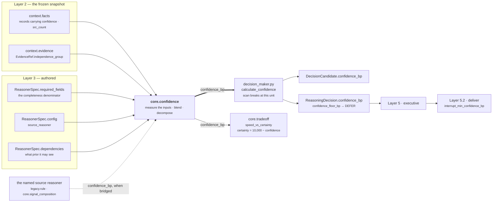
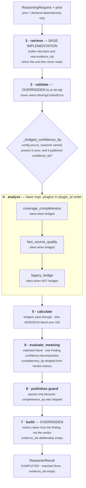
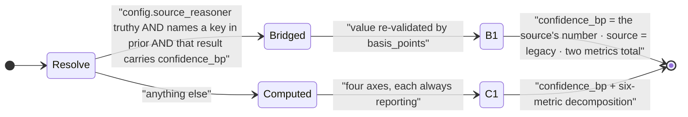

# `core.confidence` — the Confidence Authority

**Unit id:** `core.confidence` · **version** `1.0.0` · **category** `BUSINESS_EVALUATION`
**Source of truth:** `genios_engine/reason/reasoners/confidence.py` (343 lines)
**Class:** `confidence.py:ConfidenceReasoner` (line 226)
**Tests:** `tests/test_unit_confidence.py` (667 lines) — 34 test functions, **59 cases, all passing**
**Registered:** `reason/reasoners/__init__.py:45` in the `BUSINESS_EVALUATION` tuple

```
cd /Users/rohitswerashi/genios-brain && .venv/bin/python -m pytest tests/test_unit_confidence.py -q
59 passed in 0.09s
```

---

## 1 · What it is for

**The business question:** *how much should anyone trust the rest of this reasoning?*

Every other unit reports what it found. This one reports how much of that finding rests on solid
ground. It is the system's **confidence authority** — named as `CONFIDENCE_AUTHORITY` in
`reason/decision_maker.py:56` — and the only unit in the seventeen-unit roster permitted to declare
`confidence_bp` in `publishes`. The module docstring states why the ownership is named rather than
conventional:

> *A second publisher would silently re-score every decision in the system, which is why the number
> has a single named owner rather than a convention.*

The distinction that shapes everything below:

> *Confidence here is never a feeling about the answer. It is a measurement of the **inputs**.*

Four independent axes, chosen because they fail independently:

| Axis | Metric | What it measures |
|---|---|---|
| Source quality | `source_quality_bp` | what the facts themselves claim about their own reliability |
| Completeness | `completeness_bp` | how much of what the capability asked for actually arrived |
| Corroboration | `corroboration_bp` | whether each fact was seen once or seen repeatedly |
| Evidence coverage | `evidence_coverage_bp` | how many genuinely independent sources stand behind the snapshot at all |

And two branches with one output. When a capability names a `source_reasoner` in config, the unit
**bridges** another reasoner's confidence instead of recomputing it. That is not a fallback:

> *The bridge is not a fallback; it is a declaration by the capability author about where confidence
> comes from, so it wins outright and the decomposition axes are not even evaluated.*

`matched` is always `None`. *"How sure are we" is not a gate that can be passed or failed.*

---

## 2 · Its place in the pipeline



The thick arrow is the one that matters. `decision_maker.py:calculate_confidence` scans every
result in plan order, taking any `confidence_bp` it sees, and **breaks** the moment it reaches the
authority. So this unit's number is the last word by construction, not by ordering luck.

### Where it is deployed

| Capability | `required_fields` on this spec | `config` | Branch actually taken |
|---|---|---|---|
| `packs/capabilities/deal_cooling.py:210` — `sales.deal_cooling` | `deal.status`, `deal.value`, `derived.engagement`, `thread.last_inbound` | `{}` | **computed** |
| `packs/capabilities/deal_cooling_v2.py:103` — `sales.deal_cooling_full` | inherits v1's spec verbatim | `{}` | **computed** |
| `packs/capabilities/deal_health.py:35` — `sales.deal_health` | none | `source_reasoner: core.signal_composition` | **bridged** |
| `reason/adapters/legacy_pack.py:85` — every compiled legacy rule | none | `source_reasoner: legacy.rule` | **bridged** |

Every shipped capability declares `failure_policy=REQUIRED` for this unit. A confidence failure
terminates the run — which is the right policy, because a decision that cannot say how sure it is
should not be delivered at all.

---

## 3 · Internal flow



Three of the eight stages behave unusually here, and each is argued in the code's own docstrings.

**`validate` is a no-op**, and the argument is the sharpest in the roster: *"A confidence unit that
declined to run on incomplete input would remove the only signal that the input was incomplete."*
The completeness axis exists precisely to answer a thin snapshot with a low number rather than with
silence. See [01](01-Input-and-Validator.md) — including why the orchestrator defeats this override
in production.

**`retrieve` is the base implementation, and its output is unused.** The unit reads
`view.request.context.facts` and `view.request.context.evidence` directly, never `view.facts` or
`view.evidence_ids`. That is not sloppiness: it is required, because the completeness denominator
can come from the *capability's* `required_fields`, which the base retriever never selects. See
[02](02-Retriever.md) §3.

**`build` is overridden twice over** — metrics from the finding rather than the verdict, and no
evidence ids at all. Both are load-bearing. See [06](06-Builder-and-Metrics.md).

The plugin subgraph is in `plugin_id` order, which is the order `unit.py:analyze` produces:
`coverage_completeness` → `fact_source_quality` → `legacy_bridge`. Note that the bridge plugin runs
**last** and yet wins outright — exclusivity is enforced by every other plugin re-testing the bridge
condition itself, not by ordering. See [03 · Analyzer](03-Analyzer.md) §3.

---

## 4 · The two branches



The branch is decided by one accessor, `confidence.py:_bridged_confidence_bp` (line 82), which
**all three plugins call**. The two decomposition plugins return `()` when it is not `None`, so a
bridged run never even looks at the facts. `test_the_decomposition_plugins_stand_down_when_the_bridge_applies`
pins that with a deliberately malformed fact: on the bridged path it cannot fail the run, because it
is never read.

`_bridged_confidence_bp` reads `view.prior` directly rather than through the framework's
`UnitView.prior_metric` helper. The docstring gives the reason:

> *The legacy contract is stricter than the framework helper: a malformed or out-of-range bridged
> value is an authoring fault that must surface loudly, not be quietly replaced by a default.*

---

## 5 · Plugins

Three, registered at `confidence.py:240`. **None of them attaches an evidence id, and none of them
emits a reason code.**

| # | `plugin_id` | Class | `Observation.kind` | Metrics it emits | Fires when |
|---|---|---|---|---|---|
| 1 | `coverage_completeness` | `CoverageCompletenessPlugin` (line 188) | `confidence.coverage_completeness` | `completeness_bp`, `evidence_coverage_bp`, `independent_evidence_groups`, `declared_field_count`, `present_field_count` | no bridge applies |
| 2 | `fact_source_quality` | `FactSourceQualityPlugin` (line 138) | `confidence.fact_source_quality` | `source_quality_bp`, `corroboration_bp`, `self_reported_fact_count`, `described_fact_count` | no bridge applies |
| 3 | `legacy_bridge` | `LegacyBridgePlugin` (line 117) | `confidence.legacy_bridge` | `confidence_bp` | a bridge applies |

Per-plugin detail: [03a · `coverage_completeness`](03a-plugin-coverage_completeness.md) ·
[03b · `fact_source_quality`](03b-plugin-fact_source_quality.md) ·
[03c · `legacy_bridge`](03c-plugin-legacy_bridge.md).

**Exactly one branch's worth of observations always exists.** Either the bridge fires alone, or the
other two fire together. Zero observations is impossible in the shipped composition — which is why
the fallback defaults inside `calculate` are unreachable dead code, analysed in
[04 · Calculator](04-Calculator.md) §5.

**Four of the nine emitted metrics never leave the Analyzer.** `self_reported_fact_count`,
`described_fact_count`, `declared_field_count` and `present_field_count` are computed, placed in an
`Observation`, and then dropped by `calculate`, which copies only the six it names. They exist for
unit tests and for nothing else. Their absence from the result is why *"2 of 3 fields arrived"* is
not recoverable from a persisted decision — only the ratio `6,667bp` is.

---

## 6 · Published metrics

`publishes = ("confidence_bp", "source", "source_quality_bp", "corroboration_bp",
"evidence_coverage_bp", "independent_evidence_groups")` — `confidence.py:238`.

| Metric | Type · range | Meaning | Present on computed branch | Present on bridged branch |
|---|---|---|---|---|
| `confidence_bp` | int 0–10,000 | How much to trust the rest of this reasoning | **yes** | **yes** |
| `source_quality_bp` | int 0–10,000 | Mean of the facts' own stated confidence | yes | no |
| `completeness_bp` | int 0–10,000 | Share of declared fields that arrived | yes — **but undeclared**, see §8 | no |
| `corroboration_bp` | int 0–10,000 | Mean of the `src_count` ladder | yes | no |
| `evidence_coverage_bp` | int 0–10,000 | Independent groups × 2,500, capped | yes | no |
| `independent_evidence_groups` | int ≥ 0 | The raw group count, uncapped | yes | no |
| `source` | **string** `"legacy"` | Marks the number as somebody else's | no | yes |

`source` is *"a deliberately non-integer metric — the only one in the roster — kept because changing
it would change the result hash of every legacy strangler decision ever replayed"* (`confidence.py:302`).
It survives because `ReasonerResult.__post_init__` only type-checks metric names ending in `_bp`.

**Silence semantics: this unit is never silent.** It always completes, always publishes
`confidence_bp`, and always emits exactly one `Finding`. There is no *"confidence unknown"* outcome —
`CONFIDENCE_REASON = "confidence_computed"` (line 43) *"states that the number exists, not what it
turned out to be."* The silence in this unit lives one level down, at the plugin seam, where the two
branches take turns.

**Who actually reads these.** Verified by grep across `genios_engine/`:

| Metric | Programmatic consumer |
|---|---|
| `confidence_bp` | `decision_maker.py:128` · `reasoners/tradeoff_unit.py:127` · excluded from divergence checks by `validation_unit.py:74` |
| everything else | **none** — no module in the engine reads them |

Five of the six declared metrics exist purely for the human audit trail and the persisted trace.
That is a legitimate design — *"a bare `confidence_bp` is an assertion; the decomposition beside it
is an explanation"* — but it is worth knowing that changing `evidence_coverage_bp` cannot move any
decision except through the blend.

---

## 7 · Config

The unit reads **exactly one** config key.
`test_config_key_order_cannot_change_the_result` pins that unrelated keys and their ordering are
irrelevant to the hash.

| Key | Type | Default | Read at | Effect |
|---|---|---|---|---|
| `source_reasoner` | `str` | `""` — absent, `""`, `None` and any falsy value all mean *no source declared* | `confidence.py:94` | Names the reasoner whose `confidence_bp` **is** the confidence for this capability. Truthy, present in `prior`, and carrying `confidence_bp` → bridged branch. Anything else → computed branch. |

There is no threshold, no weight override, no tuning knob. The blend weights are module constants,
not config: *"Expressed as data so the weights and the metric names cannot drift apart."*

### Module constants

| Constant | Value | Line | Why that value |
|---|---|---|---|
| `CONFIDENCE_REASON` | `"confidence_computed"` | 43 | The single reason code, in both branches. Says the number exists, not what it is. |
| `_SOURCE_WEIGHT` | `40` | 48 | What the facts claim about themselves dominates — it is the evidence closest to the claim. |
| `_COMPLETENESS_WEIGHT` | `30` | 49 | How much of the picture arrived is next; the only axis that fires with no fact metadata at all. |
| `_CORROBORATION_WEIGHT` | `20` | 50 | Independent agreement is strong but coarse — the tie-breaker. |
| `_COVERAGE_WEIGHT` | `10` | 51 | The most diffuse claim: a property of the snapshot, not of any field. |
| `_WEIGHT_TOTAL` | `100` | 52 | A constant divisor. No renormalisation is needed because every axis always reports. |
| `_NEUTRAL_BP` | `5_000` | 57 | *"A fact that never stated its own confidence is unknown, not untrustworthy."* Applies to source quality and corroboration only. |
| `_CORROBORATION_MANY_BP` | `10_000` | 62 | Three or more independent sightings is as good as it gets. |
| `_CORROBORATION_PAIR_BP` | `8_500` | 63 | Two is strong. |
| `_CORROBORATION_SINGLE_BP` | `6_000` | 64 | One is the floor of the ladder, not a hole in it. |
| `_GROUP_COVERAGE_BP` | `2_500` | 67 | Each independent evidence group buys this much; saturates at four groups. |
| `_UNATTRIBUTED_GROUP` | `"unattributed"` | 71 | *"Missing independence metadata is one unknown group, not proof that every field came from an independent source."* |
| `UNDECLARED_METRICS` | `("completeness_bp",)` | 79 | The name collision with `core.context`, recorded rather than fixed. |

**None of these numbers is tuned.** There is no calibration data behind 40/30/20/10, behind
6,000/8,500/10,000, or behind 2,500-per-group. They are considered defaults with a written argument,
and nothing in the repository measures whether a run scoring 7,000bp is right more often than one
scoring 5,000bp. Treat them as a starting position, not as evidence.

---

## 8 · Known compromises

Documented in full in the files below; listed here so nobody has to hunt for them.

| # | What | Where | Severity |
|---|---|---|---|
| 1 | **The `validate()` no-op is defeated in production.** `orchestrator.py:178` runs `required_missing(request, spec.required_fields)` *before* the unit is called. In `sales.deal_cooling` this unit declares four required fields, so a thin snapshot produces `INSUFFICIENT_CONTEXT` and — because the policy is `REQUIRED` — terminates the whole run. The completeness axis can therefore only ever measure `10,000bp` in the shipped computed branch. | [01](01-Input-and-Validator.md) §4 · [03a](03a-plugin-coverage_completeness.md) §7 | **live** — 30% of the blend is a constant in production |
| 2 | **A malformed fact takes the whole run down.** `basis_points` raises on a `confidence_bp` outside 0–10,000 or a non-integer. There is no degradation path. `test_a_malformed_fact_still_fails_the_run_exactly_as_it_used_to` pins this as preserved-not-fixed. | [03b](03b-plugin-fact_source_quality.md) §5 | live, deliberate |
| 3 | **`confidence: 1` means 100%; `confidence: 2` means 0.02%.** `common.py:ratio_bp` treats `0..1` as a ratio and anything else as basis points. Two adjacent integers differ by a factor of 5,000 in meaning, silently. | [03b](03b-plugin-fact_source_quality.md) §5.2 | live trap, no guard |
| 4 | **A mistyped `source_reasoner` silently switches branches.** Any config value that is not a truthy key present in `prior` falls through to the computed branch with no error, no reason code and no telemetry. The capability's stated intent is ignored in silence. | [03c](03c-plugin-legacy_bridge.md) §4 | audit gap |
| 5 | **`completeness_bp` is emitted by two units under one name.** `core.context` declares it; this unit emits it while routing around the framework's `publishes` guard. The two compute different quantities from different denominators. | [05](05-Evaluator.md) §4 · [06](06-Builder-and-Metrics.md) §3 | latent hazard |
| 6 | **The Retriever's output is built and discarded.** `view.facts` and `view.evidence_ids` are populated by the base implementation and read by nothing. `build` then explicitly throws the evidence ids away. | [02](02-Retriever.md) §3 | wasted work, no behavioural cost |
| 7 | **`build` indexes `verdict.findings[0]`.** It works only because `evaluate_meaning` emits exactly one finding. Any future finding placed ahead of the decomposition would silently produce a result whose metrics are the wrong finding's. | [06](06-Builder-and-Metrics.md) §2 | fragile, unguarded |
| 8 | **`EvidenceRef.confidence_bp` and `authority_rank` are ignored.** Layer 2 populates both on every evidence item; this unit reads only `independence_group`. The evidence's own reliability claim plays no part in the confidence score. | [03a](03a-plugin-coverage_completeness.md) §6 | design gap |
| 9 | **The `confidence_floor_bp` gate cannot fire on the computed branch.** With completeness pinned at 10,000 (compromise 1), the arithmetic floor for `sales.deal_cooling_full` is 6,450bp against a declared floor of 4,500bp. | [06](06-Builder-and-Metrics.md) §5 | the safety gate is inert where it is declared |

---

## 9 · The files

| File | Covers |
|---|---|
| [01 · Input and Validator](01-Input-and-Validator.md) | What arrives, the four `required_fields` the shipped spec declares, the `validate()` no-op and why the orchestrator overrules it |
| [02 · Retriever](02-Retriever.md) | The base `retrieve()`, what lands in the `UnitView`, and why this unit reads around its own window |
| [03 · Analyzer](03-Analyzer.md) | The plugin seam: composition, execution order, branch exclusivity, and the triple evaluation of the bridge test |
| [03a · `coverage_completeness`](03a-plugin-coverage_completeness.md) | Completeness of the request and independence of the evidence |
| [03b · `fact_source_quality`](03b-plugin-fact_source_quality.md) | What the facts say about themselves, and the corroboration ladder |
| [03c · `legacy_bridge`](03c-plugin-legacy_bridge.md) | The capability's declaration that confidence belongs elsewhere |
| [04 · Calculator](04-Calculator.md) | `calculate()` — the 40/30/20/10 blend, why no renormalisation, and a full worked combination |
| [05 · Evaluator](05-Evaluator.md) | `evaluate_meaning()` — the decomposition finding, `matched=None`, and the guard workaround |
| [06 · Builder and Metrics](06-Builder-and-Metrics.md) | The overridden `build()`, the result shape, evidence, and every downstream consumer |

---

## Related

- [Category README · §4.6](../README.md) — `core.confidence` in the Business Evaluation family
- [Unit Framework](../../README.md) — the eight stages, `UnitView`, `Observation`, `Verdict`
- [Decision Maker](../../../03-Decision-Maker/README.md) — `calculate_confidence`, the floor, the degraded cap
- [`core.context`](../../01-Situation-Understanding/core.context/README.md) — the other publisher of `completeness_bp`
