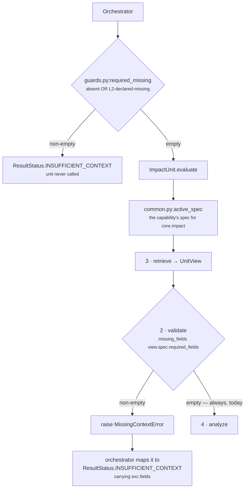

# `core.impact` · Stages 1–2 — Input and Validator

**Source:** `genios_engine/reason/unit.py:ReasoningUnit.evaluate` (input) ·
`genios_engine/reason/unit.py:ReasoningUnit.validate` (validator) ·
`genios_engine/reason/reasoners/common.py:missing_fields`
**Overridden by `ImpactUnit`:** **no** — both stages are the base class, unchanged.

---

## 1 · What it is for

Stage 1 fixes what a unit is allowed to know. Stage 2 is where a unit refuses to reason: it is the
mechanism by which `core.impact` says *"I will not guess"* instead of producing a number nobody can
defend.

For this unit the answer to stage 2 is unusual and worth stating up front: **`core.impact` refuses
almost nothing**. It declares no mandatory input of its own, and its entire safety story lives one
level down, in three plugins that each stay silent rather than fabricate. That is a deliberate
trade — the price of it is defect 1 in the [README](README.md#6--known-defects-and-compromises),
where a missing dependency produces a confident number rather than a refusal.

---

## 2 · What exists

### 2.1 · The input pair

```python
def evaluate(self, request: ReasoningRequest,
             prior_results: Mapping[str, ReasonerResult]) -> ReasonerResult:
```

Two arguments, both frozen, both content-addressed:

| Argument | Type | What it carries for this unit |
|---|---|---|
| `request` | `contracts/reasoning.py:ReasoningRequest` | `request.context.facts` (the deal value, the tier, the initiative tags), `request.context.evidence` (the citations), `request.capability.goal.goal_id` (read by `StrategicLinkagePlugin`), `request.capability.reasoners` (the spec, resolved by `common.py:active_spec`) |
| `prior_results` | `Mapping[str, ReasonerResult]` | **only** the dependencies the capability declared. `orchestrator.py` builds it as `{item: prior[item] for item in spec.dependencies if item in prior}` |

`ImpactUnit` reads exactly four things out of that pair:

```text
request.context.facts          → via common.py:fact_value, in all three plugins
request.context.evidence       → via common.py:evidence_ids, in two of three plugins
request.capability.goal.goal_id → StrategicLinkagePlugin, one line
prior_results["core.relationship"] → AccountImportancePlugin fallback, via view.prior_metric
```

It never touches `request.evaluation_time`, `request.context.neighbor_facts`,
`request.context.observations`, or `request.mode`. **Impact is timeless by construction** — the
stake does not change because a clock moved, which is why this unit alone in Category 2 has no
temporal input and no dependency on `core.temporal`.

### 2.2 · `required_fields` — the unit declares none

There is no `required_fields` attribute on `ReasoningUnit` at all. The framework reads it from the
**capability's spec** for this unit:

```python
absent = missing_fields(view.request, view.spec.required_fields)
if absent:
    raise MissingContextError(*absent)
```

So `required_fields` is authored per capability, in Layer 3, and versioned with the manifest.

| Capability | `core.impact` spec | `required_fields` |
|---|---|---|
| `packs/capabilities/deal_cooling_v2.py` | `_spec("core.impact", config={"play_impact_bp": {...}})` | `()` — **empty** |
| `tests/test_unit_impact_unit.py:_request` | `ReasonerSpec("core.impact", "1.0.0", config=config or {})` | `()` — **empty** |

**Every place `core.impact` exists today declares zero required fields.** The validator therefore
computes `missing_fields(request, ())` → `()` → never raises. In the shipped system this stage is a
no-op.

### 2.3 · The two definitions of "missing"

Both are live, and the stricter one runs first in the orchestrated path.

| Definition | Where | Rule |
|---|---|---|
| Presence only | `common.py:missing_fields` — the unit's own validator | a field is missing when it is not a key of `context.facts` (or `context.neighbor_facts` for a `neighbor:`-prefixed field) |
| Presence **or** declared-absent | `guards.py:required_missing` — the orchestrator, *before* the unit is called | additionally missing when Layer 2 explicitly published it in `context.missing_fields` |

In an orchestrated run the unit's own validator is effectively unreachable — the orchestrator has
already refused. It matters when the unit is invoked directly, which is how every test in
`test_unit_impact_unit.py` calls it.

---

## 3 · How it works



Note that **retrieve runs before validate**. The spec's ordering is Validator → Retriever; the code
inverts it because the default validator's subject *is* the `UnitView`. Nothing is lost: `retrieve`
is selection over an immutable mapping and cannot fail on data it would later reject.

### 3.1 · What `active_spec` does before either stage

```python
def active_spec(request: ReasoningRequest, reasoner_id: str) -> ReasonerSpec:
    for spec in request.capability.reasoners:
        if spec.reasoner_id == reasoner_id:
            return spec
    raise ValueError(f"capability does not declare reasoner {reasoner_id}")
```

This is the only hard failure `core.impact` can suffer before any of its own code runs: a
capability that schedules `core.impact` without declaring a `ReasonerSpec` for it raises
`ValueError`, which the orchestrator turns into `ResultStatus.FAILED` — not
`INSUFFICIENT_CONTEXT`. The distinction is right: a missing spec is a deployment fault, not a data
gap.

### 3.2 · `MissingContextError` → `INSUFFICIENT_CONTEXT`

```python
class MissingContextError(ReasonerError):
    def __init__(self, *fields: str) -> None:
        self.fields = tuple(sorted(set(fields)))
        super().__init__("missing required context: " + ", ".join(self.fields))
```

`orchestrator.py:ReasoningOrchestrator._evaluate` catches it and produces a
`ResultStatus.INSUFFICIENT_CONTEXT` result carrying `exc.fields` in `missing_fields`. That result is
constrained by `ReasonerResult.__post_init__`:

> *a non-`COMPLETED` result cannot carry `matched`, metrics, findings, adjustments, checks or
> evidence ids.*

So a refused `core.impact` leaves **no partial stake behind** — no `impact_bp`, no
`impact_signal_count`, not even the count of dimensions that did report before the refusal. Any
other exception — including the `ValueError`s raised by `_config_bp`, `_config_positive` and
`_delta_bp` — becomes `ResultStatus.FAILED` instead, with the type and message in `diagnostics`
(which is `compare=False, repr=False` and outside `to_semantic_dict`, so a failure message can
never move a hash).

---

## 4 · Silence semantics at this stage

| Situation | What happens | Why |
|---|---|---|
| No `required_fields` declared *(every shipped case)* | validator passes, unit reasons | the unit's inputs are all optional by design; refusal happens per-dimension, not per-unit |
| A declared field is absent | `MissingContextError` → `INSUFFICIENT_CONTEXT`, **nothing published at all** | a unit that cannot see what it was told it needs must not publish a partial stake |
| A declared field is present but empty/malformed | validator **passes** — it checks key presence only | the plugin that reads it decides; malformed money is silence, not zero. See [03b](03b-plugin-revenue_exposure.md) |
| Capability never declared a `core.impact` spec | `ValueError` from `active_spec` → `FAILED` | a deployment fault, not a data gap |

The last row of that table is the important asymmetry: **`core.impact` distinguishes "I was not
given what I need" from "what I was given is not usable", and answers them with different result
statuses.** The first is a run-level refusal; the second is a dimension-level silence that still
lets the other two dimensions produce a number.

---

## 5 · Worked examples

### 5.1 · The shipped configuration — validator is a no-op

```text
spec      ReasonerSpec("core.impact", "1.0.0",
              dependencies=(), required_fields=(),
              config={"play_impact_bp": {"restore_momentum": 400}})
facts     {"deal.value": 500000, "deal.status": "open", ...}

validate  missing_fields(request, ()) → ()   → no raise
analyze   revenue_exposure only  (no tier config, no strategic config,
                                  no core.relationship in prior)
result    COMPLETED · revenue_exposure_bp 10000 · impact_signal_count 1 · impact_bp 10000
```

Verified against the live unit: 500,000 against the **default** `reference_value` of 100,000
saturates at 10,000bp, and because the other two dimensions are silent the renormalisation
re-weights revenue to 100%. `core.impact` reported the maximum possible stake off one of three
dimensions, and nothing in the run said so. That is the shape of defect 1.

### 5.2 · A capability that does declare a required field

```text
spec      ReasonerSpec("core.impact", "1.0.0", required_fields=("deal.value",))
facts     {"deal.status": "open"}          # deal.value absent

guards.py:required_missing → ("deal.value",)
  → the orchestrator never calls the unit
  → ReasonerResult(status=INSUFFICIENT_CONTEXT, missing_fields=("deal.value",),
                   matched=None, metrics={}, findings=(), evidence_ids=())
```

And the same spec invoked directly from a test, bypassing the orchestrator:

```text
unit.evaluate(request, {})
  → retrieve → UnitView(facts={}, evidence_ids=())
  → validate → missing_fields(request, ("deal.value",)) → ("deal.value",)
  → raise MissingContextError("deal.value")
```

The exception propagates out of `evaluate`. Only the orchestrator converts it to a typed result;
a direct caller gets the exception.

### 5.3 · Present but unusable — the validator does not care

```text
spec      required_fields=("deal.value",)
facts     {"deal.value": "not-a-number"}

validate  "deal.value" IS a key of context.facts → () → no raise
analyze   RevenueExposurePlugin: integer("not-a-number") raises ValueError,
          caught inside contribute → returns ()
result    COMPLETED · matched None · metrics {"impact_signal_count": 0}
          impact_bp ABSENT
```

Pinned by `test_a_malformed_deal_value_is_silence_rather_than_a_fabricated_zero` and
`test_a_situation_with_no_measurable_stake_publishes_no_impact_at_all`. The run completes, the unit
has no opinion, and the reader supplies their own default rather than being handed a fabricated
zero.

### 5.4 · A `neighbor:`-prefixed required field

Not used by any capability that schedules `core.impact`, but the framework asymmetry applies to it
as it does to every unit: `common.py:missing_fields` **honours** the `neighbor:` prefix and will
refuse a run whose neighbourhood fact is absent, while `retrieve` filters those fields out of
`wanted` so they never reach `view.facts`. Since `core.impact`'s plugins read
`fact_value(view.request, field)` with `neighbor=False` and never pass the flag, a
`neighbor:`-scoped requirement would gate the run without any plugin being able to use the fact it
gated on. Latent, not live.

---

## 6 · Edge cases

| Input | Behaviour | Pinned by |
|---|---|---|
| `required_fields=()` — every shipped case | no refusal is possible | all 25 tests |
| Field present with value `None` | key exists → validator passes; `fact_value` returns `None` → plugin silent | `test_an_unrecorded_deal_value_produces_no_observation` (via absence) |
| Fact stored as `{"value": 150000}` | `common.py:fact_value` unwraps the `"value"` key before the plugin sees it | — |
| Fact stored as `{"value_bp": 7500}` | `fact_value` does **not** unwrap `value_bp` — it returns the whole mapping, and `integer()` rejects it → silence. Only `ContextSnapshot`'s evidence check understands `value_bp` | not pinned |
| Duplicate `core.impact` specs in one capability | impossible — `CapabilityManifest.__post_init__` raises `"duplicate reasoner in capability"` | `test_reasoning_contracts.py` |
| `spec.gating = True` | permitted by the contract but never authored; `core.impact` sets no terminal outcome, so gating it would only make its failure fail-closed | — |

---

| ← | → |
|---|---|
| [README — the unit's map](README.md) | [02 · Retriever](02-Retriever.md) |
