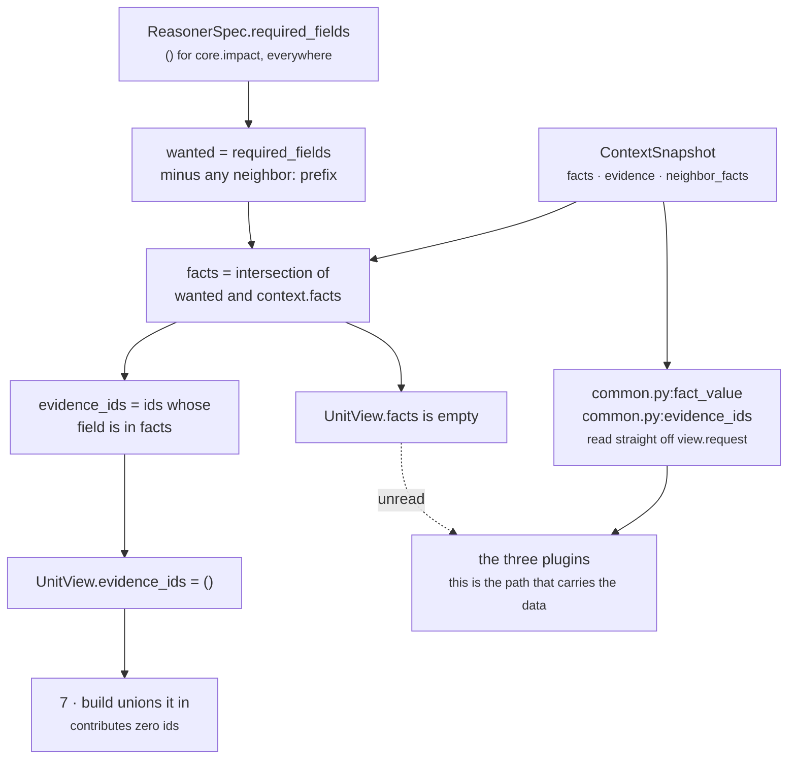

# `core.impact` · Stage 3 — Retriever

**Source:** `genios_engine/reason/unit.py:ReasoningUnit.retrieve` (lines 190–200)
**Overridden by `ImpactUnit`:** **no** — the base implementation, unchanged.
**Net effect on this unit:** `view.facts == {}` and `view.evidence_ids == ()` in every shipped and
tested configuration. The Retriever's output is not read by any part of `core.impact`.

That is a real finding, not a criticism looking for one, and the rest of this page explains what the
base stage does, why the unit bypasses it, and what is lost by the bypass.

---

## 1 · What it is for

The Retriever is the answer to *"what was this unit allowed to look at?"* — asked by a reviewer six
months later, and answerable without reading the unit's body.

It does **not** fetch. Units are forbidden database, network, clock, random, environment and LLM
access, and retrieval already happened: Layer 2 froze a `ContextSnapshot` and Layer 4 hashed its
content into the request id. A unit that fetched anything would be reading state the decision was
never hashed against, and every replay of that decision would be a different decision wearing the
same id. So *retrieve* here means **select and shape** from the frozen input — the only form of
retrieval that survives replay.

---

## 2 · What exists

### 2.1 · The base implementation, in full

```python
def retrieve(self, request: ReasoningRequest, spec: ReasonerSpec,
             prior: Mapping[str, ReasonerResult]) -> UnitView:
    """Select this unit's window on the frozen snapshot. Selection only — never IO."""
    wanted = tuple(field for field in spec.required_fields
                   if not field.startswith("neighbor:"))
    facts = {name: request.context.facts[name]
             for name in wanted if name in request.context.facts}
    evidence = tuple(sorted(item.evidence_id for item in request.context.evidence
                            if item.field in facts))
    return UnitView(request=request, spec=spec, prior=prior,
                    facts=MappingProxyType(facts), evidence_ids=evidence)
```

Three things it selects, in order: the declared root fields, the facts behind them, and the
evidence ids whose `field` matches one of those facts.

### 2.2 · The `UnitView` it produces for `core.impact`

| Field | Value for `core.impact` | Used by the unit? |
|---|---|---|
| `request` | the whole frozen `ReasoningRequest` | **yes** — all three plugins read facts and evidence through it |
| `spec` | the capability's `ReasonerSpec` for `core.impact` | **yes** — through `view.config`, thirteen keys |
| `prior` | declared dependencies only | **yes** — `view.prior_metric` in `AccountImportancePlugin` |
| `facts` | `{}` — because `spec.required_fields` is `()` | **no** — never referenced anywhere in `impact_unit.py` |
| `evidence_ids` | `()` — derived from `facts`, which is empty | **indirectly** — `build` unions it into the result, contributing nothing |

Verified by running the Northwind fixture through `ImpactUnit().retrieve(...)`:

```text
view.facts        = {}
view.evidence_ids = ()
```

…on a request carrying four facts and three evidence refs. Every one of them reaches the unit, but
through `view.request`, not through the selected window.

### 2.3 · Where the unit actually reads from

| Reader | Call | Scope it sees |
|---|---|---|
| `RevenueExposurePlugin` | `fact_value(view.request, field)` | **all** of `request.context.facts` |
| `AccountImportancePlugin` (tier path) | `fact_value(view.request, tier_field)` | **all** of `request.context.facts` |
| `AccountImportancePlugin` (fallback) | `view.prior_metric(source, "coverage_bp", -1)` | declared dependencies only |
| `StrategicLinkagePlugin` | `fact_value(view.request, field)` | **all** of `request.context.facts` |
| all three, for citations | `evidence_ids(view.request, field)` | **all** of `request.context.evidence` |

```python
# common.py
def fact_value(request, field, *, neighbor=False):
    record = fact_record(request, field, neighbor=neighbor)
    return record.get("value") if isinstance(record, Mapping) and "value" in record else record

def evidence_ids(request, *fields):
    wanted = set(fields)
    return tuple(sorted(item.evidence_id for item in request.context.evidence
                        if item.field in wanted))
```

---

## 3 · How it works — and why the unit bypasses it



**Why the bypass is not an accident.** The fields `core.impact` reads are *configurable per
capability* — `value_field`, `account_tier_field`, `strategic_link_field`. The base Retriever selects
from `spec.required_fields`, which is a different list, authored separately. To make the Retriever
carry this unit's data a capability author would have to keep two lists in sync:

```text
required_fields = ("deal.value", "account.tier", "deal.initiatives")
config          = {"value_field": "deal.value",
                   "account_tier_field": "account.tier",
                   "strategic_link_field": "deal.initiatives"}
```

…and the moment they drift, the unit refuses to reason about a field it was perfectly able to read,
or reads a field it never declared. The unit chose the second failure mode over the first, because
its whole design says an absent dimension is silence rather than refusal. Declaring the fields as
`required_fields` would convert every one of those silences into an `INSUFFICIENT_CONTEXT` for the
entire unit — which is exactly the outcome the module docstring argues against.

**What is lost by the bypass**, stated plainly:

1. **`view.facts` is not a record of what this unit looked at.** A reviewer asking "what could
   `core.impact` see?" gets `{}` from the view and must read the plugin bodies plus the capability
   config to get the real answer. The framework's central readability promise does not pay out here.
2. **Nothing narrows the unit's read scope.** `fact_value(view.request, field)` can reach any fact
   in the snapshot. The bound on what it reads is the config, not the framework.
3. **The evidence path inherits the base stage's `context_scope` blindness.** `evidence_ids` matches
   on `item.field` only, ignoring whether the `EvidenceRef` is `"root"` or `"neighbor"` scoped. A
   neighbour-scoped evidence row whose field name collides with a configured root field would be
   cited as though the unit had observed it. Harmless today — no shipped capability has a colliding
   name — and the same one-line gap exists in the base retriever.

None of the three affects a number. All three affect what a reviewer can prove without reading
code, which is the thing this layer is supposed to be good at.

---

## 4 · Which evidence ids land in the result

Because `view.evidence_ids` is empty, **every citation `core.impact` produces comes from its
plugins**, and each plugin cites exactly the field it read:

| Plugin | Cites | Silent about |
|---|---|---|
| `revenue_exposure` | `evidence_ids(request, value_field)` — the deal-value rows | nothing else |
| `account_importance` · tier path | `evidence_ids(request, account_tier_field)` — the tier rows | nothing else |
| `account_importance` · fallback path | **nothing — `evidence_ids` is not passed at all** | see below |
| `strategic_linkage` | `evidence_ids(request, strategic_link_field)` — the initiative rows | nothing else |

The fallback's empty citation is defect 2 in the [README](README.md#6--known-defects-and-compromises).
The relationship reading came from another unit's published metric, and there is no `EvidenceRef` in
*this* snapshot that stands behind it — `core.relationship`'s own citations live in
`core.relationship`'s result. Rather than cite something it did not read, the plugin cites nothing;
the cost is that a run whose only dimension is the fallback asserts `matched=True` with an empty
`evidence_ids`, which `validation_unit.py:_asserts_a_claim` counts as an ungrounded claim.

`unit.py:ReasoningUnit.build` then unions all of it:

```python
evidence = set(view.evidence_ids)          # () for this unit
for observation in observations:
    evidence.update(observation.evidence_ids)
```

and `guards.py:validate_evidence_references` re-checks at the orchestrator boundary that every id
resolves inside the frozen snapshot. A unit cannot cite a row it fetched itself, only what the
selector already froze into the snapshot the decision was hashed against.

---

## 5 · Worked examples

### 5.1 · Northwind — three facts in, zero facts selected

```text
required_fields = ()
context.facts   = {deal.value: 150000, account.tier: "strategic",
                   deal.initiatives: ("expand_enterprise",), deal.status: "open"}
context.evidence = ev_value(deal.value) · ev_tier(account.tier) · ev_init(deal.initiatives)

retrieve →  wanted        = ()
            view.facts    = {}
            view.evidence_ids = ()

analyze  →  account_importance  cites ev_tier    (via evidence_ids(request, "account.tier"))
            revenue_exposure    cites ev_value   (via evidence_ids(request, "deal.value"))
            strategic_linkage   cites ev_init    (via evidence_ids(request, "deal.initiatives"))

build    →  evidence_ids = () ∪ {ev_tier} ∪ {ev_value} ∪ {ev_init}
                         = ("ev_init", "ev_tier", "ev_value")   # sorted
```

Pinned by `test_the_northwind_renewal_...`:
`assert result.evidence_ids == ("ev_init", "ev_tier", "ev_value")`.

### 5.2 · A hypothetical capability that *does* declare the fields

```text
required_fields = ("account.tier", "deal.value")
same facts and evidence as 5.1

retrieve →  wanted            = ("account.tier", "deal.value")
            view.facts        = {account.tier: "strategic", deal.value: 150000}
            view.evidence_ids = ("ev_tier", "ev_value")     # sorted, deal.initiatives excluded

build    →  evidence_ids = {ev_tier, ev_value} ∪ {ev_tier} ∪ {ev_value} ∪ {ev_init}
                         = ("ev_init", "ev_tier", "ev_value")    # identical result
```

The union is unchanged because the plugins already cited everything. The observable difference is a
`UnitView` that finally answers the reviewer's question — and a validator that now refuses the whole
unit if either field is absent, which is the trade the unit declined.

### 5.3 · The fallback-only run — an empty citation set

```text
required_fields = ()
context.facts   = {"deal.status": "open"}
prior           = {"core.relationship": ReasonerResult(COMPLETED,
                                          metrics={"coverage_bp": 6000})}

retrieve →  view.facts = {}, view.evidence_ids = ()
analyze  →  account_importance  strength_bp 6000, evidence_ids = (),
                                reason_codes = ("relationship_footprint",)
build    →  evidence_ids = ()
result   →  matched True · impact_bp 6000 · impact_signal_count 1 · evidence_ids ()
```

Verified against the live unit. This result asserts a material stake and cites nothing.

---

## 6 · Edge cases

| Situation | Behaviour |
|---|---|
| `required_fields` names a field absent from `context.facts` | `retrieve` silently omits it — the dict comprehension is guarded by `if name in request.context.facts`. The refusal happens in `validate`, one stage later |
| `required_fields` contains a `neighbor:`-prefixed entry | filtered out of `wanted`, so it never reaches `view.facts`; but `common.py:missing_fields` still validates it. A framework-wide asymmetry, latent for this unit |
| Two `EvidenceRef`s on the same field | both ids are selected — `evidence_ids` returns a sorted tuple of all matches, and `Observation.__post_init__` re-sorts and dedups |
| An `EvidenceRef` with `context_scope="neighbor"` on a configured field name | **cited anyway** — neither the base retriever nor `common.py:evidence_ids` filters on scope |
| `view.facts` mutated by a plugin | impossible — `MappingProxyType`, and `UnitView` is `frozen=True, slots=True` |
| No evidence at all in the snapshot | all three plugins cite `()`; the unit still publishes its metrics. Every finding then has an empty `evidence_ids` and the whole result is an ungrounded claim to `core.validation` |

---

| ← | → |
|---|---|
| [01 · Input and Validator](01-Input-and-Validator.md) | [03 · Analyzer](03-Analyzer.md) |
