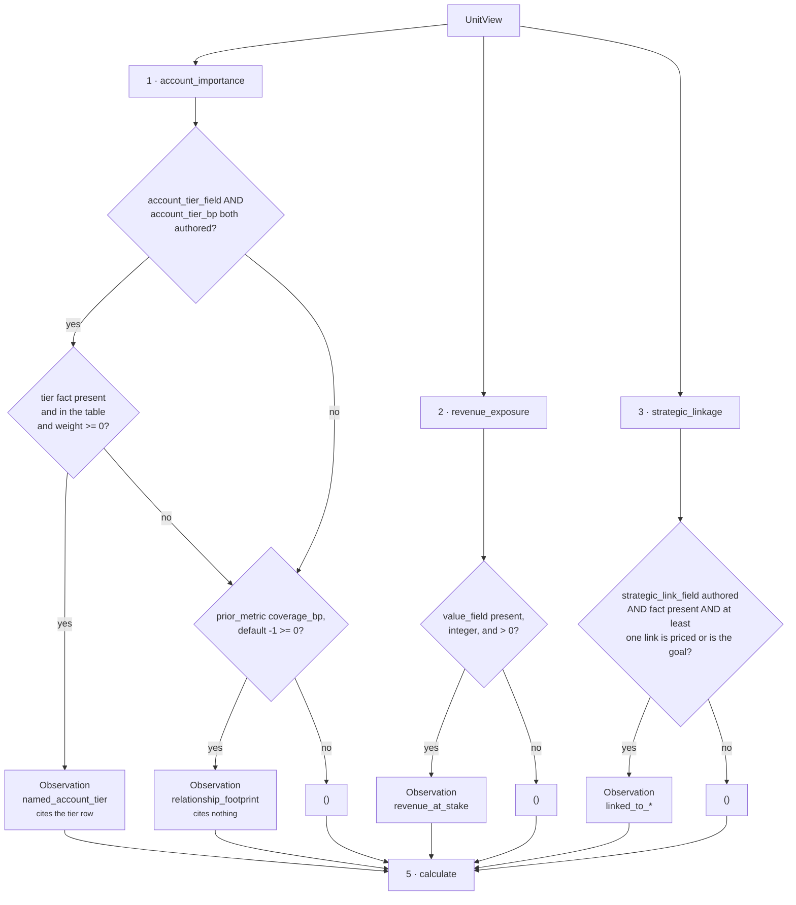

# `core.impact` · Stage 4 — The Analyzer and its plugin seam

**Source:** `genios_engine/reason/unit.py:ReasoningUnit.analyze` (the seam) ·
`genios_engine/reason/reasoners/impact_unit.py` lines 96–241 (the three plugins)
**Overridden by `ImpactUnit`:** **no** — the base implementation, unchanged.

---

## 1 · What it is for

The stake is read across **three independent dimensions, because they fail independently and are
evidenced independently**. That sentence from the module docstring is the entire argument for the
plugin seam in this unit — it is not decomposition for tidiness, it is decomposition because the
three inputs come from three different systems and go missing for three different reasons.

| Dimension | Comes from | Goes missing when |
|---|---|---|
| Revenue exposure | a CRM money column | the amount was never synced, or a human typed text into it |
| Account importance | a CRM classification field, else another reasoning unit | the tier was never set, or the dependency was not declared |
| Strategic linkage | a planning document or tagging system | nobody tagged the work, or the capability never named the field |

If these were one function, one absent input would either poison the whole number or force a single
opinionated default onto all three. As three plugins, each one's absence is *visible* — it shows up
as a missing metric and a lower `impact_signal_count` — and each one's arithmetic can be tested and
retuned alone.

---

## 2 · What exists

### 2.1 · Registration and execution order

```python
plugins = (AccountImportancePlugin(), RevenueExposurePlugin(), StrategicLinkagePlugin())
```

```python
# unit.py:ReasoningUnit.analyze
observations: list[Observation] = []
for plugin in sorted(self.plugins, key=lambda item: item.plugin_id):
    observations.extend(plugin.contribute(view))
return tuple(observations)
```

**Execution order is by `plugin_id`, not by registration order.** For this unit the two happen to
agree, which makes the sort look decorative — it is not. Observation order reaches the result's
semantic hash through the findings tuple, so a future author who inserts a fourth plugin at the top
of the tuple must not be able to change a decision hash by doing so.

| Order | `plugin_id` | Class | Registration position |
|---|---|---|---|
| 1 | `account_importance` | `AccountImportancePlugin` | 1 |
| 2 | `revenue_exposure` | `RevenueExposurePlugin` | 2 |
| 3 | `strategic_linkage` | `StrategicLinkagePlugin` | 3 |

`ReasoningUnit.__init__` refuses a duplicate `plugin_id` at construction time
(`"{unit_id} registers a duplicate analyzer plugin"`), because a duplicate makes the sort ambiguous
and every hash below it ambiguous with it.

### 2.2 · What each plugin contributes

| `plugin_id` | `Observation.kind` | `metrics` | `evidence_ids` | `reason_codes` |
|---|---|---|---|---|
| `account_importance` | `impact.account_importance` | `strength_bp` | tier field's rows, **or `()` on the fallback path** | `named_account_tier` **or** `relationship_footprint` |
| `revenue_exposure` | `impact.revenue_exposure` | `strength_bp`, `exposure_value` | the value field's rows | `revenue_at_stake` |
| `strategic_linkage` | `impact.strategic_linkage` | `strength_bp`, `linked_goal_count` | the link field's rows | `linked_to_capability_goal` and/or `linked_to_strategic_initiative` |

Every plugin returns **either exactly one `Observation` or exactly none**. There is no path in this
unit that emits two observations from one plugin. `calculate` nonetheless defends against it:

```python
strengths[item.plugin_id] = max(strengths.get(item.plugin_id, 0), value)
```

> *"A plugin emits at most one observation today; taking the max keeps the arithmetic total and
> order-free if one ever emits several."*

### 2.3 · The four shared config readers

All three plugins and both unit stages go through the same four validators, defined at module top.
They are the reason a malformed capability is *a loud authoring fault rather than a quiet rescore*.

| Function | Accepts | Rejects | Used for |
|---|---|---|---|
| `_config_bp(view, key, default)` | `int` in `0..10_000` | `bool`, non-`int`, out of range | `goal_alignment_bp`, the three weights, `impact_threshold_bp` |
| `_config_positive(view, key, default)` | `int > 0` | `bool`, non-`int`, `<= 0` | `reference_value` |
| `_delta_bp(value, label)` | `int` in `-10_000..10_000` | `bool`, non-`int`, out of range | `account_tier_bp.*`, `strategic_goal_bp.*`, `play_impact_bp.*` |
| `_mapping_config(view, key)` | `Mapping`, or `None` → `{}` | anything else | the three mapping-valued keys |

`bool` is rejected first in all three numeric readers, because `isinstance(True, int)` is `True` in
Python and a boolean masquerading as a basis-point value is exactly the kind of accident that
reaches a ranking formula. The rationale in the source is about replay:

> *"A silently coerced float here would change the decision hash on a different machine, so a
> malformed capability is a loud authoring fault rather than a quiet rescore."*

`_delta_bp` is the odd one out: it permits **negative** values, *"because a large stake can also
make a cheap play look worse"*. That is right for `play_impact_bp`, and it is the direct cause of
defect 3 — a negative `account_tier_bp` weight passes validation and is then silently discarded by
the `if strength >= 0` guard in `AccountImportancePlugin`.

---

## 3 · How the three compose



### 3.1 · They do not interact — with one exception

The three plugins share no state, read no output of one another, and can be run in any order without
changing a number. Each takes `UnitView` and returns a tuple. There is exactly one place where a
value crosses between dimensions, and it is not between plugins:

**`AccountImportancePlugin` reads another *unit*'s metric.** Its fallback calls
`view.prior_metric("core.relationship", "coverage_bp", -1)`. That is a cross-unit dependency, not a
cross-plugin one, and it is the only reason `core.impact` has anything to declare in
`ReasonerSpec.dependencies` at all.

The interaction that *does* exist between the three is downstream of the seam, in `calculate`: they
compete for weight in the blend, and any one of them going silent **redistributes that weight to the
survivors** rather than shrinking the result. See [04 · Calculator](04-Calculator.md).

### 3.2 · Independence is what makes the count meaningful

`impact_signal_count` is the number of dimensions that reported. It is only interpretable because
the plugins are independent: `impact_bp = 9,000, impact_signal_count = 1` means *"one dimension, and
it says this is large"*, while `impact_bp = 9,000, impact_signal_count = 3` means *"three
independently-evidenced dimensions agree this is large"*. A monolithic analyzer could not tell those
apart, and they should not be trusted equally.

Returning `()` rather than a zero-valued observation is load-bearing for the same reason. Three
plugins each reporting `strength_bp: 0` would give `impact_bp = 0, impact_signal_count = 3` —
*three signals looked and found nothing*, a materially different and much stronger claim than
*nothing looked*, which is `impact_signal_count = 0` and no `impact_bp` at all.

### 3.3 · The `Observation` contract, and what it stops

`unit.py:Observation.__post_init__` enforces three things on every contribution:

```python
for name, value in self.metrics.items():
    if isinstance(value, bool) or not isinstance(value, int):
        raise ValueError(f"observation metric {name} must be an integer")
object.__setattr__(self, "metrics", MappingProxyType(dict(self.metrics)))
object.__setattr__(self, "evidence_ids", tuple(sorted(set(self.evidence_ids))))
object.__setattr__(self, "reason_codes", tuple(sorted(set(self.reason_codes))))
```

- **Integers only, `bool` rejected.** `exposure_value = 150000` and `linked_goal_count = 1` pass;
  a `Decimal` or a float would raise here rather than reaching the Calculator.
- **Sets, sorted.** `StrategicLinkagePlugin` appends a `reason_code` per matched link and can
  produce `["linked_to_strategic_initiative", "linked_to_strategic_initiative"]`; the constructor
  collapses it to a one-element tuple. That dedup is why the Northwind observation's codes are
  `("linked_to_strategic_initiative",)` and not a repeat.
- **Partial by contract.** An observation states a reading, never a conclusion. None of the three
  plugins here says a play should happen, and none of them names a play id — the only play ids in
  the module come out of config, in a later stage.

---

## 4 · Worked example — all three, one run

Northwind, re-derived from the live unit:

```text
config  reference_value 200000 · account_tier_field "account.tier"
        account_tier_bp {"strategic": 9000, "smb": 2000}
        strategic_link_field "deal.initiatives"
        strategic_goal_bp {"expand_enterprise": 8000}
facts   deal.value 150000 · account.tier "strategic"
        deal.initiatives ("expand_enterprise",) · deal.status "open"
prior   {}                                   # core.relationship not declared — irrelevant here,
                                             # the tier path wins before the fallback is reached

analyze, in plugin_id order
  1  account_importance
     tier_field "account.tier" and weights both authored → tier path
     table = {"smb": 2000, "strategic": 9000}       # keys stripped + lowercased, sorted iteration
     label = "strategic" → 9000 → >= 0 → emit
     → Observation(strength_bp=9000, evidence=("ev_tier",), codes=("named_account_tier",))

  2  revenue_exposure
     field "deal.value" → 150000 → integer → > 0
     strength = clamp_bp(half_up(150000 × 10000 / 200000)) = clamp_bp(7500) = 7500
     → Observation(strength_bp=7500, exposure_value=150000,
                   evidence=("ev_value",), codes=("revenue_at_stake",))

  3  strategic_linkage
     field "deal.initiatives" → ("expand_enterprise",) → links = ("expand_enterprise",)
     "expand_enterprise" != goal_id "grow_enterprise_arr", but IS in the table → 8000
     → Observation(strength_bp=8000, linked_goal_count=1,
                   evidence=("ev_init",), codes=("linked_to_strategic_initiative",))

analyze returns a 3-tuple in exactly that order.
```

That order survives into `Verdict.findings`, into `ReasonerResult.findings`, and therefore into
`ReasonerResult.semantic_hash` — `6e95974981d35af19473fe30a329355a19117bd2a0b235736733ea6df2791811`
for this exact input, reproduced twice by
`test_the_same_frozen_situation_scores_identically_twice`.

---

## 5 · Silence, per plugin

The complete set of paths on which each plugin contributes nothing. Every one of these is a
deliberate choice with a comment beside it in the source.

| Plugin | Stays silent when |
|---|---|
| `revenue_exposure` | the value field is absent · the value is not an integer · the value is `<= 0` |
| `account_importance` | (tier path unavailable) **and** the relationship metric reads `< 0` — meaning the dependency was not declared, did not run, did not complete, or published a non-integer |
| `strategic_linkage` | `strategic_link_field` unauthored · the field is absent · the value is empty or all-whitespace · **no** link is either the capability goal or priced in `strategic_goal_bp` |

And the unit-level consequence, which is the rule the whole module is organised around:

```text
0 of 3 report  →  metrics = {"impact_signal_count": 0}
                  impact_bp ABSENT · matched None · adjustments () · checks ()
1 of 3 report  →  that dimension's metric + impact_bp renormalised to it alone
```

Pinned by `test_a_situation_with_no_measurable_stake_publishes_no_impact_at_all` and
`test_a_dimension_that_did_not_report_is_absent_from_the_metrics`.

---

## 6 · Edge cases at the seam

| Situation | Behaviour |
|---|---|
| A plugin raises instead of returning `()` | propagates out of `analyze` and `evaluate`; the orchestrator records `ResultStatus.FAILED`. Only `_config_bp`/`_config_positive`/`_delta_bp` can do this, and only on malformed config — never on malformed *data*, which is always silence |
| A plugin returns two observations with the same `plugin_id` | `calculate` takes the `max` of their `strength_bp`; the extra observation still becomes an extra `Finding` |
| A fourth plugin is added that publishes a new metric | `unit.py:evaluate`'s guard raises `ValueError: core.impact published undeclared metrics: <name>` unless `publishes` is extended too — at development time, not six months later |
| Two plugins claim the same `plugin_id` | `ReasoningUnit.__init__` raises at construction; the unit cannot be registered |
| All three silent, config malformed | the malformed key is never read, so the run **completes** with `impact_signal_count = 0`. See [README §5.1](README.md#51--config-validation-is-lazy-and-that-hides-authoring-faults) |

---

## 7 · The plugin pages

| Plugin | Page |
|---|---|
| `account_importance` | [03a · account_importance](03a-plugin-account_importance.md) |
| `revenue_exposure` | [03b · revenue_exposure](03b-plugin-revenue_exposure.md) |
| `strategic_linkage` | [03c · strategic_linkage](03c-plugin-strategic_linkage.md) |

---

| ← | → |
|---|---|
| [02 · Retriever](02-Retriever.md) | [03a · account_importance](03a-plugin-account_importance.md) |
