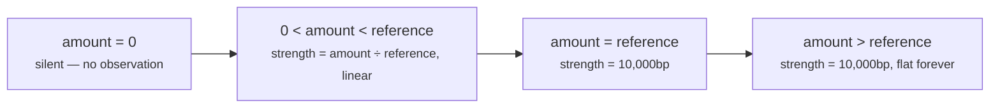

# Plugin · `revenue_exposure`

**Class:** `impact_unit.py:RevenueExposurePlugin` (lines 96–132)
**`plugin_id`:** `revenue_exposure` — **second** in execution order
**`Observation.kind`:** `impact.revenue_exposure`
**Publishes into:** `revenue_exposure_bp` (via `_DIMENSIONS`), default weight **5,000** — the
largest of the three

---

## 1 · The claim

*The money on the table, expressed against what this capability calls a large deal.*

The whole design turns on one observation:

> *"Absolute currency amounts are meaningless across tenants: 50,000 is a rounding error to an
> enterprise team and a record quarter to a two-person agency."*

So the plugin never reports an amount as a strength. It reports a **ratio against a declared
reference** — `reference_value`, the amount Layer 3 states is "fully material here" — and
**saturates** at that point:

> *"Beyond the reference the stake is already maximal for attention purposes; a deal ten times the
> reference does not deserve ten times the priority, it deserves the top of the scale."*

The raw amount is not discarded. It rides along in the observation as `exposure_value`, an
explainability metric that reaches the `Finding` and therefore the audit trail — so a reviewer sees
both *"7,500bp of stake"* and *"because the deal is 150,000"*.

---

## 2 · The code

```python
class RevenueExposurePlugin:
    plugin_id = "revenue_exposure"

    def contribute(self, view: UnitView) -> tuple[Observation, ...]:
        field = str(view.config.get("value_field") or "deal.value")
        raw = fact_value(view.request, field)
        if raw is None:
            return ()                       # no amount recorded — that is unknown, not small
        try:
            amount = integer(raw, field)
        except ValueError:
            return ()
        if amount <= 0:
            return ()
        reference = _config_positive(view, "reference_value", 100_000)
        strength = clamp_bp(divide_half_up(amount * 10_000, reference))
        return (Observation(
            plugin_id=self.plugin_id,
            kind="impact.revenue_exposure",
            metrics={"strength_bp": strength, "exposure_value": amount},
            evidence_ids=evidence_ids(view.request, field),
            reason_codes=("revenue_at_stake",),
        ),)
```

### 2.1 · Config keys

| Key | Type | Default | Validated by | Effect |
|---|---|---|---|---|
| `value_field` | str | `"deal.value"` | none — `str(... or default)` | which fact holds the amount. An empty string falls back to the default, because `"" or "deal.value"` is `"deal.value"` |
| `reference_value` | positive int | `100_000` | `_config_positive` — rejects `bool`, non-`int`, `<= 0` | the amount that scores 10,000bp. **No upper bound** — a reference of 10<sup>12</sup> is legal and makes every real deal read as ~0bp |

`reference_value` is read **after** the three silence checks, so a malformed reference only raises
on a run that actually found a positive amount. Verified: `reference_value = 0` with
`deal.value = 100` raises `ValueError: reference_value must be a positive integer`; the same config
with no `deal.value` completes silently.

`value_field` is the field name used for **both** the fact lookup and the evidence lookup, so a
capability that repoints it at `renewal.arr` automatically cites `renewal.arr`'s evidence rows.

---

## 3 · The arithmetic

```text
strength_bp = clamp_bp( divide_half_up( amount × 10_000, reference_value ) )
```

with

```python
def divide_half_up(numerator: int, denominator: int) -> int:
    if denominator <= 0:
        raise ValueError("denominator must be positive")
    if numerator >= 0:
        return (numerator + denominator // 2) // denominator
    return -((-numerator + denominator // 2) // denominator)

def clamp_bp(value: int) -> int:
    return min(10_000, max(0, int(value)))
```

Three properties, each doing a specific job:

**Integer, half-up, no floats.** `amount × 10_000` is computed *before* the division, so precision
is never lost to an intermediate. Half-up rounding is applied once, on the full numerator. A float
here would make the decision hash machine-dependent and destroy replay.

**Linear below the reference.** Every additional unit of deal value moves `strength_bp` by
`10,000 / reference_value`. At the default reference of 100,000 that is 0.1bp per currency unit.

**Saturating at and above it.** `clamp_bp` caps at 10,000. The curve is a ramp, not a line:



Saturation is a claim about **attention**, not about money. A 2,000,000 deal really is worth ten
times a 200,000 one; it is not worth ten times the human attention, because human attention has a
ceiling and the top of the scale is where that ceiling is expressed.

### 3.1 · The curve at the default reference of 100,000

| `deal.value` | `strength_bp` | Meaning |
|---|---|---|
| 1 | **0** | rounds to 0 — but the observation **still fires**, with `exposure_value = 1` |
| 7,500 | 750 | 0.075 |
| 25,000 | 2,500 | |
| 33,333 | 3,333 | half-up: `(333,330,000 + 50,000) // 100,000 = 3,333` |
| 50,000 | 5,000 | exactly the `impact_threshold_bp` default, if this is the only dimension |
| 100,000 | 10,000 | the reference |
| 500,000 | **10,000** | saturated — this is the shipped `deal_cooling_full_v2` case |

The first row is the subtle one and it is worth stating plainly: **`strength_bp = 0` and *silence*
are different outcomes, and this plugin can produce both.** A recorded value of 1 is a measurement —
it produces a real observation, a real `revenue_exposure_bp = 0` metric, and it counts toward
`impact_signal_count`. Verified end to end: `deal.value = 1` yields
`{revenue_exposure_bp: 0, impact_signal_count: 1, impact_bp: 0}` with `matched = False`. An
*absent* value produces no metric at all. The distinction is exactly the one the module docstring
is built around.

---

## 4 · Exactly when it stays silent

Three checks, in order, each with its own argument in the source.

| # | Condition | Source rationale |
|---|---|---|
| 1 | `fact_value(...) is None` — the field is absent, or present with value `None` | *"no amount recorded — that is unknown, not small"* |
| 2 | `integer(raw, field)` raises | *"A malformed amount is not a small amount. Reporting 0 would understate a live deal; staying silent lets the missing-evidence path handle it honestly."* |
| 3 | `amount <= 0` | *"A zero or negative recorded value carries no information about the stake — it is how CRMs represent 'not filled in yet' and how they represent credits — so we say nothing."* |

Check 3 covers a case the other two cannot: a **negative** amount. Credits and reversals arrive as
negatives, and a negative stake is not a concept this unit models — impact is a magnitude, and the
direction of the swing belongs to `core.risk` and `core.opportunity`. Rather than take an absolute
value and assert a stake the data does not support, the plugin declines.

### 4.1 · What `integer()` accepts

`common.py:integer` is stricter than it looks, and its exact surface decides check 2:

| Input | Result | Why |
|---|---|---|
| `150000` | `150000` | plain `int` |
| `True` | **raises** | `bool` rejected first — `isinstance(True, int)` is `True` in Python |
| `Decimal("150000")` | `150000` | `Decimal` equal to its own integral value |
| `Decimal("150000.50")` | **raises** | not integral |
| `"150000"` | `150000` | parsed as `Decimal`, integral |
| `"150000.50"` | **raises** | parses, but not integral |
| `"1.5e5"` | `150000` | **accepted** — `Decimal("1.5e5")` is exactly 150,000 |
| `"not-a-number"` | **raises** | `InvalidOperation` |
| `150000.0` (float) | **raises** | `float` is not `int`, not `Decimal`, not `str` |

Two of those are worth remembering. A **float** deal value is silence, not a reading — which is
correct for this engine (floats are forbidden in semantic artifacts by
`platform/canonical.py:canonicalize`) but means a snapshot that lost its `Decimal` typing loses the
whole revenue dimension quietly. And scientific-notation strings are accepted, which is harmless but
not obviously intended.

---

## 5 · Worked examples

### 5.1 · Three quarters of a full stake

```text
config  reference_value = 200000
facts   deal.value      = 150000
evidence ev_value → field "deal.value", source_ref_id "crm_deal_9"

raw       = 150000                       # fact_value, no {"value": ...} wrapper to unwrap
amount    = 150000                       # integer()
150000 > 0 → proceed
reference = 200000
numerator = 150000 × 10000 = 1,500,000,000
strength  = divide_half_up(1,500,000,000, 200000)
          = (1,500,000,000 + 100,000) // 200,000
          = 1,500,100,000 // 200,000 = 7500
          → clamp_bp(7500) = 7500

Observation(plugin_id="revenue_exposure", kind="impact.revenue_exposure",
            metrics={"strength_bp": 7500, "exposure_value": 150000},
            evidence_ids=("ev_value",),
            reason_codes=("revenue_at_stake",))
```

Pinned by `test_deal_value_is_scored_against_the_capabilitys_own_definition_of_large` —
*"150k against a 200k reference is three quarters of a full stake, not an absolute verdict."*

### 5.2 · Saturation

```text
config  reference_value = 200000
facts   deal.value      = 2000000        # ten times the reference

numerator = 2,000,000 × 10,000 = 20,000,000,000
divide_half_up(20,000,000,000, 200,000) = 100,000
clamp_bp(100,000) = 10,000               ← the clamp is what saturates

Observation(metrics={"strength_bp": 10000, "exposure_value": 2000000}, ...)
```

Pinned by `test_a_deal_far_above_the_reference_saturates_rather_than_running_away`. Note
`exposure_value` still carries the true 2,000,000, so the audit trail can distinguish a deal that
*just* reached the reference from one that blew past it, even though the strengths are identical.

### 5.3 · The shipped configuration, with the default reference

```text
config  {"play_impact_bp": {"restore_momentum": 400}}      # deal_cooling_full_v2, verbatim
facts   deal.value = 500000

reference = 100000                       # the DEFAULT — v2 never authors one
strength  = clamp_bp(divide_half_up(5,000,000,000, 100,000)) = clamp_bp(50,000) = 10,000

unit result  revenue_exposure_bp 10,000 · impact_signal_count 1 · impact_bp 10,000
             matched True
             adjustment restore_momentum +400   # half_up(400 × 10,000 / 10,000)
```

Verified end to end against the live unit. **`core.impact` reports the maximum possible stake off
one of three dimensions, on a default reference nobody authored, and says nothing about either
fact.** The two absences compound: the reference is a guess, and the renormalisation makes the
single surviving dimension the whole answer.

### 5.4 · Silence, four ways

```text
facts {"deal.status": "open"}          → fact_value → None            → ()
facts {"deal.value": "not-a-number"}   → integer() raises ValueError  → ()
facts {"deal.value": 0}                → amount <= 0                  → ()
facts {"deal.value": -12000}           → amount <= 0                  → ()
```

Rows 1–3 are pinned by `test_an_unrecorded_deal_value_produces_no_observation`,
`test_a_malformed_deal_value_is_silence_rather_than_a_fabricated_zero` and
`test_a_zero_amount_carries_no_information_about_the_stake`. Row 4 is unpinned.

In every one of them the unit-level result is the same when no other dimension reports:

```text
metrics = {"impact_signal_count": 0}
impact_bp ABSENT · matched None · findings () · adjustments () · checks ()
```

Not `impact_bp = 0`. The distinction is the point: an absent metric lets the reader supply their own
default, while a fabricated zero silently lies — and downstream, in
`decision_maker.py:score_candidate`, `impact` carries 35 of the 100 default ranking weight. A
fabricated 0 there would demote exactly the deals that matter most.

---

## 6 · Edge cases

| Input | Result | Note |
|---|---|---|
| `deal.value = 1`, reference 100,000 | observation with `strength_bp 0` | a measured zero, not silence — counts toward `impact_signal_count` |
| `reference_value = 1` | any amount ≥ 1 saturates at 10,000bp | legal; makes the dimension binary |
| `reference_value = 0` or negative | `ValueError` → `FAILED`, but **only** on a run with a positive amount | lazy validation, see [README §5.1](README.md#51--config-validation-is-lazy-and-that-hides-authoring-faults) |
| `reference_value = True` | `ValueError` — `bool` rejected before the `<= 0` check | |
| Fact stored as `{"value": 150000}` | unwrapped by `common.py:fact_value` before `integer()` | |
| Fact stored as `{"value_bp": 7500}` | **not** unwrapped — `fact_value` only understands `"value"` — so `integer(mapping)` raises → silence | latent trap for a Layer 2 field emitted in bp form |
| `value_field = ""` | falls back to `"deal.value"`, because `"" or "deal.value"` | an author cannot disable this plugin by blanking the key; only by removing the fact |
| Two `EvidenceRef`s on the value field | both cited, sorted and deduped by `Observation.__post_init__` | |
| Value field present, no evidence for it | `evidence_ids = ()` — the observation still fires | the reading is real; the citation is missing |

---

| ← | → |
|---|---|
| [03a · account_importance](03a-plugin-account_importance.md) | [03c · strategic_linkage](03c-plugin-strategic_linkage.md) |
