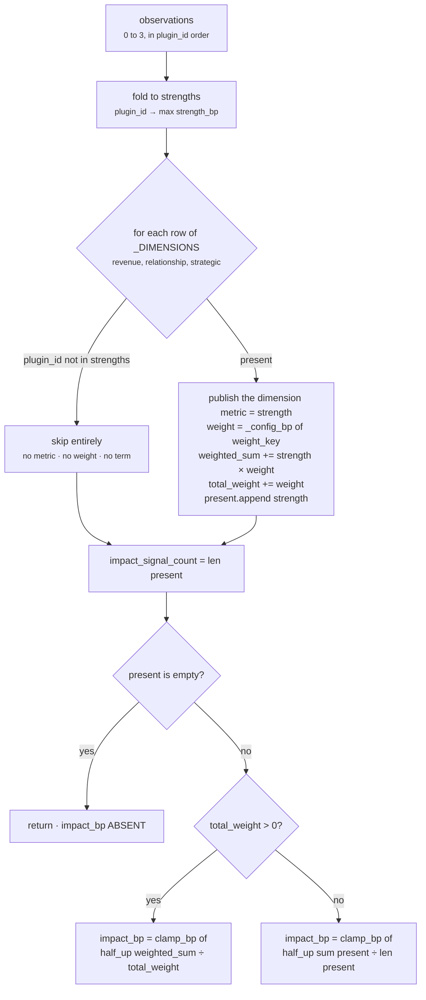

# `core.impact` · Stage 5 — Calculator

**Source:** `impact_unit.py:ImpactUnit.calculate` (lines 265–304) and the `_DIMENSIONS` table
(lines 248–252)
**Overridden by `ImpactUnit`:** **yes** — `calculate` is `@abstractmethod` on `ReasoningUnit`; a
subclass that omits it cannot be instantiated.

---

## 1 · What it is for

Turn up to three independent dimension readings into one number that means *"how big is this,
given what we know"* — and, crucially, **not** *"how complete is our data"*.

That distinction is the entire argument of this stage, and the code's own docstring makes it:

> *"Deliberately **not** a mean over all three dimensions: an unmeasured dimension has no value, and
> treating it as zero would report a small stake for a large deal whose account tier simply was not
> synced. Renormalising over the observed weights keeps the number meaning 'how big is this, given
> what we know' instead of 'how complete is our data'.*
>
> *`impact_bp` is omitted entirely when nothing reported, so a reader gets their own default rather
> than a manufactured 0."*

---

## 2 · What exists

### 2.1 · `_DIMENSIONS` — the blend declared as data

```python
#: The dimensions of the stake, in a fixed order: (plugin, published metric, weight key, default).
_DIMENSIONS: tuple[tuple[str, str, str, int], ...] = (
    ("revenue_exposure",   "revenue_exposure_bp",      "revenue_weight_bp",      5_000),
    ("account_importance", "relationship_exposure_bp", "relationship_weight_bp", 3_000),
    ("strategic_linkage",  "strategic_bp",             "strategic_weight_bp",    2_000),
)
```

Four columns, one row per dimension:

| Column | Purpose |
|---|---|
| `plugin_id` | which observation to look for in `strengths` |
| published metric name | what the dimension is called in `ReasonerResult.metrics` and in `publishes` |
| weight config key | the Layer 3 tuning key |
| default weight | the fallback when the capability does not author one |

> *"Declared as data rather than branching code so that the published metric names, the tuning keys,
> and the blend can never drift apart."*

That is not a stylistic preference. Three branches of `if plugin_id == ...` would let an author add
a metric name in one place and forget the weight key in another; the tuple makes it a single edit or
none. It is also why the plugin id and the metric name are allowed to differ —
`account_importance` → `relationship_exposure_bp` — without becoming a trap.

The default weights *"say revenue dominates, relationship matters, and strategy is a tie-breaker —
the ordering most capabilities start from and then re-author."* They sum to 10,000, which makes the
fully-observed denominator exactly 10,000 and the arithmetic legible by hand. Nothing enforces that
sum: an author may set any three values in 0..10,000 and the renormalisation absorbs it.

**These three numbers have never been fitted to data.** They were authored from domain reasoning.
`Rohit_Updates/Layer 4.md` Step 4 records this, and no shipped capability re-authors any of them.

### 2.2 · The method, in full

```python
def calculate(self, view, observations) -> Mapping[str, int]:
    strengths: dict[str, int] = {}
    for item in observations:
        value = clamp_bp(int(item.metrics.get("strength_bp", 0)))
        strengths[item.plugin_id] = max(strengths.get(item.plugin_id, 0), value)

    metrics: dict[str, int] = {}
    weighted_sum = 0
    total_weight = 0
    present: list[int] = []
    for plugin_id, metric_name, weight_key, default_weight in _DIMENSIONS:
        if plugin_id not in strengths:
            continue
        strength = strengths[plugin_id]
        metrics[metric_name] = strength
        weight = _config_bp(view, weight_key, default_weight)
        weighted_sum += strength * weight
        total_weight += weight
        present.append(strength)

    metrics["impact_signal_count"] = len(present)
    if present:
        metrics["impact_bp"] = clamp_bp(divide_half_up(weighted_sum, total_weight)) \
            if total_weight > 0 else clamp_bp(divide_half_up(sum(present), len(present)))
    return metrics
```

---

## 3 · How it works



### 3.1 · Why this shape, in the code's own terms

**Weighted, because the dimensions are not equal.** A deal's money is a harder, more directly
consequential signal than its strategic tagging, and the defaults say so: 5,000 / 3,000 / 2,000.

**Renormalised, because absence is not evidence.** The denominator is `total_weight`, accumulated
inside the same `if` that skips absent dimensions. Contrast the arithmetic with the naive
alternative on a genuinely enormous deal whose tier was never synced:

```text
                          renormalised (shipped)      fixed denominator (rejected)
revenue 9,000 × 5,000  =        45,000,000                    45,000,000
relationship  absent   =                 —                             0
strategic     absent   =                 —                             0
                          ────────────────────        ────────────────────────────
denominator                          5,000                            10,000
impact_bp                            9,000                             4,500
```

The rejected column reports a mid-scale stake for a deal we know to be enormous. The number would
be answering a question nobody asked — *how many of our fields are populated* — while wearing the
name of the question they did ask. Pinned by
`test_a_dimension_that_did_not_report_is_absent_from_the_metrics`, which asserts both
`revenue_exposure_bp == 9,000` and `impact_bp == 9,000` on exactly that input, with the comment
*"a known-large deal is not diluted by unmeasured dimensions."*

**`impact_bp` omitted, not zeroed, when nothing reported.** The `if present:` guard is the last
expression of the silence rule. Downstream, `impact` carries 35 of the 100 default ranking weight in
`decision_maker.py:score_candidate`; a manufactured 0 would be indistinguishable from a measured one
and would demote the deal on the strength of a data gap.

**`impact_signal_count` published unconditionally.** It is the one metric that always exists — the
reader's only way to tell *nothing was measurable* (`0`) from *one dimension of three spoke* (`1`)
from *all three agree* (`3`). It is set outside the `if present:` guard for precisely that reason.

### 3.2 · The zero-weight branch

```python
metrics["impact_bp"] = clamp_bp(divide_half_up(weighted_sum, total_weight)) \
    if total_weight > 0 else clamp_bp(divide_half_up(sum(present), len(present)))
```

> *"An author who zeroes every weight has not asked for a zero impact — they have removed the
> weighting, so fall back to an unweighted mean rather than dividing by zero."*

This is authoring hygiene, not analysis. `divide_half_up` raises `ValueError("denominator must be
positive")` on a zero denominator, so without the branch a capability that zeroed all three weights
would produce a `FAILED` result with a message about division. The fallback reads the author's
intent instead: they removed the ranking between the dimensions, so treat them equally.

The branch is reachable only when **every present dimension** has weight 0 — a single non-zero
weight keeps `total_weight` positive. Verified: with all three weight keys set to 0 and revenue
7,500 + relationship 9,000 reporting, `impact_bp = 8,250` — the unweighted mean, not an error.

### 3.3 · The `max` fold

```python
strengths[item.plugin_id] = max(strengths.get(item.plugin_id, 0), value)
```

> *"A plugin emits at most one observation today; taking the max keeps the arithmetic total and
> order-free if one ever emits several."*

No plugin in this unit returns more than one observation, so the fold is defensive. What it buys is
that the result cannot depend on which of two same-plugin observations came first — which matters
because observation order reaches the semantic hash. `int(item.metrics.get("strength_bp", 0))` also
means a hypothetical observation with no `strength_bp` folds in as 0 rather than raising; the
`clamp_bp` around it is unreachable in practice, since all three plugins already clamp.

---

## 4 · Worked combinations

All figures re-derived by running the live unit.

### 4.1 · All three — the Northwind renewal

```text
strengths   revenue_exposure 7,500 · account_importance 9,000 · strategic_linkage 8,000
weights     5,000 (default) · 3,000 (default) · 2,000 (default)

_DIMENSIONS order (NOT plugin_id order — this loop is the one place they differ)
  revenue       7,500 × 5,000 = 37,500,000   total_weight  5,000
  relationship  9,000 × 3,000 = 27,000,000   total_weight  8,000
  strategic     8,000 × 2,000 = 16,000,000   total_weight 10,000
                              ───────────
  weighted_sum                = 80,500,000

impact_bp = clamp_bp(divide_half_up(80,500,000, 10,000))
          = clamp_bp((80,500,000 + 5,000) // 10,000)
          = clamp_bp(8,050) = 8,050

metrics = {"revenue_exposure_bp": 7500, "relationship_exposure_bp": 9000,
           "strategic_bp": 8000, "impact_signal_count": 3, "impact_bp": 8050}
```

Revenue alone read 7,500bp. The other two dimensions lifted it 550bp — enough to clear the 5,000bp
materiality threshold with room, and enough that losing either one is visible.

### 4.2 · One dimension — renormalised to itself

```text
strengths   revenue_exposure 9,000        (deal.value 180,000, reference 200,000)
weighted_sum = 9,000 × 5,000 = 45,000,000
total_weight = 5,000
impact_bp    = (45,000,000 + 2,500) // 5,000 = 9,000

metrics = {"revenue_exposure_bp": 9000, "impact_signal_count": 1, "impact_bp": 9000}
          # relationship_exposure_bp and strategic_bp ABSENT
```

Pinned by `test_a_dimension_that_did_not_report_is_absent_from_the_metrics`, including the two
`not in result.metrics` assertions.

### 4.3 · Two dimensions — an uneven denominator

```text
strengths   revenue_exposure 7,500 · strategic_linkage 8,000
            (no tier configured, core.relationship not a declared dependency)

  revenue    7,500 × 5,000 = 37,500,000    total_weight 5,000
  strategic  8,000 × 2,000 = 16,000,000    total_weight 7,000
                            ───────────
  weighted_sum             = 53,500,000

impact_bp = (53,500,000 + 3,500) // 7,000 = 53,503,500 // 7,000 = 7,643

metrics = {"revenue_exposure_bp": 7500, "strategic_bp": 8000,
           "impact_signal_count": 2, "impact_bp": 7643}
```

Note the half-up division is applied **once, to the summed numerator** — never per term. Rounding
each term first would introduce up to 3bp of drift and, worse, make the result depend on the order
of summation.

### 4.4 · Nothing reported

```text
observations = ()
strengths    = {}
present      = []

metrics = {"impact_signal_count": 0}       # and nothing else
```

`impact_bp` is absent, which propagates directly into
[`evaluate_meaning`](05-Evaluator.md) as `matched = None`. Pinned by
`test_a_situation_with_no_measurable_stake_publishes_no_impact_at_all`.

### 4.5 · Every weight zeroed

```text
config      revenue_weight_bp 0 · relationship_weight_bp 0 · strategic_weight_bp 0
strengths   revenue_exposure 7,500 · account_importance 9,000

weighted_sum = 0 · total_weight = 0 · present = [7500, 9000]
total_weight is not > 0 → unweighted branch
impact_bp = clamp_bp(divide_half_up(16,500, 2)) = 8,250

metrics = {"revenue_exposure_bp": 7500, "relationship_exposure_bp": 9000,
           "impact_signal_count": 2, "impact_bp": 8250}
```

Verified against the live unit.

### 4.6 · A measured zero is not silence

```text
facts   deal.value = 1, reference 100,000

strengths    revenue_exposure 0        # the observation fired; the ratio rounded to 0
weighted_sum = 0 × 5,000 = 0
total_weight = 5,000
present      = [0]                     # truthy list — the `if present:` guard passes
impact_bp    = divide_half_up(0, 5,000) = 0

metrics = {"revenue_exposure_bp": 0, "impact_signal_count": 1, "impact_bp": 0}
matched = False
```

Verified. `present` is `[0]`, not `[]` — a list containing a zero is truthy, so `impact_bp = 0` is
published. This is the one path on which `core.impact` publishes a real zero, and it is correct:
something was measured, and what it measured was negligible.

---

## 5 · Edge cases

| Situation | Behaviour |
|---|---|
| A plugin emits an observation with no `strength_bp` | folds in as `0` via `.get("strength_bp", 0)`; counts as a present dimension |
| A plugin emits two observations | `max` of their strengths; both still become separate `Finding`s in stage 6 |
| A malformed weight key on a dimension that **did** report | `ValueError: <key> must be integer basis points` → `FAILED` |
| A malformed weight key on a dimension that stayed **silent** | never read; the run completes. See [README §5.1](README.md#51--config-validation-is-lazy-and-that-hides-authoring-faults) |
| Weights that do not sum to 10,000 | fine — renormalisation only ever divides by the observed total. `{9000, 9000, 9000}` behaves identically to `{3000, 3000, 3000}` |
| One weight 10,000, the others 0 | that dimension decides alone whenever it reports; when it does not, the other two fall into the unweighted branch together |
| `weighted_sum` exceeding the clamp | impossible when every strength ≤ 10,000: `weighted_sum / total_weight` is a convex combination of the strengths, so it is bounded by their max. `clamp_bp` is defensive |
| Negative `weighted_sum` | impossible — `_config_bp` forbids negative weights and `clamp_bp` forbids negative strengths |

---

| ← | → |
|---|---|
| [03c · strategic_linkage](03c-plugin-strategic_linkage.md) | [05 · Evaluator](05-Evaluator.md) |
