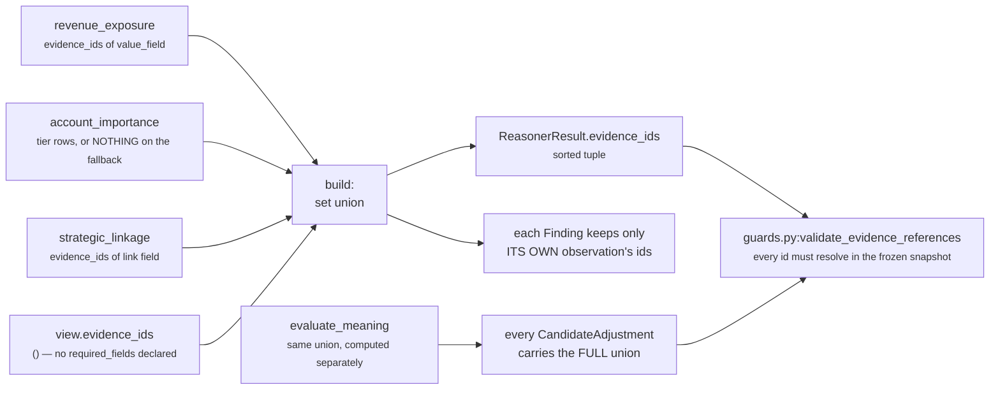

# `core.impact` · Stages 7–8 — Builder and Metrics

**Source:** `unit.py:ReasoningUnit.build` (lines 223–241) · the `publishes` guard in
`unit.py:ReasoningUnit.evaluate` (lines 256–261) · `impact_unit.py:ImpactUnit.publishes` (lines
261–262)
**Overridden by `ImpactUnit`:** **no** — `build` is the base class, unchanged. `publishes` is a
class attribute, declared.

---

## 1 · What it is for

Stage 7 assembles the one object shape every unit in Layer 4 returns, so the orchestrator, the
Decision Maker, the audit store and the replay verifier all handle seventeen units with one code
path. Stage 8 is the guard that stops a unit publishing a metric nobody declared — the mechanism
that keeps *"exactly one publisher per shared value"* enforceable rather than aspirational.

---

## 2 · What exists

### 2.1 · The guard, which runs first

```python
undeclared = sorted(set(verdict.metrics) - set(self.publishes)) if self.publishes else []
if undeclared:
    raise ValueError(f"{self.unit_id} published undeclared metrics: {', '.join(undeclared)}")
return self.build(view, verdict, observations)
```

It sits **between** the Evaluator and the Builder, not inside it. A unit that published an
undeclared metric would still produce a well-formed `ReasonerResult`; the guard's job is to refuse
*before* that object exists, so the failure reads as *"this unit is misdeclared"* rather than
*"this result contains something surprising"*.

`ImpactUnit` declares a non-empty `publishes`, so it is not in the framework's escape hatch (the
`if self.publishes else []` clause that leaves a unit with an empty tuple unguarded). Adding a
fourth plugin that emitted, say, `headroom_bp` into `Verdict.metrics` would raise
`ValueError: core.impact published undeclared metrics: headroom_bp` on the first test run — not six
months later when something downstream started reading it.

### 2.2 · The Builder, in full

```python
def build(self, view, verdict, observations) -> ReasonerResult:
    evidence = set(view.evidence_ids)
    for observation in observations:
        evidence.update(observation.evidence_ids)
    return ReasonerResult(
        reasoner_id=self.unit_id,
        reasoner_version=self.version,
        status=ResultStatus.COMPLETED,
        matched=verdict.matched,
        metrics={name: clamp_bp(value) if name.endswith("_bp") else value
                 for name, value in verdict.metrics.items()},
        findings=verdict.findings,
        adjustments=verdict.adjustments,
        checks=verdict.checks,
        evidence_ids=tuple(sorted(evidence)),
        reason_codes=verdict.reason_codes,
    )
```

Three things it does, and only three: **union the evidence**, **clamp the `_bp` metrics**, and
**stamp identity and status**. Everything else passes through from the `Verdict` untouched.

For `core.impact` the clamp is a no-op — `calculate` already ran every published `_bp` value through
`clamp_bp`, and `impact_signal_count` does not end in `_bp` so it is passed through unclamped (which
matters: a count of 3 must not be confused for a basis-point value). The one framework-level hazard
here does not apply to this unit either: `Verdict` validates nothing, and `clamp_bp` calls `int()`,
which truncates a float silently. `ImpactUnit` never puts a float in a `Verdict` — every value
originates from `Observation.metrics`, which `Observation.__post_init__` already proved to be `int`.

### 2.3 · What the final `ReasonerResult` carries

For the Northwind renewal, verified by running the live unit:

| Field | Value |
|---|---|
| `reasoner_id` | `"core.impact"` |
| `reasoner_version` | `"1.0.0"` |
| `status` | `ResultStatus.COMPLETED` |
| `matched` | `True` |
| `metrics` | `revenue_exposure_bp 7500 · relationship_exposure_bp 9000 · strategic_bp 8000 · impact_signal_count 3 · impact_bp 8050` |
| `findings` | 3 — `impact.account_importance`, `impact.revenue_exposure`, `impact.strategic_linkage`, in `plugin_id` order |
| `adjustments` | 1 — `executive_escalation` / `impact` / `+1610` / `impact_magnitude_at_stake` |
| `checks` | 1 — `executive_escalation` / `cost_benefit` / `ADJUST` / `detail={"impact_bp": 8050, "delta_bp": 1610}` |
| `evidence_ids` | `("ev_init", "ev_tier", "ev_value")` |
| `missing_fields` | `()` — the base builder never sets it |
| `reason_codes` | `("linked_to_strategic_initiative", "material_impact", "named_account_tier", "revenue_at_stake")` |
| `diagnostics` | `{}` — `compare=False, repr=False`, outside `to_semantic_dict` |
| `semantic_hash` | `6e95974981d35af19473fe30a329355a19117bd2a0b235736733ea6df2791811` |

`ReasonerResult.__post_init__` re-validates on the way in: every `_bp`-suffixed metric must be an
integer in 0..10,000 (`bool` rejected), evidence ids and reason codes are deduplicated and sorted
again, and `platform/canonical.py:canonicalize` rejects floats anywhere in the object. The status
constraint is the sharpest of them:

> *a non-`COMPLETED` result cannot carry `matched`, metrics, findings, adjustments, checks or
> evidence ids.*

So there is no such thing as a partially-successful `core.impact`. Either the whole stake reading
stands, or nothing does.

---

## 3 · The `publishes` list

```python
publishes = ("impact_bp", "revenue_exposure_bp", "relationship_exposure_bp",
             "strategic_bp", "impact_signal_count")
```

| Metric | Range | Meaning | Emitted |
|---|---|---|---|
| `impact_bp` | 0–10,000 | The blended stake. `8,050bp` means 0.805 — a large but not maximal swing | only when ≥ 1 dimension reported |
| `revenue_exposure_bp` | 0–10,000 | Deal value ÷ `reference_value`, saturating at the reference | only when `revenue_exposure` reported |
| `relationship_exposure_bp` | 0–10,000 | Account importance: the tier weight, else `core.relationship`'s `coverage_bp` | only when `account_importance` reported |
| `strategic_bp` | 0–10,000 | The **strongest** single strategic linkage, not the sum | only when `strategic_linkage` reported |
| `impact_signal_count` | 0–3 | How many of the three dimensions reported. **Not** basis points | **always** |

### 3.1 · No reserved metric appears here

```python
reserved = {"confidence_bp", "urgency_bp", "priority_override_bp"}
assert reserved.isdisjoint(ImpactUnit().publishes)
```

Pinned by `test_the_unit_never_publishes_a_metric_another_unit_owns` —
*"confidence_bp and urgency_bp have named authorities; emitting them here rescores all."*
`decision_maker.py:calculate_confidence` scans results in plan order and **breaks** at
`CONFIDENCE_AUTHORITY = "core.confidence"`; `priority_metrics` does the same at
`PRIORITY_AUTHORITY = "core.priority"`. A `core.impact` that emitted `confidence_bp` would move
every ranked decision in the system, silently, the day it joined a capability.

The roster-wide version of the same rule is
`tests/test_unit_roster.py::test_no_unit_publishes_a_metric_another_unit_owns` — all five of
`core.impact`'s names are unique across the seventeen units.

### 3.2 · Four of five are conditionally absent — restated, because it is the contract

```text
nothing measurable   metrics = {"impact_signal_count": 0}                 matched None
revenue only         + revenue_exposure_bp, impact_bp                     matched True/False
tier or coverage     + relationship_exposure_bp, impact_bp                matched True/False
strategic only       + strategic_bp, impact_bp                            matched True/False
all three            all five metrics                                     matched True/False
```

A consumer must handle the absence. `unit.py:UnitView.prior_metric` does so by design — it
substitutes a caller-supplied default when the metric is not there — which is exactly why
`tradeoff_unit.py` can read `impact_bp` without special-casing anything, and why
`impact_unit.py`'s own `AccountImportancePlugin` chose `-1` rather than `0` as its sentinel.

---

## 4 · Evidence attachment



Three different granularities, deliberately:

| Carrier | Evidence | Why |
|---|---|---|
| `Finding.evidence_ids` | only the observation's own | a claim about revenue must cite the revenue row, not the tier row |
| `ReasonerResult.evidence_ids` | the union, including `view.evidence_ids` | *"everything this unit stood on"* — what `aggregate_evidence` collects |
| `CandidateAdjustment.evidence_ids` | the union, recomputed in `evaluate_meaning` | the tilt is justified by the **blended** stake, which stands on every dimension |

`view.evidence_ids` contributes nothing in practice, because no capability declares
`required_fields` for `core.impact`. See [02 · Retriever](02-Retriever.md).

`guards.py:validate_evidence_references` re-checks at the orchestrator boundary that every id
resolves inside the frozen `ContextSnapshot`:

> *"This is what makes evidence replayable: a reasoner cannot cite a row it fetched itself, only
> what the selector already froze into the snapshot the decision was hashed against."*

### 4.1 · The ungrounded-claim hole

The `relationship_footprint` fallback constructs its `Observation` **without** `evidence_ids`. When
it is the only dimension that reports:

```text
result  matched True · impact_bp 6,000 · impact_signal_count 1
        findings (impact.account_importance, matched=True, evidence_ids=())
        evidence_ids ()
```

Verified. `validation_unit.py:_asserts_a_claim` returns `True` for this result (`matched is True`),
`_cited` returns `()`, and `EvidenceSufficiencyPlugin` emits an
`Observation(kind="validation.ungrounded_claim", reason_codes=("claim_without_evidence",
"claimant:core.impact"))`. On the measured `deal_cooling_full_v2` run `core.impact` was the *only*
one of validation's four inspected dependencies that cited anything, so today the unit is the
category's best citizen on this axis — but the fallback path, if it ever becomes reachable, moves it
into the ungrounded column.

The honest fix is not obvious: the reading genuinely came from another unit's metric, and there is
no `EvidenceRef` in *this* snapshot that stands behind it. Citing `core.relationship`'s evidence ids
would mean asserting a citation the plugin never read. That tension is unresolved and is recorded in
the category document as a live disagreement between two units' design records.

---

## 5 · Who consumes these metrics

Every consumer, verified by grep across `genios_engine/`.

| Consumer | Reads | How | Behaviour when absent |
|---|---|---|---|
| `reasoners/tradeoff_unit.py:CostVersusBenefitPlugin` | `impact_bp` | `_prior_bp(view, "benefit_source", "core.impact", "impact_bp")` — the **benefit** side of the cost-vs-benefit axis | returns `None` → the plugin contributes `()`. *"where neither has been deployed the plugin stays silent rather than treating unmeasured effort as free"* |
| `reason/decision_maker.py:synthesize_candidates` | the `CandidateAdjustment`s, not the metric | `components["impact"] = clamp_bp(play.impact_bp + delta_bp)` for the matching `play_id` | the play keeps its authored `PlayDefinition.impact_bp` |
| `reason/decision_maker.py:evaluate_candidates` | the `CandidateCheck`s | attached to the candidate via `ordered_checks`; **never eliminates**, because the outcome is `ADJUST` not `ELIMINATE` | no check rows |
| `reason/decision_maker.py:aggregate_evidence` | `result.evidence_ids`, `finding.evidence_ids`, `adjustment.evidence_ids` | unioned into the decision's evidence set | contributes nothing |
| `reasoners/validation_unit.py` | `matched`, `findings`, `evidence_ids` | `core.impact` is one of its four declared dependencies in `deal_cooling_full_v2`; feeds `ungrounded_claim_count` and `evidence_sufficiency_bp` | an `INSUFFICIENT_CONTEXT` result is not `COMPLETED`, so `completed_results` skips it entirely |
| `reason/authority.py:AUTHORITATIVE_SCORE_INPUTS_SQL` | `impact_bp` | `coalesce((authority_source.output->'metrics'->>'impact_bp')::int, selected_rc.final_utility_bp)` — projects the `I` input of the legacy 0–100 signal score | **`coalesce` falls back to the candidate's final utility**. This is the one consumer that supplies its own default for an absent `impact_bp`, in SQL |

Two things that are **not** consumers, despite looking like them:

- **`PlayDefinition.impact_bp`** is a different number entirely — the author's static estimate of a
  play's impact, declared in Layer 3 and used as the *starting* value of the `impact` score
  component. `core.impact`'s `impact_bp` is a measurement of the situation. They meet only through
  the adjustment.
- **`reasoners/cost_unit.py` and `reasoners/alternative_unit.py`** both compute
  `clamp_bp(divide_half_up(play.impact_bp * play.success_probability_bp, 10_000))` — that is the
  *play's* declared impact, read straight off the manifest. Neither unit reads `core.impact`.

Nothing reads `revenue_exposure_bp`, `relationship_exposure_bp`, `strategic_bp` or
`impact_signal_count`. All four are explainability metrics: they exist so a human reading a trace
can see *why* `impact_bp` is what it is, and so a refactor that drops a dimension is visible as a
changed count rather than only as a slightly different blend.

---

## 6 · Worked example — the guard and the builder on one run

```text
Verdict.metrics keys  {"revenue_exposure_bp", "relationship_exposure_bp", "strategic_bp",
                       "impact_signal_count", "impact_bp"}
publishes             ("impact_bp", "revenue_exposure_bp", "relationship_exposure_bp",
                       "strategic_bp", "impact_signal_count")

set(verdict.metrics) - set(publishes) = ∅   → no raise → build proceeds

build
  evidence = set(())                         # view.evidence_ids
           | {"ev_tier"} | {"ev_value"} | {"ev_init"}
           = {"ev_init", "ev_tier", "ev_value"}
  metrics  = {"revenue_exposure_bp": clamp_bp(7500)   = 7500,
              "relationship_exposure_bp": clamp_bp(9000) = 9000,
              "strategic_bp": clamp_bp(8000)          = 8000,
              "impact_signal_count": 3,                # no _bp suffix → untouched
              "impact_bp": clamp_bp(8050)             = 8050}
  status   = COMPLETED
  → ReasonerResult, semantic_hash 6e95974981d35af1...
```

And the same input run twice produces byte-identical output — pinned by
`test_the_same_frozen_situation_scores_identically_twice`, which asserts on both
`dict(result.metrics)` and `result.semantic_hash`. `semantic_hash` covers status, `matched`,
metrics, findings, adjustments, checks, evidence ids, missing fields and reason codes together, so
one equality is the whole replay claim rather than a spot check.

The determinism chain that makes it hold, end to end:

```text
analyze          plugins sorted by plugin_id
account tier     table built over sorted(weights)
strategic links  set → sorted tuple; table built over sorted(weights)
calculate        _DIMENSIONS is a fixed tuple; one half-up division on the summed numerator
evaluate_meaning play ids sorted; evidence sorted; reason codes set → sorted
Observation      evidence_ids and reason_codes sorted and deduped at construction
build            evidence_ids sorted
canonicalize     floats rejected; mappings serialised in a canonical key order
```

Not one ordering in that list is left to iteration order.

---

## 7 · Edge cases

| Situation | Behaviour |
|---|---|
| `Verdict` carries a metric not in `publishes` | `ValueError` before `build` runs → orchestrator records `FAILED` |
| `publishes` emptied by a future edit | the guard becomes a no-op (`if self.publishes else []`). `tests/test_unit_roster.py` catches it with `assert instance.publishes`, but the check lives in the test, not the framework |
| `matched is None` | `build` sets it faithfully; `ReasonerResult` permits boolean-or-`None`. The result is still `COMPLETED` — having no opinion is a successful run |
| No metrics at all in the `Verdict` | impossible for this unit — `impact_signal_count` is always set by `calculate` |
| An observation cites an evidence id absent from the snapshot | impossible — `common.py:evidence_ids` derives ids *from* the snapshot; `guards.py:validate_evidence_references` re-proves it anyway |
| A `Finding` metric ends in `_bp` and exceeds 10,000 | `Finding.__post_init__` raises. Unreachable here: every `strength_bp` is already clamped, and `exposure_value` / `linked_goal_count` do not end in `_bp` |
| `exposure_value` of 2,000,000 in a `Finding` | fine — no `_bp` suffix, so no range check. It is an explainability value, not a score |
| The unit is invoked twice on one request | identical results; the unit holds no state and the plugins are stateless singletons constructed at class-definition time |

---

| ← | |
|---|---|
| [05 · Evaluator](05-Evaluator.md) | [README — the unit's map](README.md) |
