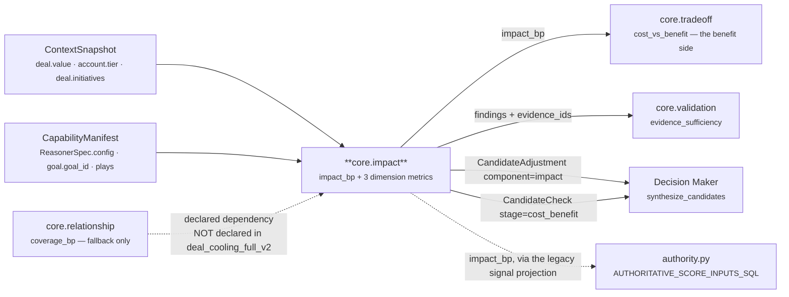
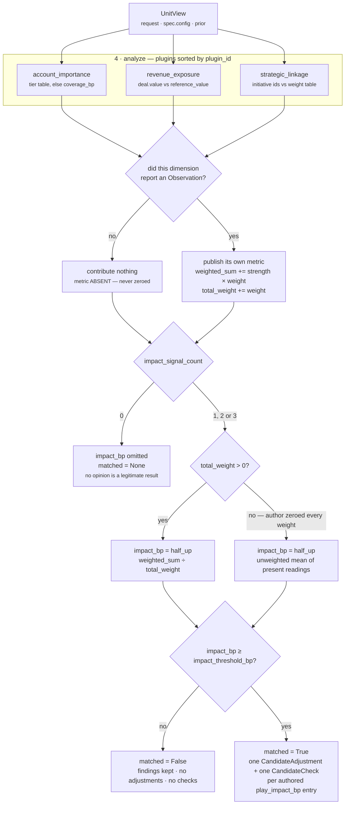

# `core.impact` — the Impact Unit

**Source of truth:** `genios_engine/reason/reasoners/impact_unit.py` (367 lines)
**Class:** `impact_unit.py:ImpactUnit` · `unit_id = "core.impact"` · `version = "1.0.0"`
**Category:** `UnitCategory.BUSINESS_EVALUATION`
**Contract:** `tests/test_unit_impact_unit.py` — 25 tests, all passing
**Registered:** `reasoners/__init__.py:BUSINESS_EVALUATION`, third of five

---

## 1 · What it is for

*If this goes one way or the other, how much actually changes?*

Impact is the **size of the swing** — not its direction, and never the choice about it. The module
docstring states the case the unit exists for:

> *"A deal worth twelve thousand and a deal worth twelve million can sit in exactly the same state,
> with the same risk and the same urgency, and still deserve very different amounts of human
> attention."*

Nothing else in Layer 4 measures the stake. `core.temporal` knows the clock, `core.relationship`
knows the coverage, `core.risk` knows the downside — none of them know how much is on the table.
`core.impact` is the only publisher of `impact_bp`, and `impact_bp` is what
`decision_maker.py:score_candidate` weights most heavily in the default ranking
(`ranking_weights = {"impact": 35, ...}` in `contracts/reasoning.py:CapabilityManifest`).

It never picks a play. Where a large stake should make a play more attractive, the tilt is
*authored* in Layer 3 as `play_impact_bp: {play_id: delta}` and merely **scaled** here by the
measured impact. The unit supplies the magnitude; the capability author supplies the judgement
about which play the magnitude favours; the Decision Maker does the actual choosing.

---

## 2 · Its place in the pipeline



The dotted `core.relationship` edge is the unit's one real wiring hazard: the fallback reading of
`AccountImportancePlugin` only works when the capability **declares** `core.relationship` as a
dependency, and the shipped `deal_cooling_full_v2` does not. See §6.

---

## 3 · What exists

### 3.1 · The three plugins

Registered as `plugins = (AccountImportancePlugin(), RevenueExposurePlugin(),
StrategicLinkagePlugin())`. `unit.py:ReasoningUnit.analyze` sorts them by `plugin_id`, so the
execution order below is the order observations, findings and reason codes appear in — a property
of the composition, not of the class body.

| # | `plugin_id` | Class | Claim | Emits `Observation.metrics` | Doc |
|---|---|---|---|---|---|
| 1 | `account_importance` | `AccountImportancePlugin` | How much relationship is riding on the outcome | `strength_bp` | [03a](03a-plugin-account_importance.md) |
| 2 | `revenue_exposure` | `RevenueExposurePlugin` | The money on the table, against a declared reference | `strength_bp`, `exposure_value` | [03b](03b-plugin-revenue_exposure.md) |
| 3 | `strategic_linkage` | `StrategicLinkagePlugin` | Whether this is attached to a declared company goal | `strength_bp`, `linked_goal_count` | [03c](03c-plugin-strategic_linkage.md) |

### 3.2 · The published metrics

`publishes = ("impact_bp", "revenue_exposure_bp", "relationship_exposure_bp", "strategic_bp",
"impact_signal_count")`

| Metric | Range | Meaning | Present when |
|---|---|---|---|
| `impact_bp` | 0–10,000 | The blended stake. `10,000bp` means 1.00 — maximal for attention purposes | **only** when at least one dimension reported |
| `revenue_exposure_bp` | 0–10,000 | Deal value as a fraction of `reference_value`, saturating | only when `revenue_exposure` reported |
| `relationship_exposure_bp` | 0–10,000 | Account importance — tier weight, else relationship coverage | only when `account_importance` reported |
| `strategic_bp` | 0–10,000 | Strongest single strategic linkage | only when `strategic_linkage` reported |
| `impact_signal_count` | 0–3 | How many dimensions reported | **always** |

Four of the five are conditionally absent. That is the unit's central design rule and it is
described in §4.

> **Naming mismatch worth knowing.** The plugin is `account_importance`; the metric it publishes is
> `relationship_exposure_bp`. The mapping lives in the `_DIMENSIONS` table, which is exactly why
> that table exists as data — *"so that the published metric names, the tuning keys, and the blend
> can never drift apart."*

### 3.3 · Which stages it implements

| Stage | Overridden? | Doc |
|---|---|---|
| 1 · Input | n/a — fixed by the template method | [01](01-Input-and-Validator.md) |
| 2 · Validator | **no** — base `unit.py:ReasoningUnit.validate` | [01](01-Input-and-Validator.md) |
| 3 · Retriever | **no** — base `unit.py:ReasoningUnit.retrieve` | [02](02-Retriever.md) |
| 4 · Analyzer | **no** — base `unit.py:ReasoningUnit.analyze` | [03](03-Analyzer.md) |
| 5 · Calculator | **yes** — abstract, must be | [04](04-Calculator.md) |
| 6 · Evaluator | **yes** — abstract, must be | [05](05-Evaluator.md) |
| 7 · Builder | **no** — base `unit.py:ReasoningUnit.build` | [06](06-Builder-and-Metrics.md) |
| 8 · Metrics | declared in `publishes` | [06](06-Builder-and-Metrics.md) |

Four of the eight stages are the base class unchanged (`validate`, `retrieve`, `analyze`, `build`),
one is fixed by the framework, and one is a declaration. `ImpactUnit` is 108 lines of class body —
`impact_unit.py:255-362`; the other 259 lines of the module are the module docstring, the three
plugins, four config readers, the `_DIMENSIONS` table and the prose that argues them.

---

## 4 · Internal flow



The three rules the module docstring states, and where each one lives in the code:

**Silence is not zero.** A dimension with no evidence contributes no observation *and publishes no
metric*. Emitting `revenue_exposure_bp = 0` because Layer 2 never supplied a deal value would be a
fabricated fact — downstream it is indistinguishable from a genuinely worthless deal. Enforced by
every plugin returning `()` on its silence paths, and by `calculate` skipping any `plugin_id` not
present in `strengths`.

**The blend renormalises over what was actually seen.** The denominator is `total_weight`, summed
only over dimensions that actually reported. Averaging a known 9,000bp revenue exposure against two
unknowns would report 3,000bp for a deal we know to be enormous — turning the number from *"how big
is this"* into *"how complete is our data"*.

**It never picks a play.** No play id appears anywhere in `impact_unit.py`. The only play ids the
unit ever names come out of `view.config["play_impact_bp"]`, authored in Layer 3. *"Hardcoding play
names here would make this unit a decision authority by the back door."*

---

## 5 · Every config key

All thirteen are read from `ReasonerSpec.config` — per-capability tuning authored in Layer 3 and
versioned with the manifest. There is no global default file; the defaults below are the literal
fallback arguments in the source.

| Key | Read by | Type | Default | Validator | Effect when absent |
|---|---|---|---|---|---|
| `value_field` | `RevenueExposurePlugin` | str | `"deal.value"` | none — `str(... or default)` | uses `deal.value` |
| `reference_value` | `RevenueExposurePlugin` | positive int | `100_000` | `_config_positive` | 100,000 is "fully material" |
| `account_tier_field` | `AccountImportancePlugin` | str | `""` | `str(... or "").strip()` | tier path **disabled**, fallback only |
| `account_tier_bp` | `AccountImportancePlugin` | mapping label→int | `{}` | `_mapping_config` + `_delta_bp` | tier path **disabled**, fallback only |
| `relationship_reasoner` | `AccountImportancePlugin` | str | `"core.relationship"` | none | reads `core.relationship` |
| `strategic_link_field` | `StrategicLinkagePlugin` | str | `""` | `str(... or "").strip()` | plugin **silent entirely** |
| `strategic_goal_bp` | `StrategicLinkagePlugin` | mapping id→int | `{}` | `_mapping_config` + `_delta_bp` | only the capability's own goal can score |
| `goal_alignment_bp` | `StrategicLinkagePlugin` | bp 0–10,000 | `6_000` | `_config_bp` | goal linkage worth 6,000bp |
| `revenue_weight_bp` | `ImpactUnit.calculate` | bp 0–10,000 | `5_000` | `_config_bp` | revenue dominates the blend |
| `relationship_weight_bp` | `ImpactUnit.calculate` | bp 0–10,000 | `3_000` | `_config_bp` | relationship matters |
| `strategic_weight_bp` | `ImpactUnit.calculate` | bp 0–10,000 | `2_000` | `_config_bp` | strategy is a tie-breaker |
| `impact_threshold_bp` | `ImpactUnit.evaluate_meaning` | bp 0–10,000 | `5_000` | `_config_bp` | half the scale is "material" |
| `play_impact_bp` | `ImpactUnit.evaluate_meaning` | mapping play_id→int −10,000..10,000 | `{}` | `_mapping_config` + `_delta_bp` | **no adjustments, no checks, ever** |

The three weight defaults are declared as data in `_DIMENSIONS`, not as literals in `calculate`:

```python
_DIMENSIONS: tuple[tuple[str, str, str, int], ...] = (
    ("revenue_exposure",   "revenue_exposure_bp",      "revenue_weight_bp",      5_000),
    ("account_importance", "relationship_exposure_bp", "relationship_weight_bp", 3_000),
    ("strategic_linkage",  "strategic_bp",             "strategic_weight_bp",    2_000),
)
```

### 5.1 · Config validation is lazy, and that hides authoring faults

Every `_config_bp` / `_config_positive` / `_delta_bp` call sits **inside** the branch that needs it.
A malformed value therefore raises only on the run where its branch is reached:

```text
config={"revenue_weight_bp": 99_999}, facts={"deal.status": "open"}
  → revenue_exposure stays silent → weight never read → run COMPLETES
  → metrics = {"impact_signal_count": 0}

config={"revenue_weight_bp": 99_999}, facts={"deal.value": 10}
  → revenue_exposure reports → weight read → ValueError:
    "revenue_weight_bp must be integer basis points"
  → orchestrator turns it into ResultStatus.FAILED
```

Verified against the live module. A broken manifest can sit green through an entire test suite and
fail on the first deal that happens to carry the field. That is the price of not validating config
at manifest-compile time, and nothing in `packs/` validates these keys either.

### 5.2 · Only one shipped capability configures this unit

`packs/capabilities/deal_cooling_v2.py:_full_roster` declares:

```python
_spec("core.impact", config={"play_impact_bp": {"restore_momentum": 400}}),
```

No dependencies. No required fields. No `reference_value`, no tier field, no strategic field. So in
the only place `core.impact` ships today it runs on **defaults for everything except one authored
play tilt**, and two of its three dimensions are unreachable. See §6.

---

## 6 · Known defects and compromises

| # | What | Where | Severity |
|---|---|---|---|
| 1 | **A whole dimension is structurally unreachable in the shipped capability.** `deal_cooling_full_v2` declares `core.impact` with no `dependencies`, and `orchestrator.py` passes a unit only the prior results it declared. So `view.prior_metric("core.relationship", "coverage_bp", -1)` always returns the `-1` sentinel and `AccountImportancePlugin` is always silent — even though `core.relationship` ran in the same execution and published `coverage_bp = 6,666`. Renormalisation then quietly re-weights revenue to 100% and nothing reports a problem. | `deal_cooling_v2.py:99` | **high** — silent, and defeats the silence-is-not-zero rule by moving the omission into the manifest |
| 2 | **The `relationship_footprint` fallback cites nothing.** The fallback `Observation` is constructed with no `evidence_ids`. A run whose only dimension is the fallback produces `matched=True` with `result.evidence_ids == ()` — which `validation_unit.py:_asserts_a_claim` counts as an **ungrounded claim** and folds into `evidence_sufficiency_bp`. Verified: coverage 6,000 alone gives `impact_bp = 6,000, matched=True, evidence_ids=()`. | `impact_unit.py:179-184` | medium |
| 3 | **A negative tier weight is accepted, then silently ignored.** `_delta_bp` permits −10,000..10,000 because it is shared with `play_impact_bp`; the tier branch then guards with `if strength >= 0`. A capability authoring `{"churned": -2000}` gets no error and no tier reading — it falls through to relationship coverage. Verified: tier `churned` at −2,000 with coverage 4,000 yields `strength_bp = 4,000, reason_codes = ("relationship_footprint",)`. | `impact_unit.py:166-174` | low, but undiagnosable from the outside |
| 4 | **Findings are emitted below the threshold.** Unlike `core.opportunity`, which suppresses findings when `matched=False`, `core.impact` builds its `Finding` tuple *before* the materiality branch. An immaterial run still asserts three `matched=True` findings. That is defensible — the dimensions really were measured — but it means an immaterial impact still counts as a claim in `core.validation`. | `impact_unit.py:326-333` | low |
| 5 | **Every threshold is a guess.** `impact_threshold_bp` (5,000), `reference_value` (100,000), `goal_alignment_bp` (6,000) and the 5,000/3,000/2,000 weights were authored from domain reasoning and have never been fitted to data. `Rohit_Updates/Layer 4.md` Step 4 records this. | throughout | acknowledged |
| 6 | **`view.facts` and `view.evidence_ids` are both empty for this unit in practice**, because the plugins read through `view.request` rather than the retrieved window. See [02 · Retriever](02-Retriever.md). | `impact_unit.py` plugins | design note |
| 7 | **The unit test proves the unit, not the wiring.** `test_the_northwind_renewal_reports_a_high_stake_across_all_three_dimensions` configures its own capability with the tier field declared, so it never exercises the fallback path the shipped v2 manifest actually depends on. That is why defect 1 has been sitting in the candidate capability with a green suite. | `tests/test_unit_impact_unit.py` | process |

---

## 7 · The canonical worked example

`test_the_northwind_renewal_reports_a_high_stake_across_all_three_dimensions` — a 150,000 renewal,
on a strategic-tier account, tagged to the enterprise push. Every number below was re-derived by
running the live unit, not copied from the test.

```text
facts    deal.value        = 150000        evidence ev_value  (crm_deal_9)
         account.tier      = "strategic"   evidence ev_tier   (crm_account_3)
         deal.initiatives  = ("expand_enterprise",)  evidence ev_init (planning_doc_1)
         deal.status       = "open"
config   reference_value       = 200000
         account_tier_field    = "account.tier"
         account_tier_bp       = {"strategic": 9000, "smb": 2000}
         strategic_link_field  = "deal.initiatives"
         strategic_goal_bp     = {"expand_enterprise": 8000}
         play_impact_bp        = {"executive_escalation": 2000}

4 · analyze  (plugin_id order)
   account_importance  strength_bp 9000  ev_tier   named_account_tier
   revenue_exposure    strength_bp 7500  ev_value  revenue_at_stake      exposure_value 150000
   strategic_linkage   strength_bp 8000  ev_init   linked_to_strategic_initiative  linked_goal_count 1

5 · calculate  (_DIMENSIONS order)
   revenue      7500 × 5000 = 37,500,000
   relationship 9000 × 3000 = 27,000,000
   strategic    8000 × 2000 = 16,000,000
   weighted_sum            = 80,500,000
   total_weight            =     10,000
   impact_bp = half_up(80,500,000 / 10,000) = 8,050

6 · evaluate_meaning
   8,050 >= 5,000  → material → matched True
   executive_escalation: half_up(2000 × 8050 / 10000) = 1,610
   adjustment  play=executive_escalation component=impact delta_bp=+1610
               reason_code=impact_magnitude_at_stake  evidence=(ev_init, ev_tier, ev_value)
   check       stage=cost_benefit outcome=ADJUST evaluator=core.impact@1.0.0
               detail={"impact_bp": 8050, "delta_bp": 1610}

7 · build
   metrics      revenue_exposure_bp 7500 · relationship_exposure_bp 9000 · strategic_bp 8000
                impact_signal_count 3 · impact_bp 8050
   findings     impact.account_importance · impact.revenue_exposure · impact.strategic_linkage
   reason_codes linked_to_strategic_initiative · material_impact · named_account_tier ·
                revenue_at_stake
   evidence_ids ev_init · ev_tier · ev_value
   semantic_hash 6e95974981d35af19473fe30a329355a19117bd2a0b235736733ea6df2791811
```

Revenue alone reads 7,500bp — meaningful but not alarming. The tier and the strategic tag are what
lift it to 8,050bp and put it in front of a human. **Any refactor that loses a dimension shows up
here as a materially lower number**, which is the whole point of pinning it.

---

## 8 · The files

| File | Stage | Answers |
|---|---|---|
| [01 · Input and Validator](01-Input-and-Validator.md) | 1–2 | What arrives, what `required_fields` it declares, and why it almost never refuses to reason |
| [02 · Retriever](02-Retriever.md) | 3 | Which slice of the frozen snapshot lands in the `UnitView` — and why this unit ignores it |
| [03 · Analyzer](03-Analyzer.md) | 4 | The plugin seam: composition, execution order, independence, interaction |
| [03a · `account_importance`](03a-plugin-account_importance.md) | 4 | Tier table first, relationship coverage second, silence third |
| [03b · `revenue_exposure`](03b-plugin-revenue_exposure.md) | 4 | Money as a saturating ratio against a declared reference |
| [03c · `strategic_linkage`](03c-plugin-strategic_linkage.md) | 4 | Declared intent, strongest linkage wins |
| [04 · Calculator](04-Calculator.md) | 5 | The renormalised weighted mean, argued from the code's own docstring |
| [05 · Evaluator](05-Evaluator.md) | 6 | Materiality, `matched`, findings, scaled adjustments, mirrored checks |
| [06 · Builder and Metrics](06-Builder-and-Metrics.md) | 7–8 | The `ReasonerResult`, evidence attachment, and every downstream consumer |

### Related

| Document | Covers |
|---|---|
| [Category 2 · Business Evaluation](../README.md) | The five units of this category and the two metric authorities |
| [Part 2 · The Unit Framework](../../README.md) | The eight stages, the plugin seam, the roster invariants |
| [Layer 4 · Overview](../../../00-Overview.md) | The three parts and the laws that bind all of them |
