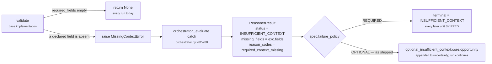

# `core.opportunity` · Stages 1–2 — Input and Validator

**Source:** `unit.py:ReasoningUnit.evaluate` (lines 245–262) · `unit.py:ReasoningUnit.validate`
(lines 179–188) · `reasoners/common.py:missing_fields` (lines 116–124) ·
`reason/guards.py:required_missing` (lines 27–48)
**Overridden by `OpportunityUnit`:** **no.** `opportunity.py` contains no `validate` method and no
`required_fields` declaration. Both come from the base class and from the capability manifest.

---

## 1 · What it is for

Stage 1 is not a method. It is the fact that a unit receives exactly two things and nothing else:

```python
def evaluate(self, request: ReasoningRequest,
             prior_results: Mapping[str, ReasonerResult]) -> ReasonerResult:
```

Stage 2 is the unit's chance to say *"I will not guess."* The base implementation:

> *"Refuse inputs that cannot support a conclusion. The default enforces the unit's declared
> `required_fields`. Raising `MissingContextError` is how a unit says 'I will not guess' — the
> orchestrator turns it into a typed insufficient-context result instead of letting a fabricated
> answer through."*

`core.opportunity` declines to use it. That is the substantive finding of this file.

---

## 2 · What arrives

### 2.1 · The `ReasoningRequest`

`contracts/reasoning.py:ReasoningRequest` (lines 453–517). The parts this unit's plugins actually
touch:

| Path | Type | Read by | Purpose |
|---|---|---|---|
| `request.context.facts["deal.last_inbound"]` | ISO-8601 string, or a fact record mapping with a `"value"` key | `unanswered_inbound` | when the counterparty last wrote |
| `request.context.facts["deal.last_outbound"]` | same | `unanswered_inbound` | when we last wrote back |
| `request.context.facts["deal.status"]` | string, or a fact record mapping | `stalled_but_open` | is the deal still winnable |
| `request.context.facts["deal.owner"]` | anything; only truthiness is tested | `unworked_relationship` | is anyone working it |
| `request.evaluation_time` | tz-aware `datetime` | `common.py:elapsed_hours` | the frozen clock |
| `request.capability.reasoners` | `tuple[ReasonerSpec, ...]` | `common.py:active_spec` | finds this unit's own spec |

All four fact paths are **string literals in `opportunity.py`**. There is no config key that
renames any of them. `fact_value` (`common.py:25-27`) unwraps a `{"value": ...}` record if it finds
one and otherwise returns the raw value, so both shapes Layer 2 emits are accepted.

### 2.2 · The prior results

`prior_results` is a mapping of `reasoner_id → ReasonerResult`, and the orchestrator fills it with
**only the dependencies this unit declared in the capability DAG**:

```python
dependencies = {item: prior[item] for item in spec.dependencies if item in prior}
```

> *"A reasoner can see only dependencies it declared in the capability DAG. Passing every earlier
> result would create hidden, order-dependent edges."* — `orchestrator.py:188-189`

`core.opportunity` needs exactly one: `core.temporal`, for `drop_bp`. The shipped capability
declares it (`deal_cooling_v2.py:94`), as does `tests/test_l4_end_to_end.py:49`. A capability that
forgets it does not get an error — `view.prior_metric("core.temporal", "drop_bp", 0)` returns the
`0` default and `stalled_but_open` goes silent. Verified: identical `semantic_hash` to a run where
`core.temporal` failed.

### 2.3 · The `ReasonerSpec` this unit runs under

`common.py:active_spec` scans `request.capability.reasoners` for `reasoner_id == "core.opportunity"`
and raises `ValueError("capability does not declare reasoner core.opportunity")` if it is absent.
That is unreachable in practice — the planner resolves the spec before scheduling — but it is what
makes `view.spec` safe to read without a guard.

As shipped:

```text
ReasonerSpec(reasoner_id="core.opportunity", version="1.0.0",
             dependencies=("core.temporal",),
             required_fields=(),                    ← empty
             latency_budget_ms=60,
             failure_policy=FailurePolicy.OPTIONAL,
             gating=False,
             config={"opportunity_threshold_bp": 2500})
```

---

## 3 · The Validator, in full

```python
def validate(self, view: UnitView) -> None:
    absent = missing_fields(view.request, view.spec.required_fields)
    if absent:
        raise MissingContextError(*absent)
```

`OpportunityUnit` does not override it. And because `required_fields` is `()` in every capability
that names this unit, `missing_fields` iterates an empty tuple, returns `()`, and `validate` is a
no-op on every run the product performs today.

### 3.1 · What `missing_fields` would do if the tuple were not empty

```python
def missing_fields(request, fields: tuple[str, ...]) -> tuple[str, ...]:
    missing = []
    for field in fields:
        if field.startswith("neighbor:"):
            if field.split(":", 1)[1] not in request.context.neighbor_facts:
                missing.append(field)
        elif field not in request.context.facts:
            missing.append(field)
    return tuple(sorted(missing))
```

Presence only — a field whose value is `None` counts as present. The `neighbor:` prefix scopes the
lookup to `context.neighbor_facts`. The output is sorted so `MissingContextError.fields` and every
hash downstream of it are stable.

### 3.2 · The orchestrator already checked, more strictly

Before `evaluate` is ever called, `orchestrator.py:177-186` runs
`guards.py:required_missing(request, spec.required_fields)` and short-circuits to
`INSUFFICIENT_CONTEXT` with `reason_codes=("required_context_missing",)`. That check is **stricter**
than the unit's own:

```python
missing = set()
declared_missing = set(request.context.missing_fields)
for field in required:
    ...
    if absent or field in declared_missing:
        missing.add(field)
```

> *"A field counts as missing when it is absent **or** when Layer 2 explicitly published it as
> missing — an unknown fact and a known-absent fact must both stop reasoning rather than be
> silently treated as a default value."*

So `ReasoningUnit.validate` is a second, weaker line of defence that exists for direct callers —
unit tests instantiate `OpportunityUnit()` and call `.evaluate()` without an orchestrator, and the
in-unit check is what protects them.

### 3.3 · What happens if it ever does raise



`contracts/reasoning.py:ReasonerResult.__post_init__` (lines 629–633) then forbids that result from
carrying any metric, finding, adjustment, check or evidence id:

> *"non-completed reasoner results cannot carry decision effects or evidence"*

So there is no partial answer. Either the unit completes with `opportunity_bp`, or it publishes
nothing at all and every consumer's `prior_metric` falls back to its own default.

---

## 4 · Why this unit declares no required fields

The plugins already handle absence individually, and they handle it three different ways:

| Plugin | Its input | On absence |
|---|---|---|
| `unanswered_inbound` | `deal.last_inbound` | returns `()` — silent |
| `stalled_but_open` | `deal.status` | `str(None or "").lower()` is `""`, not in the open set → silent |
| `unworked_relationship` | `deal.owner` | **fires** at `unowned_strength_bp` |

Declaring `required_fields=("deal.last_inbound", "deal.status", "deal.owner")` would convert all
three into a single hard refusal: a deal with no owner recorded would produce
`INSUFFICIENT_CONTEXT` instead of the `no_owner_assigned` claim the third plugin exists to make.
That would be wrong for the third plugin and right for the first two — which is precisely why the
decision was pushed down to the plugins rather than declared at the unit.

The cost is spelled out in [02 · Retriever](02-Retriever.md): `required_fields` is also what drives
evidence selection, so an empty tuple means this unit cites nothing, ever.

---

## 5 · Silence semantics

**This unit cannot go silent.** It always returns `COMPLETED`, and it always publishes both
`opportunity_bp` and `opportunity_count`, even when all three plugins declined:

```text
facts = {}, prior = {}
  → analyze  → ()
  → calculate → {"opportunity_bp": 0, "opportunity_count": 0}
  → evaluate  → matched = (0 >= 3000) = False, findings = (), reason_codes = ()
  → build     → COMPLETED, metrics {"opportunity_bp": 0, "opportunity_count": 0}, evidence ()
```

Verified. A downstream reader cannot distinguish *"we looked and there is no headroom"* from *"none
of the three inputs was in the snapshot"* by reading `opportunity_bp` alone — both are `0`.
`opportunity_count` is the only signal that separates them, and even that is imperfect (defect 7 in
the [README](README.md#6--known-defects-and-compromises)). `core.impact` made the opposite choice
and omits `impact_bp` entirely when nothing reported. The divergence is discussed in
[04 · Calculator](04-Calculator.md) §5.

---

## 6 · Edge cases at the input boundary

| Input | What happens | Verified |
|---|---|---|
| `facts = {}`, `prior = {}` | `COMPLETED`, `opportunity_bp = 0`, `count = 0`, `matched = False` | yes |
| `deal.last_inbound = {"value": "2026-07-28T12:00:00+00:00"}` | `fact_value` unwraps the record; identical to the bare string | yes — `opportunity_bp = 6,308` either way |
| `deal.last_inbound = "not-a-date"` | `parse_time` raises, `unanswered_inbound` swallows it, plugin silent | yes |
| `deal.last_inbound = "2026-07-28T12:00:00"` (naive) | `parse_time` raises "must be timezone-aware", plugin silent | yes |
| `deal.last_inbound` in the future | `elapsed_hours` raises "is in the future", plugin silent | yes |
| `deal.status = {"value": "open"}` | `fact_value` unwraps; matches the open set | yes — `opportunity_bp = 6,000` at `drop_bp = 6,000` |
| `deal.owner = ""` / `0` / `False` / `[]` / absent | all falsy → `unworked_relationship` fires at 4,000bp | yes, all five |
| `deal.owner = "unassigned"` | truthy string → plugin **silent**. A CRM sentinel defeats the check | yes |
| `core.temporal` absent from `prior` | `prior_metric` default `0` → `stalled_but_open` silent | yes |
| `core.temporal` present but `status != COMPLETED` | `prior_metric` returns the default without reading metrics | yes — `unit.py:130-134` |
| `capability` does not declare `core.opportunity` | `active_spec` raises `ValueError` before `retrieve` | by inspection; unreachable via the orchestrator |
| `config = {"opportunity_threshold_bp": "3000"}` | `_config_bp` raises → orchestrator catches → `FAILED`, `reason_codes = ("reasoner_failure",)` | yes |

---

## 7 · Related

- [02 · Retriever](02-Retriever.md) — what the empty `required_fields` costs at the evidence seam
- [03 · Analyzer](03-Analyzer.md) — the three plugins and how their guards compose
- [README](README.md) — defects 1 and 2, both of which are input-boundary faults
- [Part 2 · The Unit Framework](../../README.md) — `MissingContextError` and the template method
