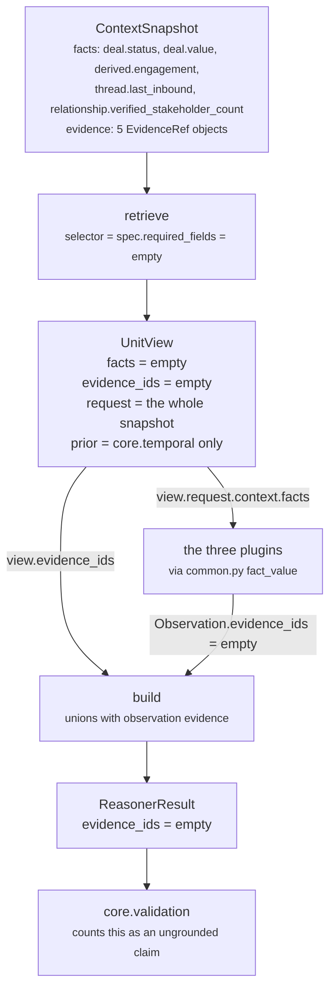

# `core.opportunity` · Stage 3 — Retriever

**Source:** `unit.py:ReasoningUnit.retrieve` (lines 190–200) · `unit.py:UnitView` (lines 109–134)
**Overridden by `OpportunityUnit`:** **no.** `opportunity.py` contains no `retrieve` method. The
base implementation runs unchanged.

---

## 1 · What it is for

The framework docstring opens by disowning the name:

> **The Retriever does not fetch.** *"Units are forbidden to touch a database, network, or clock —
> that is what makes a decision replayable months later. Retrieval already happened when Layer 2
> froze the ContextSnapshot. So 'Retriever' here means select and shape from that frozen input,
> which is the only form of retrieval that can survive replay."*

So the stage does two things: it narrows the request down to a declared window, and it collects the
evidence ids that back that window. For `core.opportunity` both produce an empty result, on every
run, and that has real consequences.

---

## 2 · The base implementation, in full

```python
def retrieve(self, request: ReasoningRequest, spec: ReasonerSpec,
             prior: Mapping[str, ReasonerResult]) -> UnitView:
    """Select this unit's window on the frozen snapshot. Selection only — never IO."""
    wanted = tuple(field for field in spec.required_fields
                   if not field.startswith("neighbor:"))
    facts = {name: request.context.facts[name]
             for name in wanted if name in request.context.facts}
    evidence = tuple(sorted(item.evidence_id for item in request.context.evidence
                            if item.field in facts))
    return UnitView(request=request, spec=spec, prior=prior,
                    facts=MappingProxyType(facts), evidence_ids=evidence)
```

Four properties worth naming:

1. **`spec.required_fields` is the only selector.** Nothing else decides what lands in
   `view.facts`. A unit that declares nothing selects nothing.
2. **`neighbor:`-prefixed fields are excluded** from `view.facts` — they live in
   `request.context.neighbor_facts` and a plugin that wants them reads them through
   `common.py:fact_value(..., neighbor=True)`. `core.opportunity` never does.
3. **Evidence is derived from the selected facts**, not declared separately:
   `item.field in facts`. So `view.evidence_ids ⊆ evidence for declared fields`, always.
4. **`facts` is wrapped in `MappingProxyType`** and `UnitView` is a frozen slots dataclass — the
   window cannot be mutated by a plugin and then observed by the next one.

---

## 3 · What `core.opportunity` actually gets

Because the shipped `ReasonerSpec` declares `required_fields=()`:

```text
wanted   = ()
facts    = {}                  → view.facts is an empty MappingProxyType
evidence = ()                  → view.evidence_ids is ()
```



### 3.1 · The plugins read past the window

Every plugin call is `fact_value(view.request, "...")` — never `view.facts[...]`:

| Line | Call |
|---|---|
| `opportunity.py:42` | `fact_value(view.request, "deal.last_inbound")` |
| `opportunity.py:43` | `fact_value(view.request, "deal.last_outbound")` |
| `opportunity.py:47` | `elapsed_hours(view.request, "deal.last_inbound")` |
| `opportunity.py:52` | `elapsed_hours(view.request, "deal.last_outbound")` |
| `opportunity.py:75` | `fact_value(view.request, "deal.status")` |
| `opportunity.py:95` | `fact_value(view.request, "deal.owner")` |

`common.py:fact_value` reads `request.context.facts`, which is the **whole** snapshot, not the
selected window. So the Retriever's narrowing has no effect on what this unit can see: it reads
everything Layer 2 froze regardless of what the spec declared.

That is the same pattern `core.impact` uses, and it is a deliberate framework-wide compromise:
`UnitView` was designed so *"a unit's inputs are visible in one place and a reviewer can see exactly
what it was allowed to look at"*, and reading through `view.request` defeats that. It is not a
correctness bug — every read is still from the frozen snapshot, so replay is unaffected — but the
audit property `UnitView` was built for is not being obtained.

### 3.2 · What the narrowing *does* still control

One thing, and it is the important one: **evidence**. `view.evidence_ids` is the only path by which
snapshot evidence reaches `build()`, and it is populated exclusively from `spec.required_fields`.

Verified against the live unit, same facts and same evidence in both runs:

```text
spec.required_fields = ()
  snapshot evidence  = (EvidenceRef("ev_inbound", "deal.last_inbound", ...),)
  → view.facts        = {}
  → view.evidence_ids = ()
  → result.evidence_ids = ()                     ← cites nothing

spec.required_fields = ("deal.last_inbound",)
  same snapshot evidence
  → view.facts        = {"deal.last_inbound": "..."}
  → view.evidence_ids = ("ev_inbound",)
  → result.evidence_ids = ("ev_inbound",)        ← cites the buyer's message
  → finding.evidence_ids = ()                    ← still empty; see §4
```

So a one-line manifest change fixes the result-level citation. It does **not** fix the findings,
because `evaluate_meaning` copies `item.evidence_ids` off each `Observation`, and no plugin sets
that field.

---

## 4 · Why the findings stay uncited either way

`unit.py:build` unions two sources:

```python
evidence = set(view.evidence_ids)
for observation in observations:
    evidence.update(observation.evidence_ids)
```

`evaluate_meaning` takes only the second:

```python
findings = tuple(Finding(..., evidence_ids=item.evidence_ids, ...) for item in observations)
```

All three `Observation(...)` constructions in `opportunity.py` — lines 61–66, 81–86, 98–103 — omit
`evidence_ids`, so it defaults to `()`. Compare `impact_unit.py:AccountImportancePlugin`, which
calls `evidence_ids(view.request, tier_field)` from `common.py:110-113` to attach the ids for the
exact field it read. `core.opportunity` has no equivalent call anywhere in the module.

The fix is mechanical — `evidence_ids(view.request, "deal.last_inbound")` on the observation — and
would give the `unanswered_inbound` finding a citation to the buyer's actual message, which is the
single most useful piece of provenance this unit could carry.

### 4.1 · What it costs downstream

`validation_unit.py:_asserts_a_claim` and `_cited`:

```python
def _asserts_a_claim(result) -> bool:
    if result.matched is True:
        return True
    return any(finding.matched is not False for finding in result.findings)

def _cited(result, producible) -> tuple[str, ...]:
    cited = set(result.evidence_ids)
    for finding in result.findings:
        cited.update(finding.evidence_ids)
    return tuple(sorted(cited & producible))
```

A matched `core.opportunity` run asserts a claim and cites nothing, so it is counted ungrounded.
Verified on the shipped capability:

```text
core.validation findings
   validation.evidence_sufficiency.core.confidence    claim_without_evidence · claimant:core.confidence
   validation.evidence_sufficiency.core.opportunity   claim_without_evidence · claimant:core.opportunity
   validation.evidence_sufficiency.core.risk          claim_without_evidence · claimant:core.risk

core.validation metrics
   inspected_result_count 4 · ungrounded_claim_count 3 · evidence_sufficiency_bp 2500
```

One in four claims in that run is grounded. `core.opportunity` is one of the three that is not, and
it is the one whose evidence — a dated inbound message with a `source_ref_id` — is sitting in the
snapshot unused.

---

## 5 · Silence semantics for this stage

`retrieve` cannot be silent and cannot fail. It returns a `UnitView` on every path; an empty
`facts` mapping and an empty `evidence_ids` tuple are legitimate, fully-formed results, and the
stage has no branch that raises. A missing declared field is not detected here — that is stage 2's
job, and it runs **after** `retrieve` in the template method:

```python
view = self.retrieve(request, spec, prior_results)
self.validate(view)
```

The ordering is deliberate: `validate` takes a `UnitView`, so the window must exist before it can
be checked.

---

## 6 · Edge cases

| Case | Result | Verified |
|---|---|---|
| `required_fields = ()` — as shipped | `facts = {}`, `evidence_ids = ()` | yes |
| `required_fields = ("deal.last_inbound",)`, field present with evidence | `facts` has one entry, `evidence_ids = ("ev_inbound",)` | yes |
| `required_fields` names a field the snapshot lacks | `retrieve` skips it silently; `validate` then raises `MissingContextError` | by inspection of the `if name in request.context.facts` guard |
| `required_fields = ("neighbor:contact.verified_recipient",)` | excluded from `wanted`, so no fact and no evidence; `validate` checks `context.neighbor_facts` | by inspection |
| Two `EvidenceRef` objects on the same declared field | both ids land in `view.evidence_ids`, sorted | by inspection of `common.py:110-113` and `unit.py:197-198` |
| Evidence on a field the spec did **not** declare | ignored entirely — `item.field in facts` is False | yes, §3.2 |

---

## 7 · Related

- [01 · Input and Validator](01-Input-and-Validator.md) — why `required_fields` is empty in the first place
- [03 · Analyzer](03-Analyzer.md) — the plugins that read past this window
- [06 · Builder and Metrics](06-Builder-and-Metrics.md) — where the empty evidence tuple ends up
- [README](README.md) — defect 3, the citation gap, stated with its downstream cost
