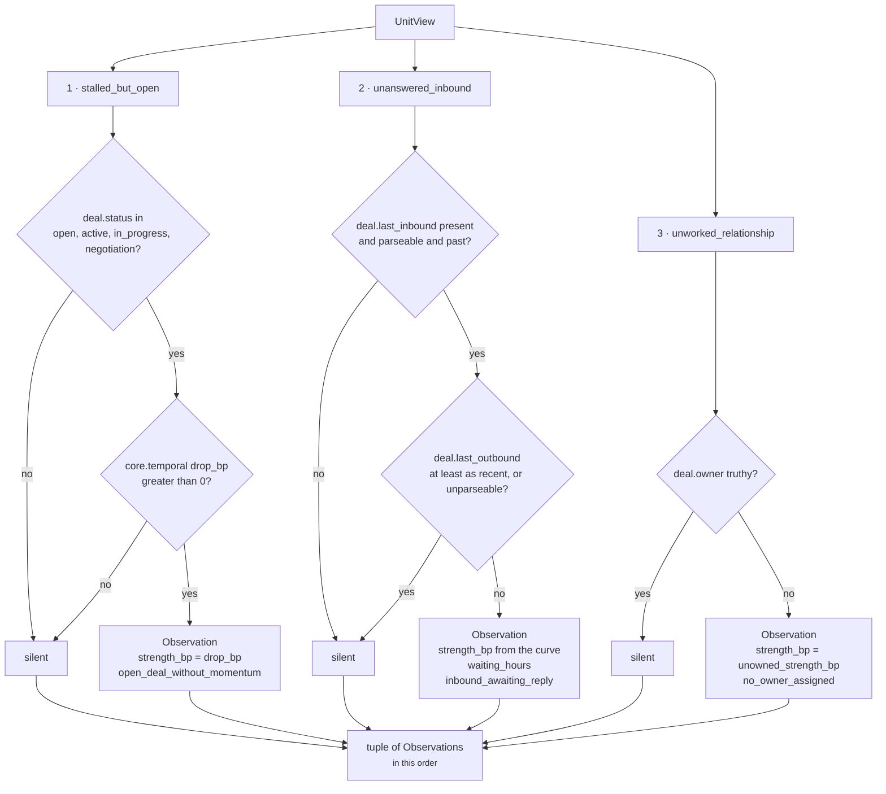

# `core.opportunity` · Stage 4 — Analyzer

**Source:** `unit.py:ReasoningUnit.analyze` (lines 202–211) · the three plugin classes in
`opportunity.py` (lines 32–103) · registration on line 113
**Overridden by `OpportunityUnit`:** **no.** The base `analyze` runs unchanged. All of this unit's
IP lives in the plugins it registers.

---

## 1 · What it is for

The framework docstring states the case for the seam:

> **Why plugins matter.** *"Risk is not one algorithm. It is time decay plus revenue exposure plus
> relationship health plus policy — each a small deterministic contribution that can be tested,
> tuned, and versioned alone. A unit composes plugins; it does not hide a monolith."*

`opportunity.py` makes the same argument in its own words, and it is the sharper of the two because
it is about *explainability* rather than testability:

> *"An investor who replied and was never answered, a buyer who went quiet while the deal is still
> open, an account with room to grow and no one working it. Each of those is a separate plugin,
> because they are separate claims with separate evidence, and folding them into one score would
> make the reasoning unexplainable."*

That is the design constraint: a card that says *"there is 7,000bp of headroom here"* is useless. A
card that says *"the buyer wrote nine days ago and nobody replied, on an open deal with no
momentum"* is an instruction. The plugin seam is what preserves the second sentence all the way
through to `core.recommendation`, because each claim keeps its own `reason_code` and its own
`Finding`.

---

## 2 · The base implementation, in full

```python
def analyze(self, view: UnitView) -> tuple[Observation, ...]:
    """Run every plugin and collect partial evidence.

    Sorted by plugin id so the observation order — and therefore every hash downstream of it —
    is a property of the unit's composition, not of registration order.
    """
    observations: list[Observation] = []
    for plugin in sorted(self.plugins, key=lambda item: item.plugin_id):
        observations.extend(plugin.contribute(view))
    return tuple(observations)
```

Three things it guarantees and one it does not:

- **Every plugin runs.** There is no short-circuit, no early exit, no conditional registration. A
  plugin that goes silent still ran.
- **Order is alphabetical by `plugin_id`.** Registration order in the class body is
  `(UnansweredInbound, StalledButOpen, UnworkedRelationship)`; execution order is
  `stalled_but_open → unanswered_inbound → unworked_relationship`. Reordering the tuple on line 113
  changes nothing observable.
- **A plugin returns a tuple, so it may emit zero, one, or many observations.** All three plugins
  here return either `()` or a one-element tuple. None emits two.
- **It does not catch exceptions.** A `ValueError` raised inside `contribute` — for example
  `_config_bp` rejecting a malformed `unowned_strength_bp` — propagates out of `analyze`, out of
  `evaluate`, and is caught by `orchestrator.py:290-297` as a `FAILED` result with
  `reason_codes=("reasoner_failure",)` and the exception type in `diagnostics`. One bad plugin
  takes the whole unit down. That is intentional: a partially-analysed opportunity score would be
  a number nobody could reconstruct.

### 2.1 · Why sorting matters here specifically

`Observation` order flows directly into `Finding` order in `evaluate_meaning`, and
`ReasonerResult.findings` is a **tuple** whose order is inside `semantic_hash`
(`contracts/reasoning.py:635-644` — `to_semantic_dict` includes `findings` positionally). A
replayed run that emitted findings in a different order would hash differently while the request
hash stayed identical, and the audit store would report a reproducible run as non-reproducible.
`sorted()` on line 209 is what prevents that.

`reason_codes` is separately re-sorted in `evaluate_meaning` and again in
`ReasonerResult.__post_init__`, so codes are order-independent. Findings are not.

---

## 3 · The three plugins



| Order | `plugin_id` | Reads | Depends on a prior unit? | Config keys | Detail |
|---|---|---|---|---|---|
| 1 | `stalled_but_open` | `deal.status` | **yes** — `core.temporal.drop_bp` | none | [03a](03a-plugin-stalled_but_open.md) |
| 2 | `unanswered_inbound` | `deal.last_inbound`, `deal.last_outbound`, `request.evaluation_time` | no | none | [03b](03b-plugin-unanswered_inbound.md) |
| 3 | `unworked_relationship` | `deal.owner` | no | `unowned_strength_bp` | [03c](03c-plugin-unworked_relationship.md) |

---

## 4 · How they interact

### 4.1 · They do not

Each `contribute(view)` receives the same immutable `UnitView` and returns a tuple. No plugin reads
another plugin's output — `analyze` collects into a local list that no plugin can see. There is no
ordering dependency, no shared mutable state, and no plugin that suppresses another.

This is a genuine difference from `core.cost`, whose `calculate` looks observations up by kind
(`self._observation(observations, "cost.step_effort")`) and combines them structurally.
`core.opportunity` never inspects a specific plugin's output anywhere: `calculate` reads only the
anonymous `strength_bp` values, and `evaluate_meaning` iterates observations generically. **You can
add or remove a plugin from line 113 without touching another line of the module.**

### 4.2 · The one thing they share: a common metric name

All three emit `strength_bp`, and `calculate` reads exactly that key with a `0` default:

```python
strengths = sorted((int(item.metrics.get("strength_bp", 0)) for item in observations),
                   reverse=True)
```

That is the whole contract between the Analyzer and the Calculator. A fourth plugin joining this
unit needs to do exactly one thing to participate: put an integer under `strength_bp`. It would
also inherit the failure mode — a plugin that misspelled the key would contribute `0` silently
rather than raising, and the only symptom would be a `opportunity_count` one higher than the number
of strengths that mattered.

`unanswered_inbound` additionally emits `waiting_hours`, which nothing in `calculate` reads. It
travels only into `Finding.metrics`, where it is the number that makes the finding legible to a
human: *"`strength_bp` 6,308, `waiting_hours` 216"*.

### 4.3 · They *can* fire together, and routinely do

The three claims are not mutually exclusive — a deal can be open, unanswered, and unowned at once.
Verified, with `core.temporal` publishing `drop_bp = 8,200` and an inbound 216 hours old:

```text
observations, in plugin_id order
   stalled_but_open       strength_bp 8200
   unanswered_inbound     strength_bp 6308   waiting_hours 216
   unworked_relationship  strength_bp 4000

calculate  → strengths [8200, 6308, 4000]
             lift = half_up(6308 + 4000, 4) = half_up(10308, 4) = 2577
             opportunity_bp = clamp_bp(8200 + 2577) = clamp_bp(10777) = 10000
             opportunity_count = 3
```

Three plugins firing at 8,200 / 6,308 / 4,000 saturate the scale. That is [04 · Calculator](04-Calculator.md)'s
territory, and it is the main argument for reading `opportunity_count` alongside `opportunity_bp`
rather than instead of it.

### 4.4 · Correlation the unit does not model

The three plugins are independent as *code* but not as *signals*. A deal whose buyer wrote nine
days ago with no reply is very likely also a deal `core.temporal` scores as decayed, so
`unanswered_inbound` and `stalled_but_open` fire off substantially the same underlying silence. The
÷4 lift in `calculate` is the only discount applied, and it is applied uniformly regardless of how
correlated the corroborating claims are. Nothing in the unit knows that `drop_bp` and
`waiting_hours` are two views of one fact.

`alternative_unit.py:DoNothingBaselinePlugin` uses the identical max-plus-quarter shape over
`opportunity_bp`, `drop_bp` and `risk_bp` — three metrics that are more correlated still — and its
docstring names the hazard directly: *"Summing would let four weak, correlated observations
out-argue one decisive one."* The quarter-lift bounds the damage; it does not measure it.

---

## 5 · Silence semantics for this stage

`analyze` returns `()` when every plugin declines. That is a legitimate, common result and it is
**not** an error:

```text
facts = {"deal.owner": "rohit", "deal.status": "closed_won"}, prior = {}
  stalled_but_open       "closed_won" not in the open set        → ()
  unanswered_inbound     deal.last_inbound absent                → ()
  unworked_relationship  deal.owner is truthy                    → ()
  analyze → ()
  calculate → {"opportunity_bp": 0, "opportunity_count": 0}
```

Verified. The unit still completes and still publishes both metrics. What it cannot do is
distinguish that run — a deal that genuinely has no headroom — from a run where all three fields
were missing from the snapshot. Both produce
`semantic_hash = ffbab6c7d3c801896c5026b2...`. See [01 · Input and Validator](01-Input-and-Validator.md) §5.

**The one plugin that inverts this rule** is `unworked_relationship`: absence of `deal.owner`
produces a positive claim rather than silence. It is the reason a snapshot missing all four fields
does *not* score zero in production — it scores 4,000bp. That asymmetry is argued, and criticised,
at [03c](03c-plugin-unworked_relationship.md) §5.

---

## 6 · The seam's shipped blind spot

Two of the three plugins cannot fire in `sales.deal_cooling_full` v2, for the same structural
reason: `native.py:_selected_fields` builds the snapshot's field set from the capability's declared
fields, and neither `deal.last_inbound` nor `deal.owner` is in it.

```text
sales.deal_cooling_full v2 — root fields the selector carries
   deal.next_step · deal.status · deal.value · derived.engagement
   relationship.verified_stakeholder_count · thread.last_inbound

   deal.last_inbound   NOT SELECTED  → unanswered_inbound is dead
   deal.last_outbound  NOT SELECTED  → and has no writer in genios_engine/ at all
   deal.owner          NOT SELECTED  → unworked_relationship fires on the absence
```

So in production the seam degenerates to one live plugin plus one plugin firing on a phantom. The
plugin architecture is doing its job — each claim is separable, testable and independently
silenced — but two of the three claims are not reachable from the data the capability selects. The
fix is a manifest change, not a code change: adding `deal.last_inbound` and `deal.owner` to
`required_fields` would both feed the plugins and, as a side effect, give the unit its first
evidence citations ([02 · Retriever](02-Retriever.md) §3.2).

---

## 7 · Adding a fourth plugin

The `AnalyzerPlugin` protocol (`unit.py:97-106`) is two members:

```python
@runtime_checkable
class AnalyzerPlugin(Protocol):
    @property
    def plugin_id(self) -> str: ...
    def contribute(self, view: UnitView) -> tuple[Observation, ...]: ...
```

`ReasoningUnit.__init__` rejects a duplicate `plugin_id`
(`ValueError("core.opportunity registers a duplicate analyzer plugin")`), which is the only
registration-time check. To join this unit a plugin must:

1. pick a `plugin_id` — it determines execution order, the `Finding.finding_id`
   (`f"opportunity.{plugin_id}"`), and therefore the finding tuple's position in the hash;
2. put an integer under `Observation.metrics["strength_bp"]`, or contribute nothing to the score;
3. attach `evidence_ids` — which none of the current three do, and which is the single change that
   would most improve this unit;
4. keep to integers. `Observation.__post_init__` raises
   `ValueError("observation metric <name> must be an integer")` for a float or a bool.

No change to `calculate`, `evaluate_meaning`, `publishes` or `build` is required.

---

## 8 · Related

| Document | Covers |
|---|---|
| [03a · `stalled_but_open`](03a-plugin-stalled_but_open.md) | The status gate and the borrowed `drop_bp` |
| [03b · `unanswered_inbound`](03b-plugin-unanswered_inbound.md) | The ripen-decay-floor curve, in full |
| [03c · `unworked_relationship`](03c-plugin-unworked_relationship.md) | One truthiness test, and the absence-as-claim problem |
| [04 · Calculator](04-Calculator.md) | What happens to the `strength_bp` values these three produce |
| [Part 2 · The Unit Framework](../../README.md) | `AnalyzerPlugin`, `Observation`, and the seam in general |
