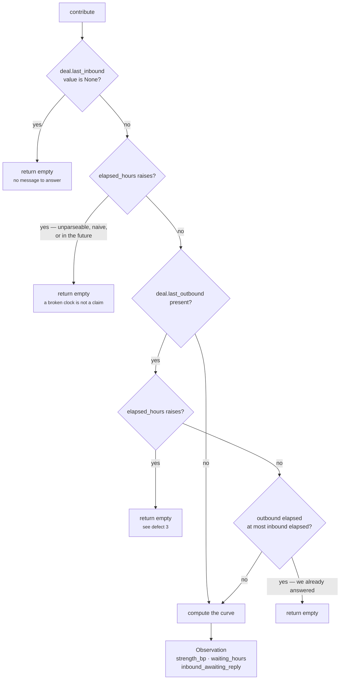

# Plugin · `unanswered_inbound`

**Class:** `opportunity.py:UnansweredInboundPlugin` (lines 32–66)
**`plugin_id`:** `unanswered_inbound` — **second** in execution order
**`Observation.kind`:** `opportunity.unanswered_inbound`
**Reason code:** `inbound_awaiting_reply`
**Metrics emitted:** `strength_bp`, `waiting_hours`
**Config keys:** none
**Depends on:** no prior unit — reads the snapshot and `request.evaluation_time` only

---

## 1 · The claim

> *"They reached out and nobody replied.*
>
> *The strongest opportunity signal in the system, because the counterparty already spent the
> effort — the cost of capture is one reply, and the window closes on its own."*

Three separate assertions are packed into that, and each one earns a piece of the mechanism:

| Assertion | Mechanism |
|---|---|
| *the counterparty already spent the effort* | the plugin fires only on an **inbound** message. Nothing here rewards our own outreach going unanswered |
| *the cost of capture is one reply* | it is the reason this claim is ranked above the other two, and the reason `deal_cooling_v2` lowered `opportunity_threshold_bp` to 2,500 in its comment: *"the whole cost of capture is one considered reply"* |
| *the window closes on its own* | the decay half of the curve. An unanswered message loses value with age; it does not become more urgent forever |

This is the plugin the unit was built around. It is also the plugin that **cannot fire in the only
capability that ships it** — see §7 defect 1.

---

## 2 · The code, in full

```python
class UnansweredInboundPlugin:
    plugin_id = "unanswered_inbound"

    def contribute(self, view: UnitView) -> tuple[Observation, ...]:
        inbound = fact_value(view.request, "deal.last_inbound")
        outbound = fact_value(view.request, "deal.last_outbound")
        if inbound is None:
            return ()
        try:
            inbound_hours = elapsed_hours(view.request, "deal.last_inbound")
        except ValueError:
            return ()
        if outbound is not None:
            try:
                if elapsed_hours(view.request, "deal.last_outbound") <= inbound_hours:
                    return ()               # we already answered; no gap remains
            except ValueError:
                return ()
        # Ripe by roughly a day, decaying in value thereafter — an answer tomorrow is worth much
        # less than an answer today, and after a week the moment has mostly passed.
        strength = clamp_bp(divide_half_up(min(inbound_hours, 168) * 10_000, 24)) \
            if inbound_hours <= 24 else clamp_bp(10_000 - divide_half_up(
                (min(inbound_hours, 336) - 24) * 6_000, 312))
        return (Observation(
            plugin_id=self.plugin_id,
            kind="opportunity.unanswered_inbound",
            metrics={"strength_bp": strength, "waiting_hours": inbound_hours},
            reason_codes=("inbound_awaiting_reply",),
        ),)
```

### 2.1 · The three guards, in order



Guard 1 tests the **value**, not the key: `fact_value` returns `None` both when the field is absent
and when Layer 2 published it with an explicit null. Both are treated as "no inbound".

Guard 2 wraps `common.py:elapsed_hours`, which raises `ValueError` on three separate faults —
unparseable ISO-8601, a timezone-naive timestamp, and a timestamp after `evaluation_time`
(*"deal.last_inbound is in the future"*). All three land on the same `return ()`.

Guard 3 is the "we already answered" test. Note the comparison direction: `elapsed_hours` measures
*age*, so a **smaller** number means **more recent**. `outbound_hours <= inbound_hours` therefore
means the reply is at least as recent as the message, and the gap is closed.

### 2.2 · Everything is hardcoded

| What | Value | Config key |
|---|---|---|
| Inbound fact path | `"deal.last_inbound"` | **none** |
| Outbound fact path | `"deal.last_outbound"` | **none** |
| Ripening point | 24 hours | **none** |
| Decay span | 312 hours, from hour 24 to hour 336 | **none** |
| Total decay | 6,000bp | **none** |
| Floor | 4,000bp | **none** |

Six tuning constants, zero config keys. Compare `core.timeline`, whose equivalent cadence figure is
authored per-capability (`deal_cooling_v2.py` sets `cadence_hours: 336`).

---

## 3 · The arithmetic

Two branches, split at 24 hours.

```text
h = inbound_hours = floor((evaluation_time - deal.last_inbound) / 1 hour)

RAMP     h <= 24    strength_bp = clamp_bp( half_up(h × 10,000 ÷ 24) )
DECAY    h >  24    strength_bp = clamp_bp( 10,000 − half_up( (min(h, 336) − 24) × 6,000 ÷ 312 ) )

where  half_up(n, d) = (n + d // 2) // d      for n >= 0     [common.py:79-84]
       clamp_bp(v)   = min(10_000, max(0, int(v)))            [common.py:75-76]
       312           = 336 − 24, the span from day 1 to day 14
```

### 3.1 · The shape, and why

```text
strength_bp
10,000 |                    ●  h=24, the peak
       |                  ╱   ╲
 8,000 |                ╱       ╲___
       |              ╱             ╲──__
 6,000 |            ╱                    ╲──__          h=216 → 6,308
       |          ╱                           ╲──__
 4,000 |        ╱                                  ╲────────────────────  floor
       |      ╱
 2,000 |    ╱
       |  ╱
     0 |●________________________________________________________________
        0        24                168               336              ∞
                 1d                 7d                14d           hours
```

**The ramp exists because a message that just arrived is not yet an opportunity.** At `h = 0` the
strength is `0`. A reply half an hour after the buyer wrote is not headroom anybody has failed to
take — it is a normal response time. The gap only becomes real once a working day has passed
without an answer, which is why the peak sits at 24 hours.

**The decay exists because value leaks.** The code comment: *"an answer tomorrow is worth much less
than an answer today."* The rate is `6,000bp ÷ 312h`, which is **19.23bp per hour** or roughly
**462bp per day**.

**The floor exists because an unanswered message never becomes worthless.** `min(h, 336)` caps the
decay input, so past 14 days the value pins at exactly `10,000 − 6,000 = 4,000bp` and stays there.
A message unanswered for a year still reports 4,000bp — above both the default 3,000 threshold and
the shipped 2,500 one.

### 3.2 · Verified curve

Every row produced by running the live plugin, not computed by hand:

| `waiting_hours` | Branch | Arithmetic | `strength_bp` |
|---|---|---|---|
| 0 | ramp | `(0 + 12) // 24` | **0** |
| 1 | ramp | `(10,000 + 12) // 24 = 10,012 // 24` | **417** |
| 6 | ramp | `(60,000 + 12) // 24` | **2,500** |
| 12 | ramp | `(120,000 + 12) // 24` | **5,000** |
| 23 | ramp | `(230,000 + 12) // 24` | **9,583** |
| **24** | ramp | `(240,000 + 12) // 24` | **10,000** ← peak |
| 25 | decay | `10,000 − (6,000 + 156) // 312 = 10,000 − 19` | **9,981** |
| 48 | decay | `10,000 − (144,000 + 156) // 312 = 10,000 − 462` | **9,538** |
| 72 | decay | `10,000 − (288,000 + 156) // 312 = 10,000 − 923` | **9,077** |
| 168 (7d) | decay | `10,000 − (864,000 + 156) // 312 = 10,000 − 2,769` | **7,231** |
| 216 (9d) | decay | `10,000 − (1,152,000 + 156) // 312 = 10,000 − 3,692` | **6,308** |
| 240 (10d) | decay | `10,000 − (1,296,000 + 156) // 312 = 10,000 − 4,154` | **5,846** |
| 335 | decay | `10,000 − (1,866,000 + 156) // 312 = 10,000 − 5,981` | **4,019** |
| **336 (14d)** | decay | `10,000 − (1,872,000 + 156) // 312 = 10,000 − 6,000` | **4,000** ← floor |
| 337 | decay | `min(337, 336) = 336` — identical | **4,000** |
| 720 (30d) | decay | capped | **4,000** |
| 8,760 (1y) | decay | capped | **4,000** |

The `+ 12` and `+ 156` terms are `d // 2` from `divide_half_up` — half-up rounding, applied to the
**summed** numerator, never per term. The transition at 24→25 is smooth: 10,000 → 9,981.

### 3.3 · Threshold crossings

| Threshold | First hour that matches, on this plugin alone |
|---|---|
| `3_000` (unit default) | `h = 8` → 3,333bp. `h = 7` gives 2,917bp and does **not** match |
| `2_500` (`deal_cooling_v2`) | `h = 6` → exactly 2,500bp, which matches, since the test is `>=` |

Both verified. So under the shipped threshold an unanswered buyer becomes reportable six hours
after they wrote, and stays reportable forever thereafter because of the 4,000bp floor.

### 3.4 · Dead sub-expression

`min(inbound_hours, 168)` in the ramp branch can never bind — the branch condition is
`inbound_hours <= 24`. Harmless, and misleading: it reads as if both branches share a 168-hour cap,
which they do not. The decay branch's cap is 336.

---

## 4 · Worked examples

### 4.1 · Nine days of silence, no reply on record

`tests/test_l4_end_to_end.py`'s situation: the buyer wrote nine days ago, our last outbound was
three weeks ago.

```text
evaluation_time      2026-08-06T12:00:00+00:00
deal.last_inbound    2026-07-28T12:00:00+00:00     → 216 hours
deal.last_outbound   2026-07-16T12:00:00+00:00     → 504 hours

guard 1   inbound is not None                                    → continue
guard 2   elapsed_hours parses cleanly, 216                       → continue
guard 3   outbound present; 504 <= 216 is FALSE                   → continue
          our last word came BEFORE theirs; the gap is real

branch    216 > 24 → decay
          min(216, 336) − 24 = 192
          192 × 6,000 = 1,152,000
          half_up(1,152,000, 312) = (1,152,000 + 156) // 312 = 1,152,156 // 312 = 3,692
          strength_bp = clamp_bp(10,000 − 3,692) = 6,308

Observation(plugin_id="unanswered_inbound",
            kind="opportunity.unanswered_inbound",
            metrics={"strength_bp": 6308, "waiting_hours": 216},
            reason_codes=("inbound_awaiting_reply",))
```

Combined with `stalled_but_open` at 8,200bp (engagement collapsed to 1,800bp):

```text
strengths [8200, 6308] → lift = half_up(6308, 4) = 1,577 → opportunity_bp = 9,777
```

Verified against the live unit.

### 4.2 · Peak ripeness — exactly one day

```text
deal.last_inbound = evaluation_time − 24h
deal.last_outbound absent

guard 1   pass          guard 2   inbound_hours = 24
guard 3   outbound is None → skipped entirely

branch    24 <= 24 → ramp
          half_up(24 × 10,000, 24) = (240,000 + 12) // 24 = 10,000
          strength_bp = 10,000
```

With `core.temporal` also at `drop_bp = 10,000` and no owner recorded:

```text
strengths [10000, 10000, 4000]
lift = half_up(10000 + 4000, 4) = half_up(14000, 4) = (14,000 + 2) // 4 = 3,500
opportunity_bp = clamp_bp(10,000 + 3,500) = 10,000        ← saturated
opportunity_count = 3
```

Verified. The scale runs out well before the evidence does; see [04 · Calculator](04-Calculator.md) §4.

### 4.3 · We already replied

```text
deal.last_inbound   evaluation_time − 216h
deal.last_outbound  evaluation_time − 24h        ← we answered eight days ago

guard 3   24 <= 216 is TRUE → return ()
```

Verified. The plugin contributes nothing, and if `stalled_but_open` fires at 8,200bp the published
`opportunity_bp` is 8,200 with `opportunity_count = 1`. The deal is still stalled; it is just not
*unanswered*, and the unit says so precisely.

### 4.4 · The hour-bucket edge — an *earlier* outbound suppresses the claim

`common.py:elapsed_hours` floors to whole hours (`seconds // 3600`). Two timestamps up to 59
minutes apart can therefore land in the same bucket:

```text
deal.last_inbound   evaluation_time − 216h 00m   → elapsed_hours = 216
deal.last_outbound  evaluation_time − 216h 59m   → elapsed_hours = 216   (216.98 floored)

guard 3   216 <= 216 is TRUE → return ()

    …but the outbound was sent 59 minutes BEFORE the inbound. We did not answer them;
    they answered us, and then we went quiet. The claim is real and is suppressed.

move the outbound one minute earlier:
deal.last_outbound  evaluation_time − 217h 01m   → elapsed_hours = 217
guard 3   217 <= 216 is FALSE → fires, strength_bp 6,308
```

Both verified. The window of wrongness is up to one hour wide and only matters when a reply and a
message cross within the same hour — which, on an email thread, is the common case, not a rare one.
Comparing the raw `datetime` values rather than the floored hours would close it.

### 4.5 · A broken reply timestamp kills a good claim

```text
deal.last_inbound   evaluation_time − 216h        valid
deal.last_outbound  "yesterday"                   unparseable

guard 3   outbound is not None → elapsed_hours raises ValueError → return ()

result: opportunity_bp 0, opportunity_count 0, matched False
        semantic_hash ffbab6c7d3c801896c5026b2… — byte-identical to a run with no inbound at all
```

Verified. A data-quality fault on the *reply* side erases a well-evidenced claim on the *message*
side, and reports it as "no opportunity". The same happens for a future-dated outbound.

---

## 5 · Silence semantics

**Silent whenever the gap cannot be established.** Six distinct paths, all returning `()`:

| Condition | Silent? | Distinguishable? |
|---|---|---|
| `deal.last_inbound` absent or null | yes | no |
| `deal.last_inbound` unparseable | yes | no |
| `deal.last_inbound` timezone-naive | yes | no |
| `deal.last_inbound` in the future | yes | no |
| `deal.last_outbound` at least as recent — we replied | yes | no |
| `deal.last_outbound` unparseable, naive, or in the future | yes | no |
| a valid inbound with no more-recent outbound | **fires** | — |

None of the six emits a reason code, a `missing_fields` entry, or a zero-strength observation.
`ResultStatus` stays `COMPLETED` throughout — this plugin never raises, so it can never turn a run
`FAILED`.

The plugin **does** emit at `strength_bp = 0` when `waiting_hours = 0`: a message that arrived
within the last hour produces a real observation worth nothing, which increments
`opportunity_count` without moving `opportunity_bp`. Verified. That is the only case in this unit
where an observation carries zero strength.

---

## 6 · What `waiting_hours` is for

It is emitted, carried into `Finding.metrics`, and read by nothing in the codebase.
`OpportunityUnit.calculate` reads only `strength_bp`. `Finding.__post_init__` validates only keys
ending in `_bp`, so `waiting_hours` passes through unbounded — 8,760 for a year-old message is a
legal value.

Its purpose is legibility. A finding reading `{"strength_bp": 6308, "waiting_hours": 216}` can be
rendered as *"the buyer wrote 216 hours ago and nobody replied"*, which is a sentence a human acts
on. `strength_bp` alone is not. It is the one place in this unit where a raw, un-normalised
observation survives into the output.

---

## 7 · Defects and compromises

| # | What | Severity |
|---|---|---|
| 1 | **Unreachable in the only capability that ships it.** The plugin reads the literal `deal.last_inbound`. `native.py:_selected_fields` resolves `sales.deal_cooling_full` v2's root field set to `deal.next_step, deal.status, deal.value, derived.engagement, relationship.verified_stakeholder_count, thread.last_inbound` — `deal.last_inbound` is not in it. The buyer's clock **is** in that snapshot, named `thread.last_inbound`, and `core.temporal` reads it; this plugin cannot, because it has no config key for the path. Commit `2f77657` gave `deal.last_inbound` a writer via `signals_derived.py:deal_activity_facts`; the selector still does not carry it. Two one-line fixes exist: add `deal.last_inbound` to the spec's `required_fields`, or add an `inbound_field` config key. | **high** |
| 2 | **The 59-minute suppression window.** §4.4. Integer-hour truncation lets an outbound sent slightly *before* the inbound close the gap. | medium |
| 3 | **A malformed `deal.last_outbound` erases the claim.** §4.5. `except ValueError: return ()` conflates "we replied" with "the reply timestamp is corrupt". Treating an unparseable outbound as absent — the same as `outbound is None` — would be the conservative reading and is not what the code does. | medium |
| 4 | **Six tuned constants, no config keys.** 24, 168 (dead), 336, 312, 6,000 and the implied 4,000 floor are all literals. A capability with a different reply-time expectation cannot express it. | medium |
| 5 | **The comment overstates the decay.** *"After a week the moment has mostly passed"* — at 168 hours the curve still reports **7,231bp**, 72% of full strength. "Mostly passed" would be somewhere under 3,000. The comment describes an intent the arithmetic does not implement, and a reader tuning this will trust the comment. | low, but actively misleading |
| 6 | **The floor never expires.** A message unanswered for a year reports 4,000bp — above both the default and the shipped threshold. Whether that is right is a judgement call, but it is not stated anywhere in the module, and it means this plugin can keep a long-dead thread permanently above the reporting bar. | low |
| 7 | **No evidence.** The `Observation` carries no `evidence_ids`, so the finding cites nothing — even though the buyer's message is exactly the kind of thing a citation exists for, and `EvidenceRef` for `deal.last_inbound` would carry the `source_ref_id` of the actual email. `evidence_ids(view.request, "deal.last_inbound")` is a one-line fix. | **high** |
| 8 | **Dead `min(inbound_hours, 168)`.** §3.4. | cosmetic |
| 9 | **Unpinned.** No test asserts the peak at 24 hours, the floor at 4,000, the decay rate, or any of the six guards. | process |

---

## 8 · Related

- [03 · Analyzer](03-Analyzer.md) — the seam, and why this plugin correlates with `stalled_but_open`
- [04 · Calculator](04-Calculator.md) — the lift that combines this with the other two
- [05 · Evaluator](05-Evaluator.md) — the threshold this curve is tuned against
- `genios_engine/reason/reasoners/common.py:elapsed_hours` — the flooring behind defect 2
- `genios_engine/reason/signals_derived.py:deal_activity_facts` — the writer commit `2f77657` added
