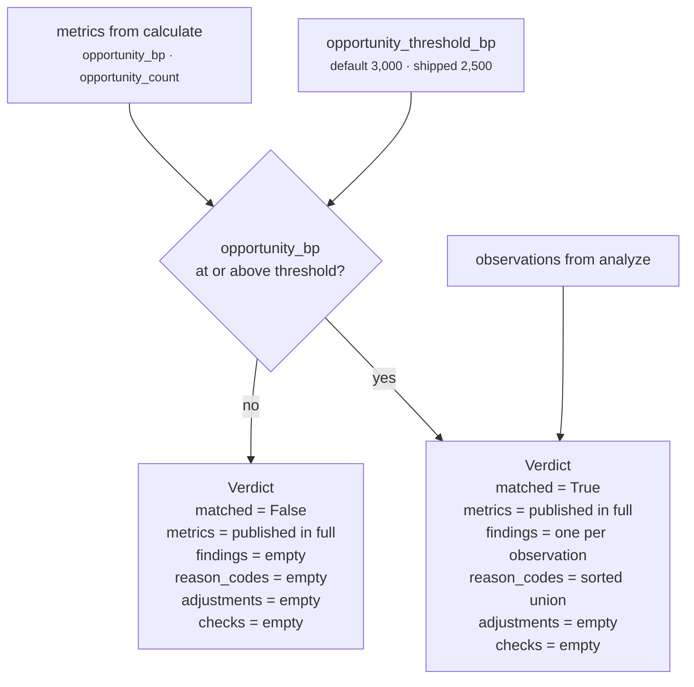

# `core.opportunity` · Stage 6 — Evaluator

**Source:** `opportunity.py:OpportunityUnit.evaluate_meaning` (lines 131–149) ·
`opportunity.py:_config_bp` (lines 25–29)
**Overridden by `OpportunityUnit`:** **yes** — `evaluate_meaning` is `@abstractmethod` on
`ReasoningUnit` (lines 218–221).

---

## 1 · What it is for

The framework's one-line brief: *"Turn numbers into meaning — a threshold crossed, a candidate
blocked, a gate matched."*

For this unit it is the narrowest possible reading of that: **one threshold, one boolean, and a
decision about whether to make any claim at all.** No candidate is blocked, no gate is matched, no
play is named. The module docstring is explicit about the boundary:

> *"The unit never proposes an action. It reports that headroom exists and how strongly; the
> Decision Maker weighs that against risk, effort, and policy."*

That sentence is enforced mechanically here: `Verdict` has fields for `adjustments` and `checks`,
and `evaluate_meaning` sets neither. See §5.

---

## 2 · The code, in full

```python
def evaluate_meaning(self, view: UnitView, metrics: Mapping[str, int],
                     observations: Sequence[Observation]) -> Verdict:
    threshold = _config_bp(view, "opportunity_threshold_bp", 3_000)
    present = metrics["opportunity_bp"] >= threshold
    findings = tuple(Finding(
        finding_id=f"opportunity.{item.plugin_id}",
        kind="opportunity",
        matched=True,
        metrics=item.metrics,
        evidence_ids=item.evidence_ids,
        reason_codes=item.reason_codes,
    ) for item in observations) if present else ()
    return Verdict(
        matched=present,
        metrics=dict(metrics),
        findings=findings,
        reason_codes=tuple(sorted({code for item in observations
                                   for code in item.reason_codes})) if present else (),
    )
```

Nineteen lines, one branch, evaluated three times — `present` gates the findings, the reason codes,
and `matched` itself.

---

## 3 · The threshold

| Key | Type | Default | Shipped value | Validator | Read |
|---|---|---|---|---|---|
| `opportunity_threshold_bp` | int bp 0–10,000 | `3_000` | `2_500` in `sales.deal_cooling_full` v2 | `_config_bp` | on **every** run |

`3,000bp` is *"30% of the scale is enough to say there is an opportunity here"* — an authored
judgement with no empirical backing, like every other constant in this unit.

`deal_cooling_v2.py:94-98` lowers it, and records why:

```python
_spec("core.opportunity", ("core.temporal",), config={
    # An unanswered buyer is the cheapest opportunity in the system: they already spent
    # the effort, and the whole cost of capture is one considered reply.
    "opportunity_threshold_bp": 2_500,
}),
```

The comment names `unanswered_inbound` as the reason for the lower bar — the plugin which, in that
same capability, cannot fire ([03b](03b-plugin-unanswered_inbound.md) §7 defect 1). The lowered
threshold currently benefits only `stalled_but_open` and `unworked_relationship`.

### 3.1 · The comparison is `>=`, not `>`

`present = metrics["opportunity_bp"] >= threshold`. So a score exactly equal to the threshold
matches. Verified: a 6-hour-old unanswered message scores exactly `2,500bp`, which matches under
the shipped configuration and would not under `>`.

### 3.2 · The threshold is read even when there is nothing to threshold

`_config_bp` sits on the first line of the method, outside any branch, so it runs on every
execution including one with no observations at all. A malformed `opportunity_threshold_bp` fails
the unit unconditionally:

```text
config = {"opportunity_threshold_bp": 20000}   → ValueError, every run
config = {"opportunity_threshold_bp": "3000"}  → ValueError, every run
config = {"opportunity_threshold_bp": True}    → ValueError, every run  (bool checked first)
```

All three verified. That is the opposite of `unowned_strength_bp`, which is only validated on runs
where its branch fires ([03c](03c-plugin-unworked_relationship.md) §2.2). Of the unit's two config
keys, one fails fast and one fails late — a distinction nothing documents in the source.

---

## 4 · What `matched` means for this unit

**`matched = True` means: at least `opportunity_threshold_bp` of untaken headroom is present here.**
It is a magnitude statement, not a recommendation, and it never says what to do about it.

`matched` is `True` or `False` on every completed run. It is **never `None`**. That places
`core.opportunity` in a minority of its own category:

| Unit | `matched` |
|---|---|
| `core.risk` | always `None` |
| `core.priority` | always `None` |
| `core.confidence` | always `None` |
| `core.impact` | `True` / `False` / `None` — `None` when no dimension reported |
| **`core.opportunity`** | **`True` / `False` — never `None`** |

Because `calculate` always publishes `opportunity_bp` (0 when nothing fired), there is no "no
opinion" path. A run with an entirely empty snapshot returns `matched = False`, which reads as *"we
checked and there is no opportunity"* rather than *"we could not check"*. See
[01 · Input and Validator](01-Input-and-Validator.md) §5.

### 4.1 · The one case where `matched=True` means nothing

```text
config = {"opportunity_threshold_bp": 0}, facts = {"deal.owner": "rohit", "deal.status": "closed_won"}

observations       ()
opportunity_bp     0
present            0 >= 0 → True
findings           built from an empty observation list → ()
reason_codes       empty set, sorted → ()

Verdict(matched=True, metrics={"opportunity_bp": 0, "opportunity_count": 0},
        findings=(), reason_codes=())
```

Verified. A positive claim with no findings, no codes and a zero score. `validation_unit.py:_asserts_a_claim`
returns `True` on `result.matched is True` alone, so it is counted as an ungrounded claim.
Only reachable via an authored `0`, and nothing warns.

### 4.2 · `matched=False` is not a gate

`ReasonerSpec.gating` is `False` for `core.opportunity` in every capability that names it. If a
capability set `gating=True`, `orchestrator.py:216-217` would turn `matched is False` into
`terminal = DecisionOutcome.NO_ACTION` and skip every remaining unit — and `ReasonerSpec.__post_init__`
would force `failure_policy=REQUIRED` at the same time (*"gating reasoners must use required
fail-closed policy"*). Nobody has done this, and it would be a strange thing to do: the absence of
an opportunity is not a reason to stop reasoning about risk.

---

## 5 · What it emits, and what it deliberately does not



| `Verdict` field | Value | Condition |
|---|---|---|
| `matched` | `present` | always set |
| `metrics` | `dict(metrics)` — a copy of `calculate`'s output | **always**, regardless of the threshold |
| `findings` | one `Finding` per observation | only when `present` |
| `reason_codes` | sorted union of the observations' codes | only when `present` |
| `adjustments` | `()` — the `Verdict` default | **never set** |
| `checks` | `()` — the `Verdict` default | **never set** |

### 5.1 · No adjustments, no checks — the boundary made mechanical

`contracts/reasoning.py:CandidateAdjustment` moves a play's score; `CandidateCheck` can `WARN` or
`ELIMINATE` a candidate outright. `core.impact` emits both — one adjustment and one check per
authored `play_impact_bp` entry — and is careful to explain that the *tilt* is authored in Layer 3
and only *scaled* by the measured impact.

`core.opportunity` emits neither, and no play id appears anywhere in `opportunity.py`. There is no
`play_opportunity_bp` config key. The unit has no mechanism by which it could influence a specific
candidate even if a capability author wanted it to.

That is the difference between a stated principle and an enforced one. `orchestrator.py` runs
`guards.py:validate_candidate_effects(result, play_ids)` on every result, so a unit that invented an
adjustment for an undeclared play would be rejected — but the stronger guarantee here is that there
is nothing to reject.

### 5.2 · The findings

One `Finding` per observation, in observation order — which is `plugin_id` order, which is fixed by
`analyze`'s `sorted()`:

| Field | Value | Note |
|---|---|---|
| `finding_id` | `f"opportunity.{item.plugin_id}"` | `opportunity.stalled_but_open`, `opportunity.unanswered_inbound`, `opportunity.unworked_relationship` |
| `kind` | `"opportunity"` — the same literal for all three | so a consumer can select this unit's findings by kind without knowing the plugin roster |
| `matched` | **`True`, unconditionally** | a finding is only ever built on the `present` branch, so there is no false finding to represent |
| `metrics` | `item.metrics` — the observation's own mapping | `{"strength_bp": …}`, plus `waiting_hours` for `unanswered_inbound` |
| `evidence_ids` | `item.evidence_ids` — **always `()`** | no plugin sets it; see [02 · Retriever](02-Retriever.md) §4 |
| `reason_codes` | `item.reason_codes` | one code each |

`Finding.__post_init__` re-validates: any metric key ending in `_bp` must be an integer in
0–10,000, and `evidence_ids` / `reason_codes` are sorted and de-duplicated. `waiting_hours` does not
end in `_bp` and passes through unbounded.

### 5.3 · Why findings are suppressed below the threshold

`findings = (...) if present else ()`. This is the unit's sharpest divergence from `core.impact`,
which builds its finding tuple **before** the materiality branch and therefore asserts
`matched=True` findings on an immaterial run.

The reasoning is visible in `validation_unit.py:_asserts_a_claim`:

```python
if result.matched is True:
    return True
return any(finding.matched is not False for finding in result.findings)
```

A result with `matched=False` but a non-negative finding still counts as a claim. So had this unit
kept its findings below the threshold, every low-headroom run would be an ungrounded claim in
`core.validation` — and because no plugin attaches evidence, *every one of them* would be ungrounded.
By emitting nothing, a below-threshold `core.opportunity` is invisible to the validator:

```text
opportunity_bp 2,000, threshold 3,000
  → matched False, findings (), reason_codes ()
  → _asserts_a_claim: matched is not True; no findings to inspect → False
  → not counted, not inspected, not penalised
```

Verified. `core.impact` documents the opposite choice as *"defensible — the dimensions really were
measured"*. Both defences are reasonable; the two units are simply inconsistent, and nothing records
that they are.

### 5.4 · The reason codes

```python
tuple(sorted({code for item in observations for code in item.reason_codes})) if present else ()
```

A set comprehension, sorted — so the roll-up is de-duplicated and order-independent, and a code
emitted by two plugins appears once. `ReasonerResult.__post_init__` sorts and de-duplicates again;
the sort here matters because `Verdict` performs no validation of its own and a caller could observe
the tuple before it reaches the result.

The three codes are `inbound_awaiting_reply`, `no_owner_assigned`, `open_deal_without_momentum`.
All three appear at both levels: on the individual `Finding` and in the result-level roll-up.
`recommendation_unit.py:_claims` deliberately prefers the findings and ignores the roll-up when
findings exist, and names this unit as the reason:

> *"Findings are preferred over the result-level roll-up because a result's `reason_codes` are
> usually the union of its findings' codes (see `opportunity.py`), and counting both would let one
> observation support a play twice."*

---

## 6 · Worked examples

### 6.1 · Above the threshold — the shipped run

```text
metrics       {"opportunity_bp": 7000, "opportunity_count": 2}
config        opportunity_threshold_bp = 2500
observations  stalled_but_open       {"strength_bp": 6000}  ("open_deal_without_momentum",)
              unworked_relationship  {"strength_bp": 4000}  ("no_owner_assigned",)

present = 7000 >= 2500 → True

Verdict(
  matched      = True,
  metrics      = {"opportunity_bp": 7000, "opportunity_count": 2},
  findings     = (Finding("opportunity.stalled_but_open", "opportunity", True,
                          {"strength_bp": 6000}, (), ("open_deal_without_momentum",)),
                  Finding("opportunity.unworked_relationship", "opportunity", True,
                          {"strength_bp": 4000}, (), ("no_owner_assigned",))),
  reason_codes = ("no_owner_assigned", "open_deal_without_momentum"),
  adjustments  = (),
  checks       = ())
```

Verified against the live orchestrator.

### 6.2 · Below the threshold — the metrics survive, the claim does not

```text
facts    deal.status = "open", deal.owner = "rohit"
prior    core.temporal drop_bp = 2000
config   opportunity_threshold_bp = 3000  (default)

observations  stalled_but_open {"strength_bp": 2000}
metrics       {"opportunity_bp": 2000, "opportunity_count": 1}
present       2000 >= 3000 → False

Verdict(matched=False,
        metrics={"opportunity_bp": 2000, "opportunity_count": 1},
        findings=(), reason_codes=(), adjustments=(), checks=())
```

Verified. `core.tradeoff` still reads `opportunity_bp = 2,000` from the metrics — the threshold
governs the *claim*, not the *number*. A consumer that wants the headline reads `matched`; one that
wants the magnitude reads the metric. That separation is the point of publishing both.

### 6.3 · The same score under both thresholds

```text
opportunity_bp = 2000
  threshold 3000 (default)                → matched False
  threshold 2500 (sales.deal_cooling_full) → matched False

opportunity_bp = 2500
  threshold 3000                           → matched False
  threshold 2500                           → matched True     ← the >= boundary
```

Verified. The `Verdict.metrics` are byte-identical in all four; only `matched`, `findings` and
`reason_codes` move. Two capabilities can therefore reach opposite conclusions from the same
snapshot with the same audited arithmetic, which is exactly what per-capability tuning is for.

### 6.4 · Nothing observed

```text
observations ()
metrics      {"opportunity_bp": 0, "opportunity_count": 0}
present      0 >= 3000 → False

Verdict(matched=False, metrics={"opportunity_bp": 0, "opportunity_count": 0},
        findings=(), reason_codes=())
```

Verified. Indistinguishable from 6.2's shape at the `Verdict` level except for the metric values.

---

## 7 · Silence semantics

**The Evaluator never withholds metrics.** `metrics=dict(metrics)` is unconditional — a
below-threshold run still publishes `opportunity_bp` and `opportunity_count` in full. What it
withholds is the *claim*: findings and reason codes both collapse to `()`.

So the unit has three distinguishable output states, and a consumer must know which one it is
reading:

| State | `matched` | `metrics` | `findings` | Consumers see |
|---|---|---|---|---|
| Headroom found | `True` | published | 1–3 | `core.tradeoff` gets a reward figure; `core.validation` gets a claim; `core.recommendation` gets support codes |
| Headroom below the bar | `False` | published | `()` | `core.tradeoff` still gets the figure; `core.validation` sees no claim |
| Nothing observed | `False` | published as `0` | `()` | `core.tradeoff` gets a **stated zero** it cannot distinguish from a measured one |

The third row is where the design leaks, and it leaks in [04 · Calculator](04-Calculator.md) §5
rather than here.

---

## 8 · Related

- [04 · Calculator](04-Calculator.md) — where `opportunity_bp` comes from, and the zero-vs-omit divergence
- [06 · Builder and Metrics](06-Builder-and-Metrics.md) — what `build` does with this `Verdict`
- [03c · `unworked_relationship`](03c-plugin-unworked_relationship.md) — the plugin whose 4,000bp default sits above both thresholds
- `genios_engine/reason/reasoners/validation_unit.py` — `_asserts_a_claim`, the consumer of the suppression rule
