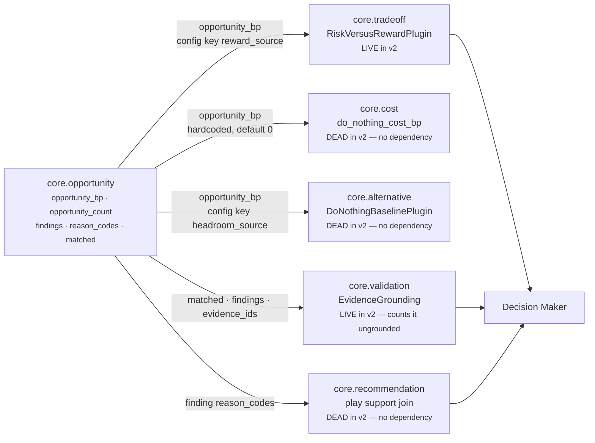

# `core.opportunity` · Stages 7–8 — Builder and Metrics

**Source:** `unit.py:ReasoningUnit.build` (lines 223–241) · the `publishes` guard in
`unit.py:ReasoningUnit.evaluate` (lines 256–261) · `opportunity.py:OpportunityUnit.publishes`
(line 112)
**Overridden by `OpportunityUnit`:** **no.** `build` is the base class, unchanged. `publishes` is a
class attribute, declared.

---

## 1 · What it is for

Stage 7 assembles the one object shape every unit in Layer 4 returns, so the orchestrator, the
Decision Maker, the audit store and the replay verifier handle seventeen units with one code path.
Stage 8 is the guard that stops a unit publishing a metric nobody declared — the mechanism that
keeps *"exactly one publisher per shared value"* enforceable rather than aspirational.

---

## 2 · What exists

### 2.1 · The guard, which runs first

```python
undeclared = sorted(set(verdict.metrics) - set(self.publishes)) if self.publishes else []
if undeclared:
    raise ValueError(f"{self.unit_id} published undeclared metrics: {', '.join(undeclared)}")
return self.build(view, verdict, observations)
```

> *"A unit publishing an undeclared metric is how a shared value like `confidence_bp` gets moved by
> something nobody knew was moving it."*

It sits **between** the Evaluator and the Builder, so a misdeclared unit fails before a
`ReasonerResult` exists and the error reads as *"this unit is misdeclared"* rather than *"this
result contains something surprising"*.

`OpportunityUnit` declares a non-empty `publishes`, so it is not in the framework's escape hatch
(the `if self.publishes else []` clause that leaves an empty-tuple unit unguarded). Adding a
plugin that pushed, say, `headroom_bp` into `Verdict.metrics` would raise
`ValueError: core.opportunity published undeclared metrics: headroom_bp` on the first run.

The guard is one-directional: it catches **extra** metrics, never missing ones. A `calculate` that
stopped returning `opportunity_count` would pass silently and every consumer would fall back to its
own default.

### 2.2 · The Builder, in full

```python
def build(self, view: UnitView, verdict: Verdict,
          observations: Sequence[Observation]) -> ReasonerResult:
    """Assemble the one object shape every unit returns."""
    evidence = set(view.evidence_ids)
    for observation in observations:
        evidence.update(observation.evidence_ids)
    return ReasonerResult(
        reasoner_id=self.unit_id,
        reasoner_version=self.version,
        status=ResultStatus.COMPLETED,
        matched=verdict.matched,
        metrics={name: clamp_bp(value) if name.endswith("_bp") else value
                 for name, value in verdict.metrics.items()},
        findings=verdict.findings,
        adjustments=verdict.adjustments,
        checks=verdict.checks,
        evidence_ids=tuple(sorted(evidence)),
        reason_codes=verdict.reason_codes,
    )
```

Three things it does: **union the evidence**, **clamp the `_bp` metrics**, and **stamp identity and
status**. Everything else passes through from the `Verdict`.

For this unit:

- **The clamp is a no-op.** `calculate` already ran `opportunity_bp` through `clamp_bp`.
- **`opportunity_count` is passed through unclamped**, because it does not end in `_bp` — which
  matters: a count of 3 must not be mistaken for a basis-point value.
- **`adjustments` and `checks` are both `()`**, because `evaluate_meaning` never sets them.
- **The evidence union is empty on both sides.** `view.evidence_ids` is `()` because
  `spec.required_fields` is `()`; every `observation.evidence_ids` is `()` because no plugin sets
  the field. `tuple(sorted(set()))` is `()`.

`status` is hardcoded `COMPLETED`. A unit cannot return `SKIPPED` — `orchestrator.py:209-215`
rewrites any such result as `FAILED` with `reason_codes=("reasoner_returned_skipped",)`, because
*"reasoner implementations may not silently skip themselves."* The only non-completed outcomes for
this unit come from an exception (`FAILED`) or a `MissingContextError` (`INSUFFICIENT_CONTEXT`),
both raised before `build` is reached.

### 2.3 · The result, as shipped

```text
ReasonerResult(
    reasoner_id       = "core.opportunity",
    reasoner_version  = "1.0.0",
    status            = ResultStatus.COMPLETED,
    matched           = True,
    metrics           = {"opportunity_bp": 7000, "opportunity_count": 2},
    findings          = (Finding("opportunity.stalled_but_open", "opportunity", True,
                                 {"strength_bp": 6000}, (), ("open_deal_without_momentum",)),
                         Finding("opportunity.unworked_relationship", "opportunity", True,
                                 {"strength_bp": 4000}, (), ("no_owner_assigned",))),
    adjustments       = (),
    checks            = (),
    evidence_ids      = (),
    missing_fields    = (),
    reason_codes      = ("no_owner_assigned", "open_deal_without_momentum"),
)
semantic_hash = 3a194aa89ddcaf4daa0d2d8844896e283c7205228bd532659b38f49e622ada0c
```

Produced by running `sales.deal_cooling_full` v2 through `ReasoningOrchestrator` against its
fixture.

### 2.4 · What the contract re-validates

`ReasonerResult.__post_init__` (lines 606–633) runs after `build` returns:

| Check | Effect on this unit |
|---|---|
| every `_bp` metric is an integer in 0–10,000 | `opportunity_bp` already clamped twice |
| `matched` is `bool` or `None` | always `bool` here |
| `evidence_ids`, `missing_fields`, `reason_codes` sorted and de-duplicated | reason codes sorted a second time |
| `findings`, `adjustments`, `checks` coerced to tuples | already tuples |
| a non-`COMPLETED` result may carry no metric, finding, adjustment, check or evidence id | unreachable — `build` only ever emits `COMPLETED` |

Then `orchestrator.py:271-273` runs two more guards on the way out:
`validate_candidate_effects(result, play_ids)` — trivially satisfied, since there are no candidate
effects — and `validate_evidence_references(result, request)`, which would raise
*"reasoner references evidence outside the context snapshot"* for any cited id not in the frozen
snapshot. With an empty tuple that check is also trivially satisfied. **This unit passes both
evidence guards by never citing anything.**

---

## 3 · The published metrics

`publishes = ("opportunity_bp", "opportunity_count")`

| Metric | Type | Range | Meaning | Absent when |
|---|---|---|---|---|
| `opportunity_bp` | int basis points | 0–10,000 | Untaken headroom. `10,000bp` means 1.00 — maximal for attention purposes. Saturates: 10,777 and 13,500 both report 10,000 | **never** |
| `opportunity_count` | int | 0–3 | How many plugins produced an `Observation` — **not** how many crossed any bar, and not how many were worth anything | **never** |

Both are always present, including `0`. That is the design decision argued — and criticised — at
[04 · Calculator](04-Calculator.md) §5.

`opportunity_count` has two honest readings and one dishonest one:

- *"how many independent claims support this score"* — correct
- *"how much of the scale the lift could have added"* — correct, since the lift is
  `half_up(sum of all but the leader, 4)`
- *"how many opportunities exist here"* — **wrong**, because a zero-strength observation still
  counts. Verified: an inbound message that arrived within the last hour gives
  `opportunity_bp = 0` with `opportunity_count = 1`.

### 3.1 · Sole ownership

`tests/test_unit_roster.py:82` asserts that no two units publish the same metric name.
`core.opportunity` is the only publisher of both `opportunity_bp` and `opportunity_count` anywhere
in the roster.

Neither is a **metric authority** in the sense the category uses for `confidence_bp` and
`urgency_bp` — there is no `OPPORTUNITY_AUTHORITY` constant and no capability metadata key to move
it, because there is no second unit that could plausibly emit it. Sole ownership here is a fact
about the roster rather than an enforced arbitration.

---

## 4 · Who consumes these metrics



A consumer sees this unit's result **only if the capability declared `core.opportunity` as one of
its dependencies** — `orchestrator.py:158` builds each unit's `prior` mapping from
`spec.dependencies` alone, *"Passing every earlier result would create hidden, order-dependent
edges."* In `sales.deal_cooling_full` v2 that is true for `core.tradeoff` and `core.validation` and
false for the other three.

### 4.1 · `core.tradeoff` — the one live numeric consumer

`tradeoff_unit.py:RiskVersusRewardPlugin.contribute`:

```python
reward = _prior_bp(view, "reward_source", "core.opportunity", "opportunity_bp")
risk   = _prior_bp(view, "risk_source",   "core.risk",        "risk_bp")
if reward is None or risk is None:
    return ()
return _weigh(view, self.plugin_id, "risk_vs_reward", "reward", reward, "caution", risk)
```

`_prior_bp` reads with an `_ABSENT = -1` sentinel and returns `None` if the unit did not complete.
`reward_source` is a config key, so a capability can appoint a different publisher.

> *"Both sides already exist as audited units, and until now they were only ever summed into a
> score. Holding them apart is what lets an explanation say 'the upside is worth more than the
> exposure, and here is the exposure we accepted' — which is the sentence an executive needs and a
> weighted average destroys."*

Verified on the shipped run:

```text
reward  = opportunity_bp = 7000
caution = risk_bp        = 5934
margin_bp  = 7000 − 5934 = 1066
tension_bp = half_up(5934 × (10000 − 1066) ÷ 10000)
           = half_up(5934 × 8934, 10000) = half_up(53,014,356, 10000)
           = (53,014,356 + 5,000) // 10,000 = 5,301
reason codes: favours.reward · concedes.caution · tradeoff.risk_vs_reward
```

That single axis is `core.tradeoff`'s entire output in that run — `axis_count = 1` — because the
other two axes' sources were not wired. So **`opportunity_bp` is currently the only reason
`core.tradeoff` has anything to say at all.**

### 4.2 · `core.cost` — wired in code, dead in the manifest

`cost_unit.py:calculate`:

```python
# Untaken headroom is a cost of inaction too: the Opportunity Unit already priced it, so
# read it rather than re-deriving a second, disagreeing estimate of the same thing.
headroom_bp = clamp_bp(view.prior_metric("core.opportunity", "opportunity_bp", 0))
leading, trailing = max(delay_bp, headroom_bp), min(delay_bp, headroom_bp)
do_nothing_bp = clamp_bp(leading + divide_half_up(trailing, 4))
```

The same max-plus-quarter shape as [04 · Calculator](04-Calculator.md), applied to a different
pair. The unit id is **hardcoded** — there is no `headroom_source` key here — and the default is
`0`, not a sentinel.

`deal_cooling_v2.py` declares `_spec("core.cost", config={...})` with **no dependencies**, so
`prior` is empty, `prior_metric` returns `0`, and `do_nothing_cost_bp` is computed as if there were
no headroom at all. Verified: `core.opportunity` published `7,000` and `core.cost` published
`do_nothing_cost_bp = 0` in the same run.

### 4.3 · `core.alternative` — the chain fails twice

`alternative_unit.py:DoNothingBaselinePlugin` first asks `core.cost` for a price, and only falls
back to raw signals if none was published:

```python
priced = _prior_bp(view, "inaction_cost_source", "core.cost", "do_nothing_cost_bp")
if priced is not None:
    return (Observation(..., metrics={"do_nothing_baseline_bp": priced, "signal_count": 1},
                        reason_codes=("inaction_priced_upstream",)),)
signals = ...
for key, default_unit, metric, code in (
    ("headroom_source", "core.opportunity", "opportunity_bp", "headroom_lapses"),
    ("momentum_source", "core.temporal",    "drop_bp",        "momentum_decays"),
    ("exposure_source", "core.risk",        "risk_bp",        "exposure_compounds"),
):
```

In v2, `core.alternative` declares `("core.constraint", "core.cost")`. So it reads `core.cost`'s
`do_nothing_cost_bp = 0` — a value that is zero only because §4.2's dependency is missing — takes
the `priced is not None` branch, and never reaches the `headroom_lapses` fallback. Verified:

```text
core.alternative  do_nothing_baseline_bp = 0
                  reason code "inaction_priced_upstream"
```

The plugin's own docstring names the risk it is trying to avoid: *"An unknown cost of waiting must
stay unknown: reporting it as zero would tell a human that doing nothing is free, which is the
single most expensive thing this unit could get wrong."* Two missing manifest dependencies produce
exactly that outcome, and every guard in the chain reports success.

### 4.4 · `core.validation` — the live consumer that penalises this unit

`validation_unit.py`'s evidence-grounding plugin inspects every completed prior result:

```python
def _asserts_a_claim(result) -> bool:
    if result.matched is True:
        return True
    return any(finding.matched is not False for finding in result.findings)

def _cited(result, producible) -> tuple[str, ...]:
    cited = set(result.evidence_ids)
    for finding in result.findings:
        cited.update(finding.evidence_ids)
    return tuple(sorted(cited & producible))
```

`core.opportunity` returns `matched=True` with `evidence_ids=()` and findings that cite nothing, so
it is counted ungrounded. Verified on the shipped run:

```text
core.validation findings
  validation.evidence_sufficiency.core.confidence   claimant:core.confidence
  validation.evidence_sufficiency.core.opportunity  claimant:core.opportunity
  validation.evidence_sufficiency.core.risk         claimant:core.risk

core.validation metrics
  inspected_result_count 4 · ungrounded_claim_count 3 · evidence_sufficiency_bp 2500
  safe_bp 5500
```

`core.validation` is `REQUIRED` in v2 with `safety_floor_bp = 3_000`; `safe_bp = 5,500` clears it,
so the run proceeds. But this unit is actively costing the capability evidence-sufficiency points,
and the fix — attaching `evidence_ids` in the plugins — is one line per plugin.
See [02 · Retriever](02-Retriever.md) §4.

### 4.5 · `core.recommendation` — the join this unit's reason codes were designed for

`recommendation_unit.py` builds the finding→play join from the *reason codes* a prior unit
published, matched against play `tags` or an authored `play_support_codes` map:

> *"Linkage is declared, never inferred. A finding supports a play because Layer 3 said so — not
> because this unit guessed that `inbound_awaiting_reply` sounds like it goes with `send a reply`."*

`inbound_awaiting_reply` is the worked example throughout `tests/test_unit_recommendation_unit.py`,
where a play tagged with that code draws support from a `core.opportunity` finding. In v2 the join
is dead twice over: `core.recommendation` declares `("core.dependency", "core.validation")` so it
never sees `core.opportunity`, and no play in the capability carries a matching tag. Verified: all
three plays report `support_bp 0`, `supporting_unit_count 0`, reason code `support.absent`.

Note the `matched=False` interaction: `recommendation_unit.py` discards findings the publishing unit
marked negative, because *"a finding the publishing unit itself marked `matched=False` is a claim it
declined to make."* `core.opportunity` never emits a negative finding — below the threshold it emits
none at all ([05 · Evaluator](05-Evaluator.md) §5.3) — so every finding this unit produces is
support-eligible.

### 4.6 · The Decision Maker does not read it directly

`decision_maker.py` contains no reference to `core.opportunity` or `opportunity_bp`. The unit
reaches the decision only through `core.tradeoff`'s tension reading and `core.validation`'s safety
metrics — which is the boundary the module docstring asserts: *"It reports that headroom exists and
how strongly; the Decision Maker weighs that against risk, effort, and policy."*

There is no legacy-signal projection for this metric either. `core.impact` leaks into
`authority.py:AUTHORITATIVE_SCORE_INPUTS_SQL` through the legacy path; `opportunity_bp` does not
appear in any SQL, any projection, or any delivery slot.

### 4.7 · Consumer summary

| Consumer | Reads | Config key for the source | Default on absence | Wired in v2? |
|---|---|---|---|---|
| `core.tradeoff` · `risk_vs_reward` | `opportunity_bp` | `reward_source` | `None` sentinel → plugin silent | **yes** |
| `core.cost` · `calculate` | `opportunity_bp` | none — hardcoded | `0` | no — `core.cost` declares no dependencies |
| `core.alternative` · `do_nothing_baseline` | `opportunity_bp` | `headroom_source` | `None` sentinel → signal skipped | no — and shadowed by `core.cost`'s `0` |
| `core.validation` · evidence grounding | `matched`, `findings`, `evidence_ids` | n/a | n/a | **yes** |
| `core.recommendation` · play support | finding `reason_codes` | n/a | n/a | no |
| Decision Maker | nothing directly | — | — | n/a |

---

## 5 · Silence semantics at the output boundary

**This unit never emits nothing.** `build` always returns a `COMPLETED` result carrying both
metrics. The three states a consumer can observe are the ones tabulated in
[05 · Evaluator](05-Evaluator.md) §7, and `metrics` is populated in all three.

The one way `core.opportunity` disappears from a run is by failing. Its two config validators and
its plugins can raise `ValueError`, which `orchestrator.py:290-297` converts to:

```text
ReasonerResult(status=FAILED, reason_codes=("reasoner_failure",),
               diagnostics={"exception_type": "ValueError", "message": "..."})
```

with no metrics, no matched, no findings — `ReasonerResult.__post_init__` forbids a non-completed
result from carrying any of them. Because `sales.deal_cooling_full` marks this unit `OPTIONAL`, the
run continues with `optional_failed:core.opportunity` appended to `uncertainty`, and every consumer
falls back to its own default.

Verified end to end, by injecting `opportunity_threshold_bp = 20000` into the shipped manifest:

```text
core.opportunity  FAILED  reason_codes ("reasoner_failure",)
                  diagnostics {"exception_type": "ValueError",
                               "message": "opportunity_threshold_bp must be integer basis points"}
core.tradeoff     COMPLETED  {"tension_bp": 0, "margin_bp": 0,
                              "axis_count": 0, "contested_count": 0}
decision          DecisionOutcome.DECISION
```

`core.tradeoff` loses its only axis and reports `axis_count = 0` — which is exactly the signal its
docstring says that metric exists for: *"how many comparisons were possible at all, which is how a
reviewer tells 'nothing was contested' apart from 'nothing was measurable'."* The run still reaches
a decision, because nothing in v2 treats opportunity as load-bearing.

---

## 6 · Determinism

Every ordered field in the result is sorted, at least once and usually twice:

| Field | Sorted where |
|---|---|
| `findings` | `analyze` sorts plugins by `plugin_id`; `evaluate_meaning` preserves that order |
| `reason_codes` | `evaluate_meaning` sorts a set; `ReasonerResult.__post_init__` sorts again |
| `evidence_ids` | `build` does `tuple(sorted(evidence))`; `__post_init__` sorts again |
| `Finding.metrics` keys | `contracts/reasoning.py:_mapping` freezes; `semantic_hash` canonicalises key order |

`findings` is the one whose order is **not** re-established downstream, which is why the `sorted()`
in `analyze` is load-bearing: `to_semantic_dict` includes the findings tuple positionally, so a
reordered tuple hashes differently and the audit store would report an identical run as
non-reproducible. `tests/test_l4_end_to_end.py:test_the_run_is_replayable` is the assertion that
would catch it.

Nothing in this unit reads a clock, a random source, an environment variable or a database.
`evaluation_time` comes from the frozen request, and `elapsed_hours` is computed against it.

---

## 7 · Related

- [05 · Evaluator](05-Evaluator.md) — the `Verdict` this stage assembles
- [04 · Calculator](04-Calculator.md) — where the two published metrics come from
- [02 · Retriever](02-Retriever.md) — why `evidence_ids` is empty, and the one-line manifest fix
- [README](README.md) — defect 3, and the shipped run in full
- [Category 2 · Business Evaluation](../README.md) — metric authorities and the roster invariants
