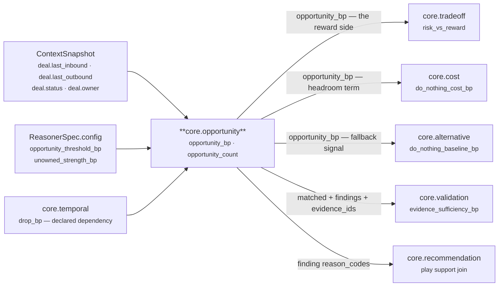
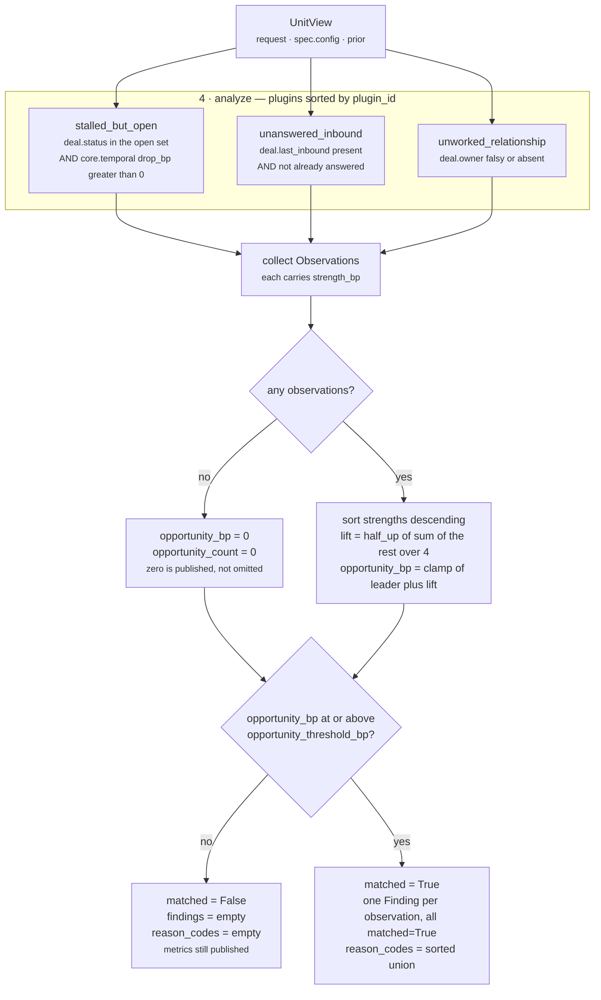

# `core.opportunity` — the Opportunity Unit

**Source of truth:** `genios_engine/reason/reasoners/opportunity.py` (153 lines)
**Class:** `opportunity.py:OpportunityUnit` · `unit_id = "core.opportunity"` · `version = "1.0.0"`
**Category:** `UnitCategory.BUSINESS_EVALUATION`
**Contract:** **no dedicated test file.** `tests/test_unit_opportunity.py` does not exist. See §7
**Registered:** `reasoners/__init__.py:BUSINESS_EVALUATION`, second of five
**Shipped by:** `packs/capabilities/deal_cooling_v2.py:_full_roster` — one capability, one config key

---

## 1 · What it is for

*Where is there value to gain here that nobody has taken?*

The module docstring is unusually specific about what this unit refuses to mean:

> *"An opportunity in GeniOS is never 'this looks promising'. It is a specific, evidenced gap
> between what the situation makes possible and what has actually happened — an investor who
> replied and was never answered, a buyer who went quiet while the deal is still open, an account
> with room to grow and no one working it. Each of those is a separate plugin, because they are
> separate claims with separate evidence, and folding them into one score would make the reasoning
> unexplainable."*

And what it refuses to do:

> *"The unit never proposes an action. It reports that headroom exists and how strongly; the
> Decision Maker weighs that against risk, effort, and policy."*

`core.opportunity` is the only publisher of `opportunity_bp`. Nothing else in Layer 4 measures
untaken upside: `core.temporal` measures decay, `core.risk` measures exposure, `core.impact`
measures the size of the stake. All three are about what is *there*; this unit is about what is
*missing* — the reply that was not sent, the momentum that was not restored, the account nobody
owns.

It is the mirror image of `core.risk` and it feeds the same consumer:
`tradeoff_unit.py:RiskVersusRewardPlugin` puts `opportunity_bp` on the reward side and `risk_bp` on
the caution side, and that single comparison is what lets an explanation say *"the upside is worth
more than the exposure, and here is the exposure we accepted."*

---

## 2 · Its place in the pipeline



Four of those five downstream edges are **dead in the only shipped capability**, and the fifth is
the only reason the unit currently affects anything. §6 names each one. The `core.temporal` edge is
live and load-bearing: without it `stalled_but_open` cannot fire at all.

---

## 3 · What exists

### 3.1 · The three plugins

Registered as `plugins = (UnansweredInboundPlugin(), StalledButOpenPlugin(),
UnworkedRelationshipPlugin())` on line 113. `unit.py:ReasoningUnit.analyze` sorts them by
`plugin_id`, so the order below — alphabetical, *not* the order in the class body — is the order
observations, findings and reason codes appear in.

| # | `plugin_id` | Class | Claim | `Observation.kind` | Reason code | `Observation.metrics` | Doc |
|---|---|---|---|---|---|---|---|
| 1 | `stalled_but_open` | `StalledButOpenPlugin` | The deal is still winnable and nothing is happening to win it | `opportunity.stalled_but_open` | `open_deal_without_momentum` | `strength_bp` | [03a](03a-plugin-stalled_but_open.md) |
| 2 | `unanswered_inbound` | `UnansweredInboundPlugin` | They reached out and nobody replied | `opportunity.unanswered_inbound` | `inbound_awaiting_reply` | `strength_bp`, `waiting_hours` | [03b](03b-plugin-unanswered_inbound.md) |
| 3 | `unworked_relationship` | `UnworkedRelationshipPlugin` | A live relationship with no one currently working it | `opportunity.unowned` | `no_owner_assigned` | `strength_bp` | [03c](03c-plugin-unworked_relationship.md) |

> **Three names for one plugin.** The third plugin's `plugin_id` is `unworked_relationship`, its
> `Observation.kind` is `opportunity.unowned`, and its `Finding.finding_id` is
> `opportunity.unworked_relationship` — because `evaluate_meaning` builds finding ids from the
> plugin id, not the kind. Nothing outside `opportunity.py` reads any `Observation.kind` this unit
> emits, so the mismatch is inert today. It is still a trap for anyone who greps for
> `opportunity.unworked_relationship` expecting to find the kind.

### 3.2 · The published metrics

`publishes = ("opportunity_bp", "opportunity_count")`

| Metric | Range | Meaning | Present when |
|---|---|---|---|
| `opportunity_bp` | 0–10,000 | Untaken headroom. `10,000bp` means 1.00 — every plugin at full strength, or enough of them to saturate the lift | **always**, including `0` when nothing fired |
| `opportunity_count` | 0–3 | How many plugins produced an observation — *not* how many crossed any bar | **always** |

**Both metrics are always present, and `0` is a real published value.** That is a deliberate
divergence from its sibling `core.impact`, which omits `impact_bp` entirely when no dimension
reported. §4 argues why the two units differ.

### 3.3 · Which stages it implements

| Stage | Overridden? | What it does | Doc |
|---|---|---|---|
| 1 · Input | n/a | fixed by the template method `unit.py:ReasoningUnit.evaluate`, lines 245–262 | [01](01-Input-and-Validator.md) |
| 2 · Validator | **no** — base `unit.py:ReasoningUnit.validate`, lines 179–188 | enforces `spec.required_fields`; this unit declares none | [01](01-Input-and-Validator.md) |
| 3 · Retriever | **no** — base `unit.py:ReasoningUnit.retrieve`, lines 190–200 | selects `spec.required_fields` into `view.facts`; the plugins ignore it | [02](02-Retriever.md) |
| 4 · Analyzer | **no** — base `unit.py:ReasoningUnit.analyze`, lines 202–211 | runs all three plugins in `plugin_id` order | [03](03-Analyzer.md) |
| 5 · Calculator | **yes** — `@abstractmethod`, lines 115–129 | max-plus-quarter-lift | [04](04-Calculator.md) |
| 6 · Evaluator | **yes** — `@abstractmethod`, lines 131–149 | one threshold, findings suppressed below it | [05](05-Evaluator.md) |
| 7 · Builder | **no** — base `unit.py:ReasoningUnit.build`, lines 223–241 | one `ReasonerResult` shape | [06](06-Builder-and-Metrics.md) |
| 8 · Metrics | declared in `publishes`, line 112 | guarded by `unit.py:ReasoningUnit.evaluate` lines 256–261 | [06](06-Builder-and-Metrics.md) |

Four of the eight stages are the base class unchanged. The unit's own class body is 44 lines; the
other 109 lines of the module are the three plugins, one config reader, and the docstrings that
argue them.

---

## 4 · Internal flow



Three rules the code enforces, and where each lives:

**The strongest claim sets the level.** `calculate` is not a sum and not a mean. Three weak hints
are not a strong opportunity, and averaging would let one weak plugin drag down a genuinely ripe
one. The arithmetic and the docstring that argues it are in [04](04-Calculator.md).

**Silence is per-plugin, and each plugin has its own silence rule.** `stalled_but_open` and
`unanswered_inbound` both go silent on absent input; `unworked_relationship` does the opposite and
*fires* on absent input, because it reads absence of an owner as the claim. That asymmetry is the
unit's sharpest edge and is documented at [03c](03c-plugin-unworked_relationship.md) §5.

**Findings are all-or-nothing.** Below the threshold `evaluate_meaning` emits `findings=()` and
`reason_codes=()` even though the observations exist and the metrics are published. Unlike
`core.impact`, which asserts its findings regardless of materiality, this unit declines to make any
claim it would not stand behind. `validation_unit.py:_asserts_a_claim` therefore does not count an
unmatched opportunity run as a claim at all.

---

## 5 · Every config key

Both are read from `ReasonerSpec.config` — per-capability tuning authored in Layer 3 and versioned
with the manifest. There is no global default file; the defaults below are the literal fallback
arguments in `opportunity.py`.

| Key | Read by | Line | Type | Default | Validator | Effect when absent |
|---|---|---|---|---|---|---|
| `unowned_strength_bp` | `UnworkedRelationshipPlugin.contribute` | 101 | int bp 0–10,000 | `4_000` | `_config_bp` | an unowned deal is worth 4,000bp of headroom |
| `opportunity_threshold_bp` | `OpportunityUnit.evaluate_meaning` | 133 | int bp 0–10,000 | `3_000` | `_config_bp` | 30% of scale counts as "there is an opportunity here" |

That is the whole surface. **The unit has no config key for any of its input field names** — the
four fact paths `deal.last_inbound`, `deal.last_outbound`, `deal.status`, `deal.owner` and the
prior-unit id `core.temporal` are all literals in the source. Its siblings do not work this way:
`impact_unit.py` exposes `value_field`, `account_tier_field`, `strategic_link_field` and
`relationship_reasoner`; `tradeoff_unit.py` exposes `reward_source`. `core.opportunity` cannot be
pointed at a differently-named fact without editing Python. §6 defect 1 is a direct consequence.

### 5.1 · The validator

```python
def _config_bp(view: UnitView, key: str, default: int) -> int:
    value = view.config.get(key, default)
    if isinstance(value, bool) or not isinstance(value, int) or not 0 <= value <= 10_000:
        raise ValueError(f"{key} must be integer basis points")
    return value
```

Bools are rejected before the `int` check because `True` *is* an `int` in Python and `True == 1`
would otherwise pass as 1bp. Floats and numeric strings are rejected rather than coerced: a
manifest saying `3000.0` or `"3000"` is an authoring fault, and coercion would hide it.

### 5.2 · Validation timing differs between the two keys

`opportunity_threshold_bp` is read on **every** run, because `evaluate_meaning` always reads it.
`unowned_strength_bp` is read only on runs where the unowned branch is actually taken. Verified
against the live unit:

```text
config = {"unowned_strength_bp": -1}
  facts has deal.owner = "rohit"   → plugin returns () → key never read
                                   → run COMPLETES, metrics {"opportunity_bp": 0, ...}
  facts has no deal.owner          → key read → ValueError:
                                     "unowned_strength_bp must be integer basis points"
                                   → orchestrator turns it into ResultStatus.FAILED

config = {"opportunity_threshold_bp": 20000}
  either way                       → ValueError on every run
```

A manifest with a broken `unowned_strength_bp` can sit green until the first deal that happens to
have no owner. Nothing in `packs/` validates these keys at manifest-compile time.

### 5.3 · The only shipped configuration

`packs/capabilities/deal_cooling_v2.py:_full_roster`, lines 94–98:

```python
_spec("core.opportunity", ("core.temporal",), config={
    # An unanswered buyer is the cheapest opportunity in the system: they already spent
    # the effort, and the whole cost of capture is one considered reply.
    "opportunity_threshold_bp": 2_500,
}),
```

Resolved spec: `dependencies=("core.temporal",)`, `required_fields=()`,
`failure_policy=OPTIONAL`, `latency_budget_ms=60`, `gating=False`. The lowered threshold is
authored for the `unanswered_inbound` plugin — which, in that same capability, cannot fire. See §6.

---

## 6 · Known defects and compromises

Every row was reproduced against the live code. Nothing here is inferred.

| # | What | Where | Severity |
|---|---|---|---|
| 1 | **The flagship plugin cannot fire in the shipped capability.** `UnansweredInboundPlugin` reads the literal fact `deal.last_inbound`. `native.py:_selected_fields` builds the snapshot's field set from `capability.required_fields` ∪ every reasoner's `required_fields` ∪ every play precondition field. For `sales.deal_cooling_full` v2 that resolves to `deal.next_step, deal.status, deal.value, derived.engagement, relationship.verified_stakeholder_count, thread.last_inbound` — `deal.last_inbound` is **not in it**, so the field never reaches the snapshot and the plugin is unconditionally silent. The buyer's clock *is* in the snapshot, under the name `thread.last_inbound`, which the plugin has no way to read. Commit `2f77657` gave `deal.last_inbound` a writer; the selector still does not carry it. | `opportunity.py:42` vs `deal_cooling_v2.py:94` | **high** — the docstring calls this "the strongest opportunity signal in the system" and the capability lowered its threshold for it |
| 2 | **`unworked_relationship` fires on an absent field, so it fires on every production deal.** `deal.owner` is written by nothing in `genios_engine/` and is not in the selected field set either. `fact_value` returns `None`, `if owner:` is False, and the plugin claims `no_owner_assigned` at 4,000bp. Since the shipped threshold is 2,500bp, **that one plugin alone makes `matched=True` on every deal the capability ever sees.** Verified on the shipped fixture: `strength_bp = 4,000`, `reason_codes = ("no_owner_assigned",)`. | `opportunity.py:95-103` | **high** — a fabricated claim, indistinguishable downstream from a real one |
| 3 | **The unit cites nothing, ever.** No plugin sets `Observation.evidence_ids`, and `view.evidence_ids` is empty because the spec declares no `required_fields`. So `result.evidence_ids == ()` and every `Finding.evidence_ids == ()`. `validation_unit.py:_asserts_a_claim` sees `matched=True`, `_cited` returns nothing, and the run is counted as an ungrounded claim. Verified on the shipped capability: `validation.evidence_sufficiency.core.opportunity` with `claimant:core.opportunity`, contributing to `evidence_sufficiency_bp = 2,500`. Declaring `required_fields=("deal.last_inbound",)` fixes `result.evidence_ids` but **not** the findings, which are built from `Observation.evidence_ids` alone. | `opportunity.py:61-66, 81-86, 98-103` | **high** — it is the difference between an audited claim and an assertion |
| 4 | **A malformed or future `deal.last_outbound` silently kills a valid inbound claim.** The guard is `try: if elapsed_hours(...) <= inbound_hours: return () except ValueError: return ()`. Both the "we already replied" path and the "the reply timestamp is garbage" path return the same empty tuple. Verified: inbound 216h ago with `deal.last_outbound = "yesterday"` → `opportunity_bp = 0`, identical `semantic_hash` to a run with no inbound at all. | `opportunity.py:50-55` | medium — a data fault is reported as an absence of opportunity |
| 5 | **Hour-truncation lets an *earlier* outbound suppress the claim.** `elapsed_hours` floors to whole hours. An outbound sent up to 59 minutes *before* the inbound lands in the same hour bucket, the `<=` comparison holds, and the plugin goes silent. Verified: inbound at −216h00m with outbound at −216h59m → `opportunity_bp = 0`; move the outbound to −217h01m and it becomes 6,308. | `opportunity.py:47-53` + `common.py:107` | medium |
| 6 | **`stalled_but_open` hardcodes both its vocabulary and its source unit.** The open set is the literal `{"open", "active", "in_progress", "negotiation"}` with no config key, and the momentum source is the literal `"core.temporal"`. `str(...).lower()` normalises case but **not** whitespace, so `"Open "` does not match. A capability whose CRM says `"qualified"` or `"proposal"` gets silence with no diagnostic. | `opportunity.py:75-78` | medium |
| 7 | **`opportunity_count` counts observations, not opportunities.** A just-arrived inbound scores `strength_bp = 0` on the ramp yet still produces an observation, so a run can publish `opportunity_bp = 0` alongside `opportunity_count = 1`. Verified at `waiting_hours = 0`. | `opportunity.py:123-129` | low, but the metric name misleads |
| 8 | **`opportunity_threshold_bp = 0` produces `matched=True` with nothing behind it.** `present = metrics["opportunity_bp"] >= threshold` is `0 >= 0`. The findings tuple is built from an empty observation list, so the result is `matched=True, opportunity_bp=0, opportunity_count=0, findings=(), reason_codes=()` — a positive claim with no content, which `_asserts_a_claim` still counts as a claim. Verified. | `opportunity.py:134` | low — only reachable via an authored `0` |
| 9 | **Dead sub-expression in the ramp.** `min(inbound_hours, 168)` appears in the `inbound_hours <= 24` branch, where it can never bind. Harmless, and it makes the two branches read as if they share a cap that they do not. | `opportunity.py:58` | cosmetic |
| 10 | **No test file.** `tests/test_unit_opportunity.py` does not exist. See §7. | — | **process** |
| 11 | **Every constant is a guess.** The 24-hour ripening point, the 6,000bp drop over 312 hours, the 4,000bp floor, `unowned_strength_bp = 4,000`, the ÷4 lift and `opportunity_threshold_bp = 3,000` were authored from domain reasoning and have never been fitted to outcome data. `Rohit_Updates/Layer 4.md` Step 4 records this for the category. | throughout | acknowledged |

### 6.1 · Doc drift found while writing this folder

`02-Business-Evaluation/README.md` §4.8 reports `core.opportunity` at `opportunity_bp = 8,462`,
`opportunity_count = 3` on the `sales.deal_cooling_full` fixture, with `unanswered_inbound` firing
at 5,846bp. **The live run gives `opportunity_bp = 7,000`, `opportunity_count = 2`**, because
`deal.last_inbound` is not in that snapshot. Every other row of that table still reproduces exactly
(`risk_bp = 5,934`, `impact_bp = 10,000`, `urgency_bp = 9,360`, `confidence_bp = 6,950`), as does
the tradeoff reading below. The decision narrative in the same section is also stale: the live
winner is `restore_momentum` at 8,070bp, rank 1. That file is outside this folder and was left
unedited.

---

## 7 · There is no test for this unit

Every other unit in Category 2 has a dedicated `tests/test_unit_*.py` with per-plugin isolation,
determinism assertions and boundary cases. `core.opportunity` has none. It is exercised only
incidentally, by three assertions:

| Test | Assertion |
|---|---|
| `tests/test_l4_end_to_end.py:135` | `by_id["core.opportunity"].metrics["opportunity_bp"] > 8_000` |
| `tests/test_l4_end_to_end.py:136` | `by_id["core.opportunity"].matched is True` |
| `tests/test_capability_deal_cooling_full.py:117` | `v2.result_by_id["core.opportunity"].metrics["opportunity_bp"] > 0` |

The ripen-then-decay curve, the three guard sequences, the max-plus-quarter-lift blend, the
threshold, the findings-suppression rule and both config validators are entirely unpinned. A
refactor could change any of them and the suite would stay green. Defects 1, 2 and 3 above have
been shipping under a green suite for exactly this reason.

The verification command in this folder's brief —
`.venv/bin/python -m pytest tests/test_unit_opportunity.py -q` — exits with
`ERROR: file or directory not found`. The nearest real check is:

```bash
.venv/bin/python -m pytest tests/test_l4_end_to_end.py \
    tests/test_capability_deal_cooling_full.py tests/test_unit_roster.py \
    tests/test_unit_tradeoff_unit.py tests/test_unit_cost_unit.py \
    tests/test_unit_validation_unit.py tests/test_unit_alternative_unit.py \
    tests/test_unit_recommendation_unit.py -q
# 246 passed in 0.22s
```

---

## 8 · The canonical worked example

The `sales.deal_cooling_full` v2 fixture: a $500,000 deal, status open, engagement halved to
4,000bp, the buyer silent for ten days, two verified stakeholders. Re-derived by running the live
orchestrator, not copied.

```text
snapshot facts   deal.status                              = "open"       ev_status
                 deal.value                               = 500000       ev_value
                 derived.engagement                       = 4000bp       ev_engagement
                 thread.last_inbound                      = NOW - 10d    ev_inbound
                 relationship.verified_stakeholder_count  = 2            ev_stakeholders
                 deal.last_inbound   ABSENT  ← not in the selected field set
                 deal.last_outbound  ABSENT  ← no writer anywhere in the codebase
                 deal.owner          ABSENT  ← no writer anywhere in the codebase
config           opportunity_threshold_bp = 2500
prior            core.temporal COMPLETED  drop_bp = 6000

4 · analyze  (plugin_id order)
   stalled_but_open       status "open" is in the set, drop_bp 6000 > 0
                          strength_bp 6000   open_deal_without_momentum
   unanswered_inbound     deal.last_inbound is None → return ()      SILENT
   unworked_relationship  deal.owner is None → falsy → fires
                          strength_bp 4000   no_owner_assigned

5 · calculate
   strengths sorted desc = [6000, 4000]
   lift  = half_up(4000 / 4) = (4000 + 2) // 4 = 1000
   opportunity_bp    = clamp_bp(6000 + 1000) = 7000
   opportunity_count = 2

6 · evaluate_meaning
   7000 >= 2500  → present → matched True
   findings     opportunity.stalled_but_open       {strength_bp: 6000}
                opportunity.unworked_relationship  {strength_bp: 4000}
   reason_codes no_owner_assigned · open_deal_without_momentum

7 · build
   metrics       opportunity_bp 7000 · opportunity_count 2
   evidence_ids  ()          ← cites nothing; see defect 3
   semantic_hash 3a194aa89ddcaf4daa0d2d8844896e283c7205228bd532659b38f49e622ada0c

downstream, same run
   core.tradeoff  risk_vs_reward  leading_bp 7000 (reward) · trailing_bp 5934 (caution)
                  margin_bp = 7000 - 5934 = 1066
                  tension_bp = half_up(5934 x (10000 - 1066) / 10000) = 5301
                  reason codes: favours.reward · concedes.caution
   core.cost      do_nothing_cost_bp = 0   ← reads opportunity_bp as 0; no dependency declared
   core.alternative do_nothing_baseline_bp = 0, "inaction_priced_upstream" from that 0
   core.validation  claimant:core.opportunity counted ungrounded
                  → evidence_sufficiency_bp 2500 across 4 claims, 1 grounded
   core.recommendation support_bp 0 on all three plays, "support.absent"
```

Read the arithmetic and it is correct. Read the inputs and **4,000 of those 7,000 basis points come
from a plugin reading a field that does not exist in the snapshot**, and the plugin the capability
actually lowered its threshold for never ran. That is the state of this unit today.

---

## 9 · The files

| File | Stage | Answers |
|---|---|---|
| [01 · Input and Validator](01-Input-and-Validator.md) | 1–2 | What arrives, why `required_fields` is empty, and why this unit can never return INSUFFICIENT_CONTEXT |
| [02 · Retriever](02-Retriever.md) | 3 | Which slice of the frozen snapshot lands in the `UnitView` — and why the plugins read past it |
| [03 · Analyzer](03-Analyzer.md) | 4 | The plugin seam: composition, execution order, the one shared dependency, the one shared blind spot |
| [03a · `stalled_but_open`](03a-plugin-stalled_but_open.md) | 4 | A status gate and a borrowed number |
| [03b · `unanswered_inbound`](03b-plugin-unanswered_inbound.md) | 4 | Ripen for a day, decay for a fortnight, floor forever |
| [03c · `unworked_relationship`](03c-plugin-unworked_relationship.md) | 4 | One truthiness test, and why absence reads as a claim |
| [04 · Calculator](04-Calculator.md) | 5 | Max plus a quarter of the rest, argued from the code's own docstring |
| [05 · Evaluator](05-Evaluator.md) | 6 | One threshold, all-or-nothing findings, and what `matched` means here |
| [06 · Builder and Metrics](06-Builder-and-Metrics.md) | 7–8 | The `ReasonerResult`, the empty evidence tuple, and all five downstream consumers |

### Related

| Document | Covers |
|---|---|
| [Category 2 · Business Evaluation](../README.md) | The five units of this category and the two metric authorities |
| [`core.impact`](../core.impact/README.md) | The sibling that made the opposite silence decision |
| [Part 2 · The Unit Framework](../../README.md) | The eight stages, the plugin seam, the roster invariants |
| [Layer 4 · Overview](../../../00-Overview.md) | The three parts and the laws that bind all of them |
