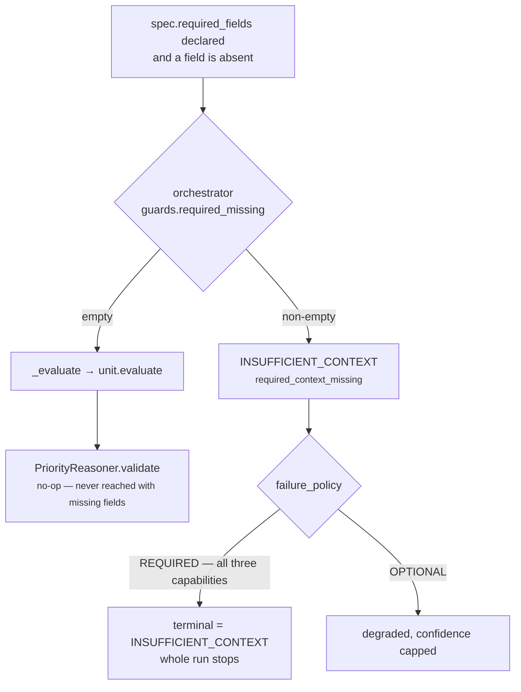

# 01 · Input and Validator

**Stages 1 and 2 of the eight.**
**Source:** `genios_engine/reason/reasoners/priority.py:192` (`PriorityReasoner.validate`)
**Base:** `genios_engine/reason/unit.py:179` (`ReasoningUnit.validate`)

---

## 1 · What it is for

The Validator's job in the framework is to **refuse to reason from inputs that cannot support a
conclusion**. For most units that means: if a fact you declared you need is not in the snapshot,
raise `MissingContextError` and let the orchestrator turn it into a typed
`INSUFFICIENT_CONTEXT` result rather than letting a fabricated answer through.

`core.priority` reads no facts. So there is nothing a missing fact could undermine, and the unit
overrides `validate()` to do nothing at all.

---

## 2 · What exists — what actually arrives

The unit is called through the framework template method:

```python
# unit.py:245
def evaluate(self, request: ReasoningRequest,
             prior_results: Mapping[str, ReasonerResult]) -> ReasonerResult:
    spec = active_spec(request, self.unit_id)
    view = self.retrieve(request, spec, prior_results)
    self.validate(view)
    ...
```

Two arguments, and one lookup that can fail before either stage runs.

### 2.1 · `request: ReasoningRequest`

The frozen, content-addressed situation. `core.priority` touches exactly two things on it, both
indirectly through `UnitView`:

| Reached via | What it is | Used for |
|---|---|---|
| `view.spec.config["source_reasoner"]` | authored in Layer 3, versioned with the capability | choosing the branch |
| `view.prior` | the results of this unit's **declared dependencies** | sourcing the reading |

It never reads `request.context.facts`, `request.context.evidence`,
`request.context.neighbor_facts`, `request.evaluation_time`, or anything else on the request.
`test_it_claims_no_fact_evidence` and `test_declared_required_fields_never_produce_insufficient_context`
both pass a request carrying facts and evidence and assert they leave no trace on the result.

### 2.2 · `prior_results: Mapping[str, ReasonerResult]`

**Not every earlier result.** `orchestrator.py:158` builds it:

```python
dependencies = {item: prior[item] for item in spec.dependencies if item in prior}
```

with the comment *"A reasoner can see only dependencies it declared in the capability DAG. Passing
every earlier result would create hidden, order-dependent edges."* Passed to the unit as a
`MappingProxyType`, so the unit cannot mutate it.

This filtering is what makes the derived maximum path predictable, and it is the thing that makes
the cliff in [03b](03b-plugin-maximum_urgency.md) §5 a property of the **manifest** rather than of
the roster: a unit that runs earlier but is not in `core.priority`'s `dependencies` tuple is
invisible to it.

For the three shipped capabilities the visible set is small:

| Capability | `prior` keys `core.priority` can see |
|---|---|
| `sales.deal_cooling` | `core.temporal`, `core.risk`, `core.constraint` |
| `sales.deal_health` | `core.signal_composition`, `core.constraint` |
| `legacy.<pack>.<rule>` | `legacy.rule`, `core.constraint` |

A dependency that did not run at all is simply absent from the mapping — `if item in prior` drops
it. A dependency that ran and was `SKIPPED`, `FAILED` or `INSUFFICIENT_CONTEXT` **is** present, with
an empty `metrics` map, because `contracts/reasoning.py:629` forbids a non-`COMPLETED` result from
carrying metrics at all.

### 2.3 · The lookup that fails first

`active_spec(request, "core.priority")` runs before `retrieve` and before `validate`:

```python
# reasoners/common.py:13
def active_spec(request, reasoner_id):
    for spec in request.capability.reasoners:
        if spec.reasoner_id == reasoner_id:
            return spec
    raise ValueError(f"capability does not declare reasoner {reasoner_id}")
```

A capability that does not declare `core.priority` in its `reasoners` tuple raises a plain
`ValueError` — not `MissingContextError` — which the orchestrator's exception boundary
(`orchestrator.py:290`) turns into a `FAILED` result with `reason_codes=("reasoner_failure",)`.
This is a deployment fault, and `test_a_capability_that_does_not_declare_this_reasoner_is_a_deployment_fault`
asserts the exact message.

---

## 3 · `required_fields` — declared: none

`core.priority` declares **no** `required_fields` in any shipped capability:

| Capability | Spec line | `required_fields` |
|---|---|---|
| `deal_cooling.py:200` | `ReasonerSpec("core.priority", …)` | omitted → `()` |
| `deal_health.py:29` | `ReasonerSpec("core.priority", …)` | omitted → `()` |
| `legacy_pack.py:78` | `ReasonerSpec("core.priority", …)` | omitted → `()` |

The class itself declares nothing either — `required_fields` lives on `ReasonerSpec`, not on
`ReasoningUnit`, so a unit cannot demand fields; only a capability author can demand them on its
behalf. `core.priority`'s position is that no capability author should, and its `validate()`
override is what defends that position from *inside* the unit.

---

## 4 · How it works — the override, and the hole in it

### 4.1 · What the base would do

```python
# unit.py:179
def validate(self, view: UnitView) -> None:
    absent = missing_fields(view.request, view.spec.required_fields)
    if absent:
        raise MissingContextError(*absent)
```

`common.py:missing_fields` walks `spec.required_fields`, honouring a `neighbor:` prefix by looking
in `request.context.neighbor_facts` instead of `request.context.facts`, and returns the sorted tuple
of names that are absent. `MissingContextError.__init__` sorts and de-duplicates the field names, so
the fault is order-stable.

### 4.2 · What this unit does instead

```python
# priority.py:192
def validate(self, view: UnitView) -> None:
    """Nothing to validate: with no prior results this unit still has a defined answer."""
```

An empty body. No `pass`, no call to `super()`. The docstring carries the whole argument:

> *The base validator enforces `required_fields`, which would turn a capability that declared fields
> on this spec into an insufficient-context result. This unit never reads a fact, so a missing one
> cannot undermine its conclusion — refusing to answer would be a fabricated objection, and it would
> strip the Decision Maker of the urgency authority it resolves against.*

The second half of that sentence is the sharper argument, and it is specific to this unit.
`decision_maker.py:priority_metrics` walks results in execution order and `break`s the moment it
reaches the authority:

```python
# decision_maker.py:153
for result in results:
    if result.status != ResultStatus.COMPLETED:
        continue
    if "urgency_bp" in result.metrics:
        urgency = clamp_bp(int(result.metrics["urgency_bp"]))
    if result.reasoner_id == authority:
        if "priority_override_bp" in result.metrics:
            override = clamp_bp(int(result.metrics["priority_override_bp"]))
        break
```

A non-`COMPLETED` `core.priority` is skipped by the `continue`, the `break` never fires, and the
scan runs to the end — so **an upstream unit's `urgency_bp` becomes the decision's urgency**. In
`sales.deal_cooling` that would be `core.temporal`'s raw reading, which happens to be the same
number the declared path would have published; in a capability where the source is not the loudest
prior, it would be some other unit's. Either way the authority stopped being an authority. A
`core.risk` that refuses is a missing risk term. A `core.priority` that refuses is a silent transfer
of ranking control.

### 4.3 · The hole: the orchestrator checks first

This is the compromise. The unit's `validate()` no-op is **not** the last word in production,
because the orchestrator runs the same check before it ever calls the unit:

```python
# orchestrator.py:178
missing = required_missing(request, spec.required_fields)
if missing:
    result = ReasonerResult(
        reasoner_id=spec.reasoner_id,
        reasoner_version=spec.version,
        status=ResultStatus.INSUFFICIENT_CONTEXT,
        missing_fields=missing,
        reason_codes=("required_context_missing",),
    )
else:
    result = self._evaluate(...)
```

`guards.py:required_missing` is a stricter test than `common.py:missing_fields` — it also treats a
field that Layer 2 explicitly published in `context.missing_fields` as missing, even when a value
happens to be present.



So the unit test that proves the override —

```python
# tests/test_unit_priority.py:469
def test_declared_required_fields_never_produce_insufficient_context():
    result = PriorityReasoner().evaluate(
        _request(required_fields=("deal.status", "deal.value")),
        {"core.temporal": _completed("core.temporal", urgency_bp=6_100)})
    assert result.status is ResultStatus.COMPLETED
```

— calls `PriorityReasoner().evaluate(...)` **directly**, bypassing the orchestrator. It proves the
unit's own behaviour and nothing about the deployed behaviour. The category README's general
observation applies here word for word: *a unit test proves the unit; only a capability test proves
the wiring.*

**Why it does not bite today:** none of the three shipped capabilities declares `required_fields` on
its `core.priority` spec, so `required_missing` always returns `()` and the else-branch always runs.
The defence is the manifest, not the code. All three also set
`failure_policy=FailurePolicy.REQUIRED`, so if a capability author ever *did* add a required field,
the failure would not be a degraded urgency — it would terminate the entire run with
`DecisionOutcome.INSUFFICIENT_CONTEXT` at `orchestrator.py:204`. That is a loud failure rather than a
quiet one, which is some consolation, but it is still the exact outcome the unit's docstring says it
is trying to prevent.

---

## 5 · Examples and edge cases

### 5.1 · The ordinary case — nothing declared

```
spec.required_fields = ()
context.facts        = {"deal.status": "open", "deal.value": 500000, …}
```

`required_missing` → `()`. Orchestrator calls the unit. `validate` returns `None`. Nothing about
the facts is read, selected, or cited. Result: `COMPLETED`, `missing_fields = ()`.

### 5.2 · Facts present and irrelevant

`test_it_claims_no_fact_evidence` supplies both a fact and its evidence:

```
required_fields = ("deal.status",)
facts           = {"deal.status": "open"}
evidence        = (EvidenceRef("ev_1", "deal.status", "open"),)
prior           = {"core.temporal": urgency_bp=4_400}
```

The field is present so `required_missing` returns `()`. The unit runs, `validate` does nothing, and
the result carries `evidence_ids == ()` — the evidence was in the snapshot and the unit refused to
claim it. See [02 · Retriever](02-Retriever.md).

### 5.3 · Required field declared and absent — the two answers

```
required_fields = ("deal.status", "deal.value")
context.facts   = {}
prior           = {"core.temporal": urgency_bp=6_100}
```

| Called | Result |
|---|---|
| `PriorityReasoner().evaluate(...)` directly | `COMPLETED`, `urgency_bp = 6,100`, `missing_fields = ()` — pinned by `test_declared_required_fields_never_produce_insufficient_context` |
| Through `ReasoningOrchestrator` | `INSUFFICIENT_CONTEXT`, `missing_fields = ("deal.status", "deal.value")`, `reason_codes = ("required_context_missing",)`, and because the policy is `REQUIRED`, the whole run terminates |

The divergence is the compromise in §4.3.

### 5.4 · Empty prior, no config

```
spec.config = {}
prior       = {}
```

`validate` still does nothing. The unit still has a defined answer: `maximum_urgency` fires with an
empty `readings` list and `max(readings, default=NEUTRAL_URGENCY_BP)` returns `5,000`. Result:
`COMPLETED`, `urgency_bp = 5,000`, no override, one finding. **This unit is never silent.**

### 5.5 · Capability does not declare the unit

```
capability.reasoners = (ReasonerSpec("core.risk", "1.0.0"),)
```

`active_spec` raises `ValueError("capability does not declare reasoner core.priority")` before
`retrieve` or `validate` run. Through the orchestrator this becomes `FAILED` with
`diagnostics = {"exception_type": "ValueError", "message": "capability does not declare reasoner core.priority"}`.
Note the asymmetry: an undeclared *reasoner* is `FAILED`; an undeclared *fact* is
`INSUFFICIENT_CONTEXT`. A manifest error and a data gap are different faults and the trace keeps
them different.

### 5.6 · `neighbor:`-prefixed required field

Not reachable for this unit today (no capability declares one), but worth stating because the two
halves of the framework disagree. `guards.py:required_missing` and `common.py:missing_fields` both
honour the `neighbor:` prefix; `unit.py:retrieve` filters `neighbor:` fields out of the selection
entirely. For `core.priority` the disagreement is moot — the overridden `retrieve` selects nothing
at all, and the overridden `validate` checks nothing at all.

---

## Related

- [README](README.md) — the unit's map
- [02 · Retriever](02-Retriever.md) — the other override, and why the `UnitView` is empty
- [05 · Evaluator](05-Evaluator.md) — the other half of "analyses, does not decide"
