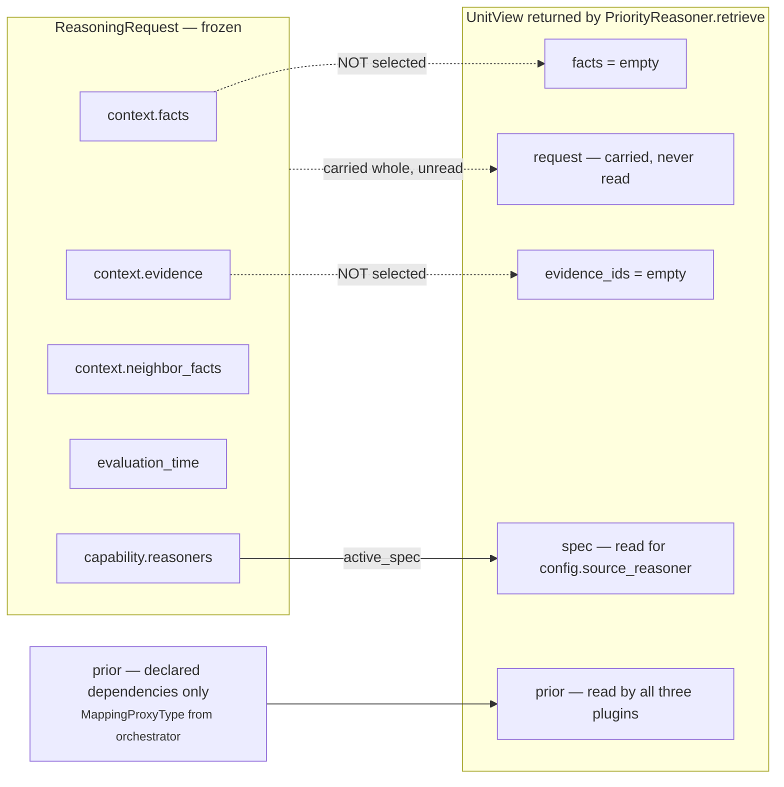

# 02 · Retriever

**Stage 3 of the eight.**
**Source:** `genios_engine/reason/reasoners/priority.py:181` (`PriorityReasoner.retrieve`)
**Base:** `genios_engine/reason/unit.py:190` (`ReasoningUnit.retrieve`)

---

## 1 · What it is for

The Retriever selects the slice of the frozen snapshot this unit is allowed to look at, and shapes
it into a `UnitView`. It does not fetch — no database, no network, no clock. Layer 2 already froze
the `ContextSnapshot` and Layer 4 hashed its content into the request id, so "retrieval" at this
point means *selection over an immutable mapping*, which is the only form of retrieval that can
survive replay.

For `core.priority` the selected slice is **empty**. The unit reads prior results and config, never
a context fact, so the window it declares is nothing at all.

---

## 2 · What exists

```python
# priority.py:181
def retrieve(self, request: ReasoningRequest, spec: ReasonerSpec,
             prior: Mapping[str, ReasonerResult]) -> UnitView:
    """This unit reads prior results and config — never a context fact."""
    return UnitView(request=request, spec=spec, prior=prior)
```

Three arguments in, one object out, no work in between. `UnitView` is a frozen slots dataclass
(`unit.py:110`) whose remaining two fields take their defaults:

| `UnitView` field | Value here | Set by |
|---|---|---|
| `request` | the full `ReasoningRequest` | passed through |
| `spec` | the capability's `ReasonerSpec` for `core.priority` | resolved by `active_spec` in the template method |
| `prior` | the declared-dependency results mapping | passed through, already a `MappingProxyType` from `orchestrator.py:271` |
| `facts` | `{}` | dataclass default — **not** populated |
| `evidence_ids` | `()` | dataclass default — **not** populated |

Two derived accessors come with the view and both are used by this unit's plugins:

| Accessor | Definition | Used by |
|---|---|---|
| `view.config` | `unit.py:124` — returns `self.spec.config` | `priority.py:_source_reasoner` |
| `view.prior_metric(id, name, default)` | `unit.py:128` — status-filtered metric read | **not used** by this unit; see §4.3 |

---

## 3 · How it works — what the base would have done, and why that would be a lie

### 3.1 · The base implementation

```python
# unit.py:190
def retrieve(self, request, spec, prior) -> UnitView:
    wanted = tuple(field for field in spec.required_fields
                   if not field.startswith("neighbor:"))
    facts = {name: request.context.facts[name]
             for name in wanted if name in request.context.facts}
    evidence = tuple(sorted(item.evidence_id for item in request.context.evidence
                            if item.field in facts))
    return UnitView(request=request, spec=spec, prior=prior,
                    facts=MappingProxyType(facts), evidence_ids=evidence)
```

Two effects. It copies the declared root facts into `view.facts`, and — the part that matters here —
it collects the evidence ids of those facts into `view.evidence_ids`. Those ids are not decorative:
`unit.py:build` unions them into the result's `evidence_ids`, and `decision_maker.py:aggregate_evidence`
unions every result's ids into the candidate's evidential basis. **An evidence id on a result is a
claim that this unit's number rests on that row.**

### 3.2 · Why the override

```
The base retriever would select facts and attach their evidence ids to the result.  That
would be a false claim here: no fact was consulted, so no fact evidences the number.  The
window is deliberately empty and the evidence chain stays with the source reasoner that
actually measured something.
```

That is the docstring, verbatim, and it is the entire argument. Consider `sales.deal_cooling` in the
measured run. Suppose `core.priority` had declared `required_fields=("thread.last_inbound",)` and
used the base retriever. The result would carry the evidence id of the last-inbound email — and
`core.priority` never opened that email. It read `core.temporal`'s `urgency_bp` of 9,360.
`core.temporal` already cites that evidence id, on its own result, correctly. `core.priority` citing
it too would double-count the row in `aggregate_evidence` (harmlessly, it is a set union) and, far
worse, would tell an auditor reading the priority result alone that this unit examined a message.

The evidence chain stays where the measurement happened. `test_it_claims_no_fact_evidence` asserts
`result.evidence_ids == ()` even when the request carries both the required field and its
`EvidenceRef`.

### 3.3 · What lands in the view



The `request` object is still on the view, whole. Nothing stops a future plugin from reaching
through `view.request.context.facts`. The discipline is by convention here, exactly as
`unit.py`'s own docstring admits about the template method: the seam holds because every author
respected it.

---

## 4 · The slice that matters: `prior`

The unit's real input window is `view.prior`, and its shape is decided in the orchestrator, not
here.

### 4.1 · Composition

`orchestrator.py:158`:

```python
dependencies = {item: prior[item] for item in spec.dependencies if item in prior}
```

Filtered to declared dependencies, in the order of `spec.dependencies` — which `ReasonerSpec.__post_init__`
(`contracts/reasoning.py:293`) has already sorted and de-duplicated. The mapping is then wrapped in a
`MappingProxyType` at `orchestrator.py:271`.

Iteration order therefore *is* deterministic already. `MaximumUrgencyPlugin` sorts anyway
(`for key in sorted(view.prior)`) and the code says why: not to move the maximum, which is
order-free, but so that a malformed prior reading raises against a deterministic result rather than
against whichever key the runtime mapping yielded first.
`test_prior_result_order_cannot_move_the_derived_maximum` builds the same two priors in both orders
and asserts identical `semantic_hash`.

### 4.2 · What a prior entry can look like

| Status of the dependency | Present in `prior`? | `metrics` |
|---|---|---|
| `COMPLETED` | yes | whatever it published — may be `{}` |
| `SKIPPED` | yes | `{}` — forced empty by `contracts/reasoning.py:629` |
| `FAILED` | yes | `{}` — same rule |
| `INSUFFICIENT_CONTEXT` | yes | `{}` — same rule, plus `missing_fields` populated |
| never scheduled / not in `spec.dependencies` | **no** | — |

The contract rule at `contracts/reasoning.py:629`:

```python
if self.status != ResultStatus.COMPLETED and (
        self.matched is not None or self.metrics or self.findings or self.adjustments
        or self.checks or self.evidence_ids):
    raise ValueError("non-completed reasoner results cannot carry decision effects or evidence")
```

This is the reason `priority.py:_declared_source` does not filter by status — the contract already
did it, and re-checking would be *"a second, divergent definition of the same rule"*.

### 4.3 · Why `view.prior_metric` is not used

The framework offers a status-aware reader:

```python
# unit.py:128
def prior_metric(self, reasoner_id, name, default=0) -> int:
    result = self.prior.get(reasoner_id)
    if result is None or result.status != ResultStatus.COMPLETED:
        return default
    value = result.metrics.get(name, default)
    return default if isinstance(value, bool) or not isinstance(value, int) else value
```

`core.priority` uses none of it, and the omission is deliberate rather than an oversight.
`prior_metric` **silently coerces** a malformed reading to the default. This unit must not: a
non-integer `urgency_bp` is a loud fault, because the number is the one the whole system ranks with.
So the plugins reach into `result.metrics` directly and pass the raw value through
`common.py:integer`, which raises `ValueError` rather than substituting anything.
`test_the_two_implementations_reject_the_same_malformed_readings` pins that the refusal survives.

The second difference: `prior_metric` would return the default `0` for a `SKIPPED` source, whereas
this unit needs the neutral `5,000`. Using it would have quietly reintroduced the exact 5,000-vs-0
confusion the module docstring spends a paragraph separating.

---

## 5 · Examples and edge cases

### 5.1 · Facts and evidence in the snapshot, none in the view

```
required_fields = ("deal.status",)
facts           = {"deal.status": "open"}
evidence        = (EvidenceRef("ev_1", "deal.status", "open"),)
```

| | base `retrieve` would give | this `retrieve` gives |
|---|---|---|
| `view.facts` | `{"deal.status": "open"}` | `{}` |
| `view.evidence_ids` | `("ev_1",)` | `()` |
| result `evidence_ids` | `("ev_1",)` | `()` |

Pinned by `test_it_claims_no_fact_evidence`.

### 5.2 · `sales.deal_cooling`, the measured run

`core.priority` declares `dependencies=("core.temporal", "core.risk", "core.constraint")`. After
those three run:

```
view.prior = {
    "core.temporal":   COMPLETED, metrics={engagement_bp: 4000, drop_bp: 6000,
                                           elapsed_hours: 240, urgency_bp: 9360}
    "core.risk":       COMPLETED, metrics={risk_bp: 5934, ...}
    "core.constraint": COMPLETED, metrics={...}, checks=(...)
}
view.config     = {"source_reasoner": "core.temporal"}
view.facts      = {}
view.evidence_ids = ()
```

`core.temporal`'s reading arithmetic, from `temporal.py:47`:

```
drop_bp    = clamp_bp(10,000 − 4,000)              = 6,000
urgency_bp = clamp_bp(6,000 + min(240, 168) × 20)
           = clamp_bp(6,000 + 168 × 20)
           = clamp_bp(6,000 + 3,360)               = 9,360
```

`core.priority` reads `9,360` off the view and publishes it. It never sees the engagement fact or
the timestamp that produced it, and its result cites neither.

### 5.3 · A dependency that is not declared is invisible

Add `core.impact` to `sales.deal_cooling` and let it run *before* `core.priority` without adding it
to `core.priority`'s `dependencies` tuple. `core.impact` publishes `impact_bp` and no `urgency_bp`.

| | Effect on `core.priority` |
|---|---|
| declared path — `source_reasoner = "core.temporal"` | none. `core.impact` is not the source. |
| derived path — no source declared | **none either**, because `core.impact` is not in `spec.dependencies` and so never enters `prior` |

Now add `"core.impact"` to the `dependencies` tuple, still with no `source_reasoner`. It enters
`prior`, contributes `metrics.get("urgency_bp", 0) → 0` to the readings list, and the maximum is
unchanged if any other prior published something higher. But in a capability whose only dependency
were `core.impact`, urgency would go from `5,000` to `0`. That is the cliff, and it lives in the
manifest's `dependencies` tuple. Detail in [03b](03b-plugin-maximum_urgency.md) §5.

### 5.4 · Empty `prior`

```
view.prior = {}
```

Legal and handled. `_declared_source` returns `None` regardless of config because
`view.prior.get(source)` misses. `MaximumUrgencyPlugin` builds an empty `readings` list and
`max(..., default=NEUTRAL_URGENCY_BP)` yields `5,000`. Nothing raises.

### 5.5 · A malformed config value

`view.config.get("source_reasoner")` is passed through `str(... or "")`, so:

| Config value | `_source_reasoner` returns | Path |
|---|---|---|
| `"core.temporal"` | `"core.temporal"` | declared, if present in `prior` |
| `""` | `""` | derived |
| `None` | `""` | derived |
| key absent | `""` | derived |
| `0`, `False`, `[]`, `{}` | `""` — all falsy | derived |
| `["core.temporal"]` | `"['core.temporal']"` — a truthy nonsense id | declared branch taken, `prior.get` misses, `_declared_source` returns `None`, so **derived** anyway |
| `42` | `"42"` | same as above — derived, by accident |

The last two rows are worth noting: a mistyped `source_reasoner` does not fail loudly. It silently
routes to the derived maximum. There is no validation that the named unit is in `spec.dependencies`
or even in the roster. A capability author who typos `core.temporl` gets a plausible number from a
different mechanism and no warning anywhere. That is a real gap; nothing in the code or the tests
covers it.

---

## Related

- [README](README.md) — the unit's map
- [01 · Input and Validator](01-Input-and-Validator.md) — the other override, and the hole in it
- [03 · Analyzer](03-Analyzer.md) — what the plugins do with `view.prior`
- [06 · Builder and Metrics](06-Builder-and-Metrics.md) — why the result's `evidence_ids` is empty
