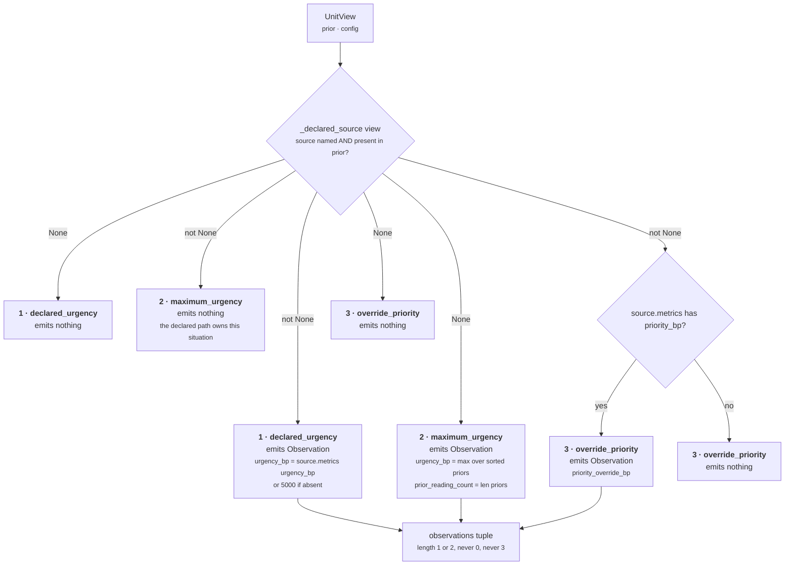
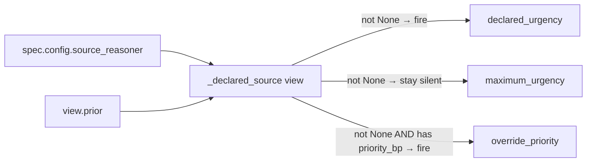

# 03 · Analyzer — the plugin seam

**Stage 4 of the eight.**
**Source:** `genios_engine/reason/reasoners/priority.py:82–162` (three plugin classes), registered at
`priority.py:179`
**Base:** `genios_engine/reason/unit.py:202` (`ReasoningUnit.analyze`) — **not overridden**

---

## 1 · What it is for

The Analyzer is where the intellectual property lives in every other unit: risk is not one algorithm
but time decay *plus* revenue exposure *plus* relationship health, each a small deterministic
contribution that can be tested and versioned alone.

`core.priority` is the case that tests whether the seam survives when there is almost nothing to
decompose. It has three plugins and no arithmetic. What the seam buys here is not modularity of
computation — it is **structural enforcement of mutual exclusion**. Two of the three plugins answer
the same question by different routes, and the framework guarantees that exactly one of them
answers it on any given run.

---

## 2 · What exists

```python
# priority.py:179
plugins = (DeclaredUrgencyPlugin(), MaximumUrgencyPlugin(), DeclaredOverridePlugin())
```

Three instances, constructed once at class-definition time and shared across every evaluation. All
three are stateless — they hold nothing but their `plugin_id` class attribute, and their
`contribute` methods read only from the `UnitView` argument. That is what makes sharing one instance
across concurrent evaluations safe.

| Order run | `plugin_id` | Class | `Observation.kind` | Metrics | Reason code |
|---|---|---|---|---|---|
| 1 | `declared_urgency` | `priority.py:82:DeclaredUrgencyPlugin` | `priority.declared_urgency` | `urgency_bp` | `urgency_from_declared_source` |
| 2 | `maximum_urgency` | `priority.py:105:MaximumUrgencyPlugin` | `priority.maximum_urgency` | `urgency_bp`, `prior_reading_count` | `urgency_from_prior_maximum` |
| 3 | `override_priority` | `priority.py:136:DeclaredOverridePlugin` | `priority.declared_override` | `priority_override_bp` | `priority_override_declared` |

None of them emits `evidence_ids`. Each emits either zero or exactly one `Observation` — none of
them ever emits two.

### 2.1 · The shared accessors

The three plugins do not each re-read config. Two module-level functions sit between them and the
view:

```python
# priority.py:58
def _source_reasoner(view: UnitView) -> str:
    return str(view.config.get("source_reasoner") or "")

# priority.py:68
def _declared_source(view: UnitView) -> ReasonerResult | None:
    source = _source_reasoner(view)
    if not source:
        return None
    return view.prior.get(source)
```

The docstring on `_source_reasoner` states the reason for the indirection:

> *A single accessor so the two urgency plugins can never disagree about which branch they are in —
> they are mutually exclusive by construction, not by coincidence.*

Every branch in all three plugins is a test of `_declared_source(view) is None`. There is exactly one
predicate in this unit, evaluated three times, and it cannot disagree with itself.

---

## 3 · How they compose

### 3.1 · Execution order is alphabetical, not registration order

```python
# unit.py:202
def analyze(self, view: UnitView) -> tuple[Observation, ...]:
    observations: list[Observation] = []
    for plugin in sorted(self.plugins, key=lambda item: item.plugin_id):
        observations.extend(plugin.contribute(view))
    return tuple(observations)
```

Sorted by `plugin_id` *"so the observation order — and therefore every hash downstream of it — is a
property of the unit's composition, not of registration order."*

For this unit the alphabetical order and the registration order happen to coincide:

```
declared_urgency  <  maximum_urgency  <  override_priority
```

`test_plugin_ids_are_unique_and_order_the_analysis_deterministically` asserts that sorted list
literally, with the comment *"Alphabetical plugin order is what makes the declared urgency validate
before the override."*

That coincidence is not luck-proof. Rename `override_priority` to `declared_override` — which would
match its `kind` string, `priority.declared_override`, and its class name, `DeclaredOverridePlugin`
— and it would sort **first**, ahead of `declared_urgency`. A run with both a malformed
`urgency_bp` and a malformed `priority_bp` would then report the override fault, and an operator
would go looking in the wrong place. The `plugin_id` is doing ordering work that its name does not
advertise.

### 3.2 · The composition



The tuple handed to `calculate` therefore has exactly one of two shapes:

| Situation | Observations | Length |
|---|---|---|
| declared path, source published no `priority_bp` | `(priority.declared_urgency,)` | 1 |
| declared path, source published `priority_bp` | `(priority.declared_urgency, priority.declared_override)` | 2 |
| derived path | `(priority.maximum_urgency,)` | 1 |

**Never zero, never three.** The derived path can never produce an override — an aggregate across
units has no single author, so there is nobody whose override it would be.

### 3.3 · The mutual-exclusion guarantee, and why it is enforced rather than assumed

`test_the_two_urgency_plugins_are_mutually_exclusive` runs both urgency plugins against all 17
scenarios and asserts exactly one fires each time:

```python
for _, request_, prior in _scenarios():
    view = _view(request_, prior)
    firing = [plugin.plugin_id for plugin in (DeclaredUrgencyPlugin(), MaximumUrgencyPlugin())
              if plugin.contribute(view)]
    assert len(firing) == 1, firing
```

with the comment *"Exactly one urgency reading must exist, or calculate would have to arbitrate."*

That is the load-bearing sentence. `calculate` (see [04](04-Calculator.md)) is a bare loop:

```python
for observation in observations:
    if "urgency_bp" in observation.metrics:
        metrics["urgency_bp"] = clamp_bp(observation.metrics["urgency_bp"])
```

Last writer wins. If both urgency plugins fired, the published urgency would be
`maximum_urgency`'s — because it sorts second — and the declared source's authoritative reading
would be silently discarded. No error, no reason code, just a different number. The mutual exclusion
is not a nicety; it is what makes a loop with no arbitration correct.

### 3.4 · How the plugins interact

They do not, in the ordinary sense. There is no shared mutable state and no plugin reads another's
`Observation` — `contribute` receives only the `UnitView`. All three coupling relationships run
through `_declared_source`:



`declared_urgency` and `override_priority` are **not** mutually exclusive with each other — they are
positively correlated. Whenever `override_priority` fires, `declared_urgency` has already fired, by
construction: both gate on the same non-`None` result. The reverse is not true.

That correlation is what makes the fault ordering in §3.1 meaningful. On a source whose metrics map
is `{"urgency_bp": "bad", "priority_bp": "also bad"}`, both would raise; alphabetical order decides
that `urgency_bp must be an integer` is the message the operator sees.
`test_a_malformed_urgency_is_reported_before_a_malformed_override` pins exactly that string.

---

## 4 · The `Observation` contract

Every plugin returns `tuple[Observation, ...]`. `Observation.__post_init__` (`unit.py:88`) enforces
three things before the object exists:

```python
for name, value in self.metrics.items():
    if isinstance(value, bool) or not isinstance(value, int):
        raise ValueError(f"observation metric {name} must be an integer")
object.__setattr__(self, "metrics", MappingProxyType(dict(self.metrics)))
object.__setattr__(self, "evidence_ids", tuple(sorted(set(self.evidence_ids))))
object.__setattr__(self, "reason_codes", tuple(sorted(set(self.reason_codes))))
```

**Integers only, and `bool` is not an integer.** This is why the plugins wrap every raw reading in
`common.py:integer` before putting it in the metrics map. `integer` accepts a real `int`, a
`Decimal` whose value is integral, or a string that parses to an integral `Decimal`; it raises
`ValueError(f"{label} must be an integer")` for anything else, including a `float` and including
`True`.

`MaximumUrgencyPlugin` is the one exception — it passes `max(readings, ...)` and `len(readings)`,
both already `int`, having converted each element through `integer` when building `readings`.

**Notably, `Observation` does not validate basis-point range.** A plugin could emit
`urgency_bp = 25_000` and the `Observation` would construct fine. The bound is applied later, by
`clamp_bp` in `calculate`, and again by `clamp_bp` in `unit.py:build`, and finally enforced as a hard
error by `contracts/reasoning.py:_bp` at `ReasonerResult` construction. In practice the prior
results these plugins read from have already been through that same `_bp` check, so an out-of-range
reading cannot actually arrive. See [04 · Calculator](04-Calculator.md) §4.

---

## 5 · Examples

### 5.1 · `sales.deal_cooling` — declared, no override

```
config = {"source_reasoner": "core.temporal"}
prior  = {"core.temporal": COMPLETED metrics={drop_bp: 6000, elapsed_hours: 240, urgency_bp: 9360},
          "core.risk":     COMPLETED metrics={risk_bp: 5934},
          "core.constraint": COMPLETED metrics={}}
```

| Plugin | Fires? | Why |
|---|---|---|
| `declared_urgency` | **yes** | `_declared_source` → the `core.temporal` result. `metrics["urgency_bp"] = 9360` |
| `maximum_urgency` | no | `_declared_source(view) is not None` → returns `()` at `priority.py:121` |
| `override_priority` | no | `metrics.get("priority_bp")` is `None` → returns `()` at `priority.py:156` |

```
observations = (Observation(plugin_id="declared_urgency",
                            kind="priority.declared_urgency",
                            metrics={"urgency_bp": 9360},
                            reason_codes=("urgency_from_declared_source",)),)
```

Note that `core.risk`'s `risk_bp` of 5,934 is present in `prior` and completely ignored. On the
declared path, only one entry in the mapping is ever read.

### 5.2 · A legacy capability — declared, with override

```
config = {"source_reasoner": "legacy.rule"}
prior  = {"legacy.rule": COMPLETED metrics={legacy_score: 78, priority_bp: 7800,
                                            confidence_bp: 6200, urgency_bp: 6400,
                                            impact_bp: 8100, recency_bp: 4400,
                                            legacy_terms_bp: 7100},
          "core.constraint": COMPLETED metrics={}}
```

| Plugin | Fires? | Emits |
|---|---|---|
| `declared_urgency` | yes | `urgency_bp = 6,400` |
| `maximum_urgency` | no | — |
| `override_priority` | **yes** | `priority_override_bp = 7,800` |

Two observations, in that order. `legacy.rule`'s `priority_bp` is `score * 100` where `score` is the
legacy 0–100 rule score, so `78 → 7,800`. Both readings come from the *same* prior result;
`impact_bp = 8,100` sits right next to them and is ignored, because this unit is not the impact
authority.

### 5.3 · Derived — no source declared

```
config = {}
prior  = {"core.temporal": COMPLETED metrics={urgency_bp: 2000},
          "core.risk":     COMPLETED metrics={urgency_bp: 8400},
          "core.impact":   COMPLETED metrics={impact_bp: 9000}}
```

| Plugin | Fires? | Emits |
|---|---|---|
| `declared_urgency` | no | `_declared_source` → `None` because `_source_reasoner` → `""` |
| `maximum_urgency` | **yes** | `urgency_bp = 8,400`, `prior_reading_count = 3` |
| `override_priority` | no | `_declared_source` → `None` |

The readings list, built over `sorted(view.prior)` = `["core.impact", "core.risk", "core.temporal"]`:

```
core.impact   → metrics.get("urgency_bp", 0) → 0        # ran, no time pressure to report
core.risk     → 8,400
core.temporal → 2,000
max([0, 8400, 2000])                          = 8,400
prior_reading_count = 3
```

Pinned by `test_maximum_urgency_takes_the_loudest_prior_reading`.

### 5.4 · Both faults at once

```
config = {"source_reasoner": "core.temporal"}
prior  = {"core.temporal": metrics={"urgency_bp": "bad", "priority_bp": "also bad"}}
```

`declared_urgency` runs first and calls `integer("bad", "urgency_bp")`. `Decimal("bad")` raises
`InvalidOperation`, caught and re-raised as `ValueError("urgency_bp must be an integer")`. The
exception propagates out of `analyze`, out of `evaluate`, and — under the orchestrator — is caught at
`orchestrator.py:290` and becomes:

```
status      = FAILED
reason_codes = ("reasoner_failure",)
diagnostics  = {"exception_type": "ValueError", "message": "urgency_bp must be an integer"}
```

`override_priority` never runs. That is the point of the ordering.

### 5.5 · A `Decimal` reading

`test_declared_urgency_accepts_the_integer_forms_the_contract_allows` sets
`metrics = {"urgency_bp": Decimal("6100")}` and asserts the observation carries `6_100` as a plain
`int`. `common.py:integer` takes the `Decimal` branch: `value == value.to_integral_value()` holds, so
`int(value)` is returned and `Observation.__post_init__`'s integer check passes.

This branch is **unreachable through the contract**. `contracts/reasoning.py:_bp` rejects a `Decimal`
with `TypeError` at `ReasonerResult` construction, so no upstream unit can hand a `Decimal` down. The
test reaches it with `object.__setattr__`, bypassing `__post_init__` deliberately. The tolerance is
kept because it is what makes the migrated unit hash-identical to the frozen legacy implementation,
which used the same helper.

---

## Related

- [README](README.md) — the unit's map
- [03a · `declared_urgency`](03a-plugin-declared_urgency.md)
- [03b · `maximum_urgency`](03b-plugin-maximum_urgency.md)
- [03c · `override_priority`](03c-plugin-override_priority.md)
- [04 · Calculator](04-Calculator.md) — why the loop needs no arbitration
