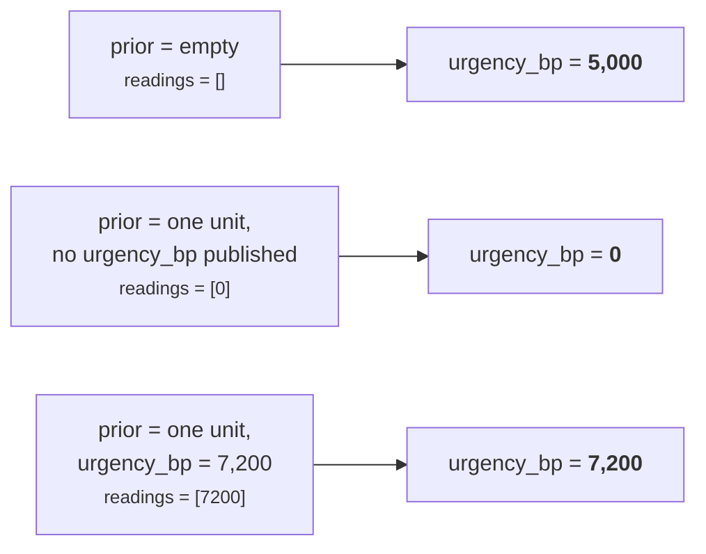

# 03b · Plugin `maximum_urgency`

**Class:** `genios_engine/reason/reasoners/priority.py:105` — `MaximumUrgencyPlugin`
**`plugin_id`:** `maximum_urgency` · runs **second** (alphabetical)
**`Observation.kind`:** `priority.maximum_urgency`
**Emits:** `urgency_bp`, `prior_reading_count` · **Reason code:** `urgency_from_prior_maximum`

---

## 1 · The claim it makes

> *Nobody told me which unit to believe, so I will believe the loudest one. Here is the highest
> urgency any unit I was allowed to see reported.*

The **derived** path. It runs when the capability author did not name a source — or named one that
did not turn up.

Two arguments in the class docstring, and both are about the shape of the aggregation rather than
its value.

**Maximum, not mean:**

> *Urgency is a claim that something is about to be lost, and a claim like that is not weakened by
> other units having nothing to say. Averaging would let a quiet relationship reading dilute a deal
> that is one day from close.*

**A silent prior contributes 0, not nothing:**

> *A prior unit that ran and published no `urgency_bp` contributes 0 rather than being skipped — it
> was in scope and reported no time pressure, which is information. Only the case of no prior results
> at all falls back to the neutral midpoint.*

---

## 2 · The code

```python
# priority.py:105
class MaximumUrgencyPlugin:
    plugin_id = "maximum_urgency"

    def contribute(self, view: UnitView) -> tuple[Observation, ...]:
        if _declared_source(view) is not None:
            return ()                       # the declared path owns this situation
        readings = [integer(view.prior[key].metrics.get("urgency_bp", 0), "urgency_bp")
                    for key in sorted(view.prior)]
        return (Observation(
            plugin_id=self.plugin_id,
            kind="priority.maximum_urgency",
            metrics={"urgency_bp": max(readings, default=NEUTRAL_URGENCY_BP),
                     "prior_reading_count": len(readings)},
            reason_codes=("urgency_from_prior_maximum",),
        ),)
```

Eleven lines. One guard, one comprehension, one `max`.

---

## 3 · Config

**None.** This plugin reads no config key of its own. It reads `source_reasoner` only through
`_declared_source`, and only to decide whether to stay out of the way. Its behaviour is entirely a
function of `spec.dependencies` — which units enter `view.prior` — and what those units published.

That is worth stating explicitly, because it makes the tuning surface for this path invisible: an
engineer looking for the knob that controls derived urgency will not find one in `config`. The knob
is the `dependencies` tuple, three lines up in the same `ReasonerSpec`.

---

## 4 · The arithmetic

```
if _declared_source(view) is not None:
    → silent

readings = [ integer(prior[k].metrics.get("urgency_bp", 0), "urgency_bp")
             for k in sorted(prior) ]

urgency_bp          = max(readings, default=5_000)
prior_reading_count = len(readings)
```

Three details, each doing work.

### 4.1 · `.get("urgency_bp", 0)` — the default is 0, inside the list

Every key in `prior` produces a reading. A unit that published no `urgency_bp` produces `0` and that
`0` competes in the `max`. Since `max` over non-negative integers is monotone, a `0` can never lower
the result — it can only fail to raise it. So the `0` is inert *except* in the one case where it is
the only reading, which is precisely where the cliff lives (§5).

### 4.2 · `default=NEUTRAL_URGENCY_BP` — on the `max`, not on the `get`

`max(readings, default=5_000)` applies **only when `readings` is empty**, which happens only when
`view.prior` is empty. This is the entire mechanism behind the module docstring's third rule:

```
prior = {}                         → readings = []      → max default → 5,000   "no information"
prior = {one unit, no urgency_bp}  → readings = [0]     → max([0])    → 0       "asked, answered no"
```

`test_maximum_urgency_is_neutral_only_when_nothing_ran` asserts both lines, with the comment
*"No priors at all is ignorance (neutral); priors that ran and said nothing is a real zero."*

### 4.3 · `sorted(view.prior)` — order-free, but not pointless

`max` is order-free, so sorting cannot move the published number. The inline comment says why it is
there anyway:

> *Sorted so that a malformed prior reading raises against a deterministic result rather than against
> whichever key the runtime mapping happened to yield first. The maximum itself is order-free, so
> sorting cannot move the published number.*

With two malformed priors, the sorted order decides which `ValueError` an operator sees. The message
is the same string for both (`"urgency_bp must be an integer"`), so the visible difference is nil
today — but the *trace* records which reasoner was mid-read via the raise site, and the guarantee is
that it will be the same one on every replay of the same run.

`test_prior_result_order_cannot_move_the_derived_maximum` builds the same two priors in both
insertion orders and asserts identical `semantic_hash`.

### 4.4 · `prior_reading_count` — emitted and then discarded

`len(readings)` counts every prior entry, including those that contributed `0`. It is the only
diagnostic in the entire unit that would let a reader distinguish `urgency_bp = 0` "one silent
prior" from `urgency_bp = 0` "four units all reporting genuine zero".

It never leaves the unit. `calculate` copies only `urgency_bp` and `priority_override_bp`, and the
`publishes` guard at `unit.py:256` would reject it if `calculate` tried — `prior_reading_count` is
not in `publishes = ("urgency_bp", "priority_override_bp")`, and adding it would break
`test_it_declares_the_two_reserved_metrics_and_nothing_else`. So the metric exists for the duration
of one function call and is then dropped on the floor. It is testable in isolation
(`test_maximum_urgency_takes_the_loudest_prior_reading` asserts it directly on the `Observation`) and
invisible in production.

---

## 5 · The 5,000-versus-0 cliff

This is the unit's most consequential live behaviour, and it is pinned by a test rather than fixed.



| Capability shape, with no `source_reasoner` declared | Published `urgency_bp` |
|---|---|
| `core.priority` declares no `dependencies` | **5,000** |
| declares one dependency that publishes no `urgency_bp` | **0** |
| declares one dependency reporting 7,200bp | 7,200 |

**What the step is a function of.** Not the capability's roster — one tuple in one `ReasonerSpec`.
`orchestrator.py:158` filters `prior` to `spec.dependencies`:

```python
dependencies = {item: prior[item] for item in spec.dependencies if item in prior}
```

So adding a unit to the capability changes nothing here unless it is *also* added to
`core.priority`'s own `dependencies` tuple. That is a smaller blast radius than it first appears,
but it is not small. `dependencies` is
routinely widened for scheduling reasons — you add a unit to the tuple to force it to run first —
and doing so silently re-scores the capability. In `sales.deal_cooling`, urgency carries weight 20 of
100, so a 5,000 → 0 move costs `5,000 × 20 = 100,000` weighted points, which after
`divide_half_up(·, 100)` is **1,000bp off every candidate's utility**. That is enough to reorder a
ranking.

**Why it has not bitten.** All three shipped capabilities declare a `source_reasoner`, so none of
them is on the derived path at all. The cliff is reachable only by a capability that omits the config
key — and there is currently none.

**Why it was not fixed.** The migration's absolute constraint was byte-identical `semantic_hash`
against `_LegacyPriorityReasoner`, whose expression was:

```python
urgency = max((integer(result.metrics.get("urgency_bp", 0), "urgency_bp")
               for result in prior_results.values()), default=5_000)
```

Structurally the same, including the `default=` placement. Changing the cliff would have changed the
hash for the "no config, priors without any urgency" scenario and broken stored replay.

---

## 6 · When it stays silent

**One condition:** `_declared_source(view) is not None` — a source was named *and* it is present in
`prior`. Then it returns `()` immediately, before touching `prior`.

That is the *only* silence. Everything else produces an `Observation`:

| `view.prior` | Fires? | `urgency_bp` | `prior_reading_count` |
|---|---|---|---|
| `{}` | **yes** | 5,000 | 0 |
| one unit, no `urgency_bp` | **yes** | 0 | 1 |
| three units, mixed | **yes** | the maximum | 3 |
| any, but a declared source is present | **no** | — | — |

The unit as a whole is therefore never silent on `urgency_bp` — between this plugin and
`declared_urgency`, exactly one always fires. See [03 · Analyzer](03-Analyzer.md) §3.3.

---

## 7 · Worked examples

### 7.1 · Three priors, one without a reading

```
config = {}
prior  = {"core.temporal": COMPLETED metrics={"urgency_bp": 2000},
          "core.risk":     COMPLETED metrics={"urgency_bp": 8400},
          "core.impact":   COMPLETED metrics={"impact_bp": 9000}}
```

```
_declared_source(view)                    → None      (source_reasoner absent → "")
sorted(view.prior) = ["core.impact", "core.risk", "core.temporal"]

  core.impact    metrics.get("urgency_bp", 0) → 0        # ran, reported no time pressure
  core.risk      metrics.get("urgency_bp", 0) → 8,400
  core.temporal  metrics.get("urgency_bp", 0) → 2,000

readings            = [0, 8400, 2000]
urgency_bp          = max([0, 8400, 2000])  = 8,400
prior_reading_count = len([0, 8400, 2000])  = 3
```

```
Observation(plugin_id="maximum_urgency",
            kind="priority.maximum_urgency",
            metrics={"urgency_bp": 8400, "prior_reading_count": 3},
            evidence_ids=(),
            reason_codes=("urgency_from_prior_maximum",))
```

Note what the mean would have given: `divide_half_up(0 + 8400 + 2000, 3) = divide_half_up(10400, 3) = 3467`.
The deal one day from close would have been scored at 3,467bp of urgency instead of 8,400bp, because
two units that were not asked about the deal's timing happened to have nothing to say. That is the
argument for `max` in one number.

Pinned by `test_maximum_urgency_takes_the_loudest_prior_reading`.

### 7.2 · The two ends of the cliff, side by side

```
A: prior = {}
   readings = []
   urgency_bp = max([], default=5_000) = 5,000
   prior_reading_count = 0

B: prior = {"core.impact": COMPLETED metrics={"impact_bp": 9000}}
   readings = [0]
   urgency_bp = max([0], default=5_000) = 0        # the default never applies
   prior_reading_count = 1
```

One unit added to `dependencies`, one metric it never publishes, and urgency moves 5,000bp — half the
scale. Both lines are asserted in `test_maximum_urgency_is_neutral_only_when_nothing_ran`.

### 7.3 · A declared source is present — silent

```
config = {"source_reasoner": "core.temporal"}
prior  = {"core.temporal": COMPLETED metrics={"urgency_bp": 1000},
          "core.risk":     COMPLETED metrics={"urgency_bp": 9900}}
```

```
_declared_source(view) → the core.temporal result, not None
→ return ()
```

Published urgency is `declared_urgency`'s `1,000`, **not** the maximum `9,900`. The capability said
`core.temporal` is what urgency means here; `core.risk` reporting a louder number does not overrule
that. `test_maximum_urgency_yields_to_the_declared_source` pins the silence.

This is the case that makes "maximum" and "declared" genuinely different policies rather than
different names for the same thing.

### 7.4 · Empty `source_reasoner` — the derived path, deliberately

```
config = {"source_reasoner": ""}       # or None
prior  = {"core.risk": COMPLETED metrics={"urgency_bp": 2500}}
```

`_source_reasoner` → `str("" or "")` → `""`, falsy, so `_declared_source` short-circuits to `None`
without ever touching `prior`. This plugin fires: `readings = [2500]`, `urgency_bp = 2,500`,
`prior_reading_count = 1`.

Both `""` and `None` are covered as separate scenarios in `_scenarios()` and both are in the
hash-parity parametrisation, because a capability whose config round-trips through JSON can turn an
absent key into an explicit `null`.

### 7.5 · Every prior at zero

```
config = {}
prior  = {"core.temporal": COMPLETED metrics={"urgency_bp": 0},
          "core.risk":     COMPLETED metrics={"urgency_bp": 0}}
```

```
readings   = [0, 0]
urgency_bp = 0
prior_reading_count = 2
```

Published `0` — a genuine, unanimous "no time pressure". Downstream this contributes
`0 × 20 = 0` weighted points to every candidate's utility, which after the `effort` and `risk`
inversions still leaves a rankable field. Scenario `"boundary: zero across every prior on the derived
path"`.

### 7.6 · A malformed prior reading

```
config = {}
prior  = {"core.alpha": metrics={"urgency_bp": 7000},
          "core.zulu":  metrics={"urgency_bp": "bad"}}
```

`sorted(view.prior)` = `["core.alpha", "core.zulu"]`. The comprehension reads `core.alpha` first
(`7000`, fine), then `core.zulu`, where `integer("bad", "urgency_bp")` raises
`ValueError("urgency_bp must be an integer")`. No `Observation` is built; the exception leaves
`analyze` and, under the orchestrator, becomes a `FAILED` result with
`diagnostics={"exception_type": "ValueError", "message": "urgency_bp must be an integer"}`.

Reverse the insertion order and the *same* reasoner raises, because the sort is on keys. That is the
whole value of the `sorted()`.

---

## Related

- [03 · Analyzer](03-Analyzer.md) — mutual exclusion, and why `calculate` needs no arbitration
- [03a · `declared_urgency`](03a-plugin-declared_urgency.md) — the branch that excludes this one
- [04 · Calculator](04-Calculator.md) — where `prior_reading_count` is dropped
- [06 · Builder and Metrics](06-Builder-and-Metrics.md) — the audit gap this plugin's discarded metrics leave
