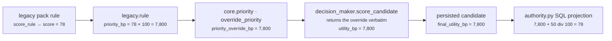
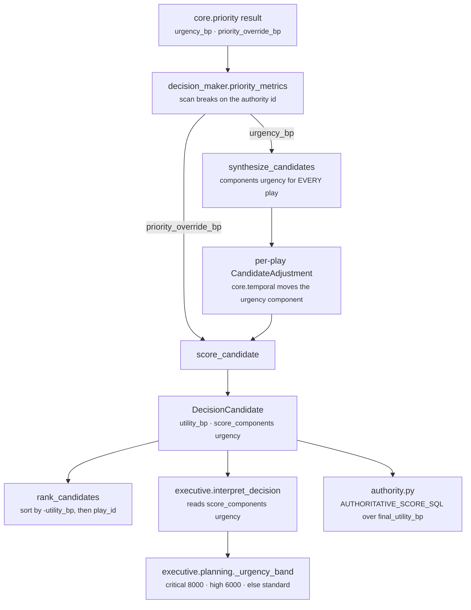

# 06 · Builder and Metrics

**Stages 7 and 8 of the eight.**
**Builder:** `genios_engine/reason/unit.py:223` (`ReasoningUnit.build`) — **not overridden**
**Metrics:** `genios_engine/reason/reasoners/priority.py:178` (`publishes`)

---

## 1 · What they are for

The Builder assembles the one object shape every unit returns, so seventeen units produce one type
and no consumer has to know which unit it is reading. The Metrics stage is the `publishes` class
attribute — a **declaration** rather than a discovery — and the guard that enforces it.

For `core.priority` this is the stage where two reserved names leave the unit and become the numbers
every ranked decision in GeniOS is built on.

---

## 2 · `build()` — the base implementation, unchanged

`core.priority` does **not** override `build`. It uses `unit.py:223` as written:

```python
def build(self, view: UnitView, verdict: Verdict,
          observations: Sequence[Observation]) -> ReasonerResult:
    evidence = set(view.evidence_ids)
    for observation in observations:
        evidence.update(observation.evidence_ids)
    return ReasonerResult(
        reasoner_id=self.unit_id,
        reasoner_version=self.version,
        status=ResultStatus.COMPLETED,
        matched=verdict.matched,
        metrics={name: clamp_bp(value) if name.endswith("_bp") else value
                 for name, value in verdict.metrics.items()},
        findings=verdict.findings,
        adjustments=verdict.adjustments,
        checks=verdict.checks,
        evidence_ids=tuple(sorted(evidence)),
        reason_codes=verdict.reason_codes,
    )
```

Three things the base does on this unit's behalf:

**It hardcodes `status=ResultStatus.COMPLETED`.** A framework unit that reaches `build` has already
survived `validate`, so a unit can never report `FAILED` or `SKIPPED` from inside itself.
`orchestrator.py:211` explicitly rejects a self-declared `SKIPPED` — *"Reasoner implementations may
not silently skip themselves"* — turning it into a `FAILED` with `reason_codes=("reasoner_returned_skipped",)`.
For `core.priority`, which has no way to fail short of an exception, `COMPLETED` is the only status
it ever carries.

**It stamps identity from the class, not from the spec.** `reasoner_id=self.unit_id = "core.priority"`
and `reasoner_version=self.version = "1.0.0"`. `orchestrator.py:274` then re-checks that pair against
the capability's `ReasonerSpec` and raises `"reasoner result identity does not match capability spec"`
if they diverge. That is why the version is frozen: all three shipped manifests declare
`ReasonerSpec("core.priority", "1.0.0")`, and bumping the class attribute would fail registry
resolution at deploy time rather than at test time.
`test_identity_is_frozen` pins `unit_id`, `version`, `spec`, `category`, and asserts the unit
satisfies both the `ReasoningUnit` base and the bare `protocols.py:Reasoner` protocol.

**It clamps `_bp` metrics again.** The third clamp on the same value — see
[04 · Calculator](04-Calculator.md) §4. Both `urgency_bp` and `priority_override_bp` end in `_bp`, so
both pass through it; neither can be moved by it.

**Why no override.** `core.confidence` is the one unit in the roster that overrides `build`, and it
does so to smuggle `completeness_bp` past the `publishes` guard. `core.priority` has nothing to
smuggle: its two metrics are exactly its two declared names, and the base assembly is correct for it
line for line.

---

## 3 · What the `ReasonerResult` carries

```
ReasonerResult(
    reasoner_id      = "core.priority"
    reasoner_version = "1.0.0"
    status           = ResultStatus.COMPLETED
    matched          = None                              # always
    metrics          = {"urgency_bp": …}                 # plus "priority_override_bp" iff overridden
    findings         = (Finding("priority.inputs", "priority", metrics=<same>,
                                reason_codes=("priority_inputs_ready",)),)
    adjustments      = ()                                # always
    checks           = ()                                # always
    evidence_ids     = ()                                # always
    missing_fields   = ()                                # always
    reason_codes     = ("priority_inputs_ready",)        # always
    diagnostics      = {}                                # always
)
```

`test_the_result_analyses_and_does_not_decide` asserts `status`, `matched`, `adjustments`, `checks`,
`reason_codes` and `metrics` together for a two-metric run.

### 3.1 · Evidence attachment: deliberately empty

`build` unions two sources and both are empty for this unit:

| Source | Value | Why |
|---|---|---|
| `view.evidence_ids` | `()` | the overridden `retrieve` never populates it — see [02](02-Retriever.md) §3.2 |
| every `observation.evidence_ids` | `()` | none of the three plugins constructs an `Observation` with evidence ids |

So `evidence_ids = ()` on every run, unconditionally.
`test_it_claims_no_fact_evidence` asserts it even when the request carries a matching
`EvidenceRef`, with the comment *"The number was measured by the source reasoner; attaching a fact's
evidence id here would be a false chain of custody."*

**This does not weaken the decision's evidence.** `decision_maker.py:aggregate_evidence` unions
across *every* result in the run:

```python
tuple(sorted(set(
    evidence_id
    for result in results
    for evidence_id in (result.evidence_ids
                        + tuple(ev for f in result.findings for ev in f.evidence_ids)
                        + tuple(ev for a in result.adjustments for ev in a.evidence_ids)))))
```

In `sales.deal_cooling`, `core.temporal` already cites the engagement fact and the last-inbound
timestamp on its own result, and its `CandidateAdjustment`s carry the same ids again. The rows reach
the candidate. `core.priority` abstaining costs the candidate nothing and buys the audit trail an
honest statement: this unit read no fact.

`guards.py:validate_evidence_references` re-checks at the orchestrator boundary that no result cites
an id absent from the snapshot. An empty tuple passes trivially.

---

## 4 · The audit gap

The result above is missing three things the unit knew and threw away.

| Discarded | Where it existed | Where it died |
|---|---|---|
| `urgency_from_declared_source` / `urgency_from_prior_maximum` | `Observation.reason_codes` | `evaluate_meaning` sets `Verdict.reason_codes = finding.reason_codes` and never reads `observations` |
| `priority_override_declared` | `Observation.reason_codes` | same |
| `prior_reading_count` | `Observation.metrics` on the derived path | `calculate` copies only the two published names; the `publishes` guard would reject it anyway |

### 4.1 · What that costs

**The persisted result does not say which path produced it.** These four runs are
byte-for-byte identical in the audit store:

| Run | `urgency_bp` | Cause |
|---|---|---|
| A | 5,000 | no priors at all — the unit had no information |
| B | 5,000 | declared source ran and published no `urgency_bp` |
| C | 5,000 | declared source was `SKIPPED` |
| D | 5,000 | derived maximum across priors that happened to peak at 5,000 |

Their `semantic_hash` values are the same. A, B and C are the three ways the neutral midpoint is
reached, and the module docstring spends a paragraph distinguishing A from a nearby case that
produces `0` — yet the distinction it defends is invisible the moment the result is written down.
An engineer debugging *"why did this deal score low on urgency"* has to reconstruct the branch from
the capability manifest and the sibling results, and if the source was skipped that reconstruction is
itself ambiguous.

The same applies to the branch: nothing in the result distinguishes *"the capability author named
`core.temporal` and I believed it"* from *"nobody named anything and this was the loudest number in
the room"*.

### 4.2 · Why it is like this

Adding the plugin reason codes would be one line:

```python
return Verdict(metrics=dict(metrics), findings=(finding,),
               reason_codes=finding.reason_codes
                            + tuple(c for o in observations for c in o.reason_codes))
```

It was not done because `reason_codes` is inside `ReasonerResult.to_semantic_dict` and therefore
inside `semantic_hash`. The migration's absolute constraint was byte-identical hashes against
`_LegacyPriorityReasoner`, and the frozen legacy implementation emitted only
`("priority_inputs_ready",)`. A changed hash breaks stored replay and the legacy-parity ratchet.

So this is a **cost of the migration, not a design position** — and nothing in `priority.py` says so.
That silence is the actual defect: a future reader will assume the single reason code was chosen, and
will not know the cheap fix is available the moment hash parity is retired.

---

## 5 · The `publishes` declaration

```python
# priority.py:178
publishes = ("urgency_bp", "priority_override_bp")
```

| Metric | Range | Meaning | Present when |
|---|---|---|---|
| `urgency_bp` | 0–10,000 integer basis points; `7,500bp` means 0.75 | How much the clock matters, sourced from another unit. `0` = no time pressure; `5,000` = no information; `10,000` = maximal | **always** |
| `priority_override_bp` | 0–10,000 | An explicit priority the declared source already resolved, carried through intact. `0` = a live instruction to deprioritise | **only** when the declared source published `priority_bp` |

### 5.1 · The reservation, and how it is enforced

Three metrics in the whole system are resolved through a named authority; this unit owns two of
them.

```python
# decision_maker.py:57
PRIORITY_AUTHORITY = "core.priority"
PRIORITY_AUTHORITY_KEY = "priority_authority"
```

| Enforcement | Where |
|---|---|
| No other unit may declare either name | `tests/test_unit_roster.py:28` — `RESERVED = ("confidence_bp", "urgency_bp", "priority_override_bp")`, parametrised over the roster |
| This unit declares exactly these two | `test_it_declares_the_two_reserved_metrics_and_nothing_else` |
| This unit's id **is** the authority constant | `test_identity_is_frozen`: `unit.unit_id == "core.priority" == PRIORITY_AUTHORITY` |
| A `Verdict` carrying anything else is refused before a result exists | `unit.py:256` |
| Divergent readings of these names are never flagged as contradictions | `validation_unit.py:74` — `AUTHORITY_RESOLVED_METRICS` excludes all three from `core.validation`'s divergence check |

That last row is easy to miss and load-bearing. `core.validation` reports a contradiction when two
units publish readings of the same `_bp` metric that differ by `contradiction_gap_bp` or more. The
authority-resolved trio is exempt, because `core.temporal` publishing `urgency_bp = 9,360` and
`core.priority` publishing `urgency_bp = 9,360` is *the system working as designed*, and flagging it
would report correct behaviour as a fault and drown the genuine contradictions in noise.

The authority is per-capability overridable via `capability.metadata["priority_authority"]`.
`decision_maker.py:_authority` refuses a non-string or blank value with an `OrchestrationError`
rather than silently falling back. **No shipped capability sets the key**; all three run on the
constant.

### 5.2 · The name asymmetry, and the evidence it is deliberate

The unit reads `priority_bp` and publishes `priority_override_bp`. Neither the code nor a test
explains the rename. Here is the chain that does.



`authority.py:AUTHORITATIVE_SCORE_SQL`:

```sql
((selected_rc.final_utility_bp + 50) / 100)
```

**78 in, 78 out.** The legacy 0–100 score survives a round trip through Layer 4's basis-point world
and comes back unchanged, and it only does so because the override bypasses the weighted formula
entirely. Without it, the same rule's single play — which takes every `PlayDefinition` scoring
default of `5,000bp` — would have scored:

```
weighted = 5,000×35 + 5,000×30 + 6,400×20 + (10,000−5,000)×10 + (10,000−5,000)×5
         = 175,000 + 150,000 + 128,000 + 50,000 + 25,000  =  528,000
utility  = (528,000 + 50) // 100                          =  5,280bp
projected score = (5,280 + 50) // 100                     =  53
```

Every legacy signal in the product would have shifted from 78 to 53. The rename is what lets the
strangler capability preserve legacy semantics exactly, and it is a **legacy bridge**, not a typo.

The remaining defect is documentation, not behaviour: nothing in `priority.py`,
`legacy_rule.py` or `legacy_pack.py` states this, so the question stays open in
`Rohit_Updates/Layer 4.md` Part 4 and the plugin's own docstring argues only the general case.

**"Inert in production" is true of two capabilities, not of the system.** Neither `core.temporal`
(`sales.deal_cooling`) nor `core.signal_composition` (`sales.deal_health`) publishes `priority_bp`,
so in those two the override never fires. But `runner.py:449` compiles every legacy pack rule
through `legacy_capability_manifest`, which names `legacy.rule` as `source_reasoner`
(`legacy_pack.py:83`), and `legacy.rule` publishes `priority_bp` on every match. The override path
carries the entire legacy rule corpus. `../README.md` §3.6(a) is written to agree with this; if the
two ever diverge, the code above is the arbiter.

---

## 6 · Who consumes these metrics



### 6.1 · `decision_maker.py:priority_metrics` — the resolution scan

```python
# decision_maker.py:150
authority = _authority(request, PRIORITY_AUTHORITY_KEY, PRIORITY_AUTHORITY)
urgency = 5_000
override = None
for result in results:
    if result.status != ResultStatus.COMPLETED:
        continue
    if "urgency_bp" in result.metrics:
        urgency = clamp_bp(int(result.metrics["urgency_bp"]))
    if result.reasoner_id == authority:
        if "priority_override_bp" in result.metrics:
            override = clamp_bp(int(result.metrics["priority_override_bp"]))
        break
return urgency, override
```

Three properties, none obvious from the shape:

1. **`urgency_bp` is read from anyone up to and including the authority.** `core.temporal` publishes
   it too, and its value sets `urgency` when the loop reaches it. The authority then overwrites it in
   the same iteration before breaking. In `sales.deal_cooling` those are the same number, so the
   overwrite is invisible — but it is what makes the authority authoritative.
2. **`priority_override_bp` is read *only* from the authority.** The docstring: *"An override
   replaces the weighted utility outright, so it is read only from the priority authority — a unit
   cannot seize ranking control by emitting the metric opportunistically."* This is the Decision
   Maker's half of the agreement that `override_priority` keeps from the other side by never firing
   on the derived path.
3. **If `core.priority` does not complete, the `break` never fires** and the last upstream publisher
   wins the urgency. That is the failure mode `PriorityReasoner.validate`'s no-op exists to prevent —
   and the one the orchestrator's pre-check can still cause. See
   [01 · Input and Validator](01-Input-and-Validator.md) §4.3.

### 6.2 · `synthesize_candidates` and `score_candidate`

`urgency_bp` seeds **every** play's urgency component (`decision_maker.py:215`), then per-play
adjustments move it and `clamp_bp` bounds it. `score_candidate` (`decision_maker.py:231`):

```python
if priority_override is not None:
    return priority_override
weighted = (components["impact"]  * weights["impact"]
          + components["success"] * weights["success"]
          + components["urgency"] * weights["urgency"]
          + (10_000 - components["effort"]) * weights["effort"]
          + (10_000 - components["risk"])   * weights["risk"])
return clamp_bp(divide_half_up(weighted, 100))
```

### 6.3 · Worked end to end — `sales.deal_cooling`, `clarify_next_step`

The measured run publishes `urgency_bp = 9,360` and no override.

```
Seed from core.priority                                     urgency = 9,360

core.temporal adjustment  clarify_next_step urgency +500    deal_cooling.py:149
  urgency = clamp_bp(9,360 + 500)                                   =  9,860

core.risk mitigation      clarify_next_step risk  −1,200    deal_cooling.py:186
  risk    = clamp_bp(700 − 1,200)                                   =      0

Play scoring floor        deal_cooling.py:321-324
  impact = 6,500   success = 6,000   effort = 1,500

ranking_weights           impact 35 · success 30 · urgency 20 · effort 10 · risk 5

weighted =  6,500 × 35                =  227,500
         +  6,000 × 30                =  180,000
         +  9,860 × 20                =  197,200
         + (10,000 −  1,500) × 10     =   85,000
         + (10,000 −      0) ×  5     =   50,000
                                       ---------
                                          739,700

utility_bp = divide_half_up(739,700, 100) = (739,700 + 50) // 100  =  7,397bp
```

`7,397bp` is the winning candidate's utility in the category README's measured run. **Of that,
`197,200` weighted points — 1,972bp of the 7,397 — came from `core.priority`'s reading plus its
per-play adjustment.** Roughly one quarter of the winning score traces back to this unit's one
published number.

**The ceiling case.** `restore_momentum` gets `+1,200` urgency from the same adjustment:

```
urgency = clamp_bp(9,360 + 1,200) = clamp_bp(10,560) = 10,000
```

560bp of the authored adjustment is absorbed by the ceiling, silently. Nothing records the loss — no
reason code, no diagnostic. At a lower seed the same `+1,200` would have moved the candidate a full
`1,200 × 20 = 24,000` weighted points (240bp of utility); at 9,360 it moves `640 × 20 = 12,800`
(128bp). The adjustment's effect depends on this unit's output in a way the capability author cannot
see when writing it.

### 6.4 · Layer 5 — the urgency band

`executive/interpret.py:354`:

```python
urgency_bp = int(candidate.score_components.get("urgency", candidate.utility_bp))
```

It reads the **adjusted** component off the candidate, not this unit's raw metric — so
`clarify_next_step` carries `9,860`, not `9,360`. The fallback to `utility_bp` is commented at
`interpret.py:300`: *"when a capability does not publish one, utility is the honest stand-in — it is
the number that ordered the queue."* For `core.priority` capabilities that fallback is dead code, and
that is exactly what the unit's never-be-silent behaviour buys.

`executive/planning.py:182`:

```python
if urgency_bp >= 8_000:  return "critical"
if urgency_bp >= 6_000:  return "high"
return "standard"
```

`9,860 ≥ 8,000` → **critical**. Note how thin the margin is on the neutral midpoint: `5,000bp` lands
in `standard`, one band below `high`. A unit that reported the neutral value because its declared
source was skipped is presented to the human as an ordinary-priority item, with nothing anywhere
saying the reading was an admission of ignorance.

### 6.5 · The SQL projection

`authority.py` selects an *authority source* row that is **not** `core.priority`:

```sql
order by case when ar.reasoner_id in ('legacy.rule','core.signal_composition')
         then 0 else 1 end, ar.ordinal asc limit 1
```

and reads `urgency_bp` off *that* result for `AUTHORITATIVE_SCORE_INPUTS_SQL`'s `'U'` field. So the
signal-projection layer reconstructs `U` from the **source reasoner**, not from the priority
authority — a third definition of "the urgency of this decision", alongside `priority_metrics`'s and
Layer 5's. For the shipped capabilities the three agree, because the declared source *is* the row
that ordering picks. There is nothing enforcing that they stay in agreement.

---

## 7 · Verification

```
$ cd /Users/rohitswerashi/genios-brain && .venv/bin/python -m pytest tests/test_unit_priority.py -q
............................................................             [100%]
60 passed in 0.09s
```

The 60 break down as: 17 differential hash-parity scenarios against the frozen
`_LegacyPriorityReasoner`, 17 determinism scenarios over the same set, and 26 behavioural
assertions covering identity, roster obligations, each plugin in isolation, result shape and
ordering.

---

## Related

- [README](README.md) — the unit's map
- [04 · Calculator](04-Calculator.md) — where the metrics mapping is built
- [05 · Evaluator](05-Evaluator.md) — the finding that mirrors it, and the reason codes that die
- [03c · `override_priority`](03c-plugin-override_priority.md) — the plugin behind the round trip in §5.2
- [Decision Maker](../../../03-Decision-Maker/README.md) — `priority_metrics`, `score_candidate`, `rank_candidates`
