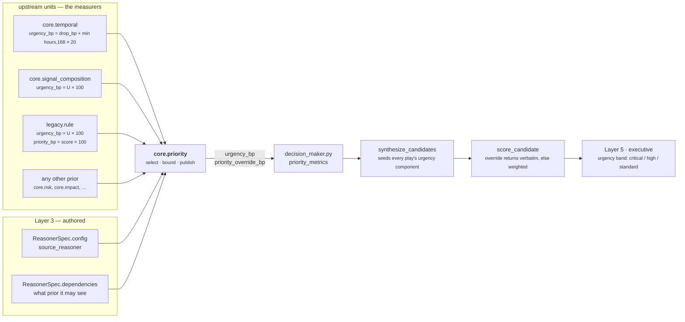
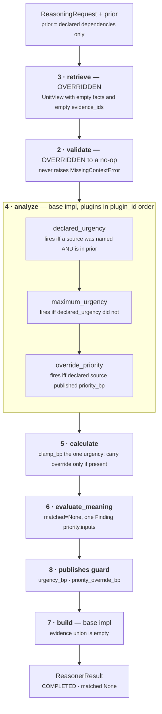
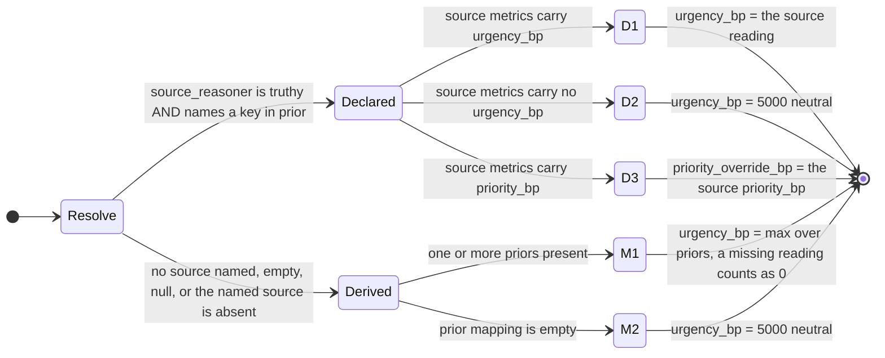

# `core.priority` — the Priority Authority

**Unit id:** `core.priority` · **version** `1.0.0` · **category** `BUSINESS_EVALUATION`
**Source of truth:** `genios_engine/reason/reasoners/priority.py` (239 lines)
**Class:** `priority.py:PriorityReasoner`
**Tests:** `tests/test_unit_priority.py` — 60 tests, all passing
**Registered:** `reason/reasoners/__init__.py:45` in the `BUSINESS_EVALUATION` tuple

---

## 1 · What it is for

**The business question:** *how much does the clock matter here, and did anything overrule it?*

`core.priority` is the system's **priority authority** — named as `PRIORITY_AUTHORITY` in
`reason/decision_maker.py:57` — and it is the only unit in the seventeen-unit roster permitted to
publish `urgency_bp` and `priority_override_bp`. Those two numbers are what the Decision Maker
ranks candidate plays with. `urgency_bp` carries weight 20 of 100 in `sales.deal_cooling`'s
`ranking_weights`; `priority_override_bp` replaces the weighted formula outright.

It does not *compute* urgency. It **sources** it, from a unit that already measured whatever
urgency is made of in this situation. The module docstring states the constraint plainly:

> *If a second unit ever published `urgency_bp`, the winner would become "whichever reasoner
> happened to run last" and every ranked decision in the system would silently re-score the day
> that unit joined a capability.*

Three rules keep it honest, taken verbatim from the module docstring:

1. **It never invents urgency.** Every number it publishes was measured by something else.
2. **Absence of an opinion is 5,000bp; absence of a reading is 0.** A prior unit that ran and
   reported no urgency contributes a genuine `0` to the derived maximum — it was asked and it
   answered. No prior units at all is ignorance, and ignorance reports the neutral midpoint.
3. **It analyses, it does not rank.** `matched` is always `None`. The orchestrator's math stage
   ranks actual candidates with the inputs this unit publishes.

It is the smallest unit in the roster. There is no arithmetic in it beyond `max()` and `clamp_bp()`.

---

## 2 · Its place in the pipeline

The unit sits late in the DAG on purpose: it can only source from units that have already run.
All three shipped capabilities place it after its source and after `core.constraint`.

| Capability | `dependencies` declared for `core.priority` | `source_reasoner` | Source publishes `priority_bp`? |
|---|---|---|---|
| `packs/capabilities/deal_cooling.py:200` | `core.temporal`, `core.risk`, `core.constraint` | `core.temporal` | **no** — override path inert |
| `packs/capabilities/deal_health.py:29` | `core.signal_composition`, `core.constraint` | `core.signal_composition` | **no** — override path inert |
| `reason/adapters/legacy_pack.py:78` | `legacy.rule`, `core.constraint` | `legacy.rule` | **yes** — override path live |

That last row matters and is easy to miss. `runner.py:449` compiles **every rule in the legacy
pack** into a capability through `legacy_capability_manifest`, and every one of them names
`legacy.rule` as the source. `legacy_rule.py:49` publishes `priority_bp = score * 100`. So the
override path is not dead code waiting for a future capability — it is the live production path for
the entire legacy rule corpus. See [06 · Builder and Metrics](06-Builder-and-Metrics.md) §5 for the
round-trip arithmetic that shows why the asymmetric metric name is deliberate.

---

## 3 · Internal flow

Two things in that diagram are unusual for this roster and both are deliberate. **Retrieve returns
an empty window** — no facts, no evidence ids — because the unit reads no fact and attaching a
fact's evidence id would be a false chain of custody. **Validate is a no-op** — a missing fact
cannot undermine a conclusion drawn from prior results, and refusing would strip the Decision Maker
of the authority it resolves urgency against. Both overrides are argued in the code's own
docstrings; see [01](01-Input-and-Validator.md) and [02](02-Retriever.md).

The plugin order in that subgraph is not registration order. `unit.py:analyze` sorts by
`plugin_id`, so the run order is alphabetical: `declared_urgency` → `maximum_urgency` →
`override_priority`. That ordering is load-bearing — it is what makes a malformed urgency reading
raise before a malformed override reading, so an operator chasing a bad deploy is sent to the right
reasoner. `test_a_malformed_urgency_is_reported_before_a_malformed_override` pins it.

---

## 4 · The two mutually exclusive paths

The branch is decided by one accessor, `priority.py:_declared_source`, which both urgency plugins
call. They are mutually exclusive **by construction**, not by coincidence — the module docstring
says exactly that, and `test_the_two_urgency_plugins_are_mutually_exclusive` asserts across all 17
scenarios that exactly one of the two fires.

`_declared_source` is deliberately **not** filtered by result status. The contract in
`contracts/reasoning.py:629` already forbids a non-`COMPLETED` result from carrying metrics, so a
`SKIPPED` or `FAILED` source reads as an empty metric map and falls through to the neutral midpoint
via the same code path as a source that completed with no opinion. Re-checking status here would be
a second, divergent definition of the same rule.

---

## 5 · Plugins

Three, all registered in `priority.py:179`. None of them attaches an evidence id.

| # | `plugin_id` | Class | `kind` | Metrics it emits | Reason code | Fires when |
|---|---|---|---|---|---|---|
| 1 | `declared_urgency` | `DeclaredUrgencyPlugin` | `priority.declared_urgency` | `urgency_bp` | `urgency_from_declared_source` | a source is named **and** present in `prior` |
| 2 | `maximum_urgency` | `MaximumUrgencyPlugin` | `priority.maximum_urgency` | `urgency_bp`, `prior_reading_count` | `urgency_from_prior_maximum` | `declared_urgency` did **not** fire |
| 3 | `override_priority` | `DeclaredOverridePlugin` | `priority.declared_override` | `priority_override_bp` | `priority_override_declared` | declared source present **and** it published `priority_bp` |

Per-plugin detail: [03a · declared_urgency](03a-plugin-declared_urgency.md) ·
[03b · maximum_urgency](03b-plugin-maximum_urgency.md) ·
[03c · override_priority](03c-plugin-override_priority.md).

**None of these reason codes reaches the result.** `evaluate_meaning` builds its `Verdict` with
`reason_codes=finding.reason_codes`, which is `("priority_inputs_ready",)` and nothing else, and
`unit.py:build` copies only `verdict.reason_codes`. `prior_reading_count` is likewise dropped by
`calculate`, which copies only `urgency_bp` and `priority_override_bp`. The consequence is set out
honestly in [06 · Builder and Metrics](06-Builder-and-Metrics.md) §4: **the persisted result cannot
tell you which branch produced it.** A `urgency_bp` of 5,000 has three indistinguishable causes.

---

## 6 · Published metrics

| Metric | Range | Meaning | Always present? |
|---|---|---|---|
| `urgency_bp` | 0–10,000 | How much the clock matters, sourced from another unit | **yes** — every completed run publishes it |
| `priority_override_bp` | 0–10,000 | An explicit priority the declared source already resolved | **no** — omitted unless the declared source published `priority_bp` |

`publishes = ("urgency_bp", "priority_override_bp")`. `tests/test_unit_roster.py:28` names both in
its `RESERVED` tuple and asserts that no other unit in the roster declares either, and
`test_it_declares_the_two_reserved_metrics_and_nothing_else` asserts this unit declares exactly
these two.

**Silence semantics.** This unit is never silent on urgency. Even with an empty `prior` mapping and
no config it emits `urgency_bp = 5,000` and one `Finding`. That is the single most important
behavioural difference between this unit and, say, `core.opportunity`, which emits nothing when it
has nothing to say. The reason is structural: `decision_maker.py:priority_metrics` defaults urgency
to 5,000 anyway, but the authority scan `break`s on this unit's `reasoner_id`, so a silent
`core.priority` would let an *upstream* publisher's urgency survive instead. The unit speaks so
that the authority is real. `priority_override_bp` **is** silent-capable, and that asymmetry is the
subject of [04 · Calculator](04-Calculator.md) §3.

---

## 7 · Config

The unit reads **exactly one** config key. Everything else in `spec.config` is ignored —
`test_unit_priority.py` scenario *"unrelated config keys are ignored"* pins that.

| Key | Type | Default | Read at | Effect |
|---|---|---|---|---|
| `source_reasoner` | `str` | `""` — absent, `""`, `None` and any falsy value all mean *no source declared* | `priority.py:_source_reasoner` | Names the unit whose reading **is** the urgency for this capability. Truthy and present in `prior` → declared path. Anything else → derived path. |

There is no threshold, no weight, no tuning knob. Nothing in this unit is tunable per capability
except *which unit to believe*.

### Module constants

| Constant | Value | Where | Why that value |
|---|---|---|---|
| `NEUTRAL_URGENCY_BP` | `5_000` | `priority.py:51` | The midpoint is a statement that the unit has no information, not that the situation is half urgent. It matches `decision_maker.py:priority_metrics`'s own default so the two agree when the unit has nothing. |
| `PRIORITY_READY_REASON` | `"priority_inputs_ready"` | `priority.py:55` | The only reason code that leaves the unit. It says *the priority inputs are ready*, not *this is urgent* — the reading lives in the metrics and the Decision Maker judges it. |

---

## 8 · Known compromises

Documented in full in the files below; listed here so nobody has to hunt for them.

| # | What | Where | Severity |
|---|---|---|---|
| 1 | **The `validate()` no-op is bypassed in production.** `orchestrator.py:178` runs `required_missing(request, spec.required_fields)` *before* the unit is called and returns `INSUFFICIENT_CONTEXT` without ever invoking `evaluate`. The unit's override only holds when the unit is called directly, which is exactly what `test_declared_required_fields_never_produce_insufficient_context` does. | [01](01-Input-and-Validator.md) §4 | latent — no shipped capability declares `required_fields` for this spec |
| 2 | **The result cannot tell you which path it took.** All three plugin reason codes and `prior_reading_count` are discarded before the result is built. Two runs with identical `urgency_bp` and different provenance hash identically. | [06](06-Builder-and-Metrics.md) §4 | audit gap |
| 3 | **The 5,000-versus-0 cliff.** On the derived path, adding one unrelated unit to `core.priority`'s `dependencies` moves urgency from 5,000 to 0 if that unit publishes no `urgency_bp`. It is a step function on the *declared dependency list*, not on the roster. | [03b](03b-plugin-maximum_urgency.md) §5 | live, pinned by test rather than fixed |
| 4 | **`clamp_bp` in `calculate` is unreachable in a real run.** `contracts/reasoning.py:_bp` already rejects any `_bp` metric outside 0–10,000 at `ReasonerResult` construction, so no in-range violation can arrive. The clamp is defence against a construction path the contract forecloses. | [04](04-Calculator.md) §4 | harmless; kept for legacy hash parity |
| 5 | **Reads `priority_bp`, publishes `priority_override_bp`.** The name changes across the boundary. Analysed in [06](06-Builder-and-Metrics.md) §5 — the round trip through `authority.py:AUTHORITATIVE_SCORE_SQL` is evidence this is a deliberate legacy bridge, not a typo. | [03c](03c-plugin-override_priority.md) §1 | by design, under-documented in code |

---

## 9 · The files

| File | Covers |
|---|---|
| [01 · Input and Validator](01-Input-and-Validator.md) | What arrives, why `required_fields` is never declared, the `validate()` no-op and why the orchestrator overrules it |
| [02 · Retriever](02-Retriever.md) | The overridden `retrieve()`, why the `UnitView` is deliberately empty, what `prior` actually contains |
| [03 · Analyzer](03-Analyzer.md) | The plugin seam: composition, execution order, mutual exclusion, fault ordering |
| [03a · `declared_urgency`](03a-plugin-declared_urgency.md) | The authoritative path — the named source's reading |
| [03b · `maximum_urgency`](03b-plugin-maximum_urgency.md) | The derived path — the loudest prior, and the 5,000/0 cliff |
| [03c · `override_priority`](03c-plugin-override_priority.md) | The explicit priority carried forward from the declared source |
| [04 · Calculator](04-Calculator.md) | `calculate()` — why selection rather than blending, and why absence is preserved |
| [05 · Evaluator](05-Evaluator.md) | `evaluate_meaning()` — the single finding, and why `matched` is `None` |
| [06 · Builder and Metrics](06-Builder-and-Metrics.md) | The result shape, evidence, the `publishes` guard, and every downstream consumer |

---

## Related

- [Category README · §4.5](../README.md) — `core.priority` in the Business Evaluation family
- [Unit Framework](../../README.md) — the eight stages, `UnitView`, `Observation`, `Verdict`
- [Decision Maker](../../../03-Decision-Maker/README.md) — `priority_metrics`, `score_candidate`
