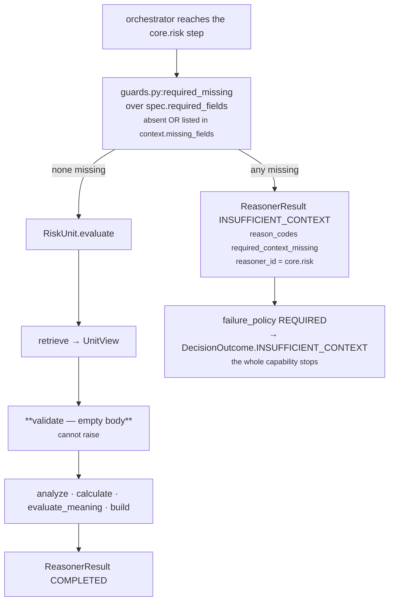

# 01 · Input and Validator

**Stages 1 and 2 of eight.** `unit.py:ReasoningUnit.evaluate` argument pair, then
`risk.py:RiskUnit.validate`.

---

## 1 · What it is for

Every unit gets one chance to say *"I will not guess"*. This unit never takes it. `core.risk` reads
no context fact, so there is no fact whose absence could make it fabricate an answer — and refusing
a run it could have answered would be worse than answering it, because the shipped spec declares
`failure_policy=REQUIRED` and a refusal there terminates the whole capability.

---

## 2 · What exists

### 2.1 · What arrives

`evaluate(request, prior_results)` is called by `orchestrator.py:ReasoningOrchestrator._evaluate`
with exactly two things:

| Argument | Type | Content for `core.risk` in `sales.deal_cooling` |
|---|---|---|
| `request` | `ReasoningRequest` | frozen: `org_id`, `capability`, `context` (the `ContextSnapshot`), `evaluation_time`, `trigger_kind`, `config_snapshot_id` |
| `prior_results` | `Mapping[str, ReasonerResult]` | **declared dependencies only** — `{"core.temporal": ..., "core.relationship": ...}` |

The narrowing of `prior_results` happens in the orchestrator, one line, and it is the reason a
config key can silently disable a plugin:

```python
# orchestrator.py:158
dependencies = {item: prior[item] for item in spec.dependencies if item in prior}
# A reasoner can see only dependencies it declared in the capability DAG.
# Passing every earlier result would create hidden, order-dependent edges.
```

The shipped spec, `packs/capabilities/deal_cooling.py`:

```python
risk = ReasonerSpec(
    reasoner_id="core.risk",
    version=REASONER_VERSION,          # "1.0.0"
    input_kind="reasoner_results",
    output_kind="risk_finding",
    dependencies=("core.temporal", "core.relationship"),
    latency_budget_ms=20,
    failure_policy=FailurePolicy.REQUIRED,
    config={...},
)
```

Three things are **absent** from that declaration and their absence is the point:

- **no `required_fields`** — nothing for a validator to enforce;
- **no `gating=True`** — this unit can never end a run with `NO_ACTION`, which is consistent with
  `matched` always being `None`;
- **`input_kind="reasoner_results"`**, the only unit in Business Evaluation whose declared input is
  other units rather than the snapshot.

### 2.2 · The override

```python
# risk.py:RiskUnit.validate
def validate(self, view: UnitView) -> None:
    """Nothing to refuse: this unit reads no context facts. ..."""
```

An empty body. The docstring gives the reason in full:

> *Its inputs are other units' published metrics and the capability's own config, so there is no
> fact whose absence could make it guess. The default validator would raise `MissingContextError`
> for a declared `required_fields` entry and turn a perfectly answerable run into
> INSUFFICIENT\_CONTEXT — a status this unit has never returned and which would terminate the whole
> capability at its required failure policy.*

### 2.3 · What the base class would have done

`unit.py:ReasoningUnit.validate` is two lines:

```python
absent = missing_fields(view.request, view.spec.required_fields)
if absent:
    raise MissingContextError(*absent)
```

`common.py:missing_fields` checks **presence only**: a field is missing when its name is not a key
of `request.context.facts`, or — for a `neighbor:`-prefixed entry — not a key of
`request.context.neighbor_facts`. It returns the names sorted. `MissingContextError` carries them as
`exc.fields`, and `orchestrator.py:ReasoningOrchestrator._evaluate` converts it into
`ResultStatus.INSUFFICIENT_CONTEXT` with those fields in `missing_fields`.

---

## 3 · How it works



**The override protects less than it appears to, and this is worth stating plainly.** The
orchestrator applies `guards.py:required_missing` to `spec.required_fields` *before* the unit is
called at all, and that check is **stricter** than the unit's own default validator — it treats a
field as missing when it is absent **or** when Layer 2 explicitly listed it in
`context.missing_fields`. So if a capability author ever declares a `required_fields` entry on the
`core.risk` spec, the run still produces an `INSUFFICIENT_CONTEXT` result carrying
`reasoner_id="core.risk"`, and `RiskUnit.validate` never gets a say. The override closes the unit's
own door; the orchestrator's door is upstream of it and is not overridable.

What the override *does* protect:

- **the direct-call path** — a unit invoked straight from a test or a replay harness, which is
  exactly what `test_the_unit_never_returns_insufficient_context` exercises;
- **the semantics of the unit itself** — a reader of `risk.py` can see that this unit has no
  refusal branch, so any `INSUFFICIENT_CONTEXT` bearing its id came from the manifest, not from the
  reasoning.

---

## 4 · Examples and edge cases

### 4.1 · A declared field that does not exist — the pinned case

```python
# tests/test_unit_risk.py::test_the_unit_never_returns_insufficient_context
result = _run((_completed("core.temporal", drop_bp=6_200),),
              required_fields=("deal.absent_field",))

assert result.status == ResultStatus.COMPLETED
assert result.missing_fields == ()
```

The snapshot's facts are `{"deal.status": "open"}`. `deal.absent_field` is not there. The base
validator would have raised `MissingContextError("deal.absent_field")`; the override returns
`None`, `analyze` runs, and the result is `risk_bp = 1,000 + round_half_up(6,200×60 / 100) = 1,000 +
3,720 = 4,720`. Nothing about the absent field appears anywhere in the result.

### 4.2 · Nothing ran before it

```python
_run()   # no prior results, no config
```

`prior` is `{}`. Both reading plugins report `0`. `risk_bp = 1,000` — the default floor, alone. The
unit completes; there is no refusal path to take. Pinned by
`test_a_quiet_situation_still_carries_the_authored_floor`.

### 4.3 · The capability does not declare this unit

```python
# tests/test_unit_risk.py::test_a_capability_that_does_not_declare_this_unit_is_a_deployment_fault
with pytest.raises(ValueError):
    RiskUnit().evaluate(request_for_a_capability_without_core_risk, {})
```

This is the one input error the unit does surface, and it happens before any stage runs.
`common.py:active_spec` scans `request.capability.reasoners` for `reasoner_id == "core.risk"` and
raises `ValueError("capability does not declare reasoner core.risk")` when it finds none. Through
the orchestrator this becomes `ResultStatus.FAILED` with the exception type and message in
`diagnostics` — which is `compare=False, repr=False` and outside `to_semantic_dict`, so a failure
message can never move a hash. It is a deployment fault, not a data fault: the registry resolved a
unit the manifest never asked for.

### 4.4 · A malformed config value

Not a validator concern — `validate()` does not look at config. `base_risk_bp = "high"` reaches
`calculate`, where `common.py:basis_points` raises `ValueError("base_risk_bp must be an integer")`.
The orchestrator returns `FAILED`, and because the shipped spec is `REQUIRED`, the terminal outcome
is `DecisionOutcome.FAILED` for the whole capability. That is the intended behaviour: an
uninterpretable authored constant is a deployment fault that should be loud, and the six rejection
cases are pinned by
`test_a_malformed_floor_is_an_authoring_fault_not_a_silent_default[10001|-1|high|1.5|True|None]`.

### 4.5 · The boundary table

| Input condition | Status returned | Where it is decided |
|---|---|---|
| No prior results, no config | `COMPLETED`, `risk_bp = 1,000` | the unit |
| `required_fields` declared and absent, **direct call** | `COMPLETED` | the unit's override |
| `required_fields` declared and absent, **orchestrated** | `INSUFFICIENT_CONTEXT` | `guards.py:required_missing`, before the unit |
| Capability does not declare `core.risk` | `FAILED` | `common.py:active_spec` |
| `base_risk_bp` malformed | `FAILED` | `common.py:basis_points`, in `calculate` |
| An entry of `play_risk_reduction_bp` malformed | `FAILED` | `common.py:basis_points`, in the plugin |
| A dependency `SKIPPED` or `INSUFFICIENT_CONTEXT` | `COMPLETED`, that exposure counted as 0 | `risk.py:_published` — see [06](06-Builder-and-Metrics.md) |

---

## Next

[02 · Retriever](02-Retriever.md) — why the view it validates carries no facts at all.
