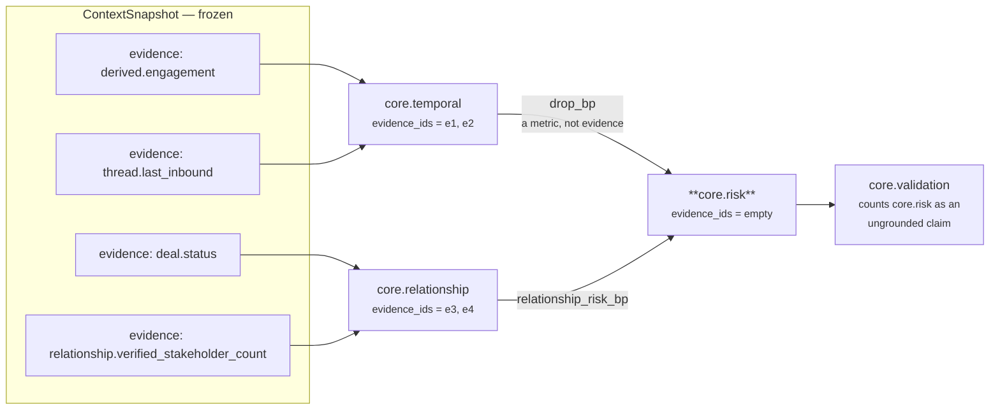

# 02 · Retriever

**Stage 3 of eight.** `risk.py:RiskUnit.retrieve` — **overridden**.

---

## 1 · What it is for

The Retriever selects the slice of the frozen snapshot this unit is allowed to look at. For
`core.risk` that slice is **empty**. Its window is the prior results and the config, nothing else,
and the override exists to make that visible in one line rather than leaving it to be inferred from
the absence of fact reads in the plugins.

---

## 2 · What exists

```python
# risk.py:RiskUnit.retrieve
def retrieve(self, request: ReasoningRequest, spec: ReasonerSpec,
             prior: Mapping[str, ReasonerResult]) -> UnitView:
    """The window is the prior results and the config — no facts, therefore no evidence. ..."""
    return UnitView(request=request, spec=spec, prior=prior)
```

Three arguments in, one `UnitView` out, no selection performed. The two `UnitView` fields the base
class would have populated are left at their dataclass defaults:

| `UnitView` field | Value after this override | Value the base class would have produced |
|---|---|---|
| `request` | the request, verbatim | same |
| `spec` | the capability's spec for `core.risk` | same |
| `prior` | the declared dependencies mapping | same |
| `facts` | **`{}`** — the `field(default_factory=dict)` default | `{name: request.context.facts[name] for name in spec.required_fields}` |
| `evidence_ids` | **`()`** — the default | `tuple(sorted(...))` over `context.evidence` whose `field` is in `facts` |

`UnitView.config` is a property returning `spec.config`, so the four config keys of
[the README §5](README.md#5--every-config-key) remain reachable. `UnitView.prior_metric` is also
available but is **deliberately not used** by this unit — see [03 · Analyzer](03-Analyzer.md).

---

## 3 · How it works

### 3.1 · The base implementation, and why it is skipped

```python
# unit.py:ReasoningUnit.retrieve
wanted = tuple(field for field in spec.required_fields if not field.startswith("neighbor:"))
facts = {name: request.context.facts[name] for name in wanted if name in request.context.facts}
evidence = tuple(sorted(item.evidence_id for item in request.context.evidence
                        if item.field in facts))
return UnitView(request=request, spec=spec, prior=prior,
                facts=MappingProxyType(facts), evidence_ids=evidence)
```

Run against the shipped `core.risk` spec, that base implementation would return exactly the same
thing the override returns: `spec.required_fields` is `()`, so `wanted` is empty, `facts` is empty,
and `evidence` is empty. **The override is not currently changing any outcome.** It changes what
happens if a future capability author adds a `required_fields` entry to the risk spec — the base
would then start attaching that field and its evidence ids to a unit that never read either.

The docstring states the reason as a rule about the audit trail rather than about the shipped
config:

> *The unit cites nothing directly: every claim it makes is downstream of a metric another unit
> already evidenced, and re-attaching that unit's evidence ids here would double-count them in the
> audit trail as if risk had observed the facts itself.*

That is the correct argument. `core.temporal` cites `derived.engagement` and `thread.last_inbound`;
`core.relationship` cites `deal.status` and `relationship.verified_stakeholder_count`. Those four
evidence ids already appear once each in the trace, attached to the units that actually parsed them.
If `core.risk` attached them again, an auditor counting distinct evidence per claim would see the
same rows supporting two independent claims and read the basis as broader than it is.



### 3.2 · What the empty view costs, downstream

The evidence union in `unit.py:ReasoningUnit.build` is `set(view.evidence_ids)` plus every
observation's `evidence_ids`. No plugin of this unit sets any. So
`ReasonerResult.evidence_ids == ()`, always. Pinned by `test_the_unit_cites_no_evidence_of_its_own`,
which deliberately puts an unused fact in the snapshot to prove the emptiness is not incidental:

```python
result = _run((_completed("core.temporal", drop_bp=6_200),),
              facts={"deal.status": "open", "derived.engagement": {"value_bp": 3_800}})

assert result.evidence_ids == ()
```

`core.validation` reads that as a problem, and it is right by its own definition:

```python
# validation_unit.py:_asserts_a_claim
if result.matched is True:
    return True
return any(finding.matched is not False for finding in result.findings)
```

`core.risk` emits one `Finding("risk.do_nothing", ...)` whose `matched` defaults to `None`. `None is
not False`, so the result counts as **an assertion**. `validation_unit.py:_cited` then intersects the
result's evidence ids with the snapshot's producible ids and finds nothing, so `core.risk` is
counted as an ungrounded claim in `evidence_sufficiency_bp`.

On a measured `deal_cooling_full_v2` run, `core.validation` inspected four results and reported
`ungrounded_claim_count = 3`, `evidence_sufficiency_bp = 2,500`. `core.risk` is one of the three.
The other two are `core.priority` and `core.confidence`, each with the same structure and the same
documented reason for not re-attaching another unit's evidence.

**Two units cannot both be right here.** Either `_asserts_a_claim` should exempt `matched=None`
findings — a unit reporting a magnitude has not put its neck out — or the metric-reading units
should attach the evidence ids of the metrics they read and accept the double count. The design
records point in opposite directions and neither cites the other. Nothing is broken today, because
`safe_bp` cleared its floor on that run for other reasons, but the evidence axis of the safety score
is reporting 75% of Business Evaluation as unsupported and that number is not telling anyone
anything actionable.

---

## 4 · Examples and edge cases

### 4.1 · The shipped run

`sales.deal_cooling` declares `core.risk` with no `required_fields`.

```
view.facts        = {}
view.evidence_ids = ()
view.prior        = {"core.temporal": ..., "core.relationship": ...}
view.config       = {"temporal_reasoner": "core.temporal",
                     "relationship_reasoner": "core.relationship",
                     "base_risk_bp": 1000,
                     "play_risk_reduction_bp": {"restore_momentum": 1800,
                                                "multithread_account": 1600,
                                                "clarify_next_step": 1200}}
```

### 4.2 · A snapshot full of facts

Even with a rich snapshot the view stays empty. There is no path by which a fact reaches this unit:
`view.facts` is `{}`, no plugin calls `common.py:fact_value`, and `common.py:fact_record` is not
imported by `risk.py` at all. A reader wanting to confirm the unit is fact-free can check the import
line — `from .common import basis_points, clamp_bp, divide_half_up, integer` — which is four pure
arithmetic helpers and nothing that touches `request.context`.

### 4.3 · A `neighbor:`-scoped required field

Hypothetical, since none is declared. The base retriever filters `neighbor:` entries out of `wanted`
so they never reach `view.facts` anyway, while `common.py:missing_fields` *does* honour the prefix
and would refuse the run. That asymmetry is a live inconsistency in the framework, documented in
[Part 2 §3.1](../../README.md). `core.risk` is immune to it: it overrides both stages.

### 4.4 · A neighbour-scoped evidence item colliding with a root fact name

The base retriever's evidence filter matches on `item.field in facts` and ignores
`EvidenceRef.context_scope`, so a neighbour-scoped evidence row whose field name collides with a
selected root fact would be attached as though the unit had observed it. `core.risk` cannot hit this
either, because `facts` is empty and the intersection is therefore empty for every possible
snapshot.

---

## Next

[03 · Analyzer](03-Analyzer.md) — the plugin seam, and the two private readers that stand in for the
facts this stage did not fetch.
