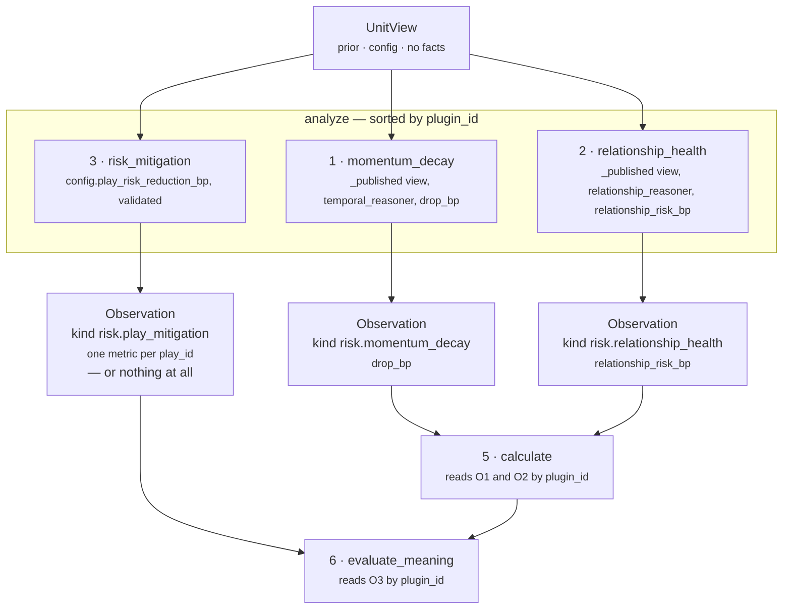

# 03 · Analyzer — the plugin seam

**Stage 4 of eight.** `unit.py:ReasoningUnit.analyze` — **base class, unchanged**.

---

## 1 · What it is for

Risk is not one algorithm. It is *a deal that has gone quiet* plus *an account held by one person*
plus *whatever the capability author says a play does about either*. Folding those into one
`calculate_risk()` would make the number unexplainable at exactly the moment somebody asks why it is
7,720 and not 4,000. Three plugins keep the three claims separable, individually testable, and
individually silent-able.

This unit does **not** override `analyze`. The base runs every registered plugin in `plugin_id`
order and concatenates the `Observation` tuples they return.

---

## 2 · What exists

### 2.1 · The base implementation

```python
# unit.py:ReasoningUnit.analyze
observations: list[Observation] = []
for plugin in sorted(self.plugins, key=lambda item: item.plugin_id):
    observations.extend(plugin.contribute(view))
return tuple(observations)
```

The sort is the whole reason a base implementation is enough here. Registration order in the class
body is `momentum_decay · risk_mitigation · relationship_health`; execution order is
`momentum_decay · relationship_health · risk_mitigation`. Observation order reaches the semantic
hash through the adjustments derived from it, so ordering has to be a property of the unit's
composition rather than of whatever the class body happened to say the day a plugin was added.

`unit.py:ReasoningUnit.__init__` rejects a duplicate `plugin_id` at construction, which is what stops
the sort from becoming ambiguous.

### 2.2 · Execution order and what each contributes



| Order | `plugin_id` | Contributes to | Reads from | Can return `()` |
|---|---|---|---|---|
| 1 | `momentum_decay` | `calculate` | `view.prior` | no |
| 2 | `relationship_health` | `calculate` | `view.prior` | no |
| 3 | `risk_mitigation` | `evaluate_meaning` | `view.config` | **yes** |

### 2.3 · The two private readers

`risk.py` defines two module-level helpers. They are the seam between the plugins and everything
else, and each is one small deliberate departure from a framework default.

```python
def _published(view: UnitView, reasoner_id: str, name: str) -> int:
    result = view.prior.get(reasoner_id)
    return integer((result.metrics if result else {}).get(name, 0), name)


def _observed(observations: Sequence[Observation], plugin_id: str, name: str) -> int:
    for observation in observations:
        if observation.plugin_id == plugin_id:
            return int(observation.metrics.get(name, 0))
    return 0
```

`_published` reads *upstream units*; `_observed` reads *this unit's own plugins*. Neither is
`UnitView.prior_metric`, and the docstring explains why:

> *Deliberately not `UnitView.prior_metric`: that helper substitutes its default whenever the prior
> result is not COMPLETED **or** the value is not an int, whereas this unit has always coerced
> through `integer()` and let a non-integer metric fail loudly. Risk is summed into the ranking
> math, so a metric the system cannot read as an integer is an authoring fault worth surfacing, not
> a value to quietly replace with zero.*

---

## 3 · How it works

### 3.1 · The plugins do not interact

There is no ordering dependency between the three. Each reads `view` and nothing else; none reads
another's `Observation`. Reordering them would change the tuple order and therefore the diagram, but
not a single number — the composition happens in `calculate` and `evaluate_meaning`, which address
observations **by `plugin_id`**, never by index:

```python
drop              = _observed(observations, MOMENTUM_PLUGIN, "drop_bp")
relationship_risk = _observed(observations, RELATIONSHIP_PLUGIN, "relationship_risk_bp")
```

That is why `MOMENTUM_PLUGIN`, `RELATIONSHIP_PLUGIN` and `MITIGATION_PLUGIN` are module constants
rather than string literals — *"a rename cannot silently turn a contribution into a zero"*. If the
plugin class changed its `plugin_id` to `"decay"` while `calculate` still looked for
`"momentum_decay"`, `_observed` would return `0` and the unit would report a floor-only risk with no
error anywhere. The shared constant makes that a rename in one place.

### 3.2 · `_published`'s loud-failure path cannot currently fire

The docstring's argument for `integer()` over `prior_metric` is about surfacing a metric the system
cannot read as an integer. **That branch is unreachable through the orchestrated path**, and it is
worth knowing before someone relies on it:

- `ReasonerResult.__post_init__` validates every metric whose name ends in `_bp` with
  `contracts/reasoning.py:_bp`, which raises `TypeError` for a non-`int` or `bool` and `ValueError`
  outside `0..10_000`. Both metrics this unit reads — `drop_bp`, `relationship_risk_bp` — end in
  `_bp`.
- `ReasonerResult.__post_init__` also refuses to let a non-`COMPLETED` result carry metrics at all,
  so a `SKIPPED` or `FAILED` dependency has `metrics == {}` and `.get(name, 0)` yields `0`.

So for every legally constructible `ReasonerResult`, `_published` and
`prior_metric(reasoner_id, name, 0)` return the same value. The distinction the docstring draws is
real in intent and currently unobservable in behaviour. It would become observable the day this unit
reads a metric whose name does not end in `_bp`.

### 3.3 · `_observed`'s zero fallback is also defensive

`_observed` is called for exactly two plugin ids, and neither of those plugins ever returns `()`.
Its `return 0` after the loop is therefore dead in the shipped unit. It is not pointless: it is what
would keep `calculate` total if `momentum_decay` ever grew a silence path, and it is the reason
`calculate` does not need to index the tuple or handle a `StopIteration`.

### 3.4 · The `Observation` contract, applied here

`unit.py:Observation.__post_init__` enforces three things on every contribution:

- **integers only** — `bool` rejected explicitly, because `isinstance(True, int)` is `True` in Python
  and a boolean masquerading as a metric reaches the ranking formula unnoticed;
- **`metrics` frozen** into a `MappingProxyType`;
- **`evidence_ids` and `reason_codes` deduplicated and sorted** at construction.

All three observations of this unit carry `evidence_ids=()` — see [02 · Retriever](02-Retriever.md).
Their `reason_codes` are per-plugin provenance and, uniquely in this unit, **are not unioned into the
result**. `evaluate_meaning` publishes only `RISK_REASON_CODE`; the plugin codes stay inside the
observations, which do not survive past `build`. See [05 · Evaluator](05-Evaluator.md) for the
argument and for what is lost.

---

## 4 · Examples and edge cases

### 4.1 · The full shipped composition

Prior: `core.temporal` with `drop_bp = 6,000`; `core.relationship` with `relationship_risk_bp =
6,667`. Config: the shipped `sales.deal_cooling` block.

```text
analyze() returns, in this order:

  Observation(plugin_id="momentum_decay",      kind="risk.momentum_decay",
              metrics={"drop_bp": 6000},
              reason_codes=("momentum_decay_exposure",))

  Observation(plugin_id="relationship_health", kind="risk.relationship_health",
              metrics={"relationship_risk_bp": 6667},
              reason_codes=("relationship_exposure",))

  Observation(plugin_id="risk_mitigation",     kind="risk.play_mitigation",
              metrics={"clarify_next_step": 1200,
                       "multithread_account": 1600,
                       "restore_momentum": 1800},
              reason_codes=("play_mitigates_detected_risk",))
```

Three observations. `calculate` reads the first two, `evaluate_meaning` reads the third.
`risk_bp = 1,000 + round_half_up((6,000×60 + 6,667×40) / 100) = 1,000 + 6,267 = 7,267`.

### 4.2 · Nothing ran before it, nothing authored

```text
analyze() returns:

  Observation(plugin_id="momentum_decay",      metrics={"drop_bp": 0}, ...)
  Observation(plugin_id="relationship_health", metrics={"relationship_risk_bp": 0}, ...)
```

**Two observations, not three.** `risk_mitigation` returned `()` — the comment in the code is
explicit: *"nothing authored is not a zero-value mitigation"*. `risk_bp = 1,000`, no adjustments.

Note the asymmetry inside this one unit: the mitigation plugin honours "silence is not zero", the
two reading plugins deliberately do not. That is not an inconsistency of taste. An unauthored
mitigation table means the capability made no claim about any play, and inventing a zero-delta
adjustment for a play nobody mentioned would be noise in the audit trail. An absent dependency means
an exposure could not be measured — and the unit chose, with its eyes open, to report the measurable
part rather than withhold the metric.

### 4.3 · A dependency that ran but published a different metric

`CASES["dependency_ran_without_the_metric"]`: `core.temporal` completed with
`{"urgency_bp": 4_000}` and no `drop_bp`.

```text
_published(view, "core.temporal", "drop_bp")
  → result.metrics = {"urgency_bp": 4000}
  → .get("drop_bp", 0) = 0
  → integer(0, "drop_bp") = 0
```

The observation is still emitted, carrying `drop_bp: 0`. Nothing in the result distinguishes this
from a deal with perfect momentum.

### 4.4 · Redirected dependency ids

`CASES["redirected_dependency_ids"]`: config names `sales.decay` and `sales.coverage`, and both are
present in `prior` with `drop_bp = 9,000` and `relationship_risk_bp = 1,000`.

```text
risk_bp = 1,000 + round_half_up((9,000×60 + 1,000×40) / 100)
        = 1,000 + round_half_up(580,000 / 100)
        = 1,000 + 5,800
        = 6,800
```

This works only because the capability also listed those ids in `ReasonerSpec.dependencies`. If it
had redirected the config without declaring the dependency, `view.prior` would not contain the key,
`_published` would return `0`, and one whole exposure would silently vanish. See
[03a](03a-plugin-momentum_decay.md) §4.4 for the worked version of that failure.

---

## The three plugins in detail

| File | Plugin |
|---|---|
| [03a · `momentum_decay`](03a-plugin-momentum_decay.md) | `MomentumDecayPlugin` |
| [03b · `relationship_health`](03b-plugin-relationship_health.md) | `RelationshipHealthPlugin` |
| [03c · `risk_mitigation`](03c-plugin-risk_mitigation.md) | `PlayMitigationPlugin` |
