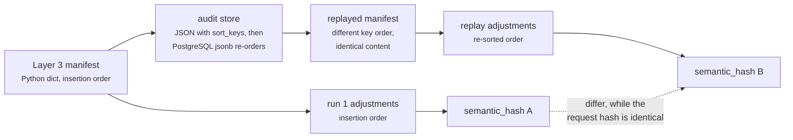

# 03c · Plugin `risk_mitigation`

**Class:** `risk.py:PlayMitigationPlugin` · **`plugin_id`** `"risk_mitigation"` ·
**Observation kind** `"risk.play_mitigation"` · **executed third** of three.

---

## 1 · The claim it makes

*The capability author says this play reduces the risk it addresses by this much.*

That is authored knowledge, not inference. Only the capability knows that "multithread the account"
attacks coverage risk while "clarify the next step" attacks ambiguity. The plugin reads the table,
validates every entry as basis points, and reports it. It supplies **no judgement about which play
wins** — the sign is applied where the adjustment is built, so the observation stays a plain
statement of magnitude, and the Decision Maker does the choosing.

This is the only plugin in the unit that can stay silent, and the only one whose output does not
reach `calculate`.

---

## 2 · What exists

```python
# risk.py:PlayMitigationPlugin
plugin_id = MITIGATION_PLUGIN                    # "risk_mitigation"

def contribute(self, view: UnitView) -> tuple[Observation, ...]:
    authored = dict(view.config.get("play_risk_reduction_bp") or {})
    if not authored:
        return ()                       # nothing authored is not a zero-value mitigation
    reductions = {
        str(play_id): basis_points(reduction, f"{play_id}.risk_reduction_bp")
        for play_id, reduction in sorted(authored.items())
    }
    return (Observation(
        plugin_id=self.plugin_id,
        kind="risk.play_mitigation",
        metrics=reductions,             # keyed by play_id: the whole authored table, validated
        reason_codes=(RISK_MITIGATION_REASON,),
    ),)
```

| | |
|---|---|
| Config key | `play_risk_reduction_bp` — `{play_id: basis_points}` |
| Default | absent or `{}` → **returns `()`** |
| Emits | one `Observation` whose `metrics` map is the whole validated table |
| Metric names | the play ids themselves — **the only place in this unit where a metric name is data rather than a constant** |
| Metric values | `0..10_000`, validated per entry |
| Reason code | `play_mitigates_detected_risk` (`RISK_MITIGATION_REASON`) |
| Evidence ids | `()` |
| Consumed by | `evaluate_meaning` only — **never `calculate`** |

The shipped table in `sales.deal_cooling`, inherited unchanged by `sales.deal_cooling_full`:

```python
"play_risk_reduction_bp": {
    "restore_momentum":    1_800,
    "multithread_account": 1_600,
    "clarify_next_step":   1_200,
}
```

---

## 3 · When it stays silent

Exactly one condition, checked before any validation runs:

```python
if not authored:
    return ()                       # nothing authored is not a zero-value mitigation
```

`not authored` is true for an absent key, an explicit `{}`, and a `None` value (the `or {}` handles
that). `test_an_unauthored_mitigation_table_produces_no_observation` pins the first two.

**The distinction being drawn is real.** A capability that authored nothing has made no claim about
any play. Emitting a zero-delta adjustment for a play nobody mentioned would put a row in the audit
trail — and inside the semantic hash — asserting that the capability considered that play's risk
and found it unmoved. It did not consider it at all.

Note that this is the opposite convention from the unit's other two plugins, which report `0` rather
than staying silent. That is not inconsistency: an unauthored table is a *statement not made*, while
an absent dependency is a *measurement not taken*, and the unit made a documented choice to report
the measurable part of the second. See [03 · Analyzer §4.2](03-Analyzer.md).

**What it does *not* do:** an authored `0` is not silence. `{"restore_momentum": 0}` passes
`not authored` (the dict is non-empty), validates fine, and produces an observation carrying
`restore_momentum: 0` — which `evaluate_meaning` turns into a `CandidateAdjustment` with
`delta_bp = 0`. Verified:

```text
_run(config={"play_risk_reduction_bp": {"restore_momentum": 0}}).adjustments
  → [CandidateAdjustment("restore_momentum", "risk", 0, "play_mitigates_detected_risk")]
```

A zero-delta adjustment moves no score, but it does occupy a row in `ReasonerResult.adjustments`,
which is inside `to_semantic_dict` and therefore inside the hash. `CASES["zero_valued_mitigation"]`
carries it through the differential precisely so that behaviour cannot change silently. Whether an
authored zero *should* produce an adjustment is arguable — `impact_unit.py` and
`recommendation_unit.py` both skip theirs with the comment *"a tilt that rounds away is noise in the
audit trail"* — but for `core.risk` the answer is now fixed by the replay contract.

---

## 4 · Validation

Each value goes through `common.py:basis_points` with the label `f"{play_id}.risk_reduction_bp"`, so
the failure message names the offending play:

```text
ValueError: restore_momentum.risk_reduction_bp must be between 0 and 10000
ValueError: restore_momentum.risk_reduction_bp must be an integer
```

| Authored value | Result |
|---|---|
| `1_800` | accepted |
| `"1800"` / `Decimal("1800")` / `Decimal("1800.0")` | accepted — `integer()` parses integral strings and Decimals |
| `1.5`, `1800.0` | `ValueError` — any `float` is rejected, even an integral one |
| `True` | `ValueError` — `bool` rejected explicitly, before the `int` check |
| `None` | `ValueError` |
| `-1`, `10_001` | `ValueError` — range |

`test_a_malformed_mitigation_is_an_authoring_fault[10001|-1|1.5|True|None]` pins five of these.

Note what is **not** validated: **the play id itself**. `PlayMitigationPlugin` never checks that
`play_id` names a play the capability declares. That check lives at the orchestrator boundary —
`guards.py:validate_candidate_effects` compares every adjustment's `play_id` against the
capability's play ids and raises, which `orchestrator.py` converts into a `FAILED` result. So a typo
in the table is caught, one stage later, as a contract violation rather than as an authoring fault
with a helpful label.

The key type is not validated either, but it cannot be wrong: `ReasonerSpec.config` is frozen
through `platform/canonical.py:canonicalize`, which raises
`CanonicalizationError("semantic mapping keys must be strings")` on any non-string key. The `str()`
coercion in the dict comprehension is defending against something the contract already forbids.

---

## 5 · Ordering — the part that was a real bug

The docstring is unusually emphatic here, and the reason is a defect that reached persisted runs:

> *The scan is `sorted()`, and the consumer sorts again. Adjustment order is inside this result's
> semantic hash while the manifest's key order is not stable across a JSON round trip through the
> audit store, so ordering has to come from the content and nowhere else.*



Unsorted iteration made **every persisted `deal_cooling` run report as non-reproducible** while the
request hash stayed byte-identical — the worst kind of determinism failure, because the thing that
proves a decision was replayed correctly is the thing that was wrong. The regression test is
`tests/test_reasoning_config_order.py`; the local pins are
`test_adjustment_order_is_alphabetical_by_play_not_arrival_order` and
`test_a_config_key_permutation_cannot_move_the_result_hash`, the second of which drives the real
shipped config through in two key orders.

**Which of the two sorts is load-bearing.** Only the second one. `PlayMitigationPlugin`'s
`sorted(authored.items())` determines the insertion order of the `Observation`'s `metrics` mapping —
and an `Observation` never reaches `ReasonerResult`; `build` reads observations only for their
`evidence_ids`. The sort that fixes the hash is in `evaluate_meaning`:

```python
for play_id in sorted(observation.metrics):
```

The plugin's own sort is belt-and-braces: it makes the observation deterministic for anyone
inspecting it in a test or a debugger, and it means the two sorts can never disagree because both
are plain string sorts over the same keys. Worth knowing before someone "simplifies" the wrong one.

---

## 6 · Worked examples

### 6.1 · The shipped table, keys in manifest order

```python
config = {"play_risk_reduction_bp": {
    "restore_momentum": 1_800, "multithread_account": 1_600, "clarify_next_step": 1_200}}
```

```text
sorted(authored.items())
  → [("clarify_next_step", 1200), ("multithread_account", 1600), ("restore_momentum", 1800)]

Observation(plugin_id="risk_mitigation", kind="risk.play_mitigation",
            metrics={"clarify_next_step": 1200,
                     "multithread_account": 1600,
                     "restore_momentum": 1800},
            reason_codes=("play_mitigates_detected_risk",))

evaluate_meaning → sorted(observation.metrics) → the same three names, and:

  CandidateAdjustment("clarify_next_step",   "risk", -1200, "play_mitigates_detected_risk")
  CandidateAdjustment("multithread_account", "risk", -1600, "play_mitigates_detected_risk")
  CandidateAdjustment("restore_momentum",    "risk", -1800, "play_mitigates_detected_risk")
```

`test_the_shipped_case_is_not_vacuous` asserts `len(result.adjustments) == 3` against the real pack,
so this stops being true the day someone re-authors the capability with fewer entries.

### 6.2 · The same table, keys reversed

```python
config = {"play_risk_reduction_bp": {
    "multithread_account": 1_600, "clarify_next_step": 1_200, "restore_momentum": 1_800}}
```

Identical output — same three adjustments, same order, **same `semantic_hash`**. That equality is
the whole point of the sort and is asserted directly by
`test_adjustment_order_is_alphabetical_by_play_not_arrival_order`.

### 6.3 · Two entries, and what reaches the score

```python
config = {"play_risk_reduction_bp": {"restore_momentum": 1_800, "multithread_account": 1_600}}
```

```text
adjustments = [("multithread_account", "risk", -1600),
               ("restore_momentum",    "risk", -1800)]
```

Downstream, `decision_maker.py:synthesize_candidates` seeds each candidate's `risk` component from
the play's own authored `PlayDefinition.risk_bp` and applies the delta with a clamp:

```text
restore_momentum:     risk = clamp_bp(1,000 − 1,800) = **0**      (600bp of the reduction lost)
multithread_account:  risk = clamp_bp(2,500 − 1,600) =   900
```

Two of the three shipped reductions exceed the play's authored risk floor and are truncated —
`clarify_next_step` is `clamp_bp(700 − 1,200) = 0`, losing 500bp. The authored mitigation table is
calibrated on a scale the play definitions do not reach. Nothing errors; the excess is simply
discarded. See [05 · Evaluator §4](05-Evaluator.md) for the utility arithmetic that follows.

### 6.4 · An empty table

```python
config = {"play_risk_reduction_bp": {}}
```

`contribute` returns `()`. `analyze` yields two observations instead of three. `evaluate_meaning`'s
loop finds no observation with `plugin_id == "risk_mitigation"` and emits no adjustments.
`ReasonerResult.adjustments == ()`. `CASES["empty_mitigation_table"]` carries this through the
differential.

### 6.5 · A play id the capability never declared

```python
config = {"play_risk_reduction_bp": {"send_a_carrier_pigeon": 500}}
```

The plugin accepts it — 500 is valid basis points — and `evaluate_meaning` emits
`CandidateAdjustment("send_a_carrier_pigeon", "risk", -500, ...)`. The orchestrator then calls
`guards.py:validate_candidate_effects(result, play_ids)`, which raises, and the step becomes
`ResultStatus.FAILED`. Because `core.risk` is `FailurePolicy.REQUIRED` in both shipped capabilities,
the terminal outcome is `DecisionOutcome.FAILED` and no decision is produced. Loud, late, and
attributed to the right unit.
