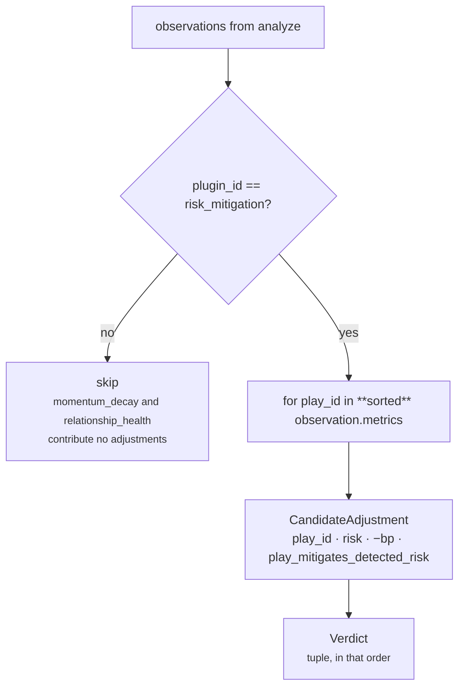

# 05 · Evaluator

**Stage 6 of eight.** `risk.py:RiskUnit.evaluate_meaning` — **abstract in the base class,
implemented here.**

---

## 1 · What it is for

Turn the number into meaning. For most units that means crossing a threshold. **For this unit it
means refusing to.**

> *`matched` stays `None` on purpose. There is no threshold at which risk becomes "true" — the
> number is the statement, and a boolean would invite a downstream reader to treat this unit as a
> gate.*

So the Evaluator's whole job here is to package one claim and, separately, to convert the authored
mitigation table into typed adjustments the Decision Maker can apply.

---

## 2 · What exists

```python
# risk.py:RiskUnit.evaluate_meaning
risk_bp = metrics["risk_bp"]
adjustments: list[CandidateAdjustment] = []
for observation in observations:
    if observation.plugin_id != MITIGATION_PLUGIN:
        continue
    for play_id in sorted(observation.metrics):
        adjustments.append(CandidateAdjustment(
            play_id, "risk", -observation.metrics[play_id], RISK_MITIGATION_REASON))
finding = Finding("risk.do_nothing", "risk", metrics={"risk_bp": risk_bp},
                  reason_codes=(RISK_REASON_CODE,))
return Verdict(matched=None, metrics=dict(finding.metrics), findings=(finding,),
               adjustments=tuple(adjustments), reason_codes=finding.reason_codes)
```

### 2.1 · The `Verdict` it returns

| Field | Value | Note |
|---|---|---|
| `matched` | **always `None`** | never `True`, never `False` |
| `metrics` | `{"risk_bp": <int>}` | copied from the finding, so the two can never disagree |
| `findings` | one `Finding` | see §2.2 |
| `adjustments` | 0 to N `CandidateAdjustment` | one per authored play, alphabetical |
| `checks` | **`()`** — never populated | see §3.3 |
| `reason_codes` | `("deal_momentum_risk",)` | the unit-level code only |

### 2.2 · The single finding

| Field | Value |
|---|---|
| `finding_id` | `"risk.do_nothing"` |
| `kind` | `"risk"` |
| `matched` | `None` — the dataclass default, never set |
| `metrics` | `{"risk_bp": <the calculated value>}` |
| `evidence_ids` | `()` |
| `reason_codes` | `("deal_momentum_risk",)` = `RISK_REASON_CODE` |

The id is not decoration. Both exposures are exposures of the *do nothing* branch, so the one claim
this unit makes is literally named after that branch. `test_the_single_finding_names_the_do_nothing_branch`
pins every field, including `finding.matched is None`.

### 2.3 · The adjustments

| Field | Value |
|---|---|
| `play_id` | a key of `play_risk_reduction_bp` |
| `component` | `"risk"` — one of `guards.py:CANDIDATE_COMPONENTS` |
| `delta_bp` | **negative** — `-observation.metrics[play_id]` |
| `reason_code` | `"play_mitigates_detected_risk"` = `RISK_MITIGATION_REASON` |
| `evidence_ids` | `()` |

The sign is applied **here**, not in the plugin, so the observation stays a plain statement of
magnitude and only the consumer knows that a mitigation is a reduction. `RISK_MITIGATION_REASON`
exists as a named constant because *"an auditor asking 'what moved this play's risk component?' gets
an answer that names the authored mitigation rather than the unit."*

---

## 3 · How it works

### 3.1 · There is no threshold

This is the shortest section in the whole set and the most important. `evaluate_meaning` reads no
config key, compares `risk_bp` against nothing, and has no branch. Contrast the sibling units:

| Unit | Threshold | What crossing it does |
|---|---|---|
| `core.opportunity` | `opportunity_threshold_bp`, default 3,000 | below it: `matched=False`, no findings, no reason codes |
| `core.impact` | `impact_threshold_bp`, default 5,000 | gates whether the claim is asserted |
| **`core.risk`** | **none** | the finding is emitted at every value, including 0 |

`risk_bp = 0` still produces a `risk.do_nothing` finding carrying `risk_bp: 0`. The unit reports a
magnitude; interpreting it is somebody else's authority. What `matched` means for this unit is
therefore: **nothing was gated, and nothing is claimed to be true or false.**

`packs/capabilities/deal_cooling.py` does not set `gating=True` on the `core.risk` spec, so even the
orchestrator's `elif spec.gating and result.matched is False` branch is doubly unreachable — the
flag is off and the value is `None`.

### 3.2 · The adjustment loop, and its ordering



`sorted(observation.metrics)` is the sort that reaches the hash. `ReasonerResult.adjustments` is a
`tuple` — order-preserving — and it is inside `to_semantic_dict`, so a different iteration order
gives a different `semantic_hash` for identical content. The audit store's JSON round trip re-sorts
config keys, so ordering had to come from the content and nowhere else. See
[03c §5](03c-plugin-risk_mitigation.md) for the defect this fixed and for why the plugin's own sort
is the redundant one.

The outer loop scans *all* observations rather than indexing, so it is unaffected by
`analyze`'s ordering and by the mitigation plugin's silence — if `risk_mitigation` returned `()`,
the loop simply finds nothing.

### 3.3 · It emits no checks, ever

`Verdict.checks` is left at its default. `test_the_unit_emits_no_checks_and_selects_nothing` states
the reason in one line: *"A unit analyses. Emitting a check or an elimination would make it a
decision authority."*

A `CandidateCheck` with `CheckOutcome.ELIMINATE` removes a play from competition before ranking.
Only `core.validation` and `core.policy` hold that authority in the roster. `core.risk` can make a
play look worse; it can never remove one.

### 3.4 · The plugin reason codes do not survive

Three observations carry `momentum_decay_exposure`, `relationship_exposure` and
`play_mitigates_detected_risk`. The `Verdict` publishes only `deal_momentum_risk`. The docstring
argues it:

> *The finding carries the single unit-level reason code. The plugins' own codes stay inside their
> observations as provenance rather than being unioned into the result: a reader of a `risk` result
> should see one claim, not three, and the composition of the score is already visible in the
> metric.*

This is the opposite convention from `core.opportunity`, which unions every plugin's codes into the
result. Both are defensible — opportunity emits one finding *per plugin* and needs the codes to tell
them apart, while risk emits one finding total.

**What is lost.** `Observation`s do not survive `build`; they are read only for their `evidence_ids`
and then discarded. So `momentum_decay_exposure` and `relationship_exposure` never appear anywhere
in the persisted trace, and a reader of the stored result cannot tell whether 7,267bp came mostly
from decay or mostly from coverage. The composition is *not* in fact "visible in the metric" — one
scalar cannot carry a two-way split. Recovering it requires reading `core.temporal`'s and
`core.relationship`'s own results from the same trace and redoing the arithmetic.
`RISK_MITIGATION_REASON` survives only because it is copied onto each adjustment.

---

## 4 · Worked examples

### 4.1 · The shipped run, end to end through this stage

Inputs as in [04 §5.1](04-Calculator.md): `risk_bp = 7,267`, the three-entry authored table.

```text
Verdict(
  matched      = None,
  metrics      = {"risk_bp": 7267},
  findings     = (Finding("risk.do_nothing", "risk",
                          metrics={"risk_bp": 7267},
                          reason_codes=("deal_momentum_risk",)),),
  adjustments  = (CandidateAdjustment("clarify_next_step",   "risk", -1200, "play_mitigates_detected_risk"),
                  CandidateAdjustment("multithread_account", "risk", -1600, "play_mitigates_detected_risk"),
                  CandidateAdjustment("restore_momentum",    "risk", -1800, "play_mitigates_detected_risk")),
  checks       = (),
  reason_codes = ("deal_momentum_risk",),
)
```

### 4.2 · What those adjustments actually do to a score

This is where the unit's output stops being an observation and starts being money.
`decision_maker.py:synthesize_candidates` seeds each candidate's components from the play's own
authored figures and then applies every adjustment:

```python
components[adjustment.component] = clamp_bp(
    components[adjustment.component] + adjustment.delta_bp)
```

`sales.deal_cooling`'s three plays carry `PlayDefinition.risk_bp` of 1,000 / 2,500 / 700 and the
capability's `ranking_weights` are `impact 35 · success 30 · urgency 20 · effort 10 · risk 5`.
`score_candidate` rewards the *absence* of risk: `(10_000 − components["risk"]) × weights["risk"]`.

With `urgency_bp = 7,000` and no other unit's adjustments applied, isolating this unit's effect:

| Play | authored `risk_bp` | adjustment | after clamp | utility before | utility after | Δ |
|---|---|---|---|---|---|---|
| `restore_momentum` | 1,000 | −1,800 | **0** | 7,100 | 7,150 | **+50** |
| `multithread_account` | 2,500 | −1,600 | 900 | 6,200 | 6,280 | **+80** |
| `clarify_next_step` | 700 | −1,200 | **0** | 6,790 | 6,825 | **+35** |

The arithmetic for `multithread_account`, in full:

```text
before:  7,500×35 + 4,000×30 + 7,000×20 + (10,000−4,000)×10 + (10,000−2,500)×5
      =  262,500  + 120,000  + 140,000  +  60,000           +  37,500
      =  620,000
      →  round_half_up(620,000 / 100) = 6,200

after:   ... + (10,000−900)×5 = ... + 45,500 = 628,000
      →  6,280
```

**The mitigation is truncated on two of the three plays.** `restore_momentum` was authored a
1,800bp reduction against a play whose own risk is 1,000bp — 800bp is discarded by the clamp.
`clarify_next_step` loses 500 of its 1,200. Only `multithread_account` receives its reduction in
full. Nothing errors and nothing records the truncation; the authored table is simply calibrated on
a scale the play definitions do not reach, and `risk` carries the smallest ranking weight of the
five, so the whole unit's influence on the shipped ranking is between 35 and 80 basis points of
utility.

**A latent ordering hazard, and it is reachable from Layer 3 alone.** Because the clamp is applied
*per adjustment* rather than once at the end, adjustments to the same component are not commutative:
`−1,800` then `+500` on a base of 1,000 gives `clamp(0) + 500 = 500`, while `+500` then `−1,800`
gives `clamp(1,500 − 1,800) = 0`. Order is execution order —
`decision_maker.py:341` flattens `[item for result in results for item in result.adjustments]` in
plan order before `synthesize_candidates` applies them.

`risk.py` is the only module under `reason/reasoners/` that names `"risk"` as an adjustment component
in code. **That is not the same as being the only unit that can write it.**
`temporal.py:TemporalReasoner.evaluate` does not hardcode a component at all — it reads the name out
of the authored table:

```python
for component, delta in sorted(config.items()):
    adjustments.append(CandidateAdjustment(
        play_id=str(play_id), component=str(component),
        delta_bp=integer(delta, f"play_adjustments.{play_id}.{component}"),
        reason_code="temporal_cooling_adjustment", evidence_ids=ev))
```

The only check on that name is `guards.py:validate_candidate_effects`, which tests membership of
`CANDIDATE_COMPONENTS = {"impact", "success", "urgency", "effort", "risk"}` — **`"risk"` is in the
set**. So a capability author can put a second writer on the `risk` component by editing a config
table, with no change to any unit and no test to catch it. `sales.deal_cooling` authors
`{"restore_momentum": {"urgency": 1_200, "success": 600}, "clarify_next_step": {"urgency": 500}}`,
so the path is unused today rather than unreachable.

What it would cost, on `restore_momentum` — authored `PlayDefinition.risk_bp = 1,000`, this unit's
mitigation `−1,800`, and a hypothetical `play_adjustments: {"restore_momentum": {"risk": 500}}`:

```text
shipped order   — core.temporal is a declared dependency of core.risk, so it runs first
  clamp_bp(1,000 + 500)    = 1,500
  clamp_bp(1,500 − 1,800)  =     0

reversed order  — the same two deltas, applied the other way round
  clamp_bp(1,000 − 1,800)  =     0
  clamp_bp(    0 +   500)  =   500
```

Same authored inputs, `risk` component of 0 versus 500, a 25bp swing in utility at weight 5. The
dependency edge `core.risk → core.temporal` is what pins the order today, and it exists for the
`drop_bp` read rather than for this.

### 4.3 · No mitigations authored

```python
_run((_completed("core.temporal", drop_bp=6_200),))
```

```text
Verdict(matched=None, metrics={"risk_bp": 4720},
        findings=(Finding("risk.do_nothing", "risk", metrics={"risk_bp": 4720},
                          reason_codes=("deal_momentum_risk",)),),
        adjustments=(), checks=(), reason_codes=("deal_momentum_risk",))
```

The claim is still made. Risk that no play addresses is still risk, and reporting it is the point of
the unit.

### 4.4 · A zero-valued mitigation

```python
_run(config={"play_risk_reduction_bp": {"restore_momentum": 0}})
```

```text
adjustments = (CandidateAdjustment("restore_momentum", "risk", 0, "play_mitigates_detected_risk"),)
```

A `delta_bp` of `0` — a row in the trace and in the hash that moves nothing. `CandidateAdjustment`
permits it: its validation is `-10_000 <= delta_bp <= 10_000`.

Two other units in the roster made the opposite call, with an explicit comment.
`impact_unit.py` and `recommendation_unit.py` both do:

```python
if scaled == 0:
    continue                # a tilt that rounds away is noise in the audit trail
```

`core.risk` has no such guard. Whether an authored zero *should* produce an adjustment is arguable;
`CASES["zero_valued_mitigation"]` pins that it does, so the answer is now fixed by the replay
contract rather than by the design — and it is inconsistent with the convention two of its
neighbours documented in code.

### 4.5 · The boundary table

| Condition | `matched` | findings | adjustments | checks |
|---|---|---|---|---|
| `risk_bp = 0` (`base_risk_bp: 0`, no priors) | `None` | 1, carrying `risk_bp: 0` | `()` | `()` |
| `risk_bp = 10,000` (saturated) | `None` | 1 | as authored | `()` |
| Both dependencies absent | `None` | 1, carrying the floor | as authored | `()` |
| Mitigation table absent | `None` | 1 | `()` | `()` |
| Mitigation table with 3 entries | `None` | 1 | 3, alphabetical | `()` |

There is no input for which this unit emits zero findings, and none for which it emits a check.

---

## Next

[06 · Builder & Metrics](06-Builder-and-Metrics.md) — what the `Verdict` becomes, and who reads it.
