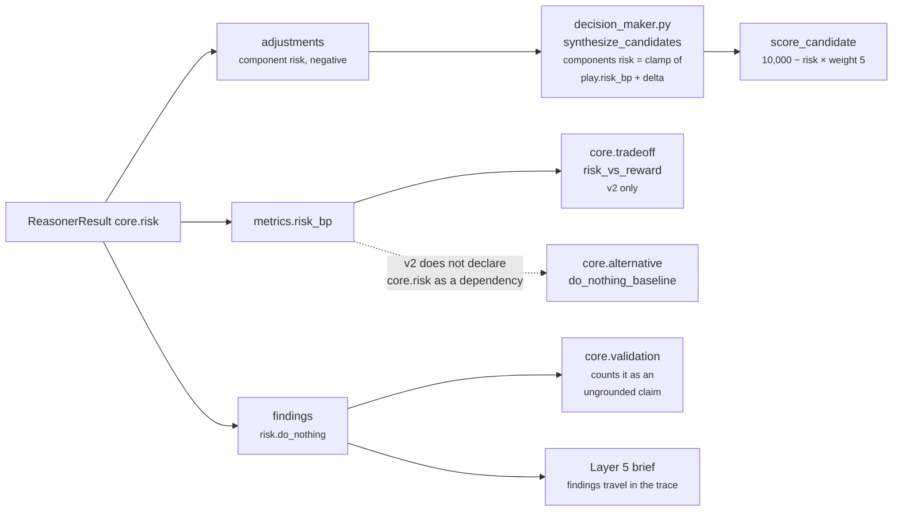

# 06 · Builder and Metrics

**Stages 7 and 8 of eight.** `unit.py:ReasoningUnit.build` — **base class, not overridden** — and the
`publishes` declaration.

---

## 1 · What it is for

Assemble the one object shape every unit returns, and declare — rather than discover — what this
unit is allowed to put into the system's shared metric namespace.

`core.risk` overrides neither. `core.confidence` is the only unit in the roster that overrides
`build`, and it does so to route around the `publishes` guard for a colliding metric name. Nothing
of that kind is needed here: the unit publishes one metric that nobody else publishes.

---

## 2 · What exists

### 2.1 · The declaration

```python
publishes = ("risk_bp",)
```

One name. `test_only_risk_bp_is_published` asserts both the class attribute and the runtime result:

```python
assert set(result.metrics) == {"risk_bp"}
assert RiskUnit.publishes == ("risk_bp",)
```

### 2.2 · The guard, which runs *before* `build`

```python
# unit.py:ReasoningUnit.evaluate
undeclared = sorted(set(verdict.metrics) - set(self.publishes)) if self.publishes else []
if undeclared:
    raise ValueError(f"{self.unit_id} published undeclared metrics: {', '.join(undeclared)}")
return self.build(view, verdict, observations)
```

The guard sits between the Evaluator and the Builder rather than inside it, so a misdeclared unit
fails *before* a well-formed `ReasonerResult` exists — the error reads "this unit is misdeclared",
not "this result contains something surprising". For `core.risk`, `verdict.metrics` is exactly
`{"risk_bp"}`, so `undeclared` is empty on every input.

The escape hatch — `if self.publishes else []` — leaves a unit with an empty tuple unguarded.
`core.risk` is not in it, and `tests/test_unit_roster.py` asserts every roster unit declares
something.

### 2.3 · The base builder

```python
# unit.py:ReasoningUnit.build
evidence = set(view.evidence_ids)
for observation in observations:
    evidence.update(observation.evidence_ids)
return ReasonerResult(
    reasoner_id=self.unit_id,
    reasoner_version=self.version,
    status=ResultStatus.COMPLETED,
    matched=verdict.matched,
    metrics={name: clamp_bp(value) if name.endswith("_bp") else value
             for name, value in verdict.metrics.items()},
    findings=verdict.findings,
    adjustments=verdict.adjustments,
    checks=verdict.checks,
    evidence_ids=tuple(sorted(evidence)),
    reason_codes=verdict.reason_codes,
)
```

Three things it does for this unit:

| What the base does | Effect on `core.risk` |
|---|---|
| Unions `view.evidence_ids` with every observation's | **empty ∪ empty ∪ empty ∪ empty = `()`** — see [02 · Retriever](02-Retriever.md) |
| Re-clamps every `_bp`-suffixed metric | a second clamp on `risk_bp`, which `calculate` already clamped — harmless, and the reason the unit needs no builder of its own |
| Hard-codes `status=COMPLETED` | a unit cannot skip itself; if it tried, `orchestrator.py` overwrites the result with `FAILED` carrying `reasoner_returned_skipped` |

The double clamp is worth one sentence of caution rather than praise. `clamp_bp` is
`min(10_000, max(0, int(value)))`, and `int()` on a `float` **truncates silently** — `clamp_bp(0.7)`
is `0`. `Verdict` validates nothing, so a float `_bp` metric would be quietly truncated here rather
than rejected. `core.risk` cannot hit this: `calculate` returns the output of `clamp_bp`, which is
already an `int`. The hazard belongs to the framework, not to this unit.

### 2.4 · The result this unit produces

| Field | Value for `core.risk` |
|---|---|
| `reasoner_id` | `"core.risk"` |
| `reasoner_version` | `"1.0.0"` |
| `status` | `ResultStatus.COMPLETED` — the only status this unit's own code can produce |
| `matched` | `None`, always |
| `metrics` | `{"risk_bp": <0..10_000>}` |
| `findings` | one `Finding("risk.do_nothing", "risk", ...)` |
| `adjustments` | 0..N, alphabetical by `play_id`, all `component="risk"`, all negative or zero |
| `checks` | `()`, always |
| `evidence_ids` | `()`, always |
| `missing_fields` | `()`, always |
| `reason_codes` | `("deal_momentum_risk",)` |
| `diagnostics` | empty; `compare=False, repr=False`, outside `to_semantic_dict` |

`test_every_visible_field_matches_field_by_field` asserts all of these against the frozen
pre-migration implementation across all fifteen `CASES`.

---

## 3 · How the result is consumed

### 3.1 · The two outputs go to different places



**The published metric and the adjustments are not the same channel, and only one of them ranks
anything.** `synthesize_candidates` seeds `components["risk"]` from `PlayDefinition.risk_bp` — the
play's own authored figure — and applies this unit's adjustments to it. The unit's `risk_bp` is
never read there.

### 3.2 · The consumer audit, verified against the shipped packs

| Consumer | Reads | Declared dependency on `core.risk`? | Live? |
|---|---|---|---|
| `decision_maker.py:synthesize_candidates` | the **adjustments** | n/a — reads all results | **yes, in both capabilities** |
| `tradeoff_unit.py:RiskVersusRewardPlugin` | `risk_bp` as `risk_source` | `sales.deal_cooling_full` declares `core.tradeoff` with `("core.risk", "core.opportunity", "core.impact", "core.cost")` | **yes, in v2** |
| `alternative_unit.py:DoNothingBaselinePlugin` | `risk_bp` as `exposure_source` → `exposure_compounds` | v2 declares `core.alternative` with `("core.constraint", "core.cost")` — **`core.risk` is not in it** | **no** — `view.prior_metric` returns the `-1` sentinel, the signal never fires |
| `validation_unit.py` | the finding, for evidence sufficiency | v2 declares it | yes — and counts `core.risk` as ungrounded |
| Layers 5, 6, 7 | nothing | — | `risk_bp` appears nowhere outside `reason/`, `packs/` and `contracts/` |

The `core.alternative` row is the same structural failure as
[Category 2 §3.5](../README.md)'s account of `core.impact`: a plugin wired to read a metric, in a
capability where the manifest never routes it. `DoNothingBaselinePlugin` composes three signals —
headroom lapsing, momentum decaying, exposure compounding — and in `deal_cooling_full_v2` it can only
ever see the first two. Nothing reports the missing third.

**So the module docstring's premise — "`risk_bp` is consumed by the ranking math" — is false as
shipped.** That is the whole justification for this unit's Law 3 exception (silence reported as
zero). The exception is defensible in principle: a consumer defaulting a missing metric to `0`
genuinely could not distinguish *safe* from *unmeasured*. But `tradeoff_unit.py:_prior_bp` and
`alternative_unit.py:_prior_bp` both use a `-1` sentinel and return `None` on absence, then stay
silent — they already handle the case the exception exists to prevent. The exception survived the
framework migration because changing it would change the semantic hash, which the refactor's
contract forbade, and it should be revisited the next time a hash-breaking change is on the table.

### 3.3 · A worked consumption, `core.tradeoff` in v2

`risk_bp = 7,267` from [04 §5.1](04-Calculator.md); `core.opportunity` reports `opportunity_bp =
10,000`.

```text
tradeoff_unit.py:RiskVersusRewardPlugin
  reward = 10,000      (core.opportunity)
  risk   =  7,267      (core.risk)

  margin  = |10,000 − 7,267|                              = 2,733
  tension = round_half_up(min(10,000, 7,267) × (10,000 − 2,733) / 10,000)
          = round_half_up(7,267 × 7,267 / 10,000)
          = round_half_up(52,809,289 / 10,000)
          = 5,281

  margin 2,733 ≥ decisive_margin_bp 500  →  the axis leans toward "reward"
```

The weaker side sets the ceiling and distance discounts it, so a 2,733bp gap reports a real but
not agonising tradeoff. This is the only place in the system where the unit's published number
changes anything a human reads.

---

## 4 · The metric

| Metric | Type | Range | Meaning | Publisher |
|---|---|---|---|---|
| `risk_bp` | integer basis points | 0–10,000 | what the do-nothing branch costs. `10,000bp` = 1.00 | `core.risk`, exclusively |

**Exclusivity is enforced at design time, not at runtime.**
`tests/test_unit_roster.py::test_no_unit_publishes_a_metric_another_unit_owns` reads
`getattr(instance, "publishes", ())`, so the six supplementary reasoners are invisible to it — but
none of them emits `risk_bp`, and no framework unit declares it. `risk_bp` is also **not** one of
the three authority-resolved metrics (`confidence_bp`, `urgency_bp`, `priority_override_bp`), so
there is no `decision_maker.py` scan that would arbitrate between two publishers if one ever
appeared.

**How to read a value.** In `sales.deal_cooling` the live range is 4,000–10,000 (see
[04 §5.4](04-Calculator.md)), because the gating rule on `core.temporal` means a warm deal never
reaches this unit and the 1,000bp floor sets the bottom. A reader treating 4,000bp as "low risk" is
reading this capability's floor, not a measurement of safety. And 9,000bp and 11,000bp both report
as 10,000, so the top of the range does not discriminate.

---

## 5 · The whole result, and its hash

### 5.1 · One complete object

Prior: `core.temporal` `drop_bp = 6,000`; `core.relationship` `relationship_risk_bp = 6,667`.
Config: the shipped `sales.deal_cooling` block, read from the pack.

```text
ReasonerResult(
  reasoner_id      = "core.risk",
  reasoner_version = "1.0.0",
  status           = COMPLETED,
  matched          = None,
  metrics          = {"risk_bp": 7267},
  findings         = (Finding("risk.do_nothing", "risk", matched=None,
                              metrics={"risk_bp": 7267},
                              reason_codes=("deal_momentum_risk",)),),
  adjustments      = (("clarify_next_step",   "risk", -1200, "play_mitigates_detected_risk"),
                      ("multithread_account", "risk", -1600, "play_mitigates_detected_risk"),
                      ("restore_momentum",    "risk", -1800, "play_mitigates_detected_risk")),
  checks           = (),
  evidence_ids     = (),
  missing_fields   = (),
  reason_codes     = ("deal_momentum_risk",),
)

semantic_hash = 22bf260d92f4cfb43dd77cdd66bc7cf12b3957e00859690902f27f1a29290a98
```

Reproduce it:

```python
from tests.test_unit_risk import _run, _completed, SHIPPED_CONFIG
_run((_completed("core.temporal", drop_bp=6_000),
      _completed("core.relationship", relationship_risk_bp=6_667)),
     config=SHIPPED_CONFIG).semantic_hash
```

That hash is a property of the current contract layer as much as of this unit. It is quoted here so
a reader can check the documentation against the code in one command, not as a value anything should
depend on.

### 5.2 · What the hash covers, and the three sorts that keep it stable

`ReasonerResult.to_semantic_dict` includes `matched`, `metrics`, `findings`, `adjustments`, `checks`,
`evidence_ids`, `missing_fields` and `reason_codes`. `diagnostics` is outside it, so a failure
message can never move a hash.

Three orderings inside that dict are decided by content rather than by arrival:

| Sort | Where | What it prevents |
|---|---|---|
| plugins by `plugin_id` | `unit.py:analyze` | registration order reaching the hash |
| `sorted(observation.metrics)` | `risk.py:evaluate_meaning` | a JSON round trip through the audit store re-ordering adjustments and reporting every replayed run as non-reproducible |
| `sorted(set(...))` on `reason_codes`, `evidence_ids` | `ReasonerResult.__post_init__` | duplicate or reordered codes |

Four tests defend the determinism directly:

| Test | Property |
|---|---|
| `test_the_migrated_unit_hashes_identically_to_the_one_it_replaced` | the framework migration was a pure refactor, across all 15 `CASES` |
| `test_the_same_input_twice_gives_the_same_hash` | idempotence |
| `test_prior_result_arrival_order_cannot_move_the_hash` | the `prior` mapping's key order is not an input |
| `test_a_config_key_permutation_cannot_move_the_result_hash` | the shipped config in two key orders, including the nested mitigation table |

### 5.3 · Identity, pinned in three places

```python
# test_identity_is_frozen_because_capabilities_pin_it
assert unit.spec.reasoner_id == "core.risk"
assert unit.spec.version     == "1.0.0"
assert unit.category is UnitCategory.BUSINESS_EVALUATION
assert isinstance(unit, Reasoner) and isinstance(unit, ReasoningUnit)

# test_the_capability_still_declares_the_version_this_unit_answers_to
spec = next(item for item in DEAL_COOLING_V1.reasoners if item.reasoner_id == "core.risk")
assert (spec.reasoner_id, spec.version) == (RiskUnit.unit_id, RiskUnit.version)

# test_the_legacy_class_name_still_resolves
assert RiskReasoner is RiskUnit
```

The version is pinned from the capability side as well as from the unit side, so bumping
`RiskUnit.version` without re-authoring the pack is a red test rather than a silent mismatch between
a manifest and the code that answers to it.

---

## Back to

[README — the unit's map](README.md)
