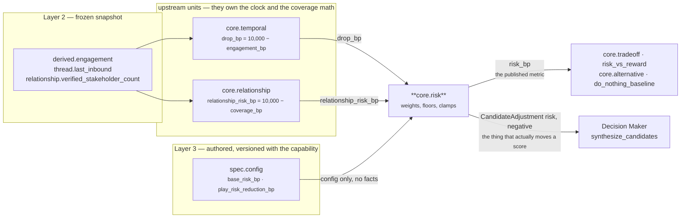
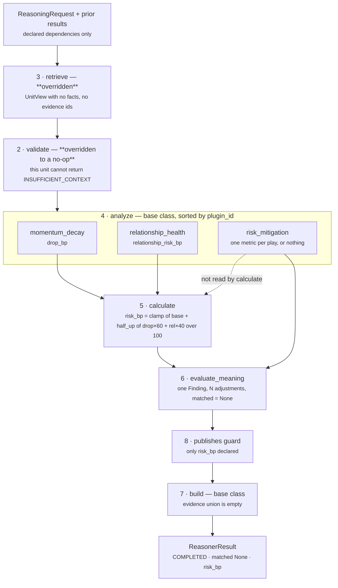

# `core.risk` — the Risk Unit

**Module:** `genios_engine/reason/reasoners/risk.py` (251 lines, 3 plugins)
**Tests:** `tests/test_unit_risk.py` — 66 passing
**Category:** `UnitCategory.BUSINESS_EVALUATION`
**Question it answers:** *what does it cost us if nobody does anything?*

```
cd /Users/rohitswerashi/genios-brain && .venv/bin/python -m pytest tests/test_unit_risk.py -q
66 passed
```

---

## 1 · What it is for

Risk here is not a mood and not a forecast. It is **the downside already visible in the situation** —
the price of the *do nothing* branch — expressed as one number in basis points.

The unit derives nothing itself. Two other units already measured the two exposures that matter, and
this unit only **weights** them:

| Exposure | Measured by | Metric read | Business reading |
|---|---|---|---|
| Momentum decay | `core.temporal` | `drop_bp` | the deal has gone quiet |
| Relationship health | `core.relationship` | `relationship_risk_bp` | the account is thinly held |

Both are exposures of the same branch, which is why the single finding the unit emits is literally
named `risk.do_nothing`.

**The unit has no opinion about what to do instead.** It reports the size of the downside and stops.
That is why `matched` is always `None` — risk is a magnitude, not a gate, and collapsing it into a
boolean would make this unit a decision authority. Where a capability author has said that a play
reduces the risk it addresses, the unit emits that authored figure as a negative `risk` adjustment
and lets the Decision Maker do the choosing.

---

## 2 · Its place in the pipeline



The split in the two outbound arrows is the single most important thing to understand about this
unit, and it is not what the module docstring claims. **The published `risk_bp` metric does not
reach the ranking math.** `decision_maker.py:synthesize_candidates` seeds each candidate's `risk`
component from the *play's* authored `PlayDefinition.risk_bp` and then applies this unit's
adjustments to it. The unit's own `risk_bp` is read only by `core.tradeoff` and `core.alternative` —
and of those two only `core.tradeoff` is wired to receive it, in `sales.deal_cooling_full` v2. See
[06 · Builder & Metrics](06-Builder-and-Metrics.md) for the full consumer audit.

`core.risk` is declared with `dependencies=("core.temporal", "core.relationship")` in
`packs/capabilities/deal_cooling.py` and `failure_policy=FailurePolicy.REQUIRED`,
`latency_budget_ms=20`. Its `input_kind` is `"reasoner_results"` — the only unit in the category
whose declared input is other units rather than the snapshot.

---

## 3 · What exists

```python
# risk.py:RiskUnit
unit_id   = "core.risk"
version   = "1.0.0"
category  = UnitCategory.BUSINESS_EVALUATION
publishes = ("risk_bp",)
plugins   = (MomentumDecayPlugin(), PlayMitigationPlugin(), RelationshipHealthPlugin())
```

`risk.py:RiskReasoner` is an alias of `RiskUnit`, kept so the migration onto the unit framework is
invisible to `reasoners/__init__.py` and to any pinned manifest. `test_the_legacy_class_name_still_resolves`
pins it.

### 3.1 · Module constants

| Constant | Value | Why it exists |
|---|---|---|
| `RISK_REASON_CODE` | `"deal_momentum_risk"` | the one code on the result and its finding |
| `RISK_MITIGATION_REASON` | `"play_mitigates_detected_risk"` | carried by every adjustment, so an auditor sees the authored mitigation named rather than the unit |
| `MOMENTUM_WEIGHT` | `60` | decay leads: a deal that has stopped moving is the nearer loss |
| `RELATIONSHIP_WEIGHT` | `40` | thin coverage is the slower loss |
| `WEIGHT_BASIS` | `100` | the divisor; integers throughout |
| `MOMENTUM_PLUGIN` | `"momentum_decay"` | named so a rename cannot silently turn a contribution into a zero |
| `RELATIONSHIP_PLUGIN` | `"relationship_health"` | as above |
| `MITIGATION_PLUGIN` | `"risk_mitigation"` | as above |

The 60/40 weights are **named but not configurable**, deliberately: *"moving these would re-score
every shipped decision."* `base_risk_bp` *is* configurable, because how much irreducible exposure a
capability carries is a per-domain judgement.

### 3.2 · The plugins

Registered in class-body order `momentum_decay · risk_mitigation · relationship_health`, executed by
`unit.py:ReasoningUnit.analyze` in `plugin_id` order — which here happens to be alphabetical and
therefore differs from registration order:

| # | `plugin_id` | Class | Reads | Observation `kind` | Metrics emitted | Reason code | Stays silent when |
|---|---|---|---|---|---|---|---|
| 1 | `momentum_decay` | `MomentumDecayPlugin` | `prior[temporal_reasoner].drop_bp` | `risk.momentum_decay` | `drop_bp` | `momentum_decay_exposure` | **never** — absence is reported as 0 |
| 2 | `relationship_health` | `RelationshipHealthPlugin` | `prior[relationship_reasoner].relationship_risk_bp` | `risk.relationship_health` | `relationship_risk_bp` | `relationship_exposure` | **never** — absence is reported as 0 |
| 3 | `risk_mitigation` | `PlayMitigationPlugin` | `config.play_risk_reduction_bp` | `risk.play_mitigation` | one entry per `play_id` | `play_mitigates_detected_risk` | table absent or empty → returns `()` |

Two of the three plugins never stay silent. That is the documented Law 3 exception; see §6.

### 3.3 · Published metrics

| Metric | Range | Meaning | Consumed by |
|---|---|---|---|
| `risk_bp` | 0–10,000 | the cost of the do-nothing branch, `10,000bp` = 1.00 | `core.tradeoff:RiskVersusRewardPlugin` — live in `sales.deal_cooling_full` v2. `core.alternative:DoNothingBaselinePlugin` — wired to read it, but v2 does not declare `core.risk` among its dependencies, so it never sees it |

`publishes` is exactly `("risk_bp",)`, so the framework's undeclared-metric guard in
`unit.py:ReasoningUnit.evaluate` would raise on anything else. `test_only_risk_bp_is_published` pins it.

---

## 4 · The internal flow



Note the dotted edge. The `risk_mitigation` observation is produced during `analyze` but is **not
read by `calculate`** — it flows straight to `evaluate_meaning`, which turns it into adjustments. An
authored mitigation never changes this unit's own `risk_bp`; it changes a *candidate's* risk
component downstream. Those are different numbers on purpose: the unit reports the exposure that
exists, not the exposure that would remain if a play were run.

---

## 5 · Every config key

All four are read from `ReasonerSpec.config` — authored in Layer 3, versioned with the capability,
and reachable through `UnitView.config`. Nothing else in the config is read by this unit.

| Key | Type | Default | Read by | Validation | Shipped value in `sales.deal_cooling` |
|---|---|---|---|---|---|
| `temporal_reasoner` | string | `"core.temporal"` | `MomentumDecayPlugin` | `str(...)` coercion only — **an id naming a unit that is not a declared dependency silently yields 0** | `"core.temporal"` |
| `relationship_reasoner` | string | `"core.relationship"` | `RelationshipHealthPlugin` | same | `"core.relationship"` |
| `base_risk_bp` | basis points | `1_000` | `RiskUnit.calculate` | `common.py:basis_points` — integer, `0..10_000`, raises otherwise | `1_000` |
| `play_risk_reduction_bp` | `{play_id: bp}` | absent / `{}` → no observation | `PlayMitigationPlugin` | `common.py:basis_points` per entry, labelled `"<play_id>.risk_reduction_bp"` | `{restore_momentum: 1_800, multithread_account: 1_600, clarify_next_step: 1_200}` |

`basis_points` accepts an `int`, a `Decimal` with no fractional part, or a **string** that parses as
one — `"4200"` and `"4200.0"` both yield `4200`. It rejects `float` unconditionally, `bool`
explicitly, `None`, unparseable strings, and anything outside `0..10_000`. Every rejection is a
`ValueError` that the orchestrator turns into `ResultStatus.FAILED`; because the shipped spec sets
`failure_policy=REQUIRED`, a malformed config key terminates the capability rather than degrading
it. `test_a_malformed_floor_is_an_authoring_fault_not_a_silent_default` pins all six rejection cases.

---

## 6 · Silence semantics

**This unit is the layer's documented exception to Law 3 — "silence is not zero".**

`risk.py:_published` treats "the dependency did not run" as `0` rather than as an omission, and
`calculate` therefore always publishes `risk_bp`. The docstring's argument:

> *`risk_bp` is consumed by the ranking math, and a missing `risk_bp` would be read downstream as
> "unknown", not "low" — so the unit reports the risk it can actually evidence and lets the floor
> carry the rest. This is a documented asymmetry, not an oversight.*

The stated premise is false as shipped: `risk_bp` is not read by the ranking math (§2). It survived
the framework migration because changing it would change the semantic hash, which the refactor's
contract forbade. `core.impact` made the opposite call in the same category.

There is a second, sharper reason the exception is currently inert. In **both** shipped capabilities
`core.temporal` and `core.relationship` are declared `FailurePolicy.REQUIRED` and `gating=True`. A
dependency that fails, or that reports `matched is False`, sets the run's terminal outcome, and the
orchestrator then records `core.risk` as `SKIPPED` without ever calling it. So the "dependency did
not run" path that `_published`'s zero exists to survive **cannot be reached in production** — by
the time `core.risk` evaluates, both dependencies have completed. See
[03a §4.3](03a-plugin-momentum_decay.md) and [03b §4.4](03b-plugin-relationship_health.md).

Consequences, all pinned by tests:

| Situation | What the unit does |
|---|---|
| No prior results at all | publishes `risk_bp = base_risk_bp` — the floor alone |
| A dependency ran but published no `drop_bp` | contributes `0`; no reason code says so |
| A dependency was `SKIPPED` or `INSUFFICIENT_CONTEXT` | contributes `0`; indistinguishable from a healthy deal |
| No `play_risk_reduction_bp` authored | `PlayMitigationPlugin` returns `()` — **this one silence is real**, and no adjustment is emitted |

The third row is the one that should worry a reviewer: a `core.relationship` that returned
`INSUFFICIENT_CONTEXT` because the stakeholder count was never synced produces exactly the same
`risk_bp` as a perfectly covered account. Nothing in the result distinguishes them.

---

## 7 · Known compromises, in one place

| # | What | Where it is argued |
|---|---|---|
| 1 | Silence is zero, against Law 3, on a premise that is currently false — and the path it defends is unreachable in both shipped capabilities | §6, [03a](03a-plugin-momentum_decay.md), [03b](03b-plugin-relationship_health.md), [06](06-Builder-and-Metrics.md) |
| 2 | The unit cites no evidence, so `core.validation` counts it as an ungrounded claim | [02 · Retriever](02-Retriever.md) |
| 3 | A redirected `temporal_reasoner` that is not a declared dependency silently reads 0 | [03a](03a-plugin-momentum_decay.md) |
| 4 | `_published`'s loud-failure path is unreachable — the contract already validates `_bp` metrics | [03 · Analyzer](03-Analyzer.md) |
| 5 | `divide_half_up`'s tie-break is unreachable: with weights 60/40 the numerator is always a multiple of 20 | [04 · Calculator](04-Calculator.md) |
| 6 | Two of three shipped mitigations exceed their play's authored risk floor and are truncated by the clamp | [05 · Evaluator](05-Evaluator.md) |
| 7 | A zero-valued authored mitigation emits a zero-delta adjustment into the hash | [05 · Evaluator](05-Evaluator.md) |
| 8 | `PlayMitigationPlugin`'s own `sorted()` is defensive — the load-bearing sort is in `evaluate_meaning` | [03c](03c-plugin-risk_mitigation.md) |
| 9 | The 60/40 blend and the 1,000bp floor are inherited constants, never fitted to data | [04 · Calculator](04-Calculator.md) |
| 10 | Adjustments to one component are clamped per-delta and therefore non-commutative, and a second writer on `risk` can be added from Layer 3 config alone — `core.temporal` takes its component name from the authored table, and `"risk"` is a legal member of `CANDIDATE_COMPONENTS` | [05 · Evaluator §4.2](05-Evaluator.md) |

---

## 8 · The files

| File | Covers |
|---|---|
| [01 · Input & Validator](01-Input-and-Validator.md) | What arrives, why `validate()` is overridden to nothing, and why this unit has never returned `INSUFFICIENT_CONTEXT` |
| [02 · Retriever](02-Retriever.md) | Why `retrieve()` returns a view with no facts and no evidence ids, and what that costs at `core.validation` |
| [03 · Analyzer](03-Analyzer.md) | The plugin seam: execution order, the two readers `_published` and `_observed`, and how the three contributions interact |
| [03a · `momentum_decay`](03a-plugin-momentum_decay.md) | Reading `drop_bp` rather than re-deriving it; the redirect trap |
| [03b · `relationship_health`](03b-plugin-relationship_health.md) | Reading `relationship_risk_bp`; why coverage is a separate term rather than a modifier |
| [03c · `risk_mitigation`](03c-plugin-risk_mitigation.md) | The authored table, its validation, and the ordering that keeps replay reproducible |
| [04 · Calculator](04-Calculator.md) | `risk_bp = clamp(base + half_up((drop·60 + rel·40)/100))` in full, and why that shape |
| [05 · Evaluator](05-Evaluator.md) | The single `risk.do_nothing` finding, the adjustments, and why `matched` is `None` |
| [06 · Builder & Metrics](06-Builder-and-Metrics.md) | The `ReasonerResult` shape, the `publishes` guard, and who actually consumes `risk_bp` |

## Related

| Document | Covers |
|---|---|
| [Category 2 · Business Evaluation](../README.md) | The five units of this category and how they relate |
| [Part 2 · The Unit Framework](../../README.md) | The eight stages, the plugin seam, the roster invariants |
| [Layer 4 · Overview](../../../00-Overview.md) | The three parts and the rules this layer never breaks |
| [Part 3 · Decision Maker](../../../03-Decision-Maker/README.md) | `synthesize_candidates` and `score_candidate`, which consume the adjustments |
