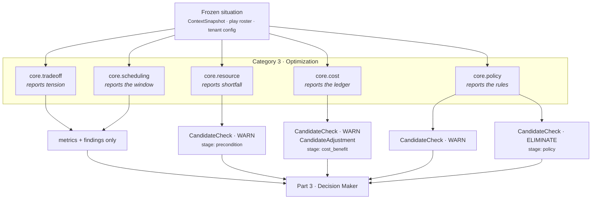
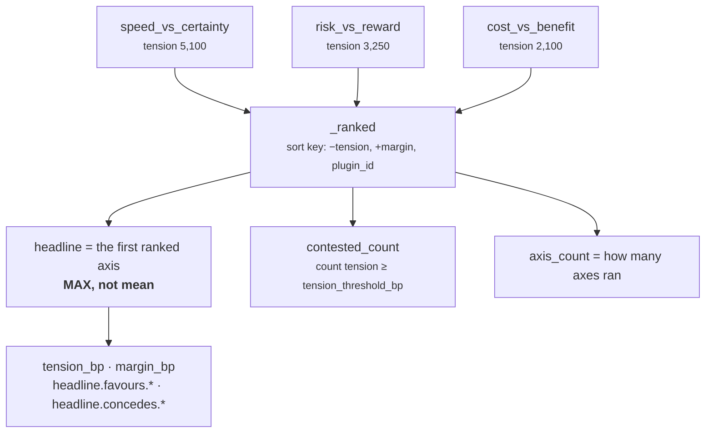
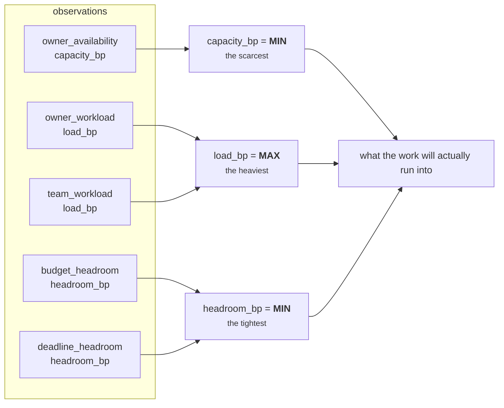
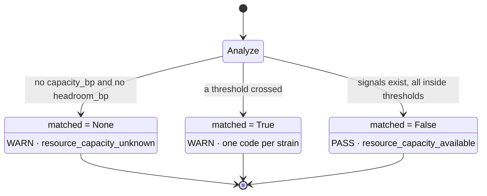
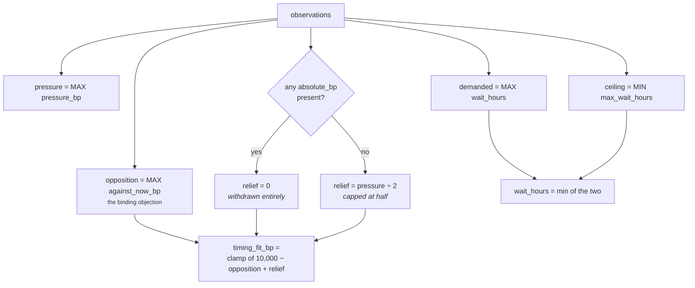
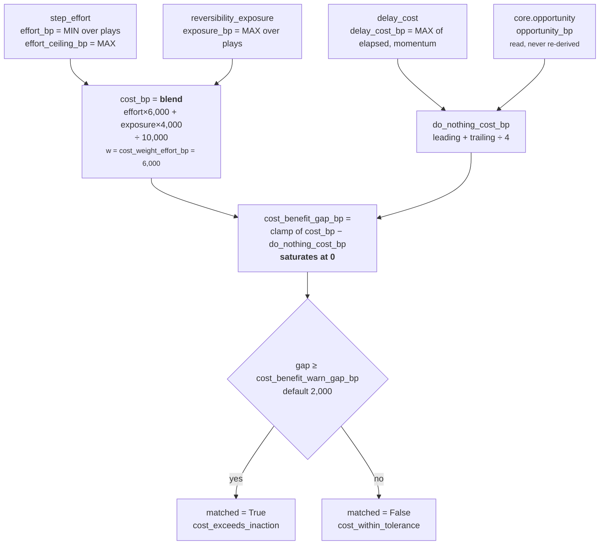
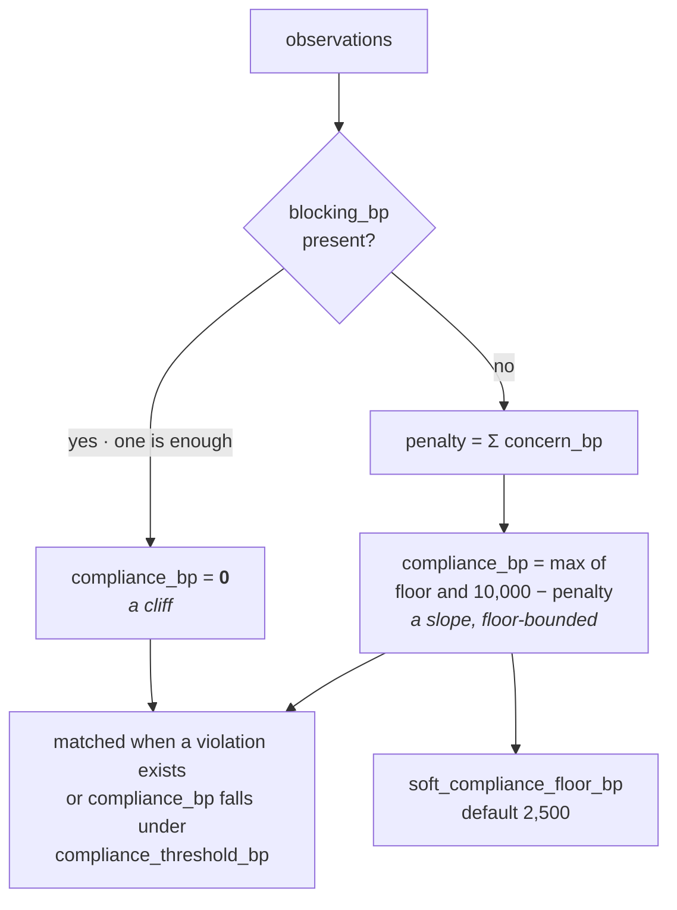
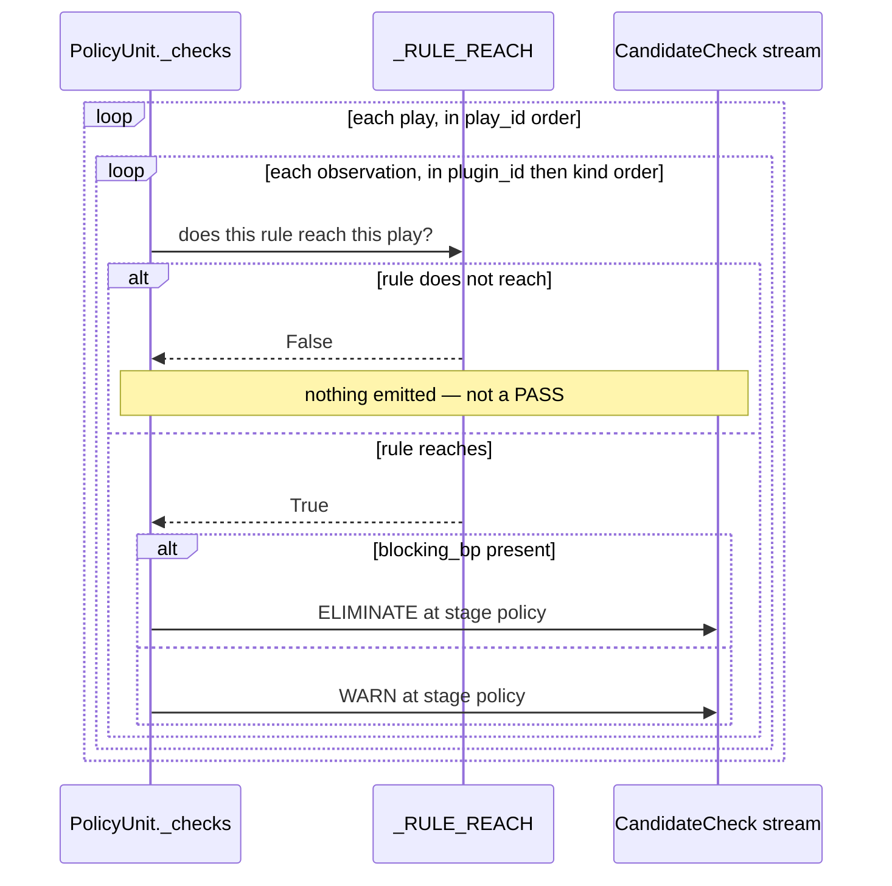

# Category 3 · Optimization

**Package:** `genios_engine/reason/reasoners/`
**Question the category answers:** *Among the possible paths, which is best and when?*
**Units:** `core.tradeoff` · `core.resource` · `core.scheduling` · `core.cost` · `core.policy`

Categories 1 and 2 establish what is true and what it is worth. This category is the first place a
unit looks at the *roster of plays* rather than only at the situation, and the first place a unit is
allowed to remove one. It is where the engine stops asking "is this real?" and starts asking "can we
do it, should we pay for it, may we, and is now the moment?"

| Unit | Answers | May emit | Reads |
|---|---|---|---|
| `core.tradeoff` | Which competing objective the evidence favours, and what is conceded | nothing — metrics and findings only | other units' published metrics |
| `core.resource` | Can the organisation actually staff, fund and fit this? | `precondition` **WARN** | Layer 2 facts |
| `core.scheduling` | Does the clock allow this now, and if not, when? | nothing — metrics and findings only | Layer 2 facts |
| `core.cost` | What does acting cost, and does that cost look worth paying? | `effort` adjustments, `cost_benefit` **WARN** | play roster + prior metrics |
| `core.policy` | What does this organisation forbid or require here? | `policy` **WARN** and **ELIMINATE** | tenant config + Layer 2 facts |

Read [02 · Unit Framework](../README.md) first if the eight stages are unfamiliar. Every
unit below is a `ReasoningUnit` subclass at version `1.0.0` with `category =
UnitCategory.OPTIMIZATION`, and all of them run through the same non-overridable template method
`unit.py:ReasoningUnit.evaluate`.

---

## 1 · What the blueprint asked for

The architecture names the category and its members without elaboration:

| Category | Units | Purpose |
|---|---|---|
| 3 · Optimization | Tradeoff, Resource, Scheduling, Cost, Policy | Find the best path |

The repo's own roster file restates it more usefully — `reasoners/__init__.py`:

> *Category 3 — Optimization: among the possible paths, which is best and when.*

Two blueprint constraints do most of the work in this category, and they pull against each other.

The first is the single-authority rule, quoted in [00 · Overview](../../00-Overview.md):

> *If it starts making decisions, then you've accidentally created two reasoning engines. That's
> architectural leakage. There should only be one place where thinking happens.*

Applied literally, no unit may choose, rank, or veto. The second constraint is the fail-closed law:
a run that cannot be shown to be permitted must not produce advice. A capability that can email a
customer needs *something* below the Decision Maker that can say "no, not this one" — because by the
time Part 3 is ranking candidates it is weighing options, and an organisation's compliance rules are
not options.

The category resolves this by splitting authority rather than sharing it. Four units report and one
unit forbids. `core.policy` is the only unit in Category 3 that emits `ELIMINATE`, and it does so
only for a rule the tenant wrote down and only against the plays that rule actually reaches.

The blueprint also asks for plugins inside the Analyzer:

> *…I would go one level deeper. Analyzer should itself have plugins. Now Risk isn't one algorithm.
> It's 20 small deterministic algorithms.*

All five units are built that way: seventeen analyzer plugins across the category, three or four per
unit, each answering one question against one family of facts.

**What the blueprint did not ask for, and is not here.** There is no optimiser in the operations-
research sense — no search, no objective function, no solver. "Optimization" here means *measure
each dimension of feasibility honestly and hand the numbers up*. Nothing in this category compares
two plays and returns a winner; that is [07 · Decision Maker](../../03-Decision-Maker/README.md).

---

## 2 · What exists

Five units, seventeen plugins, roughly 1,860 lines of source and 2,200 lines of executable contract.

| Unit | File | Lines | Plugins | Tests |
|---|---|---|---|---|
| `core.tradeoff` | `reasoners/tradeoff_unit.py` | 260 | 3 | 24 |
| `core.resource` | `reasoners/resource_unit.py` | 373 | 3 | 33 |
| `core.scheduling` | `reasoners/scheduling_unit.py` | 318 | 4 | 28 |
| `core.cost` | `reasoners/cost_unit.py` | 375 | 3 | 25 |
| `core.policy` | `reasoners/policy_unit.py` | 531 | 3 | 37 |

All five are registered explicitly in `reasoners/__init__.py:OPTIMIZATION` and reach the runtime only
through `reasoners/__init__.py:default_registry`. There is no auto-discovery — a unit that exists but
is named by no capability costs nothing, and a unit named by a capability but absent from the
registry is a failed deployment rather than a quiet degradation.

### The authority gradient



The diagram's point is the asymmetry on the right. Four of the five units can only ever *inform*
Part 3; the fifth can shrink the field before Part 3 sees it. That is the whole design argument of
this category, and section 3.1 defends it.

`decision_maker.py` treats any `ELIMINATE` check as terminal for that play —
`decision_maker.py:evaluate_candidates` sets `CandidateDisposition.ELIMINATED` if *any* check on the
play carries that outcome, and elimination happens **before** ranking. So a policy breach does not
lose the ranking, it never enters it.

### Deployment status

`packs/capabilities/deal_cooling_v2.py` — `sales.deal_cooling_full` — is the only shipped capability
that names these units. All five are declared `FailurePolicy.OPTIONAL` with a 60 ms latency budget,
and the manifest ships with `live_delivery_enabled=False`: it runs in shadow beside v1 and advises
nobody yet. The activation sequence is [Rohit_Updates/Layer 4.md](../../../../Rohit_Updates/Layer%204.md)'s
subject, not this document's.

What that manifest declares, verbatim from `deal_cooling_v2.py:_full_roster`:

| Unit | `dependencies` | `config` |
|---|---|---|
| `core.resource` | — | — |
| `core.scheduling` | — | — |
| `core.cost` | — | `play_effort_bp: {multithread_account: 600}` |
| `core.policy` | — | — |
| `core.tradeoff` | `core.cost`, `core.impact`, `core.opportunity`, `core.risk` | — |

Three of those five rows are load-bearing gaps, and section 3.4 opens them up.

---

## 3 · The gap, and why

### 3.1 · Why only `core.policy` may eliminate — and why "only two units" is wrong

The category-level rule the code enforces is: **capacity is a caution, cost is a caution,
organisation policy is not.**

`resource_unit.py:ResourceUnit.evaluate_meaning` argues it directly:

> *No outcome is ever ELIMINATE. Capacity is a caution this unit reports; whether a shortfall should
> stop a play is a decision, and decisions are Part 3's.*

A saturated owner can still be the right person to send one email. A human reading the card is a
better judge of that than a threshold, and a threshold that removed the play would remove the human's
ability to overrule it. Same for cost — `cost_unit.py:CostUnit._cost_benefit_checks`:

> *Cost is one voice at the table; a unit that could eliminate on price alone would quietly become
> the decision authority.*

Policy is different in kind. From `policy_unit.py:PolicyUnit._checks`:

> *Breaches fail closed with ELIMINATE — that is the whole reason this unit exists, and it is the one
> place in Part 2 where a unit is allowed to remove an option, because "the business forbids this" is
> not a trade-off the Decision Maker gets to weigh.*

The distinction is about *who owns the judgement*. A capacity shortfall is a fact about the world
that a human may reasonably override. A do-not-contact record is a decision the organisation already
made; re-weighing it in Part 3 would mean the engine is entitled to conclude that this deal is
valuable enough to ignore it. It is not.

**Correction to the working brief.** `core.policy` is described as "one of only two units allowed to
ELIMINATE". Three units in the roster emit `CheckOutcome.ELIMINATE`:

| Unit | Stage | Grounds |
|---|---|---|
| `core.constraint` | `precondition`, `policy` | the *capability's* declared policies and play preconditions |
| `core.policy` | `policy` | the *tenant's* written organisation rules |
| `core.validation` | `safety` | `safe_bp` below `safety_floor_bp` — the reasoning basis itself is unsound |

`core.policy` is the only one in Category 3, and the only one whose grounds are tenant-owned rather
than pack-owned or engine-owned. That is the sharper claim and the one the code supports.

### 3.2 · Why `core.policy` is not `core.constraint`

The two look like duplicates and are not. `policy_unit.py`'s module docstring draws the line by blast
radius:

> *`core.constraint` enforces what the capability declared: its `policies` tuple … Organisation
> policy is different in kind: it is tenant-owned, it changes when the business changes and not when
> the pack does, and it is carried in this unit's `ReasonerSpec.config` so a customer can tighten
> their own rules without anyone editing a play.*

The code enforces the separation by omission: nothing in `policy_unit.py` reads
`capability.policies` or play preconditions. If it did, the same rule would be evaluated twice by two
authorities that could disagree, and there would be no way to tell which answer was correct.

One deliberate exception. `policy_unit.py:_carries_human_approval` reads
`metadata["execution_boundary"] == "human_approval_required"` and the `human_approval` tag — the same
two signals `core.constraint` uses — precisely so that a play cannot satisfy one approval authority
and fail the other because the two read different fields.

### 3.3 · Deliberate silences

Every unit in the category refuses to produce a number it did not measure. This is Law 3 from the
overview ("silence is not zero") applied five different ways, and it is the single most repeated
decision in the source.

| Unit | The silence | The fabrication it prevents |
|---|---|---|
| `core.tradeoff` | one side of an axis missing → no axis at all | risk without opportunity reads as "all downside" |
| `core.resource` | no capacity fact → `capacity_bp` omitted, not zeroed | every play looks infeasible |
| `core.scheduling` | no calendar fact → no observation | a fabricated "wait 24 hours" is indistinguishable from a measured one |
| `core.cost` | no dated silence and no momentum → no delay cost | "delay is free" — the most expensive thing this unit could say |
| `core.policy` | no tenant rule → nothing at all | a policy no customer agreed to and nobody can find in their handbook |

`core.resource` goes furthest: it distinguishes *unmeasured* from *measured-empty*. An owner field
that Layer 2 never captured is silence. An owner field that Layer 2 captured as empty is evidence of
zero capacity — someone looked, and there was no one (`resource_unit.py:OwnerAvailabilityPlugin`,
gated on `"deal.owner" in request.context.facts`).

### 3.4 · What is dark in the shipped manifest

Three findings, all reproducible against `DEAL_COOLING_FULL_V2` today.

**`core.effort` does not exist.** `tradeoff_unit.py:CostVersusBenefitPlugin` defaults its
`cost_source` to `core.effort`, reading metric `effort_bp`. No unit in the roster declares
`unit_id = "core.effort"` — the metric `effort_bp` is published by `core.cost`. The axis is therefore
silent under default configuration. The plugin's docstring half-acknowledges it ("*where neither has
been deployed the plugin stays silent rather than treating unmeasured effort as free*"), which is the
right behaviour but the wrong default: the authority exists, it is just named differently. Setting
`cost_source: "core.cost"` in capability config lights the axis with no code change.

**Only one of three tradeoff axes fires.** `core.tradeoff` sees only the priors it declared as
`dependencies` (`orchestrator.py` builds `{item: prior[item] for item in spec.dependencies}` — *"a
reasoner can see only dependencies it declared in the capability DAG"*). The shipped manifest
declares `core.cost`, `core.impact`, `core.opportunity`, `core.risk`. It does not declare
`core.temporal` or `core.confidence`, so `speed_vs_certainty` is dark; and `cost_vs_benefit` is dark
for the reason above. Measured against the shipped manifest with realistic priors:

```text
shipped:                       axis_count = 1   (risk_vs_reward only)
with cost_source=core.cost:    axis_count = 2
```

The unit is working exactly as designed. The manifest is under-wired.

**`play_effort_bp` is read by nothing.** `deal_cooling_v2.py` configures `core.cost` with
`play_effort_bp: {multithread_account: 600}` and a comment explaining that multithreading spends
relationship capital. `cost_unit.py` reads no such key — its effort knobs are `step_effort_bp`,
`effort_mismatch_tolerance_bp` and `max_effort_adjustment_bp`. The analogous key on `core.impact`
*is* real (`impact_unit.py` reads `play_impact_bp`), which is presumably where the name came from.
The config is inert; the intended per-play effort weighting does not happen. Unlike a malformed
value, an *unknown* key is not rejected — `view.config.get(key, default)` cannot know the difference
between a key nobody set and a key somebody misspelled.

### 3.5 · Thresholds are guesses

Every default in this category was authored from domain reasoning, not fitted to outcome data. That
is stated plainly rather than buried: the tuning table in `Rohit_Updates/Layer 4.md` lists
`core.policy soft_compliance_floor_bp` and `core.cost cost_weight_effort_bp` among the numbers that
will matter first. Nothing here has been calibrated against a real precision window. All of it is
per-capability config, so tuning one tenant cannot move another.

---

## 4 · How it works inside

Common ground first. Every unit validates its own config rather than trusting Layer 3, and every one
of them refuses rather than coerces — from `scheduling_unit.py:_config_bp`:

> *A float or an out-of-range threshold authored in Layer 3 must fail loudly here rather than be
> coerced: silent coercion would change decision hashes without changing the manifest.*

The arithmetic is integer basis points throughout: `0`–`10,000`, where `7,500bp` means `0.75`. Two
helpers from `reasoners/common.py` do all the rounding: `clamp_bp` saturates to `[0, 10000]`, and
`divide_half_up(n, d)` is integer division with half-up rounding and a symmetric negative branch. No
float ever enters a metric — `Observation.__post_init__` raises on a non-integer metric value, and
`ReasoningUnit.build` re-clamps every `_bp`-suffixed metric on the way out.

---

### 4.1 · `core.tradeoff` — the maximum, never the mean

**Publishes:** `tension_bp`, `margin_bp`, `axis_count`, `contested_count`
**Plugins:** `cost_vs_benefit`, `risk_vs_reward`, `speed_vs_certainty`

Every other unit in Layer 4 is honest inside one frame. Risk looks at downside, opportunity at
upside, temporal at time pressure. Nobody, until this unit, holds two frames against each other. It
reads only metrics other units already published, so it adds no fact dependency and can be scheduled
last in any capability.

#### The three axes

| Plugin | Side A | Side B | Config keys |
|---|---|---|---|
| `speed_vs_certainty` | `core.temporal.urgency_bp` | `10,000 − core.confidence.confidence_bp` | `speed_source`, `certainty_source` |
| `risk_vs_reward` | `core.opportunity.opportunity_bp` | `core.risk.risk_bp` | `reward_source`, `risk_source` |
| `cost_vs_benefit` | `core.impact.impact_bp` | `core.effort.effort_bp` | `benefit_source`, `cost_source` |

The inversion on the certainty side is the whole point of that axis. Time pressure is what temporal
measured; the pull in the other direction is *doubt*, which is the complement of published
confidence. Acting fast is only cheap when we are sure.

This unit reads `confidence_bp`; it must never publish it. `core.confidence` is its sole authority,
and `tests/test_unit_roster.py` enforces that no second publisher can appear.

#### Absence versus zero

```python
_ABSENT = -1
```

Basis points are `0..10000` by law, so a negative sentinel can never collide with a real published
value. `_prior_bp` asks `view.prior_metric(unit, metric, _ABSENT)` and maps the sentinel to `None`.
`UnitView.prior_metric` itself returns the default when the dependency did not run *or* did not
complete — so a **crashed** opportunity unit is treated as absent, not as "no upside". Reading a
failed unit as zero would invert the call.

#### The tension formula

```text
margin  = |A − B|
tension = min(A, B) × (10,000 − margin) ÷ 10,000        half-up
```

Two judgements are encoded, and `tradeoff_unit.py:_weigh` argues both:

* **The weaker side sets the ceiling.** Enormous upside against no downside is not a dilemma, it is a
  free move. Using the stronger side would make every strong opportunity look agonising.
* **Distance discounts it.** Both strong *and* close is the situation a human has to think about; a
  four-thousand-point gap has already been settled by the evidence, whatever its absolute level.

Worked, from the test suite:

| A | B | margin | tension | reading |
|---|---|---|---|---|
| 8,000 | 7,900 | 100 | **7,821** | the hardest call in the system |
| 9,500 | 1,000 | 8,500 | **150** | settled despite a large number on one side |
| 9,000 | 0 | 9,000 | **0** | a free move, correctly reported as no dilemma |

Below `decisive_margin_bp` (default **500bp**) no side is named and the axis publishes
`balanced.<axis>` instead of a `favours.`/`concedes.` pair. A lean the width of rounding noise is not
a lean, and letting one basis point decide which objective "won" would make explanations flip between
runs on immaterial input drift.

#### Naming the loser

Every axis publishes `concedes.*` alongside `favours.*`. A recommendation nobody can argue with is a
recommendation nobody can audit — the delivered card can say "we leaned to speed and gave up
certainty" rather than presenting a contested call as if it were obvious.

#### Folding three axes into one headline



`calculate` takes the **maximum** deliberately, and its docstring says why:

> *A situation containing one genuinely contested axis and two settled ones is a hard situation —
> averaging would report it as easy and hide the exact thing a human is needed for.*

A mean of `{5,100, 3,250, 2,100}` is 3,483 — under a slightly different threshold that is "mostly
fine", which is precisely the wrong summary of a situation containing a 5,100 contest. The max
surfaces the hard part; `axis_count` and `contested_count` preserve the context the max discards, and
in particular `axis_count` is how a reviewer tells *"nothing was contested"* apart from *"nothing was
measurable"*.

The third sort key is not decoration. Two axes can tie on both numbers; if the winner were then
decided by iteration order, the headline — and every hash downstream of it — would depend on plugin
registration order rather than on the evidence. A test pins a deliberate tie and asserts
`cost_vs_benefit` wins it on plugin id alone.

#### Boundaries

`matched` means *a real dilemma exists here*, not *do the leading thing*. The unit emits no
adjustments and no checks at all — a test asserts `result.adjustments == ()` and
`result.checks == ()`, because emitting either would make it a second decision authority.

#### Known issue: the empty run is mute

With no axes at all, `evaluate_meaning` guards its code emission on `if ranked:`, so neither
`tradeoff_settled` nor `tradeoff_contested` is published. The result carries
`{tension_bp: 0, margin_bp: 0, axis_count: 0, contested_count: 0}` and **`reason_codes == ()`**. That
is exactly what the shipped `sales.deal_cooling_full` produces when its dependencies are absent — a
result that is numerically indistinguishable from "three axes ran and all were settled" except by
reading `axis_count`. `core.policy` handles the same situation better, deliberately emitting
`organisation_policy_clear` so a silent result cannot be mistaken for an unconfigured one. The
tradeoff unit should say `tradeoff_not_measurable` and does not.

---

### 4.2 · `core.resource` — the binding constraint, and never an elimination

**Publishes:** `capacity_bp`, `load_bp`, `headroom_bp`, `resource_signal_count`
**Plugins:** `budget_time_headroom`, `owner_availability`, `workload_saturation`

Everything else in Layer 4 reasons about whether something is worth doing. This unit reasons about
whether it can be done at all. Three plugins, because the three failures are evidenced by different
facts and are not interchangeable — an owner on leave is not the same problem as an owner with forty
open items, and neither is the same as a deadline six hours away. Folding them into one "feasibility
score" would produce a number nobody could act on.

#### Owner availability

An explicit basis-point figure outranks a status word, because a status is a coarse label a CRM
applied and a number is what someone measured. When only the label exists it maps through three
closed vocabularies:

| Vocabulary | Members | Capacity |
|---|---|---|
| `_AVAILABLE_STATUSES` | `available`, `active`, `working`, `online`, `in_office` | `10,000bp` |
| `_REDUCED_STATUSES` | `busy`, `limited`, `partial`, `overloaded`, `stretched` | `owner_reduced_availability_bp`, default **4,000bp** |
| `_UNAVAILABLE_STATUSES` | `out_of_office`, `ooo`, `on_leave`, `unavailable`, `inactive`, `departed`, `offboarded` | `0bp` |

The vocabularies are **closed** on purpose. An unrecognised status returns `None`, which means "we do
not know", not "available" — because guessing availability upward is the failure mode that puts work
on someone who is on parental leave. A malformed `owner.availability_bp` gets the same treatment:
`return None`, never `10,000`.

#### Workload and headroom

Load is commitments against `workload_capacity_items` (default **10**), computed by `_ratio_bp` which
saturates at both ends. Past 100% the ratio stops discriminating: twice over capacity and five times
over are both simply "cannot take more", and pretending to distinguish them is noise. A directly
declared `owner.load_bp` or `team.load_bp` is used as-is without recounting items — a system that
already computed load knows more than a raw count does. Owner and team are separate observations,
because a team at the wall is a real constraint even when this person is free.

Headroom prices the two resources that run out on their own — money and time — on one scale, so that
a budget and a deadline can be compared without either being converted into the other. The deadline
is measured against `request.evaluation_time`, never a clock, which is what lets the reading
reproduce identically in a replay months later. A window already past reports `headroom_bp = 0` but
still publishes signed `hours_remaining`, because missed by an hour and missed by a week read very
differently to a human.

#### The fold



Deliberately not a mean, per `calculate`:

> *An owner who is fully available and a budget that is exhausted do not average out to "half
> feasible". The scarcest capacity, the heaviest load and the tightest headroom are what the work
> will actually run into.*

Each metric is **omitted entirely** when nothing was observed. An absent metric means unknown, and a
downstream reader that defaults it chooses its own default rather than inheriting a fabricated one.

The Northwind scenario in the test suite, computed end to end: Dana owns the renewal, is out of
office, carries 14 open items against a capacity of 10, has 2,000 of a 50,000 budget left, and the
deadline is six hours away.

| Metric | Value | Derivation |
|---|---|---|
| `capacity_bp` | **0** | `out_of_office` |
| `load_bp` | **10,000** | 14 items against 10, saturated |
| `headroom_bp` | **357** | 6 hours of a 168-hour window: `6 × 10,000 ÷ 168` |
| `resource_signal_count` | **4** | availability, owner workload, budget, deadline |

Note that the money is not the constraint — `2,000 ÷ 50,000 = 4,000bp` of budget headroom — the clock
is, at 357bp. That is the `MIN` doing its job.

#### Three readings, three verdicts



| Threshold | Config key | Default | Fires when |
|---|---|---|---|
| capacity floor | `capacity_floor_bp` | 3,000bp | `capacity_bp ≤ floor` |
| headroom floor | `headroom_floor_bp` | 2,000bp | `headroom_bp ≤ floor` |
| load ceiling | `load_ceiling_bp` | 8,000bp | `load_bp ≥ ceiling` |

`matched = None` is the interesting state and it exists because *"we did not measure"* is not *"we are
fine"*. Every play still gets a `precondition` WARN carrying `resource_capacity_unknown`, so the blind
spot reaches the human instead of dying inside the unit. The unknown branch is also not exclusive: a
load reading without a capacity reading still says something real, so an observed saturation is warned
alongside the blind spot rather than swallowed by it, and `matched` becomes `True`.

The strain codes are appended in a **fixed** order — capacity, headroom, load — rather than iterated
from a set, so the order a reader sees them in is the same on every replay. Checks are emitted as the
cross product of `sorted(plays, key=play_id) × codes`, so with three strains and three plays the unit
emits nine WARN rows.

Against the shipped `sales.deal_cooling_full` manifest with a snapshot carrying no owner facts, the
unit produces exactly this:

```text
metrics  {resource_signal_count: 0}          matched = None
checks   clarify_next_step   WARN  resource_capacity_unknown
         multithread_account WARN  resource_capacity_unknown
         restore_momentum    WARN  resource_capacity_unknown
```

Three warnings and no capacity metric at all — an honest report that Layer 2 does not yet publish
owner capacity for deals.

#### Known issue: findings vanish in the unknown state

`evaluate_meaning` builds findings as `tuple(...) if matched else ()`. Because `matched` is `None` in
the unknown state and `None` is falsy, the unknown branch emits WARN checks but **no findings** — even
when a real strain was observed (the load-without-capacity case, where `matched` is `True`, is fine).
The narrower consequence: a run whose only observation was a saturated queue *and* whose
`matched` resolves to `True` does emit findings, so the bug is confined to the genuinely-blind case,
where there is nothing to report anyway. It is still a falsy-`None` conflation waiting to bite the
next person who adds a fourth reading.

---

### 4.3 · `core.scheduling` — deadline pressure is relief, not opposition

**Publishes:** `constraint_count`, `deadline_pressure_bp`, `timing_fit_bp`, `wait_hours`
**Plugins:** `cadence_spacing`, `deadline_pressure`, `quiet_window`, `upcoming_interaction`

"When" is half of a good recommendation and the half GeniOS used to get wrong. *"Follow up today"* is
not advice, it is damage, if the same buyer has a call with us tomorrow morning: the follow-up
pre-empts the meeting, burns the reason to meet, and makes the sender look like they do not know
their own calendar.

#### The four constraints

| Plugin | Default fact | Shape | Emits |
|---|---|---|---|
| `upcoming_interaction` | `calendar.next_meeting_at` | linear decay to nothing at `interaction_horizon_hours` (**72**) | `against_now_bp`, `wait_hours = hours_ahead` |
| `deadline_pressure` | `deal.close_date` | linear rise inside `deadline_window_hours` (**336**, two weeks) | `pressure_bp`, `max_wait_hours = hours_left` |
| `cadence_spacing` | `deal.last_outbound` | linear decay of crowding across `min_gap_hours` (**48**) | `against_now_bp`, `wait_hours = gap − elapsed` |
| `quiet_window` | `schedule.quiet_until` | flat | `against_now_bp = 10,000`, **`absolute_bp`**, `wait_hours` |

Three of the four argue against acting now. The deadline argues only against *waiting*, which is the
asymmetry the whole calculator is built around.

`_hours_ahead` is the mirror of `common.elapsed_hours`, which deliberately refuses future timestamps.
It returns `None` for absent, unparseable, or already-past — and the caller must then say nothing
rather than substitute a zero, which would read downstream as "it is happening right now".

`quiet_window`'s `absolute_bp` marker is worth pausing on. Its *presence*, not its size, is what the
calculator looks for. Somebody said "not until": an out-of-office, a stated review period, a legal
freeze. That is not a preference to be weighed, it is a boundary — and a closing deadline is our
problem, not a licence to ignore what they asked for.

#### The timing-fit arithmetic



```text
timing_fit_bp = clamp( 10,000 − opposition + relief )
relief        = 0                        if any constraint is absolute
              = divide_half_up(pressure, 2)   otherwise
```

Three decisions live in that one line.

**Opposition is a maximum, not a sum.** Two soft constraints do not compound into a prohibition;
summing them would make any busy account permanently unactionable. Verified: a meeting in 18 hours
(7,500) plus a 24-hour-old outbound (5,000) yields `timing_fit_bp = 2,500` — `10,000 − 7,500`, not
`10,000 − 12,500`.

**Deadline pressure is relief, not opposition.** This is the term most likely to be misread. The
deadline plugin contributes **no** `against_now_bp` at all; a test asserts the key is absent from its
metrics. What a closing deadline changes is the *cost of waiting*: as the commitment closes, the same
pre-emption risk becomes more tolerable, because the alternative to a slightly awkward email is a
missed window. So pressure is added back to the fit rather than subtracted from it.

**Relief is capped at half.** `pressure ÷ 2` means pressure can soften a judgement but never
manufacture a good moment. With a 7,500 objection and 7,500 of pressure, the fit is
`10,000 − 7,500 + 3,750 = 6,250` — improved, but still visibly compromised. Without the cap, maximum
pressure would fully cancel a maximum objection and the unit would recommend the worst possible
moment as if it were the best.

**Relief is withdrawn entirely when a constraint is absolute.** A quiet window plus a closing deadline
yields `timing_fit_bp = 0`, not `3,750`. Our deadline is our problem.

The wait is computed on the opposite polarity: waits take the **maximum** because a window only opens
once *every* constraint has cleared; ceilings take the **minimum** because the earliest deadline is
the one that binds. That ceiling is what stops "wait for Thursday's meeting" being emitted when the
contract expires on Wednesday. When the wait that clears the calendar runs past the deadline it would
blow, both facts are true and irreconcilable, so the unit adds
`timing_conflict_deadline_before_clearance` and hands the conflict up. Naming it is the unit's job;
resolving it is Part 3's.

#### Worked: the night before the call

Northwind renewal, 6 August 12:00 UTC. The buyer's call is at 06:00 tomorrow, we emailed them six
hours ago, and the contract lapses in nine days.

| Term | Value | Derivation |
|---|---|---|
| meeting opposition | 7,500bp | 18h into a 72h horizon: `10,000 − 18×10,000÷72` |
| cadence opposition | **8,750bp** | 6h of a 48h gap: `10,000 − 6×10,000÷48` — the binding one |
| deadline pressure | 3,571bp | 216h left of 336h: `10,000 − 216×10,000÷336` |
| relief | 1,786bp | `divide_half_up(3571, 2)` |
| `timing_fit_bp` | **3,036bp** | `10,000 − 8,750 + 1,786` |
| `wait_hours` | **42** | max of {18, 42}; the 216h ceiling does not bind |

Cadence, not the calendar, is the binding objection — we already wrote this morning. And the unit
says none of this as advice: it emits no adjustments and no checks, publishes no
`confidence_bp`/`urgency_bp`/`priority_override_bp`, and leaves what to send entirely to Part 3.

#### Known issue: sub-hour constraints report "wait 0 hours"

`_hours_ahead` floors to whole hours (`seconds // 3600`). A meeting 59 minutes away therefore reports
`hours_ahead = 0`, which produces maximum pre-emption *and* `wait_hours = 0`:

```text
facts    calendar.next_meeting_at = evaluation_time + 59 minutes
result   timing_fit_bp = 0   wait_hours = 0   constraint_count = 1   matched = True
```

Read literally that says "this is the worst possible moment to act; wait no time at all". Nothing
downstream currently reads `wait_hours` as an instruction, so no decision is wrong today, but any
consumer that renders "recommended wait" would print a contradiction. The honest fix is a minimum of
one hour on any non-zero future constraint, or reporting the wait in minutes.

#### Shipped behaviour

`sales.deal_cooling_full` declares `core.scheduling` with no config, so it looks for
`calendar.next_meeting_at`, `deal.close_date`, `deal.last_outbound` and `schedule.quiet_until`. Layer
2 publishes `thread.last_inbound` and `deal.last_inbound` for deals but none of those four, so the
unit currently reports `timing_fit_bp = 10,000, constraint_count = 0, reason_codes =
("timing_unconstrained",)` on every run. That is correct — it is measuring an empty calendar — but it
means the unit's value is entirely gated on Layer 2 landing calendar facts.

---

### 4.4 · `core.cost` — a blend, not a sum, and a gap that saturates

**Publishes:** `cost_bp`, `effort_bp`, `exposure_bp`, `delay_cost_bp`, `do_nothing_cost_bp`,
`cost_benefit_gap_bp`
**Plugins:** `delay_cost`, `reversibility_exposure`, `step_effort`

Every other unit in Part 2 argues for motion — something is decaying, something is unanswered,
something is at risk. A system that only ever prices the upside will act on everything, which is
indistinguishable from acting on nothing. This unit prices the other side of the ledger.

#### Three claims, three currencies

**Effort** is re-derived from what the play actually contains, at `step_effort_bp` per step (default
**1,200bp**). Steps are the only honest unit of work a play carries: a three-step play is three things
a human has to do, whatever number the author typed into `effort_bp` last quarter. Costing at a fixed
configured rate keeps the arithmetic auditable — a reviewer can count the steps in the manifest and
reproduce the number by hand.

**Exposure** is downside independent of difficulty:

```text
exposure = 0
         + irreversible_exposure_bp        (6,000)  if not play.read_only
         + external_recipient_exposure_bp  (2,000)  if metadata.external_recipient_required is True
         − approval_backstop_relief_bp     (3,000)  if "human_approval_required" in capability.policies
         → clamp_bp
```

A read-only play that turns out to be a mistake costs an apology; an irreversible outbound one costs
a relationship. The approval relief exists because a person reads the thing before it leaves — the
exposure is real but it is caught.

**The cost of not acting** is elapsed silence at `delay_cost_per_day_bp` (default **400bp/day**, whole
days only) *or* `core.temporal.drop_bp`, whichever is larger. Never the sum: both measure the same
silence and adding them would double-count it. Both absent means the plugin says nothing, because an
unknown cost of waiting must stay unknown.

#### Two asymmetries, both toward caution

Effort is the roster's **floor** — acting means running *one* play, and the cheapest route is the
least anyone could pay, so anything above it is real. Exposure is the roster's **ceiling** — the unit
does not know which play Part 3 will choose, so the exposure the capability carries is the worst it
could incur. Averaging exposure would let two harmless read-only plays hide one irreversible outbound
one.

The consequence is worth naming: `cost_bp` blends the *cheapest* play's effort with the *dearest*
play's exposure, and may therefore describe no play in the roster. That is deliberate — it is a
capability-level ledger, not a play-level one — and it is why the per-play `cost_benefit` check
recomputes cost play by play rather than reusing the published figure.

#### The ledger



**Why a blend and not a sum.** From `calculate`:

> *`cost_bp` is a weighted blend rather than a sum because effort and exposure are paid in different
> currencies — an hour of work and a burnt relationship do not add up, they trade off, and the ratio
> between them is a business choice that belongs in capability config.*

A sum would say that a cheap-but-dangerous play and an expensive-but-safe play are equally costly,
and would let a roster accumulate cost simply by having more dimensions measured. The 60/40 default
says effort matters more in the ordinary case; a capability whose plays are irreversible should raise
exposure's share.

Verified: one two-step irreversible play → effort 2,400, exposure 6,000,
`cost_bp = (2,400×6,000 + 6,000×4,000) ÷ 10,000 = 3,840`.

**Why `do_nothing_cost_bp` corroborates rather than sums.** Delay cost and untaken opportunity
headroom are two views of *one* silence, not two separate silences. The stronger reading leads and the
weaker adds a bounded quarter — the same shape `core.opportunity` uses for corroboration. Verified:
headroom 6,600 leading, ten days of delay 4,000 trailing → `6,600 + 1,000 = 7,600`. The opportunity
figure is *read*, never re-derived, so there is never a second disagreeing estimate of the same thing.

**Why the gap saturates at zero.** `clamp_bp(cost_bp − do_nothing_bp)` throws away everything below
zero, and the docstring is explicit that this is intentional:

> *How comfortably worth it something is is a ranking question, and ranking is Part 3's.*

A gap of `−200` and a gap of `−6,000` both mean "acting is worth it". Publishing the difference would
be publishing a preference ordering over plays, which is exactly the authority this unit does not
have. All the unit is entitled to say is *how far over the line the cost sits*, and zero when it does
not.

#### What it may do to a candidate

**Effort adjustments.** Layer 3 authors `effort_bp` by hand and steps get added long after that number
was agreed. Where `step_effort − declared_effort` exceeds `effort_mismatch_tolerance_bp` (**2,500bp**)
in either direction, the unit reports a correction on the `effort` component, clamped to
`max_effort_adjustment_bp` (**±3,000bp**). Five steps against a declared 1,200bp is a 4,800bp drift
reported as `+3,000` with `declared_effort_understated`. The cap exists because this unit is auditing a
declaration, not replacing the author's judgement.

**Cost-benefit checks.** Per play, recomputed:

```text
play_cost       = blend( _step_effort(play), _play_exposure(play) )
expected_benefit= impact_bp × success_probability_bp ÷ 10,000
benefit         = max( expected_benefit, do_nothing_cost_bp )
gap             = play_cost − benefit
→ WARN if gap ≥ cost_benefit_warn_gap_bp
```

Expected benefit discounts impact by odds, because a 10,000bp impact that lands one time in five is
not a big prize and comparing raw impact against cost is how a system talks itself into long-shot
work. Taking `max` against `do_nothing_cost_bp` is what makes "expensive" a comparison rather than a
verdict: a play only earns a WARN when it is expensive **and** the silence it would break is cheap.
Verified both directions — an eight-step irreversible outbound audit costing 8,960bp against 1,200bp of
expected benefit gets a WARN; the same play with 9,500bp of opportunity headroom gets none.

The outcome is `WARN` at stage `cost_benefit`, never `ELIMINATE`. The play stays fully in contention
with the ledger attached, because a capability whose upside is large enough should be free to pay.

#### Shipped behaviour

Against `sales.deal_cooling_full` with a ten-day-silent deal:

```text
effort_bp 3,600   exposure_bp 0   cost_bp 2,160
delay_cost_bp 4,000   do_nothing_cost_bp 4,000   cost_benefit_gap_bp 0
matched False · no checks · no adjustments
```

`exposure_bp = 0` because all three shipped plays are `read_only=True` drafts and the capability
declares `human_approval_required`, so the 2,000bp external-recipient charge is more than covered by
the 3,000bp approval backstop. `do_nothing_cost_bp` equals `delay_cost_bp` exactly because the shipped
`core.cost` spec declares **no dependencies**, so `prior_metric("core.opportunity", …)` returns its
default of `0` and the corroboration term never fires. Declaring `core.opportunity` and `core.temporal`
as dependencies of `core.cost` would light both the corroboration and the momentum fallback; neither
is a code change.

#### Known issue: a measured zero reports as unknown

`evaluate_meaning` adds `do_nothing_cost_unknown` whenever `do_nothing_cost_bp == 0`. But the delay
plugin fires whenever a *parseable* timestamp exists, and prices whole days only — so an inbound
message six hours ago produces a measured `delay_cost_bp = 0` and a result carrying **both**
`waiting_has_a_price` and `do_nothing_cost_unknown`:

```text
facts    deal.last_inbound = evaluation_time − 6 hours
codes    ('cost_within_tolerance', 'do_nothing_cost_unknown',
          'effort_estimated_from_declared_steps', 'roster_is_reversible',
          'waiting_has_a_price')
```

Those two codes contradict each other. The unit's own principle — a published `0` is a claim, an
absent metric is an admission — argues that the "unknown" code should key off *whether any delay
observation was made*, not off the value being zero. Today, "we measured and waiting costs nothing
yet" is indistinguishable from "we could not measure".

---

### 4.5 · `core.policy` — a cliff for breaches, a slope for concerns

**Publishes:** `compliance_bp`, `policy_concerns`, `policy_violations`, `rules_triggered`
**Plugins:** `approval_threshold`, `contact_permission`, `timing_rules`
**Opened up in full:** [`core.policy/`](core.policy/README.md) — one file per stage, one per plugin

This unit reasons about the sentences that exist in a compliance handbook rather than in a CRM:
*"anything over £50,000 needs the VP's signature"*, *"we do not email this account, ever"*, *"no
external communication during the close period"*.

#### Three rule families

| Plugin | Rules | Breach (`blocking_bp`) | Concern (`concern_bp`) |
|---|---|---|---|
| `approval_threshold` | value over `approval_threshold_amount` with no sign-off | `approval_threshold_exceeded` | `approval_value_absent`, `approval_value_unreadable` — **2,000bp** |
| `contact_permission` | do-not-contact record; consent state under an opt-in regime | `do_not_contact_on_record`, `contact_consent_revoked` | `contact_consent_not_on_record` — **3,000bp** |
| `timing_rules` | declared blackout dates; declared working hours | `inside_declared_blackout` | `outside_declared_working_hours` — **3,000bp** |

`BLOCKING_SEVERITY_BP = 10_000` is a module constant, not a knob:

> *A hard organisation rule has no gradient — it is either broken or it is not — so the number is a
> constant rather than a knob somebody can quietly soften.*

The breach/concern split is the unit's central distinction. *"We cannot show this is allowed"* and
*"this is forbidden"* are different sentences and only one of them should stop work. Blocking on a
blank CRM field would halt routine work every time a rep skipped a box; staying silent would let an
unbounded commitment through with no trace that it was unchecked. The concern is the third answer.

Three details worth knowing:

* **`_TRUE_TEXT`** — `{"true", "yes", "y", "1"}`. Source systems export booleans as strings far more
  often than as booleans, and reading a CRM's `"TRUE"` as absent would be a silent compliance failure.
  A recorded `False` is treated as an evidenced *"no"* and produces nothing.
* **Amounts are not basis points.** `_config_amount` validates `0 ≤ n ≤ 10^15` in whole minor units,
  because an approval threshold of 5,000,000 (fifty thousand pounds in pence) is ordinary and
  bp-validation would reject every realistic value.
* **The organisation's own calendar.** `_local_time` shifts `request.evaluation_time` by
  `org_utc_offset_minutes` (validated `−720..840`). A blackout date and a working hour are statements
  about the business's calendar, not about UTC — noon UTC is already tomorrow in Sydney. An overnight
  working window (22:00–06:00, an operations desk) wraps past midnight by flipping the comparison
  rather than failing shut.

#### The compliance curve



```text
compliance_bp = 0                                        if any breach
              = max( soft_compliance_floor_bp,
                     clamp_bp(10,000 − Σ concern_bp) )   otherwise
```

**Why a cliff.** A single breached rule takes compliance to zero outright, and nothing else in the
ledger may dilute it:

> *Organisation policy is not a score to be traded against upside — being 70% compliant with a
> do-not-contact record is not a softer version of complying with it.*

If a breach merely subtracted, then a capability with enough upside elsewhere could out-score it, and
the number would stop meaning "permitted".

**Why a floor.** Concerns accumulate because three unverifiable things are a worse evidential position
than one — but they stop at `soft_compliance_floor_bp`:

> *That floor is the line between "we cannot fully show this is allowed" and "this is forbidden": only
> a real breach is permitted to reach the bottom, so a stack of soft concerns can never impersonate a
> prohibition downstream.*

Verified: two 3,000bp concerns → **4,000bp**. Two 9,000bp concerns (a deliberately over-tuned
capability) → **2,500bp**, not zero. The bottom of the scale is reserved.

#### Rule reach — and why an unreached play gets *no* check



```python
_RULE_REACH = {
    "approval_threshold": _needs_approval_cover,   # not read_only and no human in the loop
    "contact_permission": _reaches_outside,        # declared external, else "not read_only"
    "timing_rules":       _reaches_outside,
}
```

Keying reach by plugin is deliberate: *a new rule family has to state its reach explicitly rather
than inherit somebody else's blast radius by accident*.

`_reaches_outside` believes an explicit `external_recipient_required` declaration in **both**
directions, because Layer 3 authored it deliberately. Where a play declares nothing it falls back to
reversibility and reads any non-read-only play as reaching outside — the fail-closed reading, since an
undeclared side effect is exactly the case where guessing "internal" is dangerous.

`_needs_approval_cover` excludes plays that already route through a human. The threshold exists to put
a person in the loop; a play that already does is not in breach of it, and flagging it anyway would
train reviewers to ignore this unit — the expensive failure mode.

**No check at all, rather than a PASS.** This is the subtlest decision in the unit:

> *A do-not-contact record is silent about logging an internal note, and recording a pass would
> suggest this unit had examined a question it never asked.*

A `PASS` is an affirmative claim: *this play was checked against this rule and cleared it*. For a
play the rule does not govern, that claim is false. The alternative — emitting PASS everywhere —
would make the audit trail lie about what was examined, and would make it impossible for a later
reader to distinguish "the rule cleared this play" from "the rule never applied". Compare
`core.resource`, which *does* emit a PASS: there, the rule genuinely applies to every play and the
PASS is a true statement that capacity was checked.

#### Worked: the Acme renewal during close period

£62,000 renewal against a £50,000 approval bar with `deal.approval_status = "pending"`, and finance
declared 6 August a communications blackout. Three plays: two outbound, one internal note.

| Output | Value |
|---|---|
| `compliance_bp` | **0** — the cliff, twice over |
| `policy_violations` | 2 |
| `policy_concerns` | 0 |
| `rules_triggered` | 2 |
| checks | 4 × `ELIMINATE` — `{send_renewal_quote, email_champion} × {approval_threshold_exceeded, inside_declared_blackout}` |
| `log_note` | **no check at all** — it reaches nobody |

Two rules × two reachable plays = four elimination rows, and the account team can still record what
happened. That last row is the design working: compliance work does not stop during a blackout.

#### Known issues

**Reach filters checks, not metrics.** `calculate` counts every observation; `_checks` filters by
reach. So a roster of only read-only plays with a declared approval threshold and a blank `deal.value`
reports `compliance_bp = 8,000, policy_concerns = 1, rules_triggered = 1` while emitting **zero**
checks — a compliance score moved by a rule that governs nothing in the roster. Whether that is a bug
depends on the reading of `compliance_bp`: as *"how well-evidenced is this org's position"* it is
correct; as *"how compliant is this candidate field"* it is not. The code does not say which it means.

**`matched` can be `False` while checks are emitted.** `constrained = violations > 0 or compliance_bp
< compliance_threshold_bp` (default **8,000bp**). A single 2,000bp approval concern lands compliance at
exactly 8,000, which is not `< 8,000` — so `matched` is `False` while a `WARN` check travels with the
play. That is defensible (`matched` is a reading, checks are the record) but the boundary is exact and
undefended by any test.

**`reason_code=item.reason_codes[0]`.** `Observation.__post_init__` sorts and dedupes reason codes, so
`[0]` is the *alphabetically first* code, not a designated primary. Every policy observation currently
carries exactly one code, so this is correct today and silently wrong the day a plugin emits two.

**`_RULE_REACH[item.plugin_id]` is an unguarded dict lookup.** A fourth plugin added without a reach
entry raises `KeyError` inside `evaluate_meaning`, which the orchestrator converts to a typed `FAILED`
result. Fail-closed, and arguably intended, but the error message will name a dict key rather than the
missing registration.

#### Shipped behaviour

`sales.deal_cooling_full` declares `core.policy` with **no config**. A rule the tenant has not
configured is not a rule, so the unit reports `compliance_bp = 10,000, rules_triggered = 0,
matched = False, reason_codes = ("organisation_policy_clear",)` and emits no checks. The category's
elimination authority is therefore **dormant in production** until a tenant writes rules into
capability config. Note that when they do, `_reaches_outside` will read the two shipped
`external_recipient_required=True` plays as reachable even though both are `read_only` drafts — which
is right, since a draft for human approval is a message intended to leave the building.

---

## 5 · Cross-unit invariants

Three properties hold across all five units and are enforced by `tests/test_unit_roster.py` rather
than by review:

1. **Exactly one unit publishes each metric name.** `do_nothing_cost_bp` was a real collision:
   `core.cost` and `core.alternative` both published it. `core.cost` is the authority on cost, so the
   alternative unit's figure was renamed `do_nothing_baseline_bp` and now *reads* `core.cost`'s value
   rather than re-deriving a second, disagreeing estimate.
2. **No unit in this category publishes `confidence_bp`, `urgency_bp` or `priority_override_bp`.**
   Each of the five has a dedicated test asserting it. `core.tradeoff` and `core.cost` both *read*
   metrics they must not publish; a second publisher would silently re-score every capability in the
   roster the day it was added.
3. **No unit's source contains a clock, randomness, environment access, or a database import.** Every
   time comparison in this category runs against `request.evaluation_time`, which is passed in rather
   than read. That is what makes `test_the_same_situation_reasons_identically_twice` — present in all
   five test files, asserting equal `semantic_hash` — a meaningful assertion rather than a tautology.

Every ordering is total and explicit. Plays are iterated `sorted(..., key=play_id)`; observations are
produced in `sorted(plugins, key=plugin_id)` order by the framework; tradeoff axes break ties on
plugin id; resource strain codes are appended in fixed precedence rather than iterated from a set;
policy rules sort on `(plugin_id, kind)`. None of this is style. Config round-trips through JSON in
the audit store and comes back re-sorted, and a hash taken over an iteration-ordered sequence would
not survive that trip.

---

## Related

| Document | Covers |
|---|---|
| [00 · Overview](../../00-Overview.md) | The layer, the three parts, the five laws |
| [02 · Unit Framework](../README.md) | The eight stages, `UnitView`, `Observation`, `Verdict`, the plugin seam |
| [03 · Situation Understanding](../01-Situation-Understanding/README.md) | `core.constraint`, the other unit that may eliminate |
| [04 · Business Evaluation](../02-Business-Evaluation/README.md) | `core.risk`, `core.opportunity`, `core.impact`, `core.confidence` — every input this category reads |
| [06 · Decision Support](../04-Decision-Support/README.md) | `core.validation`, the third unit that may eliminate; `core.alternative`, which reads `core.cost` |
| [07 · Decision Maker](../../03-Decision-Maker/README.md) | How checks eliminate before ranking, and who actually chooses |
| [08 · Contracts & Data Flow](../../_reference/Contracts-and-Dataflow.md) | `CandidateCheck`, `CandidateAdjustment`, `Finding`, `ReasonerSpec` |
| [09 · Determinism, Audit & Replay](../../_reference/Determinism-Audit-Replay.md) | Why `evaluation_time` is an input and every ordering is total |
