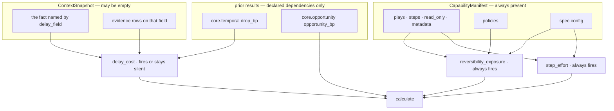

# 01 · Input and Validator

**Stages 1 and 2 of eight.** Neither is overridden. `CostUnit` uses
`unit.py:ReasoningUnit.validate` unchanged, and stage 1 is the argument pair of `evaluate()`.

**Source:** `genios_engine/reason/unit.py:ReasoningUnit.evaluate` ·
`genios_engine/reason/unit.py:ReasoningUnit.validate` ·
`genios_engine/reason/reasoners/common.py:missing_fields` ·
`genios_engine/reason/protocols.py:MissingContextError`

---

## 1 · What it is for

Stage 1 is what the capability handed this unit. Stage 2 is the unit's right to refuse: a unit that
cannot support a conclusion from what it was given must say so rather than guess, and
`MissingContextError` is the mechanism.

For `core.cost` the honest summary is short: **the unit declares nothing, so it refuses nothing.**
That is not an oversight, and this file argues why — the inputs this unit actually depends on are
not snapshot facts at all.

---

## 2 · What exists

### 2.1 · The input, exactly

```python
# unit.py:ReasoningUnit.evaluate — the signature, fixed for all seventeen units
def evaluate(self, request: ReasoningRequest,
             prior_results: Mapping[str, ReasonerResult]) -> ReasonerResult:
```

| Argument | Type | What `core.cost` takes from it |
|---|---|---|
| `request.capability.plays` | `tuple[PlayDefinition, ...]` | **the primary input.** `steps`, `read_only`, `metadata`, `effort_bp`, `impact_bp`, `success_probability_bp`, `play_id` |
| `request.capability.policies` | `tuple[str, ...]` | membership test for `"human_approval_required"` |
| `request.capability.reasoners` | `tuple[ReasonerSpec, ...]` | via `common.py:active_spec`, to find this unit's own spec and therefore its `config` |
| `request.context.facts` | `Mapping[str, Any]` | one field, named by `delay_field`, default `deal.last_inbound` |
| `request.context.evidence` | `tuple[EvidenceRef, ...]` | rows whose `field` matches that one name |
| `request.evaluation_time` | `datetime` | the reference instant for `elapsed_hours` — never a wall clock |
| `prior_results` | `Mapping[str, ReasonerResult]` | `core.temporal.drop_bp`, `core.opportunity.opportunity_bp` — **declared dependencies only** |

Everything else on the request is untouched: `neighbor_facts`, `missing_fields`, `trigger_kind`,
`org_id`, `config_snapshot_id`, `graph_version`, `root_entity_id`.

### 2.2 · `required_fields` — the declaration

`CostUnit` declares **no** `required_fields`. `required_fields` lives on `ReasonerSpec`, not on the
unit class, so this is a statement about every manifest that names the unit:

```python
# packs/capabilities/deal_cooling_v2.py — the only shipped spec for this unit
_spec("core.cost", config={"play_effort_bp": {"multithread_account": 600}})
```

`_spec` supplies no `required_fields`, and `ReasonerSpec.required_fields` defaults to `()`. The test
harness does the same: `tests/test_unit_cost_unit.py:_request` constructs
`ReasonerSpec("core.cost", "1.0.0", config=config or {})`. So in every code path that exists today:

```text
spec.required_fields = ()
```

### 2.3 · The validator, verbatim

```python
# unit.py:ReasoningUnit.validate — NOT overridden by CostUnit
def validate(self, view: UnitView) -> None:
    """Refuse inputs that cannot support a conclusion."""
    absent = missing_fields(view.request, view.spec.required_fields)
    if absent:
        raise MissingContextError(*absent)
```

```python
# common.py:missing_fields
def missing_fields(request: ReasoningRequest, fields: tuple[str, ...]) -> tuple[str, ...]:
    missing = []
    for field in fields:
        if field.startswith("neighbor:"):
            if field.split(":", 1)[1] not in request.context.neighbor_facts:
                missing.append(field)
        elif field not in request.context.facts:
            missing.append(field)
    return tuple(sorted(missing))
```

With `fields = ()` the loop body never runs, `missing` is `[]`, and `validate` returns `None`.
**`core.cost` cannot raise `MissingContextError` in any shipped or tested configuration.**

---

## 3 · How it works

### 3.1 · Why declaring nothing is the right shape here

Three of the unit's four inputs are not facts.



Two of the three plugins read **only the manifest**. `CapabilityManifest.__post_init__` raises
`capability requires at least one play`, and `PlayDefinition.__post_init__` raises
`a play requires at least one step` — so by the time a request exists, `step_effort` and
`reversibility_exposure` are guaranteed to have something to say. There is no snapshot state that
could stop them, and therefore no field worth demanding.

The third plugin reads one fact and can survive its absence, because *not knowing what waiting costs*
is a legitimate finding this unit is built to express. Demanding `deal.last_inbound` as a
`required_field` would convert that finding into an abstention:

```text
required_fields = ("deal.last_inbound",)   and the fact is absent
→ MissingContextError → ResultStatus.INSUFFICIENT_CONTEXT
→ no effort figure, no exposure figure, no ledger at all
```

The unit would go quiet about the two things it *does* know, in order to avoid saying it does not
know a third. Declaring nothing is the choice that keeps the two certain claims on the record.

### 3.2 · What refusal would look like, if a capability declared a field

Declaring a field is a manifest change, not a code change, and the machinery works. Verified by
direct call:

```text
spec = ReasonerSpec("core.cost", "1.0.0", required_fields=("deal.last_inbound",))
snapshot.facts = {}

CostUnit().evaluate(request, {})
→ MissingContextError, exc.fields == ('deal.last_inbound',)
```

Through the orchestrator that becomes a typed result rather than an exception:

```python
# orchestrator.py:_evaluate — the boundary
except MissingContextError as exc:
    → ResultStatus.INSUFFICIENT_CONTEXT, missing_fields=exc.fields
```

The `neighbor:` prefix works too — `required_fields=("neighbor:contact.email",)` against an empty
`neighbor_facts` raises with `('neighbor:contact.email',)`. Note the asymmetry the framework
documents at [Part 2](../../README.md) §3.1: a `neighbor:` field is *validated* but never *selected*
into `view.facts`, so declaring one on this spec would gate the run on a fact the unit still could
not read.

### 3.3 · The stricter validator that runs first

In the orchestrated path the unit's own validator is effectively unreachable, because
`guards.py:required_missing` runs **before** `evaluate` is called at all and uses a stricter
definition of missing:

```python
# guards.py:required_missing
absent = field not in request.context.facts
if absent or field in declared_missing:      # context.missing_fields, published by Layer 2
    missing.add(field)
```

Two definitions of "missing" coexist. `common.py:missing_fields` checks presence only;
`guards.py:required_missing` also honours a field Layer 2 explicitly declared absent. For
`core.cost` with `required_fields=()` both are no-ops, so the difference is latent — it becomes live
the moment a capability author adds a field to this spec.

---

## 4 · Examples and edge cases

### 4.1 · The shipped path — nothing declared, nothing refused

```text
spec.required_fields = ()
snapshot.facts       = {"deal.last_inbound": "2026-07-27T12:00:00+00:00"}

guards.required_missing(request, ())  → ()          # orchestrator does not pre-empt
view = retrieve(...)                                # facts {} · evidence_ids ()
validate(view)                        → None        # loop body never runs
→ analyze proceeds
```

### 4.2 · The empty snapshot — a completed result, not an abstention

`tests/test_unit_cost_unit.py:_request()` with no `facts` argument produces exactly this, and
`test_an_unknown_cost_of_inaction_is_reported_as_unknown` asserts the outcome:

```text
snapshot.facts = {}
snapshot.evidence = ()
prior = {}

status               = ResultStatus.COMPLETED
effort_bp            = 1,200      # one step, default rate — from the manifest alone
exposure_bp          = 0          # read_only default
cost_bp              = 720        # blended 60/40
delay_cost_bp        = 0          # the plugin was SILENT; calculate materialised the zero
do_nothing_cost_bp   = 0
cost_benefit_gap_bp  = 720
reason_codes         = cost_within_tolerance · do_nothing_cost_unknown
                     · effort_estimated_from_declared_steps · roster_is_reversible
```

A completed result carrying two evidenced numbers and one admitted blank. That is a different
statement from `INSUFFICIENT_CONTEXT` (*"I was asked for something I did not get"*) and different
again from `FAILED` (*"something broke"*), and it is the statement this unit is designed to make.

### 4.3 · The input that *can* stop the unit — bad config, not a missing fact

The unit has no validator-level refusal, but it does have a hard refusal, and it lives in the
Analyzer rather than the Validator. `cost_unit.py:_config_bp` raises on any knob that is not an
integer in `0..10_000`:

```python
value = view.config.get(key, default)
if isinstance(value, bool) or not isinstance(value, int) or not 0 <= value <= 10_000:
    raise ValueError(f"{key} must be integer basis points")
```

Verified, all three rejection branches:

| `spec.config` | Outcome |
|---|---|
| `{"step_effort_bp": "cheap"}` | `ValueError: step_effort_bp must be integer basis points` |
| `{"step_effort_bp": -5}` | same |
| `{"step_effort_bp": 10_001}` | same |
| `{"step_effort_bp": True}` | same — `bool` is rejected explicitly, before the `int` test |

`test_a_non_integer_effort_rate_is_a_deployment_fault` pins the first. Through the orchestrator the
`ValueError` becomes `ResultStatus.FAILED` with `reason_codes=('reasoner_failure',)` and the
exception type in `diagnostics` — and because the shipped spec is `FailurePolicy.OPTIONAL`, that
**degrades the run rather than stopping it**. A capability shipped with a malformed cost knob loses
its whole cost ledger and produces advice anyway, recorded only as a degradation string.

That is the sharp edge in this stage. The docstring's argument — *"a bad value is a deployment fault
that must fail loudly here"* — is correct about the unit and optimistic about the deployment. The
raise is loud; the shipped failure policy makes it quiet again.

### 4.4 · The boundary table

| Input | Behaviour |
|---|---|
| `spec.required_fields = ()` | validator is a no-op — every shipped and tested path |
| `spec.required_fields` names a present fact | validator passes; the base retriever *also* selects it into `view.facts` and cites its evidence. See [02](02-Retriever.md) §4.2 |
| `spec.required_fields` names an absent fact | `MissingContextError` → `INSUFFICIENT_CONTEXT`, all six metrics lost |
| `spec.required_fields` names `neighbor:x` absent from `neighbor_facts` | `MissingContextError` on `'neighbor:x'` |
| `spec.required_fields` names `neighbor:x` present | validator passes, `view.facts` still empty — the field is filtered out of `wanted` |
| Capability does not declare `core.cost` at all | `common.py:active_spec` raises `capability does not declare reasoner core.cost` before `retrieve` runs |
| `prior_results = {}` | legal and normal — this is the shipped state. `prior_metric` returns its defaults silently |
| A prior result with `status != COMPLETED` | `prior_metric` returns the default. Verified: a `FAILED` `core.opportunity` leaves `do_nothing_cost_bp` equal to `delay_cost_bp` |
| `snapshot.missing_fields` names `deal.last_inbound` | **ignored by this unit.** The delay plugin tests `fact_value(...) is not None`, not `missing_fields`. With `required_fields=()` the orchestrator's stricter guard has nothing to check either |

The last row is worth holding onto. Layer 2 can explicitly publish *"I know `deal.last_inbound` and
I do not have it"*, and `core.cost` reaches the same conclusion by a different route — the fact is
absent, so the plugin is silent. Same outcome today. It stops being the same outcome the day Layer 2
publishes a field as both present-but-stale and declared-missing.

---

## Related

| File | Covers |
|---|---|
| [README](README.md) | The unit's map, the config table, the shipped deployment |
| [02 · Retriever](02-Retriever.md) | Why the view's `facts` and `evidence_ids` are empty, and what the plugins read instead |
| [03a · `delay_cost`](03a-plugin-delay_cost.md) | The one plugin whose input can be absent, and what it does about it |
| [Part 2 · The Unit Framework](../../README.md) §4.1 | The two definitions of "missing", and why the orchestrator's runs first |
