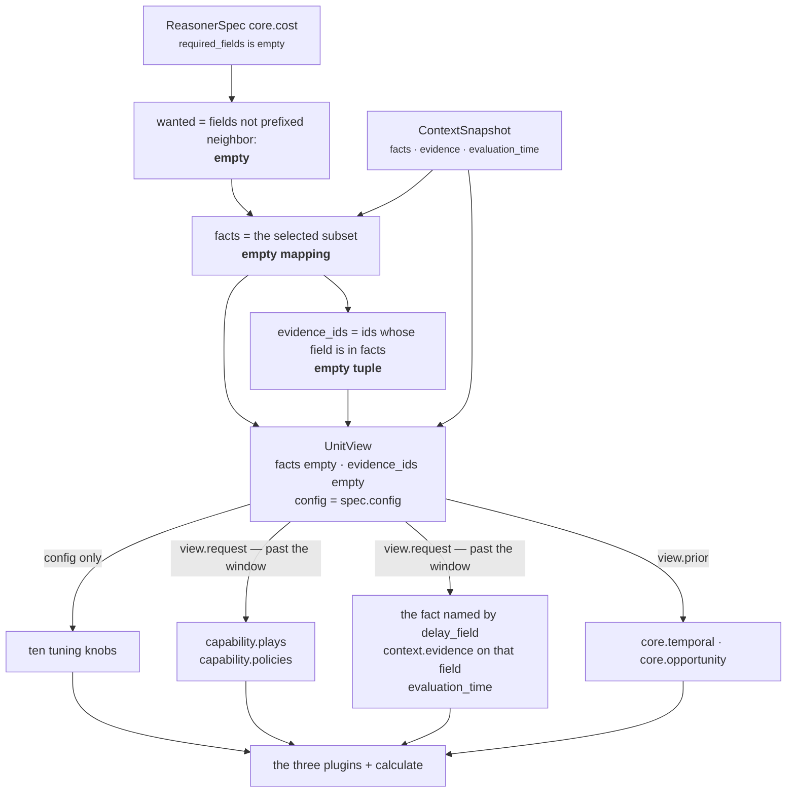

# 02 · Retriever

**Stage 3 of eight.** Not overridden. `CostUnit` uses `unit.py:ReasoningUnit.retrieve` unchanged.

**Source:** `genios_engine/reason/unit.py:ReasoningUnit.retrieve` ·
`genios_engine/reason/unit.py:UnitView` ·
`genios_engine/reason/reasoners/common.py:fact_value` · `common.py:evidence_ids`

---

## 1 · What it is for

The Retriever selects the slice of the frozen snapshot this unit needs and shapes it into a
`UnitView` — the bounded window a reviewer inspects to answer *"what was this unit allowed to look
at?"* without reading its body.

**It does not fetch.** From the framework docstring:

> *"Units are forbidden to touch a database, network, or clock — that is what makes a decision
> replayable months later. Retrieval already happened when Layer 2 froze the ContextSnapshot. So
> 'Retriever' here means select and shape from that frozen input, which is the only form of
> retrieval that can survive replay."*

For `core.cost` the selection is **empty**, and the unit reads past the window it was given. That is
the substance of this file, and it has one consequence with teeth: the unit cites evidence the
window does not contain.

---

## 2 · What exists

### 2.1 · The base implementation, verbatim

```python
# unit.py:ReasoningUnit.retrieve — NOT overridden by CostUnit
def retrieve(self, request: ReasoningRequest, spec: ReasonerSpec,
             prior: Mapping[str, ReasonerResult]) -> UnitView:
    """Select this unit's window on the frozen snapshot. Selection only — never IO."""
    wanted = tuple(field for field in spec.required_fields
                   if not field.startswith("neighbor:"))
    facts = {name: request.context.facts[name]
             for name in wanted if name in request.context.facts}
    evidence = tuple(sorted(item.evidence_id for item in request.context.evidence
                            if item.field in facts))
    return UnitView(request=request, spec=spec, prior=prior,
                    facts=MappingProxyType(facts), evidence_ids=evidence)
```

### 2.2 · The UnitView it produces here

`core.cost`'s spec declares `required_fields=()` in the one shipped manifest and in every test
([01](01-Input-and-Validator.md) §2.2). Substituting that in:

| Field | Type | Value for `core.cost` |
|---|---|---|
| `request` | `ReasoningRequest` | the whole frozen request |
| `spec` | `ReasonerSpec` | `ReasonerSpec('core.cost', '1.0.0', dependencies=(), required_fields=(), latency_budget_ms=100, failure_policy=OPTIONAL, config={'play_effort_bp': {...}})` |
| `prior` | `Mapping[str, ReasonerResult]` | **`{}`** in production — the spec declares no dependencies |
| `facts` | `MappingProxyType` | **`{}`** — `wanted` is empty, so the comprehension yields nothing |
| `evidence_ids` | `tuple[str, ...]` | **`()`** — no field in `facts` means no evidence matches |

`UnitView` is `@dataclass(frozen=True, slots=True)` and exposes one property and one method:

```python
@property
def config(self) -> Mapping[str, Any]:
    return self.spec.config

def prior_metric(self, reasoner_id: str, name: str, default: int = 0) -> int: ...
```

### 2.3 · Every access to the view, across all 375 lines

| Line | Expression | Read by |
|---|---|---|
| 62 | `view.config.get(key, default)` | `_config_bp` — nine of the ten knobs |
| 70 | `view.request.capability.plays` | `_plays` |
| 97 | `view.request.capability.policies` | `_play_exposure` — the `human_approval_required` test |
| 153 | `view.config.get("delay_field")` | `DelayCostPlugin` |
| 156 | `fact_value(view.request, field)` | `DelayCostPlugin` — presence test |
| 158 | `elapsed_hours(view.request, field)` | `DelayCostPlugin` — against `request.evaluation_time` |
| 162 | `view.prior_metric("core.temporal", "drop_bp", 0)` | `DelayCostPlugin` |
| 173 | `evidence_ids(view.request, field)` | `DelayCostPlugin` — **the citation** |
| 258 | `view.prior_metric("core.opportunity", "opportunity_bp", 0)` | `calculate` |

**`view.facts` is never read.** **`view.evidence_ids` is never read by the unit** — only by
`unit.py:build`, where it seeds the evidence union with an empty set.

---

## 3 · How it works

### 3.1 · Why an empty selection is the right shape for this unit



The base retriever selects *the fields the unit declared it needs*. That model fits a unit whose
subject is a handful of named facts. `core.cost`'s subject is mostly not facts at all — it is the
**play roster**, which lives on `request.capability` and is not part of the snapshot, so no amount
of `required_fields` declaration could put it in `view.facts`.

The one genuine fact the unit reads is named by config, not by the spec:

```python
field = str(view.config.get("delay_field") or "deal.last_inbound")
```

That is why declaring it in `required_fields` would be wrong twice over. It would gate the run on a
fact the unit can survive without ([01](01-Input-and-Validator.md) §3.1), and the two declarations
could drift — a capability that set `delay_field: "ticket.last_customer_message"` and left
`required_fields=("deal.last_inbound",)` would be demanding one field and reading another.

### 3.2 · The citation the window does not contain

This is the finding worth carrying out of this file.

The framework document states the property as an invariant:

> *"Evidence is derived from selection, not asserted. A unit's `evidence_ids` are exactly the ids of
> the fields it was allowed to look at. It cannot cite a row it did not select."*

That is true of the **base retriever**. It is not true of `core.cost`, because `DelayCostPlugin`
builds its own citation directly off the request:

```python
# cost_unit.py:DelayCostPlugin.contribute — line 173
evidence_ids=evidence_ids(view.request, field),
```

```python
# common.py:evidence_ids
def evidence_ids(request: ReasoningRequest, *fields: str) -> tuple[str, ...]:
    wanted = set(fields)
    return tuple(sorted(item.evidence_id for item in request.context.evidence
                        if item.field in wanted))
```

`unit.py:build` then unions the observation citations into the result:

```python
evidence = set(view.evidence_ids)          # empty for core.cost
for observation in observations:
    evidence.update(observation.evidence_ids)
```

So **every evidence id on a `core.cost` result comes from one plugin's own citation, never from the
retriever.** Verified end to end:

```text
spec.required_fields = ()
snapshot.facts       = {"deal.last_inbound": "2026-07-27T12:00:00+00:00"}
snapshot.evidence    = (EvidenceRef(evidence_id="ev_inbound", field="deal.last_inbound", ...),)

view.facts          = {}            ← the window is empty
view.evidence_ids   = ()            ← the window cites nothing
result.evidence_ids = ('ev_inbound',)
finding cost.delay_cost .evidence_ids = ('ev_inbound',)
```

The result cites more evidence than the view contains. This is not a safety hole —
`guards.py:validate_evidence_references` re-checks at the orchestrator boundary that every cited id
exists in `request.context.evidence`, and `common.py:evidence_ids` draws its ids from that same
tuple, so the check can only fail on an internally inconsistent snapshot. But the *auditability*
claim is weaker than the framework document implies: reading `spec.required_fields` does not tell
you what this unit looked at, and `view.evidence_ids` does not bound what it cited. You have to read
the plugin.

`core.context` has the same inversion for the same reason and documents it the same way
([../../01-Situation-Understanding/core.context/02-Retriever.md](../../01-Situation-Understanding/core.context/02-Retriever.md)
§3.2). Two units out of seventeen, both because the base window is the wrong shape for what they
reason about.

### 3.3 · What the retriever contributes to determinism

`retrieve` is a dict comprehension and a `sorted()` over an immutable snapshot. It reads no clock,
opens no connection, and cannot fail on data a later stage would reject. That is why `evaluate`
inverts the spec's stated Validator → Retriever order and runs `retrieve` first: building the view is
what turns a raw request into the bounded object the validator reasons about.

For `core.cost` the determinism that matters is downstream of the retriever anyway, and it is the
`sorted()` in `_plays`:

```python
def _plays(view: UnitView) -> tuple[PlayDefinition, ...]:
    """The capability's plays in one total order — never manifest order, never set order."""
    return tuple(sorted(view.request.capability.plays, key=lambda play: play.play_id))
```

Called four times per evaluation — twice from plugins, twice from `evaluate_meaning`. The sort is
what makes `test_checks_and_adjustments_are_emitted_in_play_id_order` hold:
`zeta_audit` declared first and `alpha_audit` second still emit as `alpha_audit`, `zeta_audit` in
both the adjustment tuple and the check tuple. Since both tuples reach
`ReasonerResult.semantic_hash`, the sort is load-bearing, not cosmetic.

---

## 4 · Examples and edge cases

### 4.1 · The shipped run — an empty window, an empty citation

`sales.deal_cooling_full`, ten days of silence, no evidence rows in the snapshot for the delay field:

```text
view.facts          = {}
view.evidence_ids   = ()
view.prior          = {}
result.evidence_ids = ()
```

The unit produced six metrics, four findings and a `waiting_has_a_price` reason code while citing
nothing. `core.validation:EvidenceSufficiencyPlugin` would classify that as an **ungrounded claim** —
`_asserts_a_claim` returns `True` because the three per-plugin findings carry `matched=True`, and
`_cited` returns empty. It does not fire today only because `core.validation` in `deal_cooling_v2`
declares dependencies `("core.risk", "core.opportunity", "core.impact", "core.confidence")` and
`core.cost` is not among them, so the validator cannot see this result at all.

Adding `core.cost` to `core.validation`'s dependencies — a one-token manifest change — would
immediately produce `claim_without_evidence` with `claimant:core.cost` on every run where the
snapshot has no evidence row for `deal.last_inbound`. Worth knowing before someone makes that change
for an unrelated reason.

### 4.2 · If the spec did declare the delay field

Suppose `_spec("core.cost", required_fields=("deal.last_inbound",))` and the snapshot carries the
fact plus two evidence rows `ev1` (on `deal.last_inbound`) and `ev2` (on `deal.owner`). Verified:

```text
wanted             = ('deal.last_inbound',)
view.facts         = {'deal.last_inbound': '2026-08-04T12:00:00+00:00'}
view.evidence_ids  = ('ev1',)                      ← selected, ev2 excluded
result.evidence_ids = ('ev1',)                     ← union with the plugin's own ('ev1',)
delay_cost_bp      = 800                           ← 2 whole days × 400
```

Nothing in the arithmetic changes. `view.facts` is still never read, and the union is idempotent
over an id the plugin already cited. **Declaring the field changes the validator's behaviour and the
run's failure mode, and changes nothing about what the unit computes.**

### 4.3 · Fact shapes the plugin accepts, all read past the window

`common.py:fact_value` unwraps a `{"value": ...}` envelope, so Layer 2's two fact shapes both work.
Verified against `evaluation_time − 4 days`:

| `snapshot.facts["deal.last_inbound"]` | `waiting_hours` | `delay_cost_bp` |
|---|---|---|
| `"2026-08-02T12:00:00+00:00"` | 96 | 1,600 |
| `{"value": "2026-08-02T12:00:00+00:00", "source": "crm"}` | 96 | 1,600 |
| `datetime(2026, 8, 2, 12, tzinfo=utc)` | 96 | 1,600 |
| `1234` | — | plugin silent |
| absent | — | plugin silent |

### 4.4 · The `neighbor:` blind spot

`delay_field` names a **root** fact. `fact_value(view.request, field)` defaults to
`neighbor=False`, so a snapshot whose only `deal.last_inbound` lives in `neighbor_facts` produces
silence. Verified:

```text
snapshot.facts          = {}
snapshot.neighbor_facts = {"deal.last_inbound": "2026-08-02T12:00:00+00:00"}
DelayCostPlugin().contribute(view) == ()
```

There is no `neighbor:` spelling for `delay_field` — the plugin does not split the prefix — so a
capability whose inbound timestamp is genuinely a neighbourhood fact has no way to point this unit
at it. Not a bug today; no shipped capability is in that shape. It is a hole in the config surface,
not in the arithmetic.

### 4.5 · The `context_scope` filter that is not applied

`EvidenceRef` carries `context_scope` of `"root"` or `"neighbor"`. Both the base retriever and
`common.py:evidence_ids` match on field name alone and ignore the scope. A neighbour-scoped evidence
row whose `field` is `deal.last_inbound` would be cited by `delay_cost` as though the unit had read
it at the root — while `fact_value` would still refuse to read the neighbour fact itself. The
citation and the reading disagree about scope.

Harmless today because no shipped capability has a colliding name, and it is the same one-line gap
recorded for the whole roster at [Part 2](../../README.md) §3.1 consequence 3.

---

## Related

| File | Covers |
|---|---|
| [README](README.md) | The unit's map and the internal-flow diagram |
| [01 · Input and Validator](01-Input-and-Validator.md) | Why `required_fields` is empty, and what declaring one would cost |
| [03a · `delay_cost`](03a-plugin-delay_cost.md) | The plugin that reads the one fact and cites the one evidence row |
| [06 · Builder and Metrics](06-Builder-and-Metrics.md) §3.1 | The evidence union, and the guard that re-checks every citation |
| [Part 2 · The Unit Framework](../../README.md) §3.1 | The three consequences of selection-not-fetching, across the whole roster |
