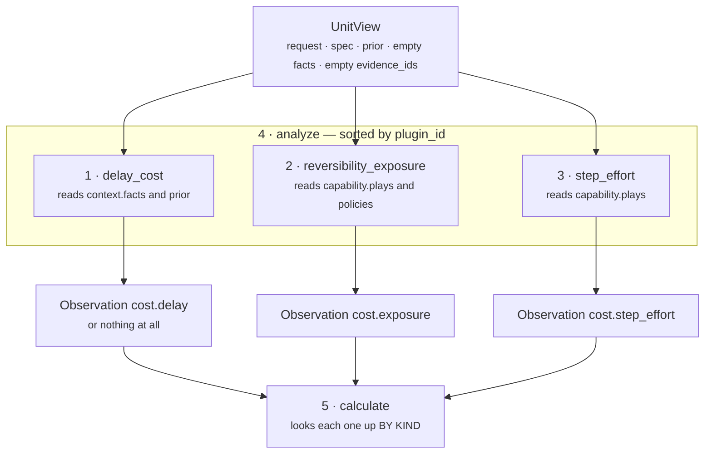

# 03 · Analyzer — the plugin seam

**Stage 4 of eight.** Not overridden. `CostUnit` uses `unit.py:ReasoningUnit.analyze` unchanged.

**Source:** `genios_engine/reason/unit.py:ReasoningUnit.analyze` ·
`genios_engine/reason/unit.py:Observation` ·
`genios_engine/reason/reasoners/cost_unit.py` lines 111–205

---

## 1 · What it is for

Cost is not one algorithm. Three separable claims, in three currencies that do not add up:

| Claim | Question | Currency |
|---|---|---|
| **Effort** | what do the declared plays actually ask a human to do? | human work |
| **Delay** | what does continuing to wait cost? | decayed opportunity |
| **Exposure** | what is the org exposed to if this turns out wrong? | relationship and reversibility |

Folding those into one number in one function would make the reasoning unexplainable at exactly the
moment somebody asks *why*. The plugin seam keeps each claim testable, tunable and silenceable
alone — and the third of those is the one that matters most here, because *"an unknown cost of
waiting must stay unknown"* is only expressible if a plugin can decline to speak.

---

## 2 · What exists

### 2.1 · The composition

```python
# cost_unit.py:CostUnit
plugins = (StepEffortPlugin(), DelayCostPlugin(), ReversibilityPlugin())
```

Three instances, constructed at class-definition time and shared across every evaluation. Each is
stateless — no `__init__`, no attributes beyond the class-level `plugin_id` — so sharing them is
safe and no per-run allocation happens.

`ReasoningUnit.__init__` checks the composition:

```python
seen = [plugin.plugin_id for plugin in self.plugins]
if len(seen) != len(set(seen)):
    raise ValueError(f"{self.unit_id} registers a duplicate analyzer plugin")
```

Duplicate ids would make `analyze`'s sort ambiguous and therefore every hash below it ambiguous too.

### 2.2 · The runner, verbatim

```python
# unit.py:ReasoningUnit.analyze — NOT overridden by CostUnit
def analyze(self, view: UnitView) -> tuple[Observation, ...]:
    observations: list[Observation] = []
    for plugin in sorted(self.plugins, key=lambda item: item.plugin_id):
        observations.extend(plugin.contribute(view))
    return tuple(observations)
```

**Registration order is `step_effort`, `delay_cost`, `reversibility_exposure`. Execution order is
alphabetical:**

```text
1. delay_cost
2. reversibility_exposure
3. step_effort
```

Alphabetical order looks arbitrary until you remember the alternative is registration order, and
registration order is whatever the class body happened to say the day someone added a plugin.
Observation order reaches the result through the `Finding` tuple in `evaluate_meaning`, and findings
reach `ReasonerResult.semantic_hash`, so this sort is load-bearing.

### 2.3 · What each contributes

| Order | `plugin_id` | `kind` | Metrics | `evidence_ids` | `reason_codes` | Doc |
|---|---|---|---|---|---|---|
| 1 | `delay_cost` | `cost.delay` | `delay_cost_bp`, `momentum_drop_bp`, `waiting_hours`* | rows on `delay_field` | `waiting_has_a_price` | [03a](03a-plugin-delay_cost.md) |
| 2 | `reversibility_exposure` | `cost.exposure` | `exposure_bp`, `irreversible_play_count`, `external_recipient_play_count` | `()` | `irreversible_action_available` **or** `roster_is_reversible` | [03b](03b-plugin-reversibility_exposure.md) |
| 3 | `step_effort` | `cost.step_effort` | `effort_bp`, `effort_ceiling_bp`, `play_count` | `()` | `effort_estimated_from_declared_steps` | [03c](03c-plugin-step_effort.md) |

\* `waiting_hours` only when a timestamp parsed.

Each plugin returns at most **one** `Observation`. There is no plugin in this unit that emits a row
per play — the per-play work happens in the Evaluator, not the Analyzer, which is the composition
choice §4.2 argues about.

### 2.4 · The Observation contract

```python
@dataclass(frozen=True, slots=True)
class Observation:
    plugin_id: str
    kind: str
    metrics: Mapping[str, int] = field(default_factory=dict)
    evidence_ids: tuple[str, ...] = ()
    reason_codes: tuple[str, ...] = ()
```

`__post_init__` rejects any metric that is not an `int` — and rejects `bool` explicitly, because
`isinstance(True, int)` is `True` — then freezes `metrics` into a `MappingProxyType` and sorts and
deduplicates both tuples. Every metric this unit's plugins emit is an integer by construction:
`clamp_bp` returns `int`, `len()` returns `int`, `sum(1 for ...)` returns `int`.

---

## 3 · How it works

### 3.1 · Three independent readings of one situation



Nothing flows between the plugins. They share two helper functions — `_plays` and `_config_bp` —
and no state. Each could be deleted without changing the other two's output; what would change is
the Calculator's blend, because a missing observation reads as a zero there ([04](04-Calculator.md)
§3.4).

### 3.2 · How the Calculator finds them again

The unit does not consume observations positionally. It looks them up by `kind`:

```python
def _observation(self, observations: Sequence[Observation], kind: str) -> Observation | None:
    for item in observations:
        if item.kind == kind:
            return item
    return None
```

That is a deliberate decoupling from `analyze`'s sort. If a fourth plugin were added tomorrow with
`plugin_id = "a_new_thing"`, it would run first and shift every index — and `calculate` would not
notice, because it asks for `"cost.step_effort"` by name. The `kind` strings are therefore the real
interface between the Analyzer and the Calculator; `plugin_id` only governs ordering and finding ids.

`_observation` returns the **first** match. Since each plugin emits at most one observation and no
two share a `kind`, there is never a second. A future plugin reusing an existing `kind` would be
silently shadowed by whichever ran first alphabetically — deterministic, and completely invisible.

### 3.3 · Where the three claims meet

They meet twice, in two different places, with two different shapes.

**In `calculate`, at the capability level.** Effort and exposure are blended into `cost_bp`; delay is
corroborated with `core.opportunity`'s headroom into `do_nothing_cost_bp`; the two results are
subtracted into `cost_benefit_gap_bp`. Effort contributes the roster **floor** and exposure the
roster **ceiling**, so `cost_bp` may describe no play that exists.

**In `_cost_benefit_checks`, at the play level.** The same blend is recomputed play by play, using
`_step_effort(view, play)` and `_play_exposure(view, play)` on a single play rather than the roster
aggregates:

```python
play_cost = clamp_bp(divide_half_up(effort * weight + exposure * (10_000 - weight), 10_000))
```

That is the same arithmetic as `calculate`'s, written out a second time. The duplication is
deliberate and is a direct consequence of the floor/ceiling asymmetry: the published `cost_bp` is a
capability-level figure that would be the wrong number to judge an individual play against.

The cost is a real one. **The blend formula exists twice in the file** — lines 253–254 and
lines 311–312 — and both read `cost_weight_effort_bp` independently. A change to one that missed the
other would produce a ledger and a per-play check that disagreed about what "cost" means, and no
test compares them.

### 3.4 · The interaction between `delay_cost` and `calculate`

`DelayCostPlugin` reads `core.temporal.drop_bp`; `calculate` reads `core.opportunity.opportunity_bp`.
Both are corroboration of the same silence, and both use the same *shape* — stronger reading leads,
weaker adds a bounded lift — but at different strengths and in different places:

```text
inside the plugin      delay_cost_bp = MAX of elapsed_cost, momentum_bp     ← no lift at all
inside the calculator  do_nothing_bp = leading + trailing ÷ 4               ← quarter lift
```

The plugin's docstring explains the difference: elapsed time and momentum drop *"measure the same
decay and adding them would double-count it"*, so the stronger simply wins. Untaken headroom is a
different enough quantity to earn a bounded lift. Both arguments are reasonable; neither is tested
against outcome data, and the asymmetry is not called out anywhere in the module.

---

## 4 · Examples and edge cases

### 4.1 · A full analyze, printed

Roster of two — `log_note` one step read-only, `send_intro` one step irreversible — with ten days of
silence and an evidence row on the inbound field. Real output, in emission order:

```text
Observation(plugin_id='delay_cost', kind='cost.delay',
            metrics={'delay_cost_bp': 4000, 'momentum_drop_bp': 0, 'waiting_hours': 240},
            evidence_ids=('ev_inbound',), reason_codes=('waiting_has_a_price',))

Observation(plugin_id='reversibility_exposure', kind='cost.exposure',
            metrics={'exposure_bp': 6000, 'irreversible_play_count': 1,
                     'external_recipient_play_count': 0},
            evidence_ids=(), reason_codes=('irreversible_action_available',))

Observation(plugin_id='step_effort', kind='cost.step_effort',
            metrics={'effort_bp': 1200, 'effort_ceiling_bp': 1200, 'play_count': 2},
            evidence_ids=(), reason_codes=('effort_estimated_from_declared_steps',))
```

Nine metrics observed. Six published. The other three — `momentum_drop_bp`, `waiting_hours`,
`effort_ceiling_bp` and the two play counts — reach the result only inside the per-plugin
`Finding` objects. [06](06-Builder-and-Metrics.md) §4.2.

### 4.2 · The composition choice: three roster-wide plugins, not one per-play plugin

`core.constraint` solves a superficially similar problem — *say something about every play* — with
plugins that emit one row per play. `core.cost` does not. Its plugins collapse the roster to a
scalar and the per-play work lives in `evaluate_meaning`.

The reason is what the two units publish. `core.constraint` publishes **rows** and no metrics, so
per-play emission is the whole output. `core.cost` publishes **six scalars**, and a scalar over a
roster needs a reduction — `min` for effort, `max` for exposure — that a per-play plugin could not
perform without a second aggregation step somewhere.

The consequence is that the Analyzer and the Evaluator both iterate `_plays(view)`, and `_plays`,
`_step_effort` and `_play_exposure` each run more than once per evaluation:

| Helper | Calls per evaluation |
|---|---|
| `_plays` | 4 — `step_effort`, `reversibility_exposure`, `_effort_adjustments`, `_cost_benefit_checks` |
| `_step_effort` | `3 × len(plays)` — the plugin, `_effort_adjustments`, `_cost_benefit_checks` |
| `_play_exposure` | `2 × len(plays)` — the plugin and `_cost_benefit_checks` |
| `_config_bp("step_effort_bp")` | `3 × len(plays)` — once inside every `_step_effort` call |
| `_config_bp("cost_weight_effort_bp")` | 2 — `calculate`, and once outside the loop in `_cost_benefit_checks` |
| `_config_bp("cost_benefit_warn_gap_bp")` | 2 — `_cost_benefit_checks` and `evaluate_meaning`, read independently |

All of them are pure functions of the same frozen view, so they cannot disagree between calls. At
three plays and a 100 ms latency budget the recomputation is free. It is recorded here because a
reader tracing the arithmetic will otherwise wonder which of the three `_step_effort` call sites is
the authoritative one. They all are; they all return the same number.

### 4.3 · What a silent plugin does to the analyze tuple

`DelayCostPlugin` is the only plugin here with a reachable silence. When it returns `()`:

```text
observations = (Observation(kind='cost.exposure', ...),
                Observation(kind='cost.step_effort', ...))     ← two, not three

_observation(observations, "cost.delay")  → None
calculate:  delay_bp = 0                                       ← the zero is materialised HERE
evaluate_meaning: 2 per-plugin findings + 1 ledger finding      ← three, not four
```

The plugin's refusal to invent a zero survives exactly as far as the Calculator, and no further. The
`do_nothing_cost_unknown` reason code is the only trace of the distinction that reaches a consumer,
and it is keyed off the value rather than off the missing observation — which is why a *measured*
zero produces the same code. [05](05-Evaluator.md) §4.2.

### 4.4 · Boundaries

| Input | Behaviour |
|---|---|
| `capability.plays` has one play | both roster plugins fire; `effort_bp == effort_ceiling_bp`; `play_count: 1` |
| `capability.plays` is empty | both roster plugins return `()` — **unreachable**, `CapabilityManifest.__post_init__` raises `capability requires at least one play` |
| A play with zero steps | unreachable — `PlayDefinition.__post_init__` raises `a play requires at least one step` |
| Two plays with the same `play_id` | unreachable — `CapabilityManifest.__post_init__` rejects duplicate play ids |
| A malformed `_config_bp` knob | `ValueError` propagates out of `contribute`, out of `analyze`, out of `evaluate`; the orchestrator turns it into `FAILED` |
| All three plugins silent | impossible: two of them cannot be silent through a legal manifest |
| A fourth plugin added with an existing `kind` | silently shadowed by `_observation`'s first-match. No test would catch it |

---

## Related

| File | Covers |
|---|---|
| [README](README.md) | The unit's map, the plugin table, the config table |
| [03a · `delay_cost`](03a-plugin-delay_cost.md) | The cost of waiting, and the silence that must not become a zero |
| [03b · `reversibility_exposure`](03b-plugin-reversibility_exposure.md) | The roster's worst case, and the approval backstop |
| [03c · `step_effort`](03c-plugin-step_effort.md) | The roster's cheapest route, re-derived from steps |
| [04 · Calculator](04-Calculator.md) | How the three observations become six metrics, and what a missing one costs |
| [05 · Evaluator](05-Evaluator.md) | The per-play second pass over the same helpers |
| [Part 2 · The Unit Framework](../../README.md) §4.2 | Why plugins, and what an `Observation` is allowed to say |
