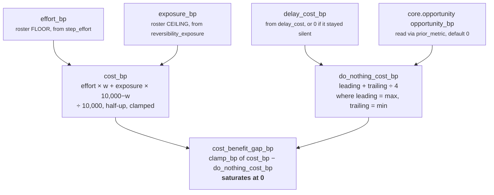
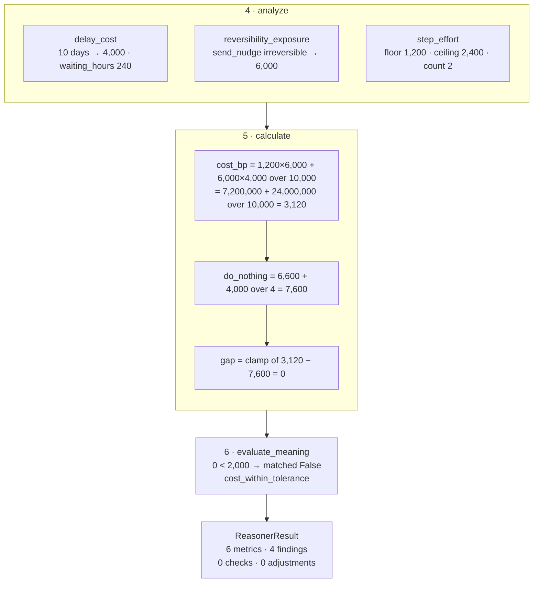

# 04 · Calculator

**Stage 5 of eight.** `@abstractmethod` on the base class — every unit must implement it.

**Source:** `genios_engine/reason/reasoners/cost_unit.py:CostUnit.calculate` (lines 229–267) ·
`cost_unit.py:CostUnit._observation` (lines 223–227) ·
`genios_engine/reason/reasoners/common.py:clamp_bp` · `common.py:divide_half_up`

---

## 1 · What it is for

Fold three claims in three currencies into one six-number ledger, using pure integer arithmetic that
reproduces byte-for-byte on any machine.

The stage is abstract on the base class because *"a unit calculates and a unit interprets"* has to be
a fact the interpreter enforces, not a code-review note. A subclass that omits `calculate` cannot be
instantiated.

---

## 2 · What exists

### 2.1 · The method, verbatim

```python
def calculate(self, view: UnitView,
              observations: Sequence[Observation]) -> Mapping[str, int]:
    effort_obs   = self._observation(observations, "cost.step_effort")
    exposure_obs = self._observation(observations, "cost.exposure")
    delay_obs    = self._observation(observations, "cost.delay")

    effort_bp   = int(effort_obs.metrics["effort_bp"])       if effort_obs   else 0
    exposure_bp = int(exposure_obs.metrics["exposure_bp"])   if exposure_obs else 0
    delay_bp    = int(delay_obs.metrics["delay_cost_bp"])    if delay_obs    else 0

    weight = _config_bp(view, "cost_weight_effort_bp", 6_000)
    cost_bp = clamp_bp(divide_half_up(
        effort_bp * weight + exposure_bp * (10_000 - weight), 10_000))

    headroom_bp = clamp_bp(view.prior_metric("core.opportunity", "opportunity_bp", 0))
    leading, trailing = max(delay_bp, headroom_bp), min(delay_bp, headroom_bp)
    do_nothing_bp = clamp_bp(leading + divide_half_up(trailing, 4))

    return {"cost_bp": cost_bp,
            "effort_bp": effort_bp,
            "exposure_bp": exposure_bp,
            "delay_cost_bp": delay_bp,
            "do_nothing_cost_bp": do_nothing_bp,
            "cost_benefit_gap_bp": clamp_bp(cost_bp - do_nothing_bp)}
```

### 2.2 · The three inputs and one dependency

| Value | Source | Default when absent |
|---|---|---|
| `effort_bp` | `cost.step_effort` observation | `0` — unreachable, the plugin always fires |
| `exposure_bp` | `cost.exposure` observation | `0` — unreachable, the plugin always fires |
| `delay_bp` | `cost.delay` observation | `0` — **reachable**, and the source of §4.4 |
| `headroom_bp` | `view.prior_metric("core.opportunity", "opportunity_bp", 0)` | `0` — the shipped state |

### 2.3 · The two arithmetic helpers

```python
def clamp_bp(value: int) -> int:
    return min(10_000, max(0, int(value)))

def divide_half_up(numerator: int, denominator: int) -> int:
    if denominator <= 0:
        raise ValueError("denominator must be positive")
    if numerator >= 0:
        return (numerator + denominator // 2) // denominator
    return -((-numerator + denominator // 2) // denominator)
```

Integer division with explicit half-up rounding, so the same inputs give the same basis points on
every machine. The negative branch never executes in this unit: both call sites pass a non-negative
numerator.

---

## 3 · How it works, and why that shape

The docstring argues all three formulas. This section mines that argument rather than inventing a new
one.

### 3.1 · The five metrics, in dependency order



Three of the six metrics are pass-throughs — `effort_bp`, `exposure_bp` and `delay_cost_bp` are
republished verbatim from their observations. Three are computed here. The pass-throughs matter as
much as the computations, because they are what lets a reader reconstruct `cost_bp` by hand from the
published ledger without re-running the plugins.

### 3.2 · `cost_bp` — a blend, not a sum

> *"`cost_bp` is a weighted blend rather than a sum because effort and exposure are paid in different
> currencies — an hour of work and a burnt relationship do not add up, they trade off, and the ratio
> between them is a business choice that belongs in capability config."*

```text
cost_bp = round_half_up( effort_bp × w + exposure_bp × (10,000 − w) , 10,000 )
          where w = cost_weight_effort_bp, default 6,000
```

The formula is a convex combination: with `w` in `0..10_000` the result is always between
`min(effort, exposure)` and `max(effort, exposure)`, so `cost_bp` can never exceed either input.
`clamp_bp` on the outside is therefore a belt that never binds — both inputs are already clamped by
their plugins.

**What a sum would do instead.** Adding effort and exposure would say that a cheap-but-dangerous play
and an expensive-but-safe play are equally costly, and would let a roster accumulate cost simply by
having more dimensions measured. Three separately-priced axes summed would routinely saturate at
10,000, at which point `cost_benefit_gap_bp` would be maximal for almost every capability and the
WARN would fire on everything — which is indistinguishable from firing on nothing.

**Where the 60/40 came from.** Nowhere measurable. The default says effort matters more in the
ordinary case, and *"a capability whose plays are irreversible should raise exposure's share"*. It is
a stated business judgement, not a calibrated constant, and nothing in the repository tests whether
it is right.

**The floor/ceiling seam.** `effort_bp` is the roster's cheapest play and `exposure_bp` is the
roster's most dangerous one. They are frequently different plays. So `cost_bp` describes a
hypothetical action — *"the least work anyone could do, at the worst downside anyone could incur"* —
and may match no play in the roster. That is defensible for a capability-level ledger, where the
question is "what does engaging with this situation cost?" rather than "what does this specific play
cost?". It is indefensible as a per-play figure, which is exactly why `_cost_benefit_checks`
recomputes the blend play by play instead of reusing this number. [05](05-Evaluator.md) §3.3.

### 3.3 · `do_nothing_cost_bp` — corroboration, not addition

> *"`do_nothing_cost_bp` follows the same shape the Opportunity Unit uses for corroboration: the
> stronger reading leads and the weaker one adds a bounded lift, because delay cost and untaken
> headroom are two views of one silence, not two separate silences."*

```text
leading, trailing = max(delay_bp, headroom_bp), min(delay_bp, headroom_bp)
do_nothing_bp     = clamp_bp( leading + round_half_up(trailing, 4) )
```

Max-plus-a-quarter-of-the-other. The shape is borrowed verbatim from
`core.opportunity`'s calculator, where it is argued as *"the strongest evidenced claim is the claim;
everything else is corroboration."*

**Why not a sum.** Delay cost and untaken headroom are both readings of *the same silence*. Ten days
of no reply and 6,600bp of unworked opportunity are not two separate problems worth 10,600bp; they
are one problem seen twice. Summing would let a system manufacture a maximal cost of inaction out of
two moderate readings of one fact.

**Why not a max alone.** Because corroboration is real information. Two independent measurements
agreeing that the silence is expensive is a stronger claim than one, and the quarter-lift says so
without letting the second reading dominate.

**Why the opportunity figure is read rather than re-derived.** The inline comment is explicit:

```python
# Untaken headroom is a cost of inaction too: the Opportunity Unit already priced it, so
# read it rather than re-deriving a second, disagreeing estimate of the same thing.
```

A second estimate of headroom inside `core.cost` would eventually disagree with `core.opportunity`'s,
and `core.validation:ContradictionPlugin` scans exactly for two units publishing divergent readings of
one quantity. Reading is the design; deriving would be a self-inflicted contradiction.

### 3.4 · `cost_benefit_gap_bp` — saturating at zero on purpose

> *"`cost_benefit_gap_bp` saturates at zero on purpose. How *comfortably* worth it something is is a
> ranking question, and ranking is Part 3's."*

```python
"cost_benefit_gap_bp": clamp_bp(cost_bp - do_nothing_bp)
```

A gap of `−200` and a gap of `−6,000` both mean "acting is worth it", and both publish `0`.
Publishing the difference would be publishing a preference ordering over situations — a number a
downstream ranker could weigh — and this unit is not the ranking authority. All it is entitled to say
is *how far over the line the cost sits*, and zero when it does not.

`test_the_gap_saturates_at_zero_when_acting_is_worth_it` pins it: 9,000bp of opportunity headroom
against a 720bp cost gives `cost_benefit_gap_bp: 0`, `matched: False`, `cost_within_tolerance`.

The asymmetry is the point. The unit is loud when cost exceeds inaction and silent about *how* much
cheaper acting is. It can raise a caution; it cannot cast a vote for motion.

---

## 4 · Worked examples and edge cases

### 4.1 · The blend, isolated

`test_cost_blends_effort_and_exposure_rather_than_adding_them`. One two-step irreversible play, no
policies, no priors:

```text
effort_bp   = 1,200 × 2                            = 2,400
exposure_bp = 6,000 + 0 − 0                        = 6,000
w           = 6,000

numerator   = 2,400 × 6,000 + 6,000 × 4,000
            = 14,400,000 + 24,000,000             = 38,400,000
cost_bp     = round_half_up(38,400,000, 10,000)
            = (38,400,000 + 5,000) // 10,000       = 3,840
```

`3,840bp` means 0.384. A sum would have given `8,400bp` — more than twice as expensive, and a number
that would have tripped the WARN against almost any benefit.

### 4.2 · The corroboration, isolated

`test_untaken_headroom_corroborates_delay_without_double_counting_it`:

```text
delay_bp    = 4,000                    # ten days at 400bp/day
headroom_bp = 6,600                    # core.opportunity, declared as a dependency

leading     = max(4,000, 6,600)        = 6,600
trailing    = min(4,000, 6,600)        = 4,000
lift        = round_half_up(4,000, 4)
            = (4,000 + 2) // 4         = 1,000
do_nothing  = clamp_bp(6,600 + 1,000)  = 7,600
```

A sum would have given 10,600 → clamped to 10,000, i.e. *"waiting is maximally expensive"* off two
moderate readings. The lift says: 6,600 is the claim, and the fact that a second measurement agrees
raises it by a quarter of itself.

### 4.3 · The full ledger — the Acme scenario, end to end

`test_chasing_a_ten_day_silent_deal_reads_as_cheap_against_what_silence_costs`. Two plays,
`core.opportunity` declared as a dependency and reporting 6,600bp:



The exact published ledger, asserted by the test:

```text
effort_bp            1,200      log_note, one step — the cheapest route
exposure_bp          6,000      send_nudge, irreversible — the worst case
cost_bp              3,120      blended 60/40
delay_cost_bp        4,000      ten days
do_nothing_cost_bp   7,600      6,600 leading + 1,000 lift
cost_benefit_gap_bp      0      saturated
matched              False
```

Read it as a sentence: *acting on this deal costs 0.31; leaving it alone costs 0.76.* Note that
`cost_bp = 3,120` is the cost of a play that does not exist — `log_note`'s effort with `send_nudge`'s
exposure. §3.2.

### 4.4 · The silent delay plugin, and where the zero comes from

The single most important behaviour in this stage:

```python
delay_bp = int(delay_obs.metrics["delay_cost_bp"]) if delay_obs else 0
```

`DelayCostPlugin` refused to invent a zero. **`calculate` invents it here.** The published ledger
therefore carries `delay_cost_bp: 0` in two structurally different situations:

| Situation | Observations | `delay_cost_bp` | Distinguishable downstream? |
|---|---|---|---|
| No timestamp, no momentum | 2 — no `cost.delay` | `0` | only by counting findings |
| Timestamp six hours old | 3 — `cost.delay` present, priced 0 | `0` | only by counting findings |

Both publish the same six numbers. The only trace of the difference that survives is the finding
count — three versus four — and the presence of `waiting_has_a_price` among the reason codes. There
is no metric that says "measured" and no metric that says "unmeasured".

`evaluate_meaning`'s `do_nothing_cost_unknown` is the intended mitigation, and it keys off
`metrics["do_nothing_cost_bp"] == 0`, which is the *value*, so it fires in both rows above.
[05](05-Evaluator.md) §4.2 carries the full argument for keying it off `delay_obs is None` instead.

The `if ... else 0` construction is the correct shape for a mapping that must always carry the same
six keys — a conditional metric would break the `publishes` contract's simplicity — but it is where
the unit's own "silence is not a zero" principle stops applying.

### 4.5 · A dependency that did not complete

`prior_metric` substitutes its default in three silent cases: the dependency did not run, did not
complete, or published a non-integer. Verified with a `FAILED` `core.opportunity`:

```text
prior = {"core.opportunity": ReasonerResult(status=FAILED)}
delay_bp    = 4,000
headroom_bp = 0                            ← substituted, no reason code, no telemetry
do_nothing  = 4,000 + round_half_up(0, 4)  = 4,000
```

Identical to the shipped state, where `core.opportunity` is not a declared dependency at all. From
the caller's side those two situations look the same, and neither is recorded. `core.risk`
deliberately does *not* use `prior_metric` for this reason, defining its own reader that raises on a
malformed metric; `core.cost` accepts the silent default because it can produce a meaningful ledger
without the headroom figure.

### 4.6 · The arithmetic boundaries

| Input | `cost_bp` | Note |
|---|---|---|
| `effort 0`, `exposure 0` | 0 | reachable only with `step_effort_bp: 0` and a read-only roster |
| `effort 10,000`, `exposure 10,000` | 10,000 | the convex combination of two identical values |
| `w = 10_000` | `= effort_bp` | exposure contributes nothing. Verified: effort 1,200 → `cost_bp` 1,200 |
| `w = 0` | `= exposure_bp` | effort contributes nothing. Verified: exposure 0 → `cost_bp` 0 |
| `w` non-integer or out of `0..10_000` | `ValueError` | `_config_bp` |
| `delay 0`, `headroom 0` | `do_nothing 0` | plus `do_nothing_cost_unknown` |
| `delay 10,000`, `headroom 10,000` | `do_nothing 10,000` | `10,000 + 2,500 = 12,500 → clamp`. The only place `clamp_bp` binds in this method |
| `cost 10,000`, `do_nothing 0` | `gap 10,000` | the maximum gap |
| `cost 0`, `do_nothing 10,000` | `gap 0` | saturated; the −10,000 is discarded |

`round_half_up` boundary: `divide_half_up(2, 4)` is `(2 + 2) // 4 = 1`, so a trailing reading of 2bp
lifts by 1bp rather than 0. Half-up, not banker's rounding, and deliberately so — the choice is
stated once in `common.py` and applies identically in `core.opportunity`'s corroboration, so the two
units' shared shape really is shared arithmetic and not a coincidence.

---

## 5 · What this stage does not do

- **It does not decide anything.** No threshold is applied here; `cost_benefit_gap_bp` is a number,
  not a verdict. The threshold lives in `evaluate_meaning`.
- **It does not look at individual plays.** Every per-play computation in the unit happens in the
  Evaluator, over the same helpers.
- **It does not read `play.effort_bp`.** The declared effort is compared against the derived effort
  in `_effort_adjustments`, never here.
- **It does not touch `momentum_drop_bp`, `waiting_hours`, `effort_ceiling_bp`,
  `irreversible_play_count` or `external_recipient_play_count`.** Five observed metrics that this
  stage reads past. They survive only inside the findings.

---

## Related

| File | Covers |
|---|---|
| [03 · Analyzer](03-Analyzer.md) §3.2 | How `_observation` finds each input by `kind` rather than by position |
| [03a · `delay_cost`](03a-plugin-delay_cost.md) | Where `delay_cost_bp` comes from, and the silence this stage converts to a zero |
| [05 · Evaluator](05-Evaluator.md) | The threshold, and the second blend recomputed per play |
| [06 · Builder and Metrics](06-Builder-and-Metrics.md) | The `publishes` guard over exactly these six keys |
| [../README.md](../README.md) §4.4 | The category-level summary of this arithmetic |
