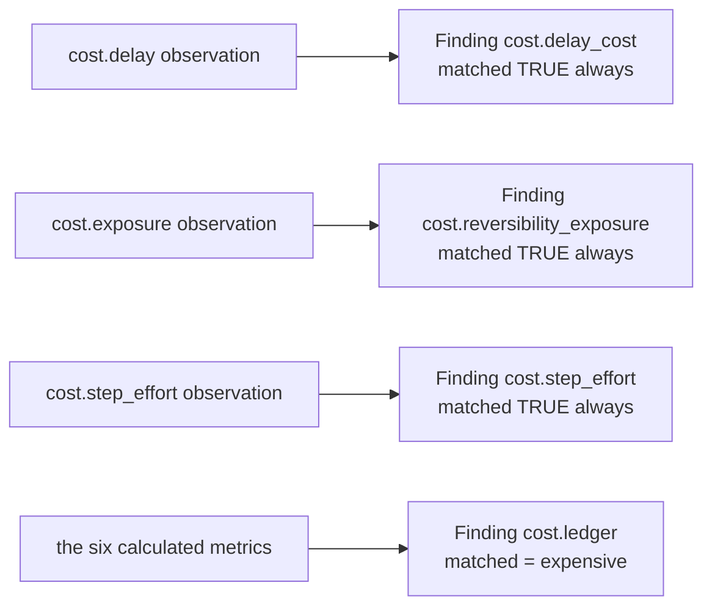

# 05 · Evaluator

**Stage 6 of eight.** `@abstractmethod` on the base class — every unit must implement it.

**Source:** `genios_engine/reason/reasoners/cost_unit.py:CostUnit.evaluate_meaning` (lines 330–371) ·
`cost_unit.py:CostUnit._effort_adjustments` (lines 269–292) ·
`cost_unit.py:CostUnit._cost_benefit_checks` (lines 294–328) ·
`cost_unit.py:_expected_benefit` (lines 102–108) ·
`cost_unit.py:COST_BENEFIT_STAGE`

---

## 1 · What it is for

Turn six numbers into meaning: one boolean, four findings, a set of reason codes, a tuple of
corrections to declared effort, and a tuple of cautions about individual plays.

This is the stage where the unit touches a candidate, and it is the stage where the unit's central
restraint is enforced in code. From the class docstring:

> *"Publishes a cost ledger and nothing else. It does not choose a play, does not rank the roster,
> and does not eliminate anything — a play it considers expensive stays fully in contention with a
> WARN on its record, because a capability whose upside is large enough should be free to pay."*

---

## 2 · What exists

### 2.1 · The method, verbatim

```python
def evaluate_meaning(self, view: UnitView, metrics: Mapping[str, int],
                     observations: Sequence[Observation]) -> Verdict:
    gap_threshold = _config_bp(view, "cost_benefit_warn_gap_bp", 2_000)
    expensive = metrics["cost_benefit_gap_bp"] >= gap_threshold

    codes = {code for item in observations for code in item.reason_codes}
    codes.add("cost_exceeds_inaction" if expensive else "cost_within_tolerance")
    if metrics["do_nothing_cost_bp"] == 0:
        codes.add("do_nothing_cost_unknown")

    findings = [Finding(
        finding_id=f"cost.{item.plugin_id}",
        kind="cost",
        matched=True,
        metrics=item.metrics,
        evidence_ids=item.evidence_ids,
        reason_codes=item.reason_codes,
    ) for item in observations]
    findings.append(Finding(
        finding_id="cost.ledger",
        kind="cost",
        matched=expensive,
        metrics=dict(metrics),
        reason_codes=tuple(sorted(codes)),
    ))

    return Verdict(
        matched=expensive,
        metrics=dict(metrics),
        findings=tuple(findings),
        adjustments=self._effort_adjustments(view),
        checks=self._cost_benefit_checks(view, metrics["do_nothing_cost_bp"]),
        reason_codes=tuple(sorted(codes)),
    )
```

### 2.2 · The one threshold, used twice

| Config key | Default | Used for |
|---|---|---|
| `cost_benefit_warn_gap_bp` | `2_000` | (a) the unit's own `matched` bar, against `cost_benefit_gap_bp`; (b) the per-play WARN bar, against each play's own gap |

Read independently in two methods — line 305 in `_cost_benefit_checks` and line 338 in
`evaluate_meaning`. Same key, same default, no shared constant. They cannot drift while both read
`view.config`, but a future edit to one call site would not be caught by any test.

### 2.3 · Everything the Verdict carries

| Field | Value |
|---|---|
| `matched` | `bool` — never `None`. §3.1 |
| `metrics` | `dict(metrics)`, the Calculator's six pairs unchanged |
| `findings` | `len(observations) + 1` — three or four |
| `adjustments` | 0 to `len(plays)` `CandidateAdjustment` objects, `play_id`-ordered |
| `checks` | 0 to `len(plays)` `CandidateCheck` objects, `play_id`-ordered, all `WARN` |
| `reason_codes` | the union of every observation's codes, plus one polarity code, plus optionally `do_nothing_cost_unknown` — sorted |

---

## 3 · How it works

### 3.1 · `matched` — "acting here is materially more expensive than sitting still"

```python
expensive = metrics["cost_benefit_gap_bp"] >= gap_threshold
```

From the docstring:

> *"It is a reading of the ledger, not an instruction. A matched cost unit alongside a matched
> opportunity unit is a perfectly normal situation — it says the call is a real trade-off, which is
> precisely when a human wants to see the numbers."*

That reading is unusual in the roster and worth stating plainly. For most units `matched=True` is
*"the thing I look for is present, act on it"*. **Here the polarity is inverted:** `matched=True`
means *"the thing I look for is present, and the thing I look for is a reason for hesitation"*.

Nothing branches on this unit's `matched` specifically. Three generic readers would if a capability
declared `core.cost` as their dependency, and none does today:

| Reader | What it would do with `matched` |
|---|---|
| `validation_unit.py:_asserts_a_claim` | `result.matched is True` marks the result as a claim needing evidence — and this unit's three per-plugin findings already force that to `True` regardless |
| `validation_unit.py:ContradictionPlugin._opposed_verdicts` | buckets `finding.matched` by `kind`; safe only because no second unit publishes `kind="cost"`. §3.4 |
| `recommendation_unit.py:_claims` | treats every `finding.matched is not False` as a claim supporting a play — which would make all three per-plugin findings support motion, from the one unit that argues against it |

`core.recommendation` in `deal_cooling_v2` depends on `("core.validation", "core.dependency")` and
`core.validation` on `("core.risk", "core.opportunity", "core.impact", "core.confidence")`. Adding
`core.cost` to either would surface the inverted polarity immediately, and the third row is the one
that would bite: a unit whose entire job is to argue for restraint would start contributing support
weight to the plays it is warning about.

The one place the polarity is already armed is `gating`. See [06](06-Builder-and-Metrics.md) §4.3.

Note that `cost_benefit_gap_bp` already saturated at zero in the Calculator, so `expensive` is
equivalent to `cost_bp − do_nothing_cost_bp ≥ 2,000`. The saturation cannot make a unit match that
otherwise would not: `clamp_bp` only ever raises a negative to zero, and `0 ≥ 2,000` is false.

`matched` is a `bool` on every path, which means declaring `core.cost` with `gating=True` would not
trip the orchestrator's *"a completed gating reasoner must return matched=true or false"* check. It
would instead make a routine cost reading able to end a run — which is precisely the authority the
unit's docstring says it does not have. No shipped capability does this; nothing prevents it.

### 3.2 · Effort adjustments — auditing a declaration

```python
def _effort_adjustments(self, view: UnitView) -> tuple[CandidateAdjustment, ...]:
    tolerance = _config_bp(view, "effort_mismatch_tolerance_bp", 2_500)
    ceiling   = _config_bp(view, "max_effort_adjustment_bp", 3_000)
    adjustments: list[CandidateAdjustment] = []
    for play in _plays(view):
        drift = _step_effort(view, play) - play.effort_bp
        if abs(drift) < tolerance:
            continue
        delta = max(-ceiling, min(ceiling, drift))
        adjustments.append(CandidateAdjustment(
            play_id=play.play_id,
            component="effort",
            delta_bp=delta,
            reason_code=("declared_effort_understated" if delta > 0
                         else "declared_effort_overstated"),
        ))
    return tuple(adjustments)
```

```text
drift = step_effort_bp × len(play.steps) − play.effort_bp
if |drift| < 2,500:  no adjustment
delta = clamp drift to ±3,000
code  = declared_effort_understated  if delta > 0
        declared_effort_overstated   otherwise
```

The argument:

> *"Layer 3 authors `effort_bp` by hand and steps get added to a play long after that number was
> agreed. Where the two have drifted past a tolerance, this reports the correction on the `effort`
> component so the play is scored on what it now asks for. The correction is capped: this unit is
> auditing a declaration, not replacing the author's judgement."*

Three properties follow from that framing:

**The tolerance exists so small drift is left alone.** *"Small drift is authoring noise; correcting
it would churn scores for no information"* — `test_a_play_that_declared_its_effort_honestly_is_left_alone`.
The comparison is `abs(drift) < tolerance`, so drift of exactly 2,500 **does** adjust. Verified: a
three-step play declaring 1,100bp drifts by exactly 2,500 and produces a `+2,500` adjustment; the
same play declaring 1,101bp drifts by 2,499 and produces nothing.

**The audit runs both ways.** `test_an_overstated_effort_is_corrected_downwards_too` —
*"a play priced as harder than it is gets unfairly buried"*. A one-step play declaring 8,000bp drifts
by `1,200 − 8,000 = −6,800`, capped to `−3,000`, code `declared_effort_overstated`.

**The cap is a statement about authority.** `±3,000bp` means the unit can move a declaration but
never replace it. A five-step play declaring 1,200bp has a true drift of 4,800; the unit reports
3,000 and leaves 1,800bp of understatement standing. The author's number still governs the majority
of the score.

`component="effort"` is one of the five names in `guards.py:CANDIDATE_COMPONENTS` —
`{"impact", "success", "urgency", "effort", "risk"}` — and `validate_candidate_effects` raises on
anything else. `CandidateAdjustment.__post_init__` independently bounds `delta_bp` to `±10,000`.
The adjustments carry **no** `evidence_ids`; the drift is a manifest-internal fact with nothing in
the snapshot to cite.

### 3.3 · Cost-benefit checks — the second, per-play blend

```python
def _cost_benefit_checks(self, view: UnitView, do_nothing_bp: int) -> tuple[CandidateCheck, ...]:
    gap_threshold = _config_bp(view, "cost_benefit_warn_gap_bp", 2_000)
    weight = _config_bp(view, "cost_weight_effort_bp", 6_000)
    checks: list[CandidateCheck] = []
    for play in _plays(view):
        effort   = _step_effort(view, play)
        exposure = _play_exposure(view, play)
        play_cost = clamp_bp(divide_half_up(
            effort * weight + exposure * (10_000 - weight), 10_000))
        benefit = clamp_bp(max(_expected_benefit(play), do_nothing_bp))
        gap = play_cost - benefit
        if gap < gap_threshold:
            continue
        checks.append(CandidateCheck(
            play_id=play.play_id,
            stage=COST_BENEFIT_STAGE,
            outcome=CheckOutcome.WARN,
            reason_code="cost_exceeds_expected_benefit",
            evaluator_id=self.unit_id,
            evaluator_version=self.version,
            detail={"estimated_cost_bp": play_cost,
                    "expected_benefit_bp": benefit,
                    "gap_bp": clamp_bp(gap)},
        ))
    return tuple(checks)
```

```text
per play:
  play_cost        = blend( _step_effort(play), _play_exposure(play) )     ← THIS play, both sides
  expected_benefit = round_half_up( impact_bp × success_probability_bp , 10,000 )
  benefit          = clamp_bp( max(expected_benefit, do_nothing_cost_bp) )
  gap              = play_cost − benefit
  → WARN if gap ≥ cost_benefit_warn_gap_bp
```

**Why `play_cost` is recomputed rather than read from `metrics["cost_bp"]`.** The published
`cost_bp` blends the roster's cheapest effort with the roster's worst exposure and may describe no
play at all ([04](04-Calculator.md) §3.2). Judging `log_note` against `send_intro`'s exposure would be
wrong in both directions. So the same three-line blend appears twice in the file, and only this copy
is play-accurate.

**Why benefit is discounted by odds.**

```python
def _expected_benefit(play: PlayDefinition) -> int:
    return clamp_bp(divide_half_up(play.impact_bp * play.success_probability_bp, 10_000))
```

> *"A 10,000bp impact that lands one time in five is not a big prize, and comparing raw impact
> against cost is how a system talks itself into long-shot work."*

**Why `max` against `do_nothing_cost_bp`.**

> *"A play only earns a WARN when it is expensive *and* the silence it would break is cheap, because
> an expensive play is exactly the right call when doing nothing is worse."*

This is the term that turns "expensive" from a verdict into a comparison. The two directions are both
pinned by tests: the same eight-step audit gets a WARN with no priors and gets none when
`core.opportunity` reports 9,500bp of headroom.

**Why `WARN` and never `ELIMINATE`.**

> *"The outcome is WARN, never ELIMINATE. Cost is one voice at the table; a unit that could eliminate
> on price alone would quietly become the decision authority."*

`test_a_play_costing_more_than_it_can_return_is_warned_never_eliminated` asserts
`check.outcome is not CheckOutcome.ELIMINATE` explicitly, which is unusual and deliberate — the
absence of an elimination is the property under test, not a side effect.

`decision_maker.evaluate_candidates` reads only `CheckOutcome.ELIMINATE`:

```python
eliminated = any(item.outcome == CheckOutcome.ELIMINATE for item in play_checks)
```

so a WARN sets `disposition = ELIGIBLE` and travels with the candidate to the card. The stage string
`"cost_benefit"` is one of seven in `guards.py:CHECK_STAGES`, and `reason/store.py` re-proves the
same closed set on every persisted read.

### 3.4 · The four findings



One finding per observation, plus one for the ledger. All four carry `kind="cost"`.

The three per-plugin findings are **always `matched=True`**, unconditionally. They are not verdicts;
they are the observations promoted to the finding shape so their metrics and citations survive into
the result. Only `cost.ledger` carries a real polarity.

That mixed polarity is safe with respect to `core.validation:ContradictionPlugin._opposed_verdicts`,
which buckets findings by `kind` and fires when the same kind is both affirmed and denied. Its guard
is:

```python
if not affirmed or not denied or len(affirmed | denied) < 2:
    continue
```

For `kind="cost"` both buckets are non-empty on an expensive-is-false run, but
`affirmed | denied == {"core.cost"}`, size 1, so the check skips. *"One unit reporting several
findings of mixed polarity is describing a mixed situation, which is honest work, not
self-contradiction."* The unit is inside that carve-out by exactly one element of margin — a second
unit ever publishing `kind="cost"` findings would put `core.cost` into a clash with itself.

`cost.ledger` republishes all six metrics inside a finding, which is how the ledger reaches
`decision_maker.aggregate_evidence`'s finding scan and any consumer reading findings rather than
metrics. It carries no `evidence_ids`.

### 3.5 · Reason codes

```python
codes = {code for item in observations for code in item.reason_codes}
codes.add("cost_exceeds_inaction" if expensive else "cost_within_tolerance")
if metrics["do_nothing_cost_bp"] == 0:
    codes.add("do_nothing_cost_unknown")
```

| Code | Emitted when |
|---|---|
| `waiting_has_a_price` | the `delay_cost` plugin fired at all — including when it priced zero |
| `roster_is_reversible` | no play in the roster has `read_only=False` |
| `irreversible_action_available` | at least one play has `read_only=False` |
| `effort_estimated_from_declared_steps` | always — the effort plugin cannot be silent |
| `cost_exceeds_inaction` | `cost_benefit_gap_bp ≥ 2,000` |
| `cost_within_tolerance` | otherwise |
| `do_nothing_cost_unknown` | `do_nothing_cost_bp == 0` — **not** "no delay observation". §4.2 |

A set, then `tuple(sorted(codes))`. The same tuple is used for both the `Verdict` and the
`cost.ledger` finding, so the two can never disagree. `ReasonerResult.__post_init__` sorts and
deduplicates again.

---

## 4 · Examples and edge cases

### 4.1 · An expensive run, printed in full

`test_a_play_costing_more_than_it_can_return_is_warned_never_eliminated`. One eight-step irreversible
outbound audit, no policies, no priors:

```text
step_effort        1,200 × 8                                  = 9,600
play_exposure      6,000 + 2,000 − 0                          = 8,000
play_cost          9,600×6,000 + 8,000×4,000 over 10,000
                 = 57,600,000 + 32,000,000 over 10,000        = 8,960
expected_benefit   4,000 × 3,000 over 10,000                  = 1,200
do_nothing_cost_bp                                            = 0
benefit            max(1,200, 0)                              = 1,200
gap                8,960 − 1,200                              = 7,760   ≥ 2,000 → WARN

ledger:
  cost_bp 8,960 · effort_bp 9,600 · exposure_bp 8,000
  delay_cost_bp 0 · do_nothing_cost_bp 0 · cost_benefit_gap_bp 8,960
  matched True

CandidateCheck(play_id='run_full_audit', stage='cost_benefit',
               outcome=CheckOutcome.WARN, reason_code='cost_exceeds_expected_benefit',
               evaluator_id='core.cost', evaluator_version='1.0.0',
               detail={'estimated_cost_bp': 8960, 'expected_benefit_bp': 1200, 'gap_bp': 7760})

adjustments  ()          drift = 9,600 − 9,600 = 0
reason_codes ('cost_exceeds_inaction', 'do_nothing_cost_unknown',
              'effort_estimated_from_declared_steps', 'irreversible_action_available')
findings     cost.reversibility_exposure · cost.step_effort · cost.ledger    ← three, not four
```

Only three findings: the delay plugin was silent, so no `cost.delay_cost` finding exists. That
finding count is the *only* structural trace of the silence that survives into the result.

**The same play, with headroom.** `test_an_expensive_play_is_not_warned_when_the_silence_costs_more`,
`core.opportunity` reporting 9,500bp:

```text
do_nothing_cost_bp  = max(0, 9,500) + round_half_up(0, 4)     = 9,500
benefit             = max(1,200, 9,500)                       = 9,500
gap                 = 8,960 − 9,500                           = −540    < 2,000 → no check
cost_benefit_gap_bp = clamp_bp(8,960 − 9,500)                 = 0
matched             = False
```

Same play, same cost, opposite reading. *"Expensive is exactly the right call when doing nothing is
worse — that is the whole point."*

### 4.2 · The `do_nothing_cost_unknown` contradiction

```python
if metrics["do_nothing_cost_bp"] == 0:
    codes.add("do_nothing_cost_unknown")
```

The comment says *"No evidence that waiting costs anything. Say so, rather than letting a zero read
as a measured finding that inaction is free."* The condition tests the **value**, not whether the
observation exists. Verified with an inbound message six hours old:

```text
delay_cost_bp       = 0            ← measured: 6 hours is 0 whole days
do_nothing_cost_bp  = 0
reason_codes        = ('cost_within_tolerance', 'do_nothing_cost_unknown',
                       'effort_estimated_from_declared_steps', 'roster_is_reversible',
                       'waiting_has_a_price')
findings            = 4            ← cost.delay_cost IS present
```

**`waiting_has_a_price` and `do_nothing_cost_unknown` on the same result.** One says the plugin
measured the silence; the other says nobody could. A consumer reading the codes cannot tell "we
measured and waiting costs nothing yet" from "we could not measure".

The fix the unit's own principle implies is one line — key the code off
`self._observation(observations, "cost.delay") is None` rather than off the metric — but that would
also need the headroom term folded in, since `do_nothing_cost_bp` is zero when *both* readings are
absent. It is not built, and no test covers the six-hour case.

`core.alternative:DoNothingBaselinePlugin` solves the same problem correctly and is worth reading as
the contrast: it distinguishes `inaction_has_a_price` from `inaction_appears_costless` off `cost > 0`
*after* establishing that signals were published, and returns `()` when none were.

### 4.3 · Effort adjustment, and what it does to the score

`test_a_play_whose_steps_outgrew_its_declared_effort_is_corrected`:

```text
full_review   5 steps, declared effort_bp = 1,200

_step_effort  1,200 × 5                    = 6,000
drift         6,000 − 1,200                = 4,800
|4,800| ≥ 2,500                            → adjust
delta         clamp to ±3,000              = +3,000
code          declared_effort_understated
```

Traced into `decision_maker.synthesize_candidates` and `score_candidate` with the default
`ranking_weights` of `{"impact": 35, "success": 30, "urgency": 20, "effort": 10, "risk": 5}` and
`urgency_bp = 5,000`:

```text
without the adjustment
  components  impact 6,000 · success 6,000 · urgency 5,000 · effort 1,200 · risk 1,000
  weighted    6,000×35 + 6,000×30 + 5,000×20 + (10,000−1,200)×10 + (10,000−1,000)×5
            = 210,000 + 180,000 + 100,000 + 88,000 + 45,000    = 623,000
  utility_bp  = round_half_up(623,000, 100)                    = 6,230

with the +3,000 adjustment
  components  effort 4,200
  weighted    … + (10,000−4,200)×10 = … + 58,000               = 593,000
  utility_bp                                                    = 5,930

delta utility = −300bp
```

`score_candidate` rewards the *absence* of effort — `(10_000 − components["effort"]) * weights["effort"]` —
so a `+3,000` effort correction correctly **lowers** utility. At the default 10% effort weight a
maximal `±3,000bp` correction moves utility by `±300bp`, which bounds this unit's entire influence on
ranking. Everything else it publishes moves nothing.

### 4.4 · Emission order

`test_checks_and_adjustments_are_emitted_in_play_id_order`. Two nine-step irreversible plays declared
in the order `zeta_audit`, `alpha_audit`:

```text
per play   step_effort   1,200 × 9 = 10,800 → clamp     = 10,000
           exposure      6,000 + 0 − 0                  = 6,000
           play_cost     10,000×6,000 + 6,000×4,000 over 10,000
                       = 60,000,000 + 24,000,000 over 10,000 = 8,400
           benefit       max(1,000×1,000 over 10,000, 0) = 100
           gap           8,400 − 100 = 8,300 ≥ 2,000     → WARN
           drift         10,000 − 1,000 = 9,000 → cap    = +3,000

adjustments  ['alpha_audit', 'zeta_audit']
checks       ['alpha_audit', 'zeta_audit']
```

Both tuples come out in `play_id` order because both iterate `_plays(view)`, which sorts. *"Nothing
downstream may depend on manifest or dict order to reproduce a hash."*

`decision_maker.ordered_checks` re-sorts anyway, on
`(stage, evaluator_id, evaluator_version, reason_code, semantic_hash(detail))` — so two WARNs from
this unit on the same play would be ordered by their detail hash, not by play order. That does not
arise: this unit emits at most one check per play.

### 4.5 · Boundaries

| Situation | `matched` | Checks | Adjustments |
|---|---|---|---|
| `cost_benefit_gap_bp` exactly 2,000 | `True` — the test is `>=` | independent | independent |
| `cost_benefit_gap_bp` 1,999 | `False` | independent | independent |
| Per-play gap exactly 2,000 | — | one WARN — the test is `gap < threshold: continue` | — |
| Drift exactly `±2,500` | — | — | one adjustment — the test is `abs(drift) < tolerance` |
| Drift `±2,499` | — | — | none |
| `cost_benefit_warn_gap_bp: 0` | `True` on any non-negative gap, i.e. always | a WARN on every play whose cost is at least its benefit | — |
| `cost_benefit_warn_gap_bp: 10_000` | `False` unless the gap is maximal | effectively never | — |
| `max_effort_adjustment_bp: 0` | — | — | adjustments still emitted, all with `delta_bp: 0` and code `declared_effort_overstated`, since `0 > 0` is false. A no-op adjustment on the record |
| A play whose gap is negative | — | no check | — |
| Every play warned | `matched` still depends only on the roster-level gap, not on the check count | `len(plays)` WARNs | — |

The `max_effort_adjustment_bp: 0` row is the one genuine wart in this stage: a zero cap produces
`CandidateAdjustment(delta_bp=0)` rows that move nothing and mislabel every understatement as an
overstatement, because the polarity test is on the *capped* `delta` rather than on the raw `drift`.
No shipped capability sets it, and no test covers it.

---

## Related

| File | Covers |
|---|---|
| [04 · Calculator](04-Calculator.md) | Where the six metrics come from, and why the gap already saturated |
| [03b · `reversibility_exposure`](03b-plugin-reversibility_exposure.md) | `_play_exposure`, recomputed here per play |
| [03c · `step_effort`](03c-plugin-step_effort.md) | `_step_effort`, recomputed here twice per play |
| [06 · Builder and Metrics](06-Builder-and-Metrics.md) | What survives into the `ReasonerResult`, and the guards it passes |
| [../../../03-Decision-Maker/README.md](../../../03-Decision-Maker/README.md) | `synthesize_candidates`, `score_candidate`, `evaluate_candidates`, `ordered_checks` |
