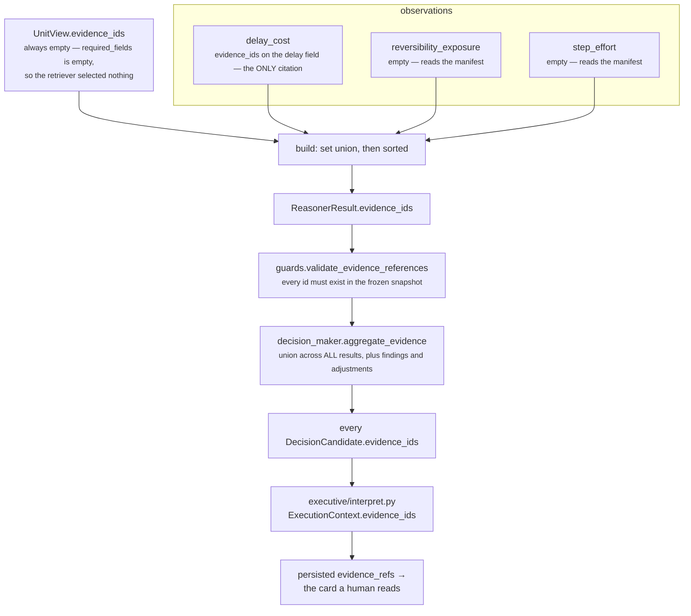

# 06 · Builder and Metrics

**Stages 7 and 8 of eight.** Neither is overridden. `CostUnit` uses `unit.py:ReasoningUnit.build`
unchanged, and stage 8 is a class attribute plus a guard inside `evaluate()`.

**Source:** `genios_engine/reason/reasoners/cost_unit.py:CostUnit.publishes` ·
`genios_engine/reason/unit.py:ReasoningUnit.build` ·
`genios_engine/reason/unit.py:ReasoningUnit.evaluate` (the guard) ·
`genios_engine/reason/guards.py:validate_candidate_effects` · `guards.py:validate_evidence_references`

---

## 1 · What it is for

Stage 7 turns the `Verdict` into the one object shape every unit in Layer 4 returns, so a consumer
reads a `core.cost` result with exactly the same code it reads a `core.risk` result.

Stage 8 is the declaration: the metric names this unit is *allowed* to publish, written in the class
body rather than discovered from what a run happened to emit. The declaration is the safety
mechanism — the framework refuses a run that emits anything not on the list, which is how a shared
number like `confidence_bp` is prevented from acquiring a second author by accident.

For this unit both stages are the base implementations. **`CostUnit` defines no `build`.** The whole
of stages 7 and 8 here is six strings and one inherited method.

---

## 2 · What exists

### 2.1 · The Builder, verbatim

```python
# unit.py:ReasoningUnit.build — NOT overridden by CostUnit
def build(self, view: UnitView, verdict: Verdict,
          observations: Sequence[Observation]) -> ReasonerResult:
    """Assemble the one object shape every unit returns."""
    evidence = set(view.evidence_ids)
    for observation in observations:
        evidence.update(observation.evidence_ids)
    return ReasonerResult(
        reasoner_id=self.unit_id,
        reasoner_version=self.version,
        status=ResultStatus.COMPLETED,
        matched=verdict.matched,
        metrics={name: clamp_bp(value) if name.endswith("_bp") else value
                 for name, value in verdict.metrics.items()},
        findings=verdict.findings,
        adjustments=verdict.adjustments,
        checks=verdict.checks,
        evidence_ids=tuple(sorted(evidence)),
        reason_codes=verdict.reason_codes,
    )
```

Substituting what this unit supplies:

| `ReasonerResult` field | Value on a `core.cost` result | Where it came from |
|---|---|---|
| `reasoner_id` | `"core.cost"` | class attribute |
| `reasoner_version` | `"1.0.0"` | class attribute |
| `status` | always `ResultStatus.COMPLETED` | hard-coded in `build` |
| `matched` | always a `bool`, never `None` | `Verdict.matched` — [05](05-Evaluator.md) §3.1 |
| `metrics` | always exactly 6 integers, all `_bp` | the Calculator, re-clamped |
| `findings` | 3 or 4 `Finding` objects — one per observation plus `cost.ledger` | `evaluate_meaning` |
| `adjustments` | 0 to `len(plays)`, `play_id`-ordered, `component="effort"` | `_effort_adjustments` |
| `checks` | 0 to `len(plays)`, `play_id`-ordered, all `WARN` at stage `cost_benefit` | `_cost_benefit_checks` |
| `evidence_ids` | 0 or more — the `delay_cost` plugin's citation, alone | §3.1 |
| `missing_fields` | always `()` | not a `build` argument; only the orchestrator's `MissingContextError` path sets it |
| `reason_codes` | 4 to 6 strings, sorted | `evaluate_meaning` |
| `diagnostics` | always `{}` | only the orchestrator's failure path sets it |

`ReasonerResult` is a frozen dataclass. `__post_init__` sorts and deduplicates `evidence_ids`,
`missing_fields` and `reason_codes` again, and runs `contracts/reasoning.py:_bp` over every
`_bp`-suffixed metric — a third guard on the same six numbers.

### 2.2 · The declaration — stage 8

```python
# cost_unit.py:CostUnit
publishes = ("cost_bp", "effort_bp", "exposure_bp", "delay_cost_bp",
             "do_nothing_cost_bp", "cost_benefit_gap_bp")
```

Six names, **all** ending in `_bp`, so all are integers `0..10_000` where `7,500bp` means 0.75. There
is no count metric on this unit, which distinguishes it from every other Optimization unit.

| Metric | Range | Meaning | Always present |
|---|---|---|---|
| `cost_bp` | 0–10,000 | Blended price of acting: the roster's cheapest effort and worst exposure traded off at `cost_weight_effort_bp` | yes |
| `effort_bp` | 0–10,000 | The roster's **cheapest** route, `step_effort_bp × steps` | yes |
| `exposure_bp` | 0–10,000 | The roster's **worst** downside, `max` over per-play exposure | yes |
| `delay_cost_bp` | 0–10,000 | Price of continuing to wait — or `0` when nothing dated the silence | yes |
| `do_nothing_cost_bp` | 0–10,000 | Delay cost with untaken headroom as a bounded corroborating lift | yes |
| `cost_benefit_gap_bp` | 0–10,000 | `cost_bp − do_nothing_cost_bp`, saturating at zero | yes |

**All six are present on every completed result**, including the empty-snapshot case. That is a
deliberate simplification and it is also the unit's largest silence compromise: three of the six can
be a *measured* zero or an *unmeasured* zero and nothing in `metrics` distinguishes them. §5.2.

### 2.3 · The one-publisher rule, and the collision that was resolved

`tests/test_unit_roster.py:test_no_unit_publishes_a_metric_another_unit_owns` enforces exactly one
publisher per metric name across the whole roster. `do_nothing_cost_bp` was a real collision:
`core.cost` and `core.alternative` both published it. `core.cost` is the authority on cost, so
`core.alternative`'s figure was renamed `do_nothing_baseline_bp` and its plugin now **reads**
`core.cost`'s value instead of deriving a second one:

```python
# alternative_unit.py:DoNothingBaselinePlugin.contribute
priced = _prior_bp(view, "inaction_cost_source", "core.cost", "do_nothing_cost_bp")
if priced is not None:
    return (Observation(..., metrics={"do_nothing_baseline_bp": priced, "signal_count": 1},
                        reason_codes=("inaction_priced_upstream",)),)
```

That is the only cross-unit consumption of a `core.cost` metric anywhere in the engine.

`test_the_unit_never_claims_authority_over_shared_metrics` additionally pins that
`confidence_bp`, `urgency_bp` and `priority_override_bp` appear neither in `publishes` nor in any
result's `metrics`. *"confidence_bp and urgency_bp have named owners; publishing them here re-scores
everything."*

### 2.4 · The guard, and where it sits

```python
# unit.py:ReasoningUnit.evaluate — between evaluate_meaning and build
undeclared = sorted(set(verdict.metrics) - set(self.publishes)) if self.publishes else []
if undeclared:
    raise ValueError(f"{self.unit_id} published undeclared metrics: {', '.join(undeclared)}")
return self.build(view, verdict, observations)
```

The guard runs **before** `build`, not inside it. A unit that published an undeclared metric would
still produce a well-formed `ReasonerResult`; refusing before that object exists makes the failure
read as *"this unit is misdeclared"* rather than *"this result contains something surprising"*.

`core.cost` declares six names and `calculate` returns exactly those six as a literal dict, so
`undeclared` is always empty and the guard is trivially satisfied on every run. The escape hatch —
`if self.publishes else []` — does not apply here.

---

## 3 · How it works

### 3.1 · The evidence union — one plugin, one citation



Two of the three plugins read the **manifest**, which is the authored action space rather than an
observation about the world, so they cite nothing. `view.evidence_ids` is empty because
`required_fields` is empty ([02](02-Retriever.md) §2.2). So the whole of a `core.cost` result's
evidence is whatever `DelayCostPlugin` cited.

Verified both directions:

```text
snapshot has an EvidenceRef on deal.last_inbound
  result.evidence_ids                     = ('ev_inbound',)
  finding cost.delay_cost .evidence_ids   = ('ev_inbound',)

shipped sales.deal_cooling_full run, no EvidenceRef on that field
  result.evidence_ids                     = ()
  and the result still asserts three matched findings
```

`guards.py:validate_evidence_references` re-checks at the orchestrator boundary that every cited id —
including ids cited only inside a `Finding` — exists in `request.context.evidence`. Since
`common.py:evidence_ids` draws from that same tuple, the check can only fail on an internally
inconsistent snapshot.

### 3.2 · What the guards check on the way out

`orchestrator.py:_evaluate` applies two functions to every returned result. For `core.cost` both have
real work to do, because this is one of only three units in the roster that touches a candidate.

```python
# guards.py:validate_candidate_effects
for name, value in result.metrics.items():
    if name.endswith("_bp") and (isinstance(value, bool) or not isinstance(value, int)
                                  or not 0 <= value <= 10_000):
        raise ValueError(f"reasoner metric {name} must be integer basis points")
for adjustment in result.adjustments:
    if adjustment.play_id not in play_ids:  raise ValueError("adjustment references unknown play")
    if adjustment.component not in CANDIDATE_COMPONENTS:  raise ValueError(...)
for check in result.checks:
    if check.play_id not in play_ids:  raise ValueError("check references unknown play")
    if check.stage not in CHECK_STAGES:  raise ValueError(...)
```

| Guard | What `core.cost` supplies | Can it fail? |
|---|---|---|
| every `_bp` metric is an integer `0..10_000` | six, all through `clamp_bp` | no |
| `adjustment.play_id` is declared | drawn from `_plays(view)`, i.e. from the manifest itself | no |
| `adjustment.component` in `{impact, success, urgency, effort, risk}` | the literal `"effort"` | no |
| `check.play_id` is declared | same source | no |
| `check.stage` in the seven-name closed set | `COST_BENEFIT_STAGE = "cost_benefit"` | no |

The stage string is why `COST_BENEFIT_STAGE` exists as a module constant: *"the string that has to
match the frozen contract's vocabulary lives in exactly one place."* `reason/store.py` re-proves the
same closed set in its persistence verifier, so the vocabulary is checked twice by two independent
callers.

### 3.3 · The clamp, and where it binds

```python
metrics={name: clamp_bp(value) if name.endswith("_bp") else value ...}
```

All six names end in `_bp`, so all six are clamped, and **none of the six can be out of range when
they arrive**: `calculate` already wraps each one in `clamp_bp`. The base clamp here never binds. It
is a belt on a unit that already wears two, which is correct for a method shared by seventeen units
that do not all have this property.

`ReasonerResult.__post_init__` runs `contracts/reasoning.py:_bp` over the same six a third time. Three
independent guards on one set of numbers, which is the right ratio for values that are hashed into an
audit record.

The framework's known float hole ([Part 2](../../README.md) §3.7) does not reach this unit. A float
`_bp` metric in a `Verdict` would be silently truncated by `int()` inside `clamp_bp` — but every value
`core.cost` produces has already passed through `clamp_bp` in the Calculator, which returns `int`.

### 3.4 · Determinism

`test_the_same_situation_reasons_to_the_same_bytes_twice` asserts `first.semantic_hash ==
second.semantic_hash`. Four sorts stand behind that:

| Sort | Where | Governs |
|---|---|---|
| `sorted(self.plugins, key=plugin_id)` | `unit.py:analyze` | observation order, therefore finding order |
| `sorted(capability.plays, key=play_id)` | `cost_unit.py:_plays` | adjustment and check order |
| `tuple(sorted(codes))` | `evaluate_meaning` | reason-code order |
| `tuple(sorted(evidence))` | `unit.py:build` | citation order |

Plus the deduplicating sorts inside `Observation.__post_init__` and
`ReasonerResult.__post_init__`. None of the unit's arithmetic reads a clock, a random source, an
environment variable, or a dict iteration order — `elapsed_hours` measures against
`request.evaluation_time`, which is frozen into the request and hashed with it.

---

## 4 · Examples and edge cases

### 4.1 · The three result shapes, real output

**A. The shipped run — cheap, quiet, uncontested.**

```text
status        COMPLETED       matched  False
metrics       cost_bp 2,160 · effort_bp 3,600 · exposure_bp 0
              delay_cost_bp 4,000 · do_nothing_cost_bp 4,000 · cost_benefit_gap_bp 0
findings      cost.delay_cost · cost.reversibility_exposure · cost.step_effort · cost.ledger
adjustments   ()
checks        ()
evidence_ids  ()
reason_codes  cost_within_tolerance · effort_estimated_from_declared_steps
              roster_is_reversible · waiting_has_a_price
```

**B. Expensive, with a caution attached.**

```text
status        COMPLETED       matched  True
metrics       cost_bp 8,960 · effort_bp 9,600 · exposure_bp 8,000
              delay_cost_bp 0 · do_nothing_cost_bp 0 · cost_benefit_gap_bp 8,960
findings      cost.reversibility_exposure · cost.step_effort · cost.ledger    ← three
adjustments   ()
checks        run_full_audit · cost_benefit · WARN · cost_exceeds_expected_benefit
              detail {estimated_cost_bp 8,960 · expected_benefit_bp 1,200 · gap_bp 7,760}
evidence_ids  ()
reason_codes  cost_exceeds_inaction · do_nothing_cost_unknown
              effort_estimated_from_declared_steps · irreversible_action_available
semantic_hash eaaba21d170ea22d…
```

**C. Nothing known at all — still a valid, meaningful result.**

```text
status        COMPLETED       matched  False
metrics       cost_bp 720 · effort_bp 1,200 · exposure_bp 0
              delay_cost_bp 0 · do_nothing_cost_bp 0 · cost_benefit_gap_bp 720
findings      cost.reversibility_exposure · cost.step_effort · cost.ledger
adjustments   ()   checks ()   evidence_ids ()
reason_codes  cost_within_tolerance · do_nothing_cost_unknown
              effort_estimated_from_declared_steps · roster_is_reversible
```

C is worth pausing on. With an empty snapshot the unit still publishes two evidenced numbers — the
effort and exposure of the declared roster — because those come from the manifest and not from the
world. *"A completed result carrying two evidenced numbers and one admitted blank"* is a different
statement from `INSUFFICIENT_CONTEXT`, and it is the statement this unit is built to make.

### 4.2 · The metrics that escape the `publishes` guard

`Observation.metrics` becomes `Finding.metrics` verbatim. The guard only inspects `Verdict.metrics`.
So five observed metrics reach the persisted result while being invisible to stage 8:

| Metric | Carried in | Declared in `publishes` | Clamped by `build` |
|---|---|---|---|
| `effort_ceiling_bp` | `cost.step_effort` finding | **no** | **no** |
| `play_count` | `cost.step_effort` finding | no | no |
| `momentum_drop_bp` | `cost.delay_cost` finding | **no** | **no** |
| `waiting_hours` | `cost.delay_cost` finding | no | no |
| `irreversible_play_count` | `cost.reversibility_exposure` finding | no | no |
| `external_recipient_play_count` | `cost.reversibility_exposure` finding | no | no |

Two of those end in `_bp` and are **not** clamped by `build`, because `build` maps only
`verdict.metrics`. They are safe today — both are produced by `clamp_bp` inside their plugins — but
the guard that would catch a regression is not covering them. `Observation.__post_init__`'s
integer check is the only validation a finding metric receives.

This is not a `core.cost` peculiarity; it is a property of the framework that this unit exercises
more than most, because six of its nine observed metrics are diagnostics rather than published
values.

### 4.3 · The `gating=True` hazard, and why it would fire backwards

`orchestrator.py:_evaluate` refuses a gating reasoner that returns a non-boolean `matched`:

```python
if (spec.gating and result.status == ResultStatus.COMPLETED
        and not isinstance(result.matched, bool)):
    raise ValueError("a completed gating reasoner must return matched=true or false")
```

Most Category 1 units return `matched=None` and would fail loudly if misdeclared as gating.
**`core.cost` always returns a `bool`, so it would pass that check silently.** And the gate itself
reads:

```python
elif spec.gating and result.matched is False:
    terminal = DecisionOutcome.NO_ACTION
```

**A gating unit ends the run when `matched` is `False`.** For every other unit that is the right
polarity — *"the condition I look for is absent, so there is nothing to do"*. For `core.cost`,
`matched=False` means `cost_within_tolerance`, i.e. *acting is worth it*. So a gating `core.cost`
would terminate the run with `NO_ACTION` exactly when the ledger says the play is cheap, and would
let the run proceed exactly when the ledger says it is expensive. Perfectly inverted.

`ReasonerSpec.__post_init__` refuses a gating spec that is not `FailurePolicy.REQUIRED` —
`gating reasoners must use required fail-closed policy` — so the misdeclaration would also have to
abandon the shipped `OPTIONAL` policy. That is the only friction. Nothing checks polarity, no
shipped capability declares this, and no test forbids it.

### 4.4 · Boundaries

| Situation | Result shape |
|---|---|
| Every plugin fires | 4 findings, 6 metrics |
| `delay_cost` silent | 3 findings, 6 metrics — `delay_cost_bp: 0` is materialised by `calculate` |
| No adjustments, no checks | `adjustments == ()`, `checks == ()`; both are valid and common |
| Every play warned and adjusted | `len(checks) == len(adjustments) == len(plays)` |
| A `_config_bp` raise anywhere | `build` never runs; `FAILED` with `reason_codes=('reasoner_failure',)` and the message in `diagnostics`, which is `compare=False, repr=False` and outside `to_semantic_dict` — so a failure message can never move a hash |
| The unit returns `SKIPPED` | impossible — `build` hard-codes `COMPLETED`. The orchestrator's `Completed → Failed` edge for a self-skipping unit is unreachable here |

---

## 5 · Who consumes this

### 5.1 · One metric has a reader. Five do not.

Verified by grep across `genios_engine/` for all six names:

| Metric | Read by |
|---|---|
| `do_nothing_cost_bp` | `alternative_unit.py:DoNothingBaselinePlugin`, via `_prior_bp(view, "inaction_cost_source", "core.cost", "do_nothing_cost_bp")` |
| `effort_bp` | `tradeoff_unit.py:CostVersusBenefitPlugin` reads `effort_bp` from `_prior_bp(view, "cost_source", "core.effort", ...)` — **`core.effort` is not a unit that exists**. Setting `cost_source: "core.cost"` in capability config would light the axis with no code change. Not set in any shipped manifest |
| `cost_bp` | nothing |
| `exposure_bp` | nothing |
| `delay_cost_bp` | nothing |
| `cost_benefit_gap_bp` | nothing |

The shipped `deal_cooling_v2.py` does declare `core.alternative` with
`dependencies=("core.constraint", "core.cost")`, so the one live consumption is wired and running.

### 5.2 · What the adjustments and checks actually do

This is where the unit's real influence lives, and it is small and precisely bounded.

| Effect | Path | Magnitude |
|---|---|---|
| Effort adjustment | `decision_maker.synthesize_candidates` → `components["effort"] += delta` → `score_candidate` | at the default 10% effort weight, a maximal `±3,000bp` correction moves `utility_bp` by exactly `±300bp`. Verified: 6,230 → 5,930 |
| `cost_benefit` WARN | `decision_maker.evaluate_candidates` → `ProposedCandidate.checks` | **zero** effect on score or disposition. `evaluate_candidates` branches only on `CheckOutcome.ELIMINATE` |

The WARN is a record, not a lever. It travels with the candidate through
`build_candidate_objects` into `reasoning_candidate_checks` and is re-proved by `store.py` on every
persisted read, so a human auditing a selected play can see that cost objected — but nothing in the
ranker ever looked at it.

That is the design, stated in the docstring, and it should be read as a deliberate limitation rather
than an oversight: *"a unit that could eliminate on price alone would quietly become the decision
authority."* The cost of that restraint is that today an expensive play with a WARN and a slightly
higher utility beats a cheap play with none, and the only surface where the objection appears is the
audit record.

### 5.3 · The record

`audit.py:_result_rows` hands `result.to_semantic_dict()` to the store. `reasoner_id`,
`reasoner_version` and `status` become columns, `evidence_ids` becomes `evidence_refs`, and
`matched`, `metrics`, `findings`, `adjustments`, `checks`, `missing_fields` and `reason_codes` are
packed into the `output` JSONB column:

```python
# store.py — the native ReasonerResult branch
output = {key: value[key] for key in (
    "matched", "metrics", "findings", "adjustments", "checks",
    "missing_fields", "reason_codes") if key in value}
```

`output_hash` is a semantic hash over that material plus the ordinal and the input hash, and
`replay.py` re-derives it to prove a decision reproduces. So all six metrics, all four findings and
every WARN are durable, queryable and hash-protected.

The one API surface that reads those rows — `api/intelligence_routes.py`'s explainability
endpoint — uses only `reasoner_id`, to build `decision_path` as `" → ".join(...)`. **The six numbers
are stored, hashed, replayable, and displayed nowhere.**

---

## 6 · Gaps in these two stages

| # | Finding | Consequence |
|---|---|---|
| 1 | **Five of six metrics have no reader**, and the sixth has one. The unit's ledger cannot influence a ranking; only its `effort` adjustments can, by at most `±300bp` of utility. | §5.1, §5.2 |
| 2 | **All six metrics are unconditional**, so a measured zero and an unmeasured zero publish identically on `delay_cost_bp`, `do_nothing_cost_bp` and `cost_benefit_gap_bp`. The `do_nothing_cost_unknown` code is the only mitigation and it keys off the value. | [05](05-Evaluator.md) §4.2 |
| 3 | **Six observed metrics bypass the `publishes` guard** by travelling inside findings, and the two `_bp`-suffixed ones among them are never clamped by `build`. | §4.2 |
| 4 | **`gating=True` on this spec would silently arm a cost reading as a run terminator — with inverted polarity.** `matched` is always a `bool` so the orchestrator's type check passes, and the gate fires on `matched is False`, which for this unit means *acting is worth it*. | §4.3 |
| 5 | **No test asserts the built result's shape beyond metrics, checks and adjustments.** Nothing pins that `build` is un-overridden, that the evidence union is exactly the delay plugin's citation, or that `status` is always `COMPLETED`. | derived by reading `unit.py`, not by an executable contract |
| 6 | **`tradeoff_unit`'s `cost_source` still defaults to `"core.effort"`**, a unit id that does not exist in the roster. The `cost_vs_benefit` axis is dark in every shipped capability, and lighting it is a one-key config change. | §5.1 |

---

## Related

| File | Covers |
|---|---|
| [README](README.md) | The unit's map, the config table, the shipped deployment |
| [04 · Calculator](04-Calculator.md) | Where the six metrics are produced, and why there is no seventh |
| [05 · Evaluator](05-Evaluator.md) | The `Verdict` this stage assembles, and the adjustments and checks it carries |
| [02 · Retriever](02-Retriever.md) §3.2 | Why the evidence union is entirely one plugin's citation |
| [Part 2 · The Unit Framework](../../README.md) §3.4, §3.7 | The `publishes` escape hatch and the `Verdict` float hole, for the units they do affect |
| [../../../03-Decision-Maker/README.md](../../../03-Decision-Maker/README.md) | `synthesize_candidates`, `evaluate_candidates`, and why a WARN changes nothing |
