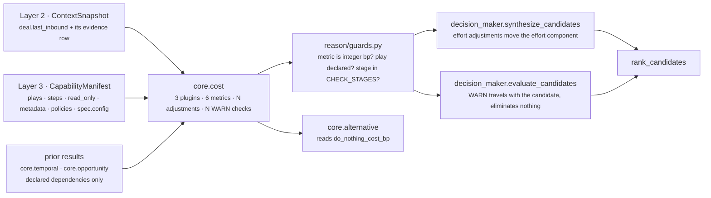
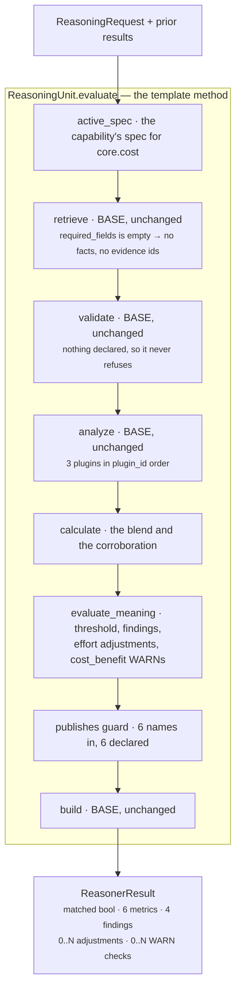
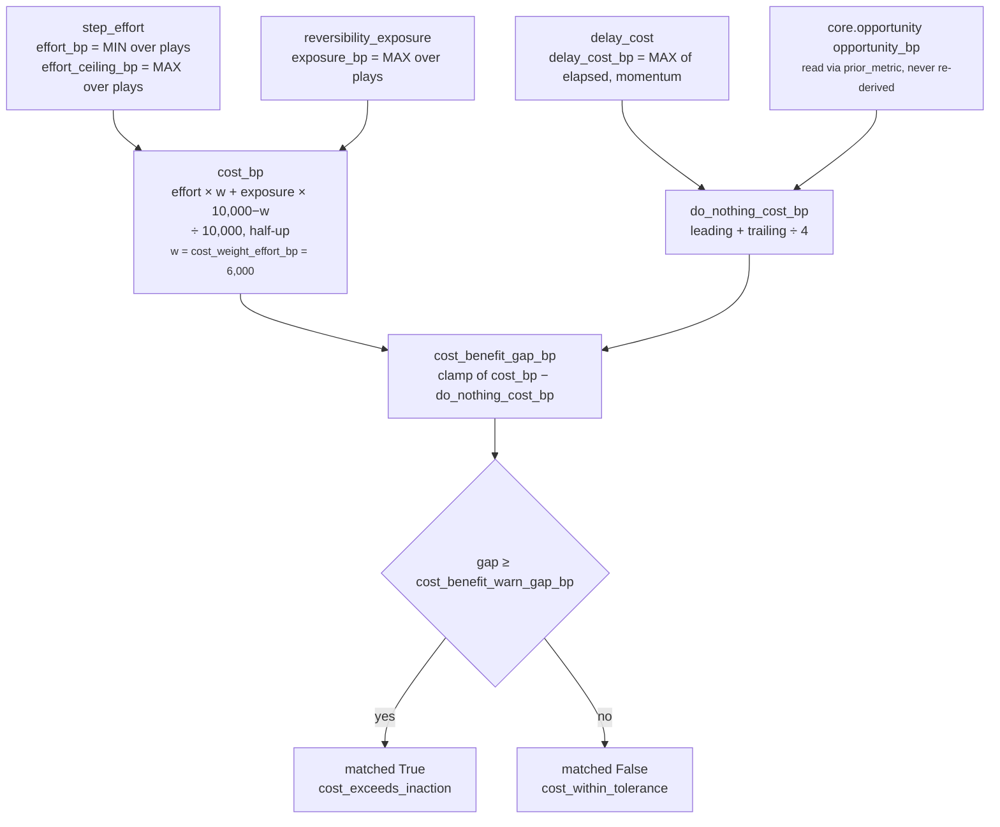

# `core.cost` — the other side of the ledger

**Module:** `genios_engine/reason/reasoners/cost_unit.py` (375 lines, 3 plugins)
**Tests:** `tests/test_unit_cost_unit.py` — 25 passing
**Identity:** `unit_id = "core.cost"` · `version = "1.0.0"`
**Category:** `UnitCategory.OPTIMIZATION`
**Registered as:** `reasoners/__init__.py:OPTIMIZATION` — `CostUnit`, no alias
**Stage constant:** `cost_unit.py:COST_BENEFIT_STAGE = "cost_benefit"`

---

## 1 · What it is for

**The business question:** *what does acting here cost, and does that cost look worth paying?*

Every other unit in Part 2 argues for motion. Something is decaying, something is unanswered,
something is at risk — and each of those units is measuring a reason to act. From the module
docstring:

> *"Nothing in that set measures the other side of the ledger, and a system that only ever prices
> the upside will act on everything, which is indistinguishable from acting on nothing."*

The unit prices three separable things: what the declared plays actually ask a human to do, what
waiting costs, and what the org is exposed to if acting turns out to be the wrong call. It folds
them into one six-number ledger and stops there.

**What it never does.** It never picks a play, never ranks the roster, and never says "do not act".
Where cost clearly outruns benefit it raises a `cost_benefit` check with outcome `WARN` — a flag on
the record, deliberately not an elimination — *"because 'expensive' is an input to a decision and
not the decision itself. Part 3 owns the verdict."*

---

## 2 · Its place in the pipeline



The unit sits in Category 3 alongside `core.tradeoff`, `core.resource`, `core.scheduling` and
`core.policy`. It is the second of the three units in the whole roster that may touch a candidate —
the other two are `core.constraint` and `core.validation`, and both of those may eliminate. This one
may not.

### The shipped deployment

One capability declares it: `packs/capabilities/deal_cooling_v2.py:build_deal_cooling_full_manifest`
(`sales.deal_cooling_full`). `sales.deal_cooling` v1 and `sales.deal_health` do not.

| Property | Shipped value | Consequence |
|---|---|---|
| `dependencies` | `()` | `prior` is always `{}`. Both `prior_metric` lookups return their defaults, so the momentum fallback and the headroom corroboration are **dark in production**. |
| `required_fields` | `()` | The validator can never refuse. See [01](01-Input-and-Validator.md). |
| `failure_policy` | `FailurePolicy.OPTIONAL` | A crash degrades the run rather than ending it. |
| `config` | `{"play_effort_bp": {"multithread_account": 600}}` | **Read by nothing.** This unit's effort knobs are `step_effort_bp`, `effort_mismatch_tolerance_bp` and `max_effort_adjustment_bp`; `play_effort_bp` appears in no source line of `cost_unit.py`. |

A real run against that manifest, ten days of buyer silence, no priors:

```text
effort_bp 3,600   exposure_bp 0   cost_bp 2,160
delay_cost_bp 4,000   do_nothing_cost_bp 4,000   cost_benefit_gap_bp 0
matched False · 0 checks · 0 adjustments · evidence_ids ()
codes  cost_within_tolerance · effort_estimated_from_declared_steps
       roster_is_reversible · waiting_has_a_price
```

All three shipped plays carry three steps, so the effort floor and ceiling coincide at
`1,200 × 3 = 3,600`. All three are `read_only=True` and the capability declares
`human_approval_required`, so the worst per-play exposure is `2,000 − 3,000 → clamp → 0`.

---

## 3 · The plugins

Three claims, three currencies, no shared arithmetic between them. `analyze()` runs them in
`plugin_id` order, which is alphabetical and is also the order their findings are emitted in.

| # | Plugin | `plugin_id` | `kind` | Observation metrics | Silent when | Doc |
|---|---|---|---|---|---|---|
| 1 | `DelayCostPlugin` | `delay_cost` | `cost.delay` | `delay_cost_bp`, `momentum_drop_bp`, `waiting_hours`* | no usable timestamp **and** no positive momentum drop | [03a](03a-plugin-delay_cost.md) |
| 2 | `ReversibilityPlugin` | `reversibility_exposure` | `cost.exposure` | `exposure_bp`, `irreversible_play_count`, `external_recipient_play_count` | the roster is empty — unreachable | [03b](03b-plugin-reversibility_exposure.md) |
| 3 | `StepEffortPlugin` | `step_effort` | `cost.step_effort` | `effort_bp`, `effort_ceiling_bp`, `play_count` | the roster is empty — unreachable | [03c](03c-plugin-step_effort.md) |

\* `waiting_hours` is present only when a timestamp parsed.

`CapabilityManifest.__post_init__` raises `capability requires at least one play`, so two of the
three plugins can never take their silent branch through a legally constructed manifest. Only
`delay_cost` has a reachable silence, and that silence is the single most load-bearing behaviour in
the unit.

### Published metrics

| Metric | Range | Meaning | Source |
|---|---|---|---|
| `cost_bp` | 0–10,000 | Blended price of acting: effort and exposure traded off at `cost_weight_effort_bp` | `calculate` |
| `effort_bp` | 0–10,000 | The roster's **cheapest** route, in steps × rate | `step_effort` |
| `exposure_bp` | 0–10,000 | The roster's **worst** downside if the call is wrong | `reversibility_exposure` |
| `delay_cost_bp` | 0–10,000 | Price of continuing to wait: elapsed days, or measured momentum loss, whichever is larger | `delay_cost` |
| `do_nothing_cost_bp` | 0–10,000 | Delay cost corroborated by untaken opportunity headroom | `calculate` |
| `cost_benefit_gap_bp` | 0–10,000 | `cost_bp − do_nothing_cost_bp`, saturating at zero | `calculate` |

Six names, all `_bp`, all always present on a completed result. There is no conditional metric on
this unit — which is itself a compromise, because three of the six can be a *measured* zero or an
*unmeasured* zero and the ledger does not distinguish them. See §7 and
[06](06-Builder-and-Metrics.md) §5.

The observation-level metrics — `effort_ceiling_bp`, `play_count`, `momentum_drop_bp`,
`waiting_hours`, `irreversible_play_count`, `external_recipient_play_count` — never reach
`result.metrics`. They travel inside the per-plugin `Finding` objects, which is a route the
`publishes` guard does not inspect. [06](06-Builder-and-Metrics.md) §4.2.

---

## 4 · Internal flow



**Five of the eight stages are the base implementation verbatim.** `CostUnit` implements only the
two abstract stages plus the class attributes. That is the framework paying for itself, and it is
also the reason [01](01-Input-and-Validator.md) and [02](02-Retriever.md) are short files about what
the base does *for* this unit rather than about anything the unit wrote.

The arithmetic in one picture:



Two deliberate asymmetries, both chosen so the unit errs toward caution. Effort is the roster's
**floor**, because acting means running *one* play and the cheapest route is the least anyone could
pay. Exposure is the roster's **ceiling**, because the unit does not know which play Part 3 will
choose. The consequence is that `cost_bp` can describe no play in the roster — it is a
capability-level ledger, not a play-level one, which is exactly why
[05](05-Evaluator.md)'s per-play check recomputes cost play by play instead of reusing the published
figure.

---

## 5 · Configuration

Every knob is read through `cost_unit.py:_config_bp`, which refuses anything that is not an `int` in
`0..10_000` — including `bool`, because `isinstance(True, int)` is `True` in Python. The refusal is
a `ValueError`, not a fallback:

> *"Tuning is authored in Layer 3 and travels inside the versioned capability, so a bad value is a
> deployment fault that must fail loudly here rather than silently become a plausible-looking cost
> somewhere downstream."*

| Config key | Default | Type | Read by | Effect |
|---|---|---|---|---|
| `step_effort_bp` | `1_200` | int bp | `_step_effort` | Cost charged per declared step. Effort saturates at 9 steps on the default. |
| `irreversible_exposure_bp` | `6_000` | int bp | `_play_exposure` | Added when `play.read_only` is `False`. |
| `external_recipient_exposure_bp` | `2_000` | int bp | `_play_exposure` | Added when `play.metadata["external_recipient_required"] is True`. |
| `approval_backstop_relief_bp` | `3_000` | int bp | `_play_exposure` | Subtracted when the capability declares `human_approval_required`. |
| `delay_cost_per_day_bp` | `400` | int bp | `DelayCostPlugin` | Charged per **whole** elapsed day. Saturates at 25 days on the default. |
| `delay_field` | `"deal.last_inbound"` | str | `DelayCostPlugin` | **Not** validated by `_config_bp`. Read as `str(view.config.get("delay_field") or "deal.last_inbound")`, so `""`, `0` and `None` all fall back to the default while `17` becomes the literal field name `"17"`. |
| `cost_weight_effort_bp` | `6_000` | int bp | `calculate`, `_cost_benefit_checks` | Effort's share of the blend. Exposure gets `10_000 − w`. |
| `effort_mismatch_tolerance_bp` | `2_500` | int bp | `_effort_adjustments` | Drift below this is authoring noise and is left alone. The test is `abs(drift) < tolerance`, so drift **exactly** at 2,500 does adjust. |
| `max_effort_adjustment_bp` | `3_000` | int bp | `_effort_adjustments` | Symmetric cap on the correction, `±ceiling`. |
| `cost_benefit_warn_gap_bp` | `2_000` | int bp | `_cost_benefit_checks`, `evaluate_meaning` | One threshold used twice: the per-play WARN bar and the unit's own `matched` bar. |

**None of these defaults is tuned against outcome data.** They are stated ratios that make the
arithmetic reproducible by hand — a reviewer can count steps in a manifest and get the same number —
not calibrated constants. `1,200bp per step`, `6,000bp for irreversibility` and `400bp per day of
silence` are business judgements written down, and nothing in the repository measures whether they
are right.

---

## 6 · Silence semantics

| Situation | What the unit does |
|---|---|
| No timestamp and no momentum reading | `delay_cost` returns `()`. **No zero observation.** *"An unknown cost of waiting must stay unknown — reporting it as zero would tell the Decision Maker that delay is free, which is the single most expensive thing this unit could get wrong."* |
| Timestamp present but unparseable, naive, or future-dated | `elapsed_hours` raises `ValueError`, caught, `hours = None`. *"A corrupt fact is missing evidence, not evidence of a fresh conversation."* |
| Roster is entirely read-only | `exposure_bp: 0` with `roster_is_reversible` — an **evidenced** zero, not an absence |
| Nothing declared to do | both roster plugins return `()`; unreachable through a legal manifest |
| A play whose declared effort matches its steps | no adjustment. Silence is the pass state. |
| A play that is expensive but breaks an expensive silence | no check. Silence is the pass state. |
| Nothing at all is known | the unit still returns `COMPLETED` with all six metrics, three of them zero, plus `do_nothing_cost_unknown` |

The last row is the unit's honest weak point. `calculate` materialises `delay_bp = 0` when the delay
plugin was silent, so the published `delay_cost_bp: 0` cannot be distinguished from a measured zero.
`do_nothing_cost_unknown` is the mitigation and it is keyed off the *value* rather than off whether
an observation was made. §7 item 1.

---

## 7 · Known gaps and compromises

| # | Gap | Where |
|---|---|---|
| 1 | **A measured zero reports as unknown.** The delay plugin fires on any parseable timestamp and prices whole days only, so an inbound message six hours ago yields `delay_cost_bp: 0` and a result carrying **both** `waiting_has_a_price` and `do_nothing_cost_unknown`. Those two codes contradict each other. Verified. | [03a](03a-plugin-delay_cost.md) §6, [05](05-Evaluator.md) §4.2 |
| 2 | **`roster_is_reversible` can fire on a non-zero exposure.** The code keys off `irreversible == 0` alone, so a read-only roster with an external recipient reports `exposure_bp: 2,000` alongside `roster_is_reversible`. Verified. | [03b](03b-plugin-reversibility_exposure.md) §6 |
| 3 | **The plugin cites evidence the retriever never selected.** `required_fields` is `()`, so `view.evidence_ids` is empty, yet `delay_cost` calls `common.py:evidence_ids(view.request, field)` directly and the id reaches the result. The framework's *"a unit cannot cite a row it did not select"* is a property of the base retriever, not of the unit. Verified. | [02](02-Retriever.md) §3.2 |
| 4 | **`prior` is empty in production.** The shipped spec declares no dependencies, so the momentum fallback and the headroom corroboration have never fired outside tests. No error, no reason code, no telemetry — two of the unit's five inputs are simply switched off. | [03a](03a-plugin-delay_cost.md) §5, [04](04-Calculator.md) §4.3 |
| 5 | **`play_effort_bp` in the shipped config is read by nothing.** `deal_cooling_v2.py` configures `core.cost` with `{"multithread_account": 600}` and a comment explaining why multithreading costs more. `cost_unit.py` contains no such key. | §2 above |
| 6 | **Effort saturates at 9 steps and delay at 25 days.** On the defaults a 9-step and a 20-step play are indistinguishable, and so are 25 and 60 days of silence. Both are `clamp_bp` doing its job at the top of the range; both are undocumented in the module. | [03c](03c-plugin-step_effort.md) §6, [03a](03a-plugin-delay_cost.md) §6 |
| 7 | **`_config_bp` cannot express a negative knob.** `approval_backstop_relief_bp` is a *subtraction* validated as `0..10_000`, so a deployment can only ever reduce exposure with it — which is correct today but means the same validator cannot be reused for a knob that should be able to go either way. | [03b](03b-plugin-reversibility_exposure.md) §3 |
| 8 | **The unit is undeclared in every capability but one, and the one that declares it wires it to nothing.** Its five non-`do_nothing` metrics are persisted and hashed and read by no module in `genios_engine/`. Its `cost_benefit` WARN changes no score and no disposition. | [06](06-Builder-and-Metrics.md) §5 |
| 9 | **`matched` has inverted polarity relative to every other unit**, and three generic readers plus the `gating` path would take it at face value. A gating `core.cost` would terminate the run precisely when acting is cheap. | [05](05-Evaluator.md) §3.1, [06](06-Builder-and-Metrics.md) §4.3 |

---

## 8 · The files

| File | Covers |
|---|---|
| [01-Input-and-Validator.md](01-Input-and-Validator.md) | What arrives, why `required_fields` is empty, why `validate()` is the base implementation and can never refuse |
| [02-Retriever.md](02-Retriever.md) | Why the base `retrieve()` selects nothing here, and how the delay plugin cites evidence anyway |
| [03-Analyzer.md](03-Analyzer.md) | The plugin seam: composition, execution order, what each contributes, and the one place two plugins touch the same input |
| [03a-plugin-delay_cost.md](03a-plugin-delay_cost.md) | The cost of waiting — the only plugin with a reachable silence |
| [03b-plugin-reversibility_exposure.md](03b-plugin-reversibility_exposure.md) | The roster's worst case, and the approval backstop |
| [03c-plugin-step_effort.md](03c-plugin-step_effort.md) | The roster's cheapest route, re-derived from steps |
| [04-Calculator.md](04-Calculator.md) | The blend, the corroboration, the saturating gap — and why each has that shape |
| [05-Evaluator.md](05-Evaluator.md) | `evaluate_meaning()` — the threshold, the four findings, the effort adjustments and the `cost_benefit` WARNs |
| [06-Builder-and-Metrics.md](06-Builder-and-Metrics.md) | The exact `ReasonerResult`, the six declared metrics, evidence attachment, and who reads them |

## Related

| Document | Covers |
|---|---|
| [../README.md](../README.md) §4.4 | Category 3 as a whole; the summary this folder expands |
| [../../README.md](../../README.md) | The unit framework — the eight stages, five of which this unit inherits untouched |
| [../../04-Decision-Support/core.alternative/](../../04-Decision-Support/) | `do_nothing_baseline`, the one downstream consumer of a `core.cost` metric |
| [../../../03-Decision-Maker/README.md](../../../03-Decision-Maker/README.md) | `synthesize_candidates` and `evaluate_candidates` — where the adjustments and WARNs land |
| [../../../_reference/Contracts-and-Dataflow.md](../../../_reference/Contracts-and-Dataflow.md) | `CandidateAdjustment`, `CandidateCheck`, `CheckOutcome` in full |
