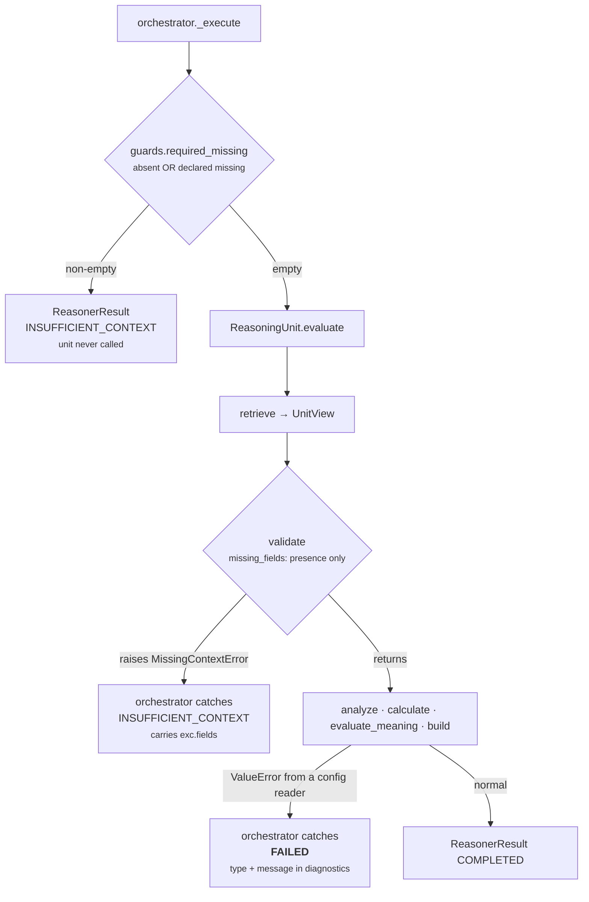

# 01 · Input and Validator

**Stage 1 of 8** — what the capability handed this unit
**Stage 2 of 8** — refuse to reason from inputs that cannot support a conclusion
**Source:** `genios_engine/reason/unit.py:ReasoningUnit.validate` (base, **not overridden**)

---

## 1 · What it is for

Two questions, in order:

1. *What did `core.policy` actually get to look at?*
2. *Is there any input this unit would refuse to reason from?*

The answer to the second is unusual and worth stating first: **`core.policy` declares no
`required_fields`, so it never refuses on missing context.** It is a unit whose entire subject —
the tenant's written rules — arrives in config rather than in facts, and a capability that
configured no rules gets a truthful `organisation_policy_clear` rather than an abstention. The unit
*does* refuse, loudly, on **malformed config**, and that is a different failure with a different
status. §4 draws the line.

---

## 2 · What arrives

`ReasoningUnit.evaluate(request, prior_results)` takes exactly two arguments. Everything the unit
sees comes from one of them.

| Input | Type | What `core.policy` uses it for |
|---|---|---|
| `request.capability.reasoners` | `tuple[ReasonerSpec, ...]` | `common.py:active_spec` picks out the `core.policy` spec — the **only** source of the tenant's rules |
| `request.capability.plays` | `tuple[PlayDefinition, ...]` | `_checks` iterates them; `_reaches_outside` / `_needs_approval_cover` read `read_only`, `tags`, `metadata` |
| `request.context.facts` | `Mapping[str, Any]` | read directly by every plugin through `common.py:fact_value` |
| `request.context.evidence` | `tuple[EvidenceRef, ...]` | read directly by `common.py:evidence_ids` to cite what a rule looked at |
| `request.evaluation_time` | `datetime`, timezone-aware | the base of `_local_time` — the frozen "now" for blackout and working-hours arithmetic |
| `prior_results` | `Mapping[str, ReasonerResult]` | **unused.** The unit never calls `view.prior_metric`, and the shipped spec declares no `dependencies` |

`prior_results` being unused is a real property, not an oversight: the tenant's handbook does not
depend on how risky the deal is. It also means `core.policy` can be scheduled anywhere in a plan
without changing its answer.

### Fields the plugins may reach for

None of these are declared as `required_fields`. Each is a *default fact name* a config key can
redirect, and each is optional — absence is handled by the plugin that wants it.

| Default fact name | Config key that renames it | Read by | Absent → |
|---|---|---|---|
| `deal.value` | `approval_value_field` | `approval_threshold` | a 2,000bp concern, if a threshold is declared |
| `deal.approval_status` | `approval_status_field` | `approval_threshold` | treated as "no sign-off on record" |
| `contact.do_not_contact` | `do_not_contact_field` | `contact_permission` | **nothing at all** |
| `contact.consent_status` | `consent_status_field` | `contact_permission` | a 3,000bp concern, if the consent rule is on |

Facts arrive in either of two shapes and `common.py:fact_value` accepts both:

```python
facts = {"deal.value": 6_200_000}                                    # bare value
facts = {"deal.value": {"value": 6_200_000, "confidence_bp": 9_000}} # record form
```

Verified: the record form produces `value_amount = 6,200,000` identically to the bare form.
`fact_value` unwraps a mapping only when it carries a `"value"` key; a mapping without one is
returned whole, which then fails `integer()` and becomes an *unreadable* concern rather than a crash.

---

## 3 · `required_fields` — declared empty, and why that is right

```python
# packs/capabilities/deal_cooling_v2.py
_spec("core.policy")            # dependencies=(), required_fields=(), config={}
```

`ReasonerSpec.required_fields` defaults to `()`. The shipped `sales.deal_cooling_full` manifest
declares nothing for `core.policy`, so the tuple is empty in production.

That is the correct declaration for this unit, for a reason specific to it:

- **A required field is a promise that reasoning is impossible without it.** For `core.policy` no
  fact is universally necessary. A tenant who configured only `blackout_dates` needs no facts at
  all — the rule is a statement about the calendar. A tenant who configured only
  `require_contact_consent` needs `contact.consent_status`, and its *absence is itself the finding*.
- **Declaring `deal.value` as required would invert the unit's own logic.** The approval plugin
  exists to distinguish "over the bar and unsigned" from "we could not verify this is within the
  limit". A required field turns the second case into an abstention — which is exactly the outcome
  the plugin's docstring argues against: *"staying silent would let an unbounded commitment through
  unremarked."*

A tenant *can* declare `required_fields` on their own spec, and the base machinery honours it. The
consequence is documented in [02-Retriever](02-Retriever.md) §4: it is currently the only way to get
non-empty `view.facts` and `view.evidence_ids` on this unit.

---

## 4 · The Validator — base implementation, unchanged

`PolicyUnit` does not define `validate`. It inherits:

```python
def validate(self, view: UnitView) -> None:
    absent = missing_fields(view.request, view.spec.required_fields)
    if absent:
        raise MissingContextError(*absent)
```

`common.py:missing_fields` checks **presence only** — `field not in request.context.facts`, with a
`neighbor:` prefix scoping the lookup to `context.neighbor_facts`. With `required_fields = ()` the
loop body never runs, `absent` is `()`, and the method returns without raising.

### Two definitions of "missing", and which one actually runs

The orchestrator applies a **stricter** test *before* the unit is called at all:

```python
# reason/guards.py
missing = set()
declared_missing = set(request.context.missing_fields)
for field in required:
    absent = field not in request.context.facts        # or neighbor_facts
    if absent or field in declared_missing:            # ← the extra clause
        missing.add(field)
```

`guards.py:required_missing` treats a field as missing when it is absent **or** when Layer 2
explicitly published it in `context.missing_fields` — an unknown fact and a *known-absent* fact must
both stop reasoning. `orchestrator.py` around line 178 runs this and short-circuits to
`ResultStatus.INSUFFICIENT_CONTEXT` without invoking the unit.

So for a tenant who *does* declare `required_fields` on `core.policy`, the effective validator is
the orchestrator's, and the unit's own is unreachable in the orchestrated path. The unit's validator
only bites when the unit is called directly — from a test, or from a replay harness.



**With the shipped configuration, `INSUFFICIENT_CONTEXT` is unreachable for this unit by either
route.** No field is declared, so neither gate can fire.

---

## 5 · What *does* make this unit refuse: malformed config

`core.policy` has a second refusal path that has nothing to do with facts. Every config reader
raises `ValueError` rather than coercing, and the orchestrator maps any non-`MissingContextError`
exception to `ResultStatus.FAILED` — a different status, carrying a different meaning.

| Status | Means | Reached by |
|---|---|---|
| `INSUFFICIENT_CONTEXT` | *the situation did not supply what this unit needs* | `MissingContextError` — **unreachable here** |
| `FAILED` | *this deployment is misconfigured* | any config reader raising `ValueError` |

The distinction matters because they route differently. `INSUFFICIENT_CONTEXT` is a fact about the
data; `FAILED` is a fact about the manifest, and somebody has to go fix a config file.

Every reader and what it rejects:

| Reader | Raises when |
|---|---|
| `_config_bp(key, default)` | value is `bool`, is not `int`, or is outside `0..10_000` |
| `_config_field(key, default)` | value is not a `str`, or strips to empty |
| `_config_flag(key, default)` | value is not a `bool` — `"true"` is rejected, not coerced |
| `_config_amount(key)` | value is `bool`, is not `int`, or is outside `0..10^15` |
| `_config_texts(key, default)` | value is a bare `str`, is not a list/tuple, or any item is not a non-empty `str` |
| `_config_hour(key)` | value is `bool`, is not `int`, or is outside `0..23` |
| `_config_weekdays(key, default)` | value is a bare `str`, is not a list/tuple, is empty, or any item is outside `0..6` |
| `_config_offset_minutes(key)` | value is `bool`, is not `int`, or is outside `−720..840` |
| `TimingRulePlugin._blackout` | any declared date fails `date.fromisoformat` |

Two of these have their own tests:

```python
# tests/test_unit_policy_unit.py
def test_a_malformed_approval_threshold_is_a_deployment_fault():
    request = _request(config={"approval_threshold_amount": "fifty thousand"})
    with pytest.raises(ValueError, match="approval_threshold_amount"):
        ApprovalThresholdPlugin().contribute(_view(request))

def test_a_malformed_blackout_date_is_a_deployment_fault():
    request = _request(config={"blackout_dates": ["christmas eve"]})
    with pytest.raises(ValueError, match="blackout_dates"):
        TimingRulePlugin().contribute(_view(request))
```

The second is the more interesting one, because *"christmas eve"* is not today. The plugin validates
**every** declared date before it compares any of them, so an unparseable entry fails the run even
when it could not possibly have fired. That is the right trade: *"a freeze nobody can parse is a
freeze that silently does not happen."*

Note the `bool` rejection appearing in five readers. `isinstance(True, int)` is `True` in Python, so
without the explicit guard `approval_threshold_amount: True` would validate as the amount `1` and
turn into a rule requiring sign-off on every deal worth more than one penny.

---

## 6 · Worked examples

### 6.1 · The shipped case — nothing declared, nothing refused

```text
spec     ReasonerSpec("core.policy", "1.0.0", dependencies=(), required_fields=(), config={})
facts    {}                    # or anything at all; none of it is required
```

```text
guards.required_missing(request, ())  → ()          # nothing to check
validate(view)                        → returns     # missing_fields(request, ()) == ()
result.status                         → COMPLETED
result.metrics                        → {compliance_bp: 10_000, policy_violations: 0,
                                         policy_concerns: 0, rules_triggered: 0}
result.reason_codes                   → ("organisation_policy_clear",)
```

Verified. The unit reasons to a real conclusion — *the tenant's rulebook has nothing to say here* —
rather than abstaining.

### 6.2 · A tenant declares `required_fields` and the field is absent

```text
spec     ReasonerSpec("core.policy", "1.0.0", required_fields=("deal.value",),
                      config={"approval_threshold_amount": 5_000_000})
facts    {"deal.approval_status": "pending"}       # deal.value is not there
```

Through the orchestrator:

```text
guards.required_missing(request, ("deal.value",))  → ("deal.value",)
→ ReasonerResult(status=INSUFFICIENT_CONTEXT, missing_fields=("deal.value",))
→ the unit is never called; no metrics, no findings, no checks
```

Called directly:

```text
retrieve  → UnitView(facts={}, evidence_ids=())
validate  → MissingContextError("deal.value")
```

Both routes end the same way. Note what is lost: the 2,000bp `approval_value_absent` concern the
plugin *would* have raised never happens, because the unit never runs. That is why the shipped spec
declares nothing — a policy unit that abstains is a policy unit that reports full silence, and full
silence reads downstream as "no rules apply".

### 6.3 · Malformed config — a deployment fault, not a data problem

```text
config   {"require_contact_consent": "true"}       # a string, not a bool
```

```text
guards.required_missing → ()                       # nothing declared, passes
validate                → returns                  # nothing declared, passes
analyze → ContactPermissionPlugin.contribute
        → _config_flag(view, "require_contact_consent", False)
        → ValueError("require_contact_consent must be a boolean")
orchestrator            → ResultStatus.FAILED
                          reason_codes: ("reasoner_failure",)
                          diagnostics: {"exception_type": "ValueError",
                                        "message": "require_contact_consent must be a boolean"}
```

`diagnostics` is declared `field(default_factory=dict, compare=False, repr=False)` on
`ReasonerResult`, so the message can never move a decision hash.

With `FailurePolicy.OPTIONAL` — which is what `sales.deal_cooling_full` declares for this unit —
the run **continues** with no policy reading at all. It is not entirely silent: `orchestrator.py`
appends `optional_failed:core.policy` to `optional_degradations`, which reaches the decision as a
degradation marker. But no play is eliminated and no compliance number is published. That is worth
naming plainly: **a typo in a tenant's consent flag disarms the only unit in Category 3 that can
eliminate a play, and the run still produces advice.** A tenant relying on `core.policy` for
compliance should declare it `FailurePolicy.REQUIRED`, which turns the same fault into
`DecisionOutcome.FAILED` and no advice at all.

---

## 7 · Determinism

Nothing in this stage reads a clock, a database, or an environment variable.
`test_no_unit_reaches_for_a_clock_or_a_database` in `tests/test_unit_roster.py` scans
`policy_unit.py` for `datetime.now`, `time.time`, `random.`, `os.environ`, `requests.`,
`sqlalchemy`, `openai` and `anthropic`. The module imports `datetime` and `date` and uses neither to
read the present: `_local_time` is `request.evaluation_time + timedelta(...)`, and
`date.fromisoformat` is a parser.

That is what makes `test_the_same_situation_reasons_to_the_same_bytes_twice` — asserting equal
`semantic_hash` across two evaluations of the same request — a meaningful assertion rather than a
tautology.

---

| ← | → |
|---|---|
| [README](README.md) | [02 · Retriever](02-Retriever.md) |
