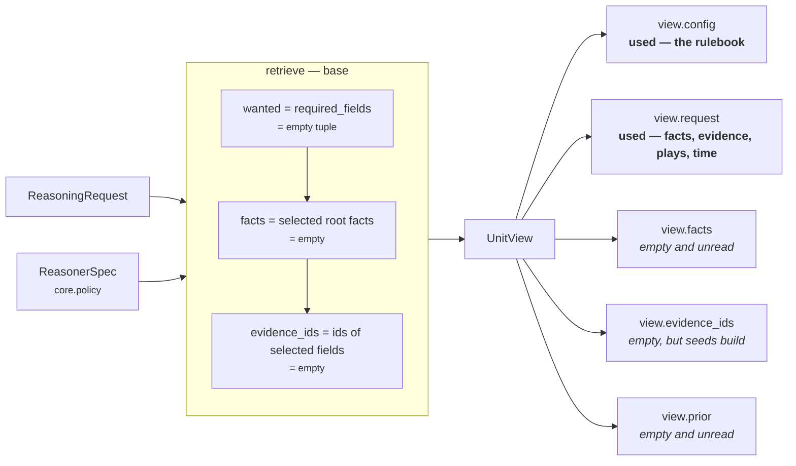

# 02 · Retriever

**Stage 3 of 8** — select the slice of the frozen snapshot this unit needs
**Source:** `genios_engine/reason/unit.py:ReasoningUnit.retrieve` (base, **not overridden**)

---

## 1 · What it is for

The Retriever's job is to answer *"what was this unit allowed to look at?"* in one place, so a
reviewer does not have to read the unit's body to find out.

For `core.policy` the honest answer has two halves, and they disagree:

- **What the Retriever selected:** nothing. `view.facts` is empty and `view.evidence_ids` is empty
  under the shipped configuration.
- **What the unit actually reads:** four fact names and the whole evidence table, reached directly
  off `view.request` rather than through the view.

That gap is the substance of this file. It is not a bug in the sense of producing a wrong answer —
every number the unit publishes is correct — but it does mean the `UnitView` does not describe this
unit's inputs, which is the one thing a `UnitView` is for.

---

## 2 · The base implementation, unchanged

`PolicyUnit` does not define `retrieve`. It inherits:

```python
def retrieve(self, request: ReasoningRequest, spec: ReasonerSpec,
             prior: Mapping[str, ReasonerResult]) -> UnitView:
    """Select this unit's window on the frozen snapshot. Selection only — never IO."""
    wanted = tuple(field for field in spec.required_fields
                   if not field.startswith("neighbor:"))
    facts = {name: request.context.facts[name]
             for name in wanted if name in request.context.facts}
    evidence = tuple(sorted(item.evidence_id for item in request.context.evidence
                            if item.field in facts))
    return UnitView(request=request, spec=spec, prior=prior,
                    facts=MappingProxyType(facts), evidence_ids=evidence)
```

Three things it does, all of them selection over an immutable mapping — never a fetch:

1. Drops `neighbor:`-prefixed declarations. `core.policy` declares none.
2. Copies the declared root facts into `view.facts`.
3. Derives `view.evidence_ids` from *which fields were selected*, so a unit cannot cite a row it did
   not select. `guards.py:validate_evidence_references` re-checks this at the orchestrator boundary
   anyway.

**"The Retriever does not fetch"** is the framework's largest departure from the literal spec, and
it is forced rather than chosen: retrieval already happened when Layer 2 froze the
`ContextSnapshot`, and a unit that fetched anything would be reading state the decision was never
hashed against. See [the framework README](../../README.md) §3.1.

---

## 3 · What lands in this unit's `UnitView`

With the shipped spec — `_spec("core.policy")`, `required_fields = ()` — the loop body never runs:

```text
wanted        = ()
view.facts    = MappingProxyType({})          # empty
view.evidence_ids = ()                         # empty
view.spec     = ReasonerSpec("core.policy", "1.0.0", ..., config={...})
view.prior    = {}                             # no dependencies declared
view.config   = view.spec.config               # ← the only thing the unit actually needs from here
```

`view.config` is the property that carries the whole point of this unit. It is `spec.config`, the
per-capability tuning authored in Layer 3 and versioned with it, and it is where all nineteen
policy rules live.



---

## 4 · Where the facts actually come from

Every plugin bypasses `view.facts` and goes to the request:

| Helper | Signature | Reads |
|---|---|---|
| `_text_fact(view, field)` | → `str` | `common.py:fact_value(view.request, field)` → `request.context.facts` |
| `ApprovalThresholdPlugin.contribute` | | `fact_value(view.request, value_field)` |
| `ContactPermissionPlugin._do_not_contact` | | `fact_value(view.request, field)` |
| `evidence_ids(view.request, *fields)` | → `tuple[str, ...]` | `request.context.evidence`, filtered on `item.field in wanted` |

```python
def _text_fact(view: UnitView, field: str) -> str:
    value = fact_value(view.request, field)          # ← view.request, not view.facts
    return "" if value is None else str(value).strip().lower()
```

**This is not unique to `core.policy`.** It is the only workable pattern for a unit whose fact names
are *configurable*: `approval_value_field` may name any fact the tenant likes, and `required_fields`
is authored on the same spec but is a separate, static declaration. A unit that read only
`view.facts` would need the tenant to keep two config keys in sync — the rule's field name and the
required-fields list — and would go silent whenever they drifted apart.

The cost is that the framework's evidence-derivation property does not hold through the view here.
It is re-established one layer down instead: `common.py:evidence_ids` filters the same
`request.context.evidence` table on the field names the rule actually consulted, so a citation is
still tied to a field the unit looked at. The difference is that the tie is asserted by the plugin
rather than derived by the Retriever.

### What `view.evidence_ids` still does

Empty as it is, it is not dead. `build()` seeds its evidence set from it:

```python
evidence = set(view.evidence_ids)
for observation in observations:
    evidence.update(observation.evidence_ids)
```

So a tenant who declares `required_fields = ("deal.value",)` gets that field's evidence ids attached
to **every** result from this unit, whether or not a rule looked at it. Verified: with
`required_fields=("deal.value",)` and evidence rows `ev_value` / `ev_status` present, the result
carries `evidence_ids = ("ev_status", "ev_value")` — the union of the retriever's selection and the
observation's citations, which happen to coincide in that run.

---

## 5 · Which slice of the snapshot the unit reaches for

Facts are only one of the four inputs. The full reach, by rule family:

| Rule family | Facts | Play attributes | Time | Config |
|---|---|---|---|---|
| `approval_threshold` | `deal.value`, `deal.approval_status` | `read_only`, `metadata["execution_boundary"]`, `tags` | — | 5 keys |
| `contact_permission` | `contact.do_not_contact`, `contact.consent_status` | `read_only`, `metadata["external_recipient_required"]` | — | 6 keys |
| `timing_rules` | **none** | `read_only`, `metadata["external_recipient_required"]` | `request.evaluation_time` | 6 keys |

`timing_rules` is the one that makes the point: an entire rule family with **zero fact
dependencies**. A blackout date is a statement about the tenant's calendar and the frozen evaluation
time, nothing else. That is why declaring `required_fields` on this unit is a mistake — it would
gate a rule family that needs no facts on the presence of a fact.

### Play attributes are not facts

`_reaches_outside` and `_needs_approval_cover` read `PlayDefinition`, which arrives on
`request.capability.plays` and is Layer 3 content, not Layer 2 context. Neither the Retriever nor
`required_fields` has anything to say about it, and no evidence id is ever attached to a play-shaped
claim — the play *is* the manifest, and the manifest is hashed into the request separately.

---

## 6 · Worked examples

### 6.1 · The shipped run — empty view, correct answer

```text
spec     required_fields=()  config={}
facts    {"deal.value": 6_200_000, "contact.do_not_contact": False}
evidence (ev_value, ev_dnc)
```

```text
retrieve → view.facts = {}          view.evidence_ids = ()
analyze  → approval_threshold : _config_amount → None      → ()
           contact_permission : raw = False → not flagged   → ()
           timing_rules       : no dates, no hours          → ()
build    → evidence = set(()) ∪ nothing = ()
result   → evidence_ids = ()
```

The unit cites nothing, which is right: it looked at `contact.do_not_contact`, found an evidenced
"no", and had nothing to claim. A citation with no claim attached would be noise.

### 6.2 · A rule fires and cites what it read

```text
config   {"approval_threshold_amount": 5_000_000}
facts    {"deal.value": 6_200_000, "deal.approval_status": "pending"}
evidence EvidenceRef(evidence_id="ev_value",  field="deal.value")
         EvidenceRef(evidence_id="ev_status", field="deal.approval_status")
```

```text
retrieve → view.facts = {}   view.evidence_ids = ()        # still empty
analyze  → Observation(kind="policy.approval_threshold",
                       evidence_ids=evidence_ids(request, "deal.value",
                                                          "deal.approval_status")
                                  = ("ev_status", "ev_value"))
build    → evidence = set(()) ∪ {"ev_status", "ev_value"}
result   → evidence_ids = ("ev_status", "ev_value")
```

Verified. Both fields are cited — the value that crossed the bar *and* the status field that failed
to show a signature — because the rule genuinely consulted both. `evidence_ids` in
`reasoners/common.py` sorts and the `Observation` sorts again, so the pair is byte-stable.

### 6.3 · Evidence for a field that is not in the snapshot

`ContextSnapshot.__post_init__` refuses to build if an `EvidenceRef` names a field the facts do not
carry — `"evidence <id> field is absent from its context scope"`. So `evidence_ids(request, field)`
can never return an id for a fact that is not present. A rule that fires on the *absence* of a
fact — `approval_value_absent`, `contact_consent_not_on_record` — therefore cites the field name it
looked for and gets back `()`:

```text
config   {"approval_threshold_amount": 5_000_000}
facts    {}
→ Observation(kind="policy.approval_unverifiable", evidence_ids=())
→ result.evidence_ids = ()
```

An absence has no evidence row by construction. The finding still names the rule and the threshold,
so a reader can see *what* could not be verified even though there is nothing to cite.

---

## 7 · The one thing a reviewer should take away

`view.facts` is empty for `core.policy` and always will be under the shipped manifest. **Do not read
`UnitView.facts` to find out what this unit inspected** — read the config key table in
[README](README.md) §5, which is the real declaration of its inputs, and the per-plugin files for
which fact each rule reaches for.

If this ever needs fixing, the fix is not `required_fields`. It would be an override of `retrieve`
that resolves the four configurable field names out of `spec.config` and selects those — which is
exactly the kind of unit-specific selection the stage exists to allow, and which three other units
in the roster already do.

---

| ← | → |
|---|---|
| [01 · Input and Validator](01-Input-and-Validator.md) | [03 · Analyzer](03-Analyzer.md) |
