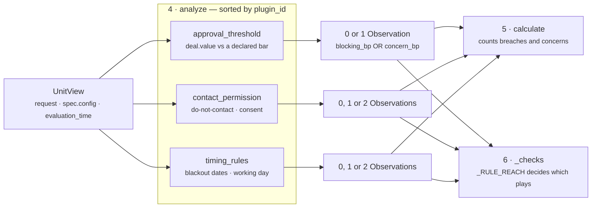
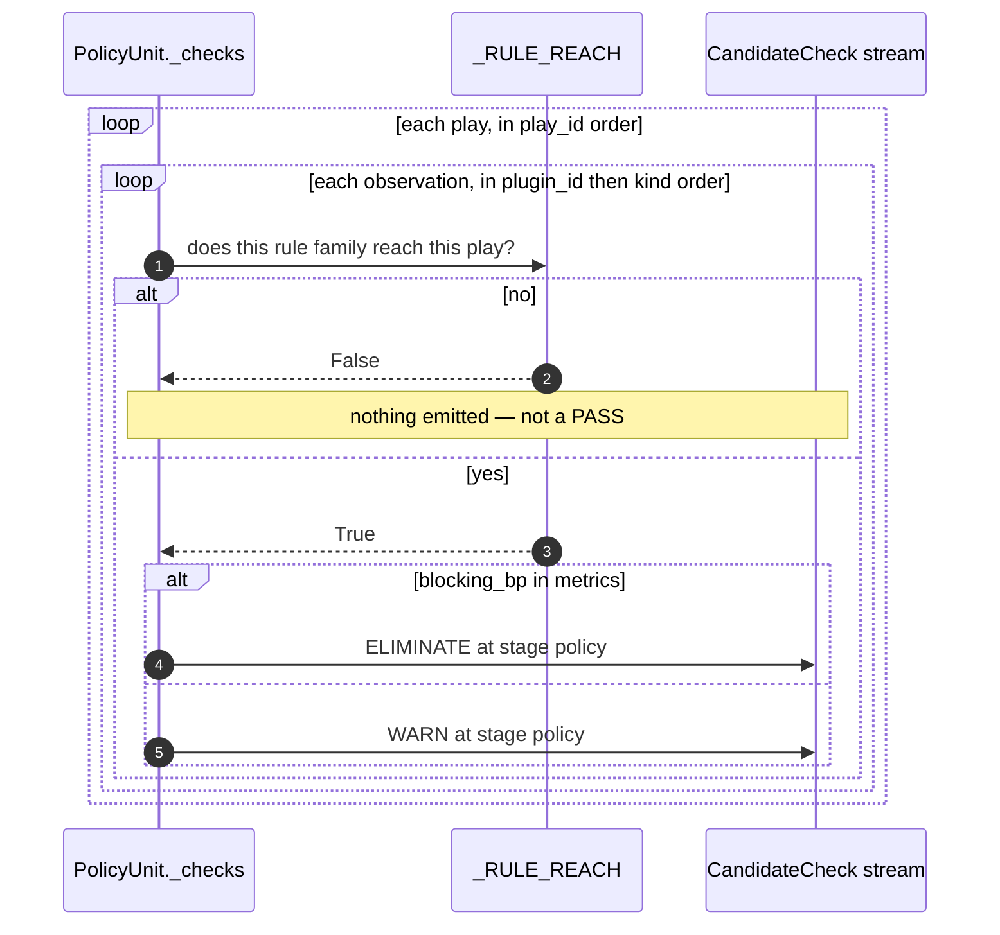

# 03 · Analyzer — the plugin seam

**Stage 4 of 8** — plugins each contribute partial evidence
**Source:** `genios_engine/reason/unit.py:ReasoningUnit.analyze` (base, **not overridden**)
**Plugins:** `policy_unit.py:ApprovalThresholdPlugin`, `ContactPermissionPlugin`, `TimingRulePlugin`

---

## 1 · What it is for

The Analyzer is where this unit's IP lives. The demand from the blueprint is that a unit composes
small deterministic contributions rather than hiding a monolith:

> *"…I would go one level deeper. Analyzer should itself have plugins. Now Risk isn't one algorithm.
> It's 20 small deterministic algorithms."*

For `core.policy` the decomposition writes itself, because organisation policy is not one kind of
sentence. The module docstring names three:

> *Three separable rule families, one plugin each:*
> * ***Approval thresholds*** *— value above which a human must sign off before the org commits.*
> * ***Contact permission*** *— do-not-contact records and consent state.*
> * ***Timing rules*** *— declared blackout dates and declared working hours.*

They are separable in the strongest sense: different facts, different config keys, different reach
over the play roster, and — crucially — **different consequences for the same tenant**. A customer
under GDPR turns on the consent rule and leaves the approval threshold off. A finance-heavy
enterprise does the opposite. Folding them into one "compliance score" would make it impossible to
turn one on without the others.

---

## 2 · Composition

```python
class PolicyUnit(ReasoningUnit):
    unit_id  = "core.policy"
    version  = "1.0.0"
    category = UnitCategory.OPTIMIZATION
    publishes = ("compliance_bp", "policy_concerns", "policy_violations", "rules_triggered")
    plugins  = (ApprovalThresholdPlugin(), ContactPermissionPlugin(), TimingRulePlugin())
```

The plugins are **instantiated at class-definition time** and shared by every evaluation. That is
safe because none of them holds state: each `contribute` is a pure function of the `UnitView`
handed to it. `ReasoningUnit.__init__` checks the ids are unique and raises
`"core.policy registers a duplicate analyzer plugin"` otherwise.

Each satisfies `unit.py:AnalyzerPlugin`, a `runtime_checkable` protocol of exactly two members —
a `plugin_id` property and `contribute(view) -> tuple[Observation, ...]`. Note that none of the
three subclasses anything; they are plain classes that happen to fit the protocol, which is the
point of using a `Protocol` rather than a base class.

| Plugin | `plugin_id` | Rules inside it | Private methods |
|---|---|---|---|
| `ApprovalThresholdPlugin` | `approval_threshold` | 1 | `_unverifiable` |
| `ContactPermissionPlugin` | `contact_permission` | 2 | `_do_not_contact`, `_consent` |
| `TimingRulePlugin` | `timing_rules` | 2 | `_blackout`, `_working_hours` |

Two of the three carry *two* rules behind one `plugin_id`, and both use the same shape to combine
them:

```python
def contribute(self, view: UnitView) -> tuple[Observation, ...]:
    return tuple(item for item in (self._do_not_contact(view), self._consent(view))
                 if item is not None)
```

Each sub-rule returns `Observation | None`, and `None` is filtered out. So a plugin can emit zero,
one, or two observations from one call. The pairing is not arbitrary — both rules in
`contact_permission` answer *"are we allowed to talk to this counterparty?"* and share
`_reaches_outside` as their reach; both rules in `timing_rules` are statements the business made
about its own calendar. A rule that needed a different reach would have to be a fourth plugin, and
§5 explains why.

---

## 3 · Execution order

```python
def analyze(self, view: UnitView) -> tuple[Observation, ...]:
    observations: list[Observation] = []
    for plugin in sorted(self.plugins, key=lambda item: item.plugin_id):
        observations.extend(plugin.contribute(view))
    return tuple(observations)
```

Plugins run in `plugin_id` order:

```text
1. approval_threshold
2. contact_permission
3. timing_rules
```

Which here is also alphabetical, also declaration order, and also — by coincidence — the order the
module docstring lists them in. That coincidence is worth not relying on: the sort is what makes the
order a property of the unit's *composition* rather than of whatever the class body happened to say
the day someone added a plugin.

Within a plugin, sub-rules run in the fixed order written into the generator expression:
`_do_not_contact` before `_consent`, `_blackout` before `_working_hours`. Nothing re-sorts them at
this stage — but `_checks` re-sorts everything on `(plugin_id, kind)` before emitting rows, so the
within-plugin order only survives into `Verdict.findings`, which are built from `observations` in
analyze order.

Maximum observation sequence, all five rules firing:

```text
0  approval_threshold  policy.approval_threshold      or policy.approval_unverifiable
1  contact_permission  policy.do_not_contact
2  contact_permission  policy.consent_revoked         or policy.consent_missing
3  timing_rules        policy.blackout
4  timing_rules        policy.outside_working_hours
```

---

## 4 · What each plugin contributes, and the one bit it does not



Every observation this unit produces is **conclusion-free about the plays**. A plugin says *"this
deal is £62,000 against a £50,000 bar and no signature is on record"*. It does not say which play to
remove. That mapping is `_checks`'s job, and it lives on the unit rather than in the plugins for a
specific reason: the reach of a rule is a property of the *rule family*, and putting it inside the
plugin would let each plugin choose its own blast radius silently.

| Plugin | Claim it makes | Metric it carries | Evidence it cites |
|---|---|---|---|
| `approval_threshold` | the org's approval rule is breached, or could not be checked | `blocking_bp` / `concern_bp` + `value_amount`, `threshold_amount` | value field, status field |
| `contact_permission` | somebody asked us to stop, or we cannot show they said yes | `blocking_bp` / `concern_bp` | the flag or status field |
| `timing_rules` | the business declared this a day or hour it does not communicate | `blocking_bp` / `concern_bp` + `local_hour`, `local_weekday` | **none** — a calendar rule cites no fact |

`timing_rules` emitting no evidence ids is correct and worth naming. A blackout date is not a fact
about the counterparty; it is a rule the tenant wrote, and the rule is already in the config
snapshot that the request is hashed against. There is nothing in `context.evidence` to point at.

### The `Observation` contract, and what it forbids

`unit.py:Observation.__post_init__` enforces three things on every one of these:

- **Integers only.** Any metric that is not an `int` raises, and `bool` is rejected explicitly.
  `blocking_bp = 10_000` and `value_amount = 6_200_000` both pass; note the second is deliberately
  *not* basis points — it is whole minor units, and no `_bp` suffix means nothing clamps it.
- **`evidence_ids` and `reason_codes` are deduplicated and sorted at construction.** This is why
  `reason_codes[0]` in `_checks` is the alphabetically first code and not a designated primary —
  see [05-Evaluator](05-Evaluator.md) §5.
- **Partial by contract.** Returning `()` is the normal way to say *this rule has nothing to
  contribute here* — silence, not a zero.

That last point is load-bearing in this unit specifically. Three plugins each returning `()`
produces `rules_triggered = 0`; three plugins each returning an observation with `concern_bp = 0`
would produce `rules_triggered = 3` and `policy_concerns = 3` at the same `compliance_bp` of 10,000.
Downstream those read as *"three rules examined this and all were satisfied"* versus *"no rule
applied"* — materially different claims about the tenant's rulebook.

---

## 5 · `_RULE_REACH` — the seam between a plugin and a play

The three plugins do not touch the play roster. The unit maps each plugin's observations onto plays
through one module-level dict:

```python
_RULE_REACH = {
    "approval_threshold": _needs_approval_cover,
    "contact_permission": _reaches_outside,
    "timing_rules":       _reaches_outside,
}
```

> *"Keyed by plugin so a new rule family has to state its reach explicitly rather than inherit
> somebody else's blast radius by accident."*

Two predicates, both over `PlayDefinition`:

```python
def _reaches_outside(play) -> bool:
    declared = play.metadata.get("external_recipient_required")
    if isinstance(declared, bool):
        return declared              # believed in BOTH directions
    return not play.read_only        # fail closed on an undeclared side effect

def _carries_human_approval(play) -> bool:
    return (play.metadata.get("execution_boundary") == "human_approval_required"
            or "human_approval" in play.tags)

def _needs_approval_cover(play) -> bool:
    return not play.read_only and not _carries_human_approval(play)
```

### The reach table, computed

| Play shape | `read_only` | `external_recipient_required` | approval reaches? | contact/timing reach? |
|---|---|---|---|---|
| declared internal note | True | `False` | no | **no** |
| declared internal write | False | `False` | **yes** | **no** |
| declared outbound draft | True | `True` | no | **yes** |
| declared outbound send | False | `True` | **yes** | **yes** |
| undeclared, read-only | True | absent | no | no |
| undeclared, mutating | False | absent | **yes** | **yes** — fail closed |
| mutating, human-gated | False | any | **no** | per declaration |

Three decisions are encoded there and each is argued in the source:

**`external_recipient_required` is believed in both directions**, *"because Layer 3 authored it
deliberately"*. A play declaring `False` is exempt from contact and timing rules even when it
mutates state. Verified with the shipped `clarify_next_step`, which declares `False` and is
therefore untouched by a do-not-contact record.

**An undeclared side effect is read as reaching outside.** *"The fail-closed reading, since an
undeclared side effect is exactly the case where guessing 'internal' is dangerous."*
`test_an_undeclared_side_effect_is_read_as_reaching_the_counterparty` pins it.

**A play already routing through a human satisfies the approval threshold.** *"A play that is gated
on human sign-off already satisfies the rule the threshold exists to enforce; flagging it would
train reviewers to ignore this unit's output."* `_carries_human_approval` reads the same two signals
`core.constraint` uses for its own `human_approval_required` policy — on purpose, so a play cannot
satisfy one approval authority and fail the other.

### The unguarded lookup

```python
for item in ordered:
    if not _RULE_REACH[item.plugin_id](play):
        continue
```

`_RULE_REACH[...]` is indexed, not `.get()`. A fourth plugin added to `plugins` without a matching
reach entry raises `KeyError: 'the_new_plugin'` inside `evaluate_meaning`, which the orchestrator
converts to `ResultStatus.FAILED`. Fail-closed, and arguably intended — a rule with no declared
reach must not default to *"reaches everything"* or to *"reaches nothing"*, both of which are
plausible and both of which are wrong. The cost is that the error message names a dict key rather
than saying *"plugin X has no entry in `_RULE_REACH`"*.

---

## 6 · How the three interact

They do not, directly. No plugin reads another's output, no plugin reads `view.prior`, and the order
they run in cannot change any of their answers. The interaction is entirely downstream, and it is of
exactly two kinds.

**Concerns add up; breaches do not.** `calculate` sums `concern_bp` across every concern and takes
the cliff on the first breach. So the *only* way two plugins compound is through the concern slope.

```text
contact_permission  consent not on file      concern_bp 3,000
timing_rules        21:00 on a Thursday      concern_bp 3,000
                                             ────────────────
                    penalty                              6,000
                    compliance_bp = max(2,500, 10,000 − 6,000) = 4,000
```

Verified: `test_stacked_concerns_erode_compliance_but_can_never_impersonate_a_prohibition`.

**Reaches overlap; rows multiply.** Two plugins whose reach predicate is the same
(`contact_permission` and `timing_rules` both use `_reaches_outside`) emit rows over the same set of
plays, so a run where both fire produces two rows per reachable play.



---

## 7 · Worked examples

### 7.1 · Two plugins fire, one stays silent

```text
config   {"require_contact_consent": True,
          "working_hours_start_hour": 13, "working_hours_end_hour": 17}
facts    {}
time     2026-08-06 12:00 UTC, Thursday, offset 0
plays    send_nudge  read_only=False  external=True
```

```text
analyze, in plugin_id order:
  approval_threshold  _config_amount("approval_threshold_amount") → None      → ()
  contact_permission  _do_not_contact: fact absent                → None
                      _consent: rule on, status "" not granted,
                                "" not revoked                     → consent_missing 3,000bp
  timing_rules        _blackout: no dates declared                 → None
                      _working_hours: 12 < 13, outside 13–17       → outside_hours 3,000bp

observations = (policy.consent_missing, policy.outside_working_hours)
```

```text
calculate      breaches 0 · concerns 2 · penalty 6,000
               compliance_bp = max(2,500, 10,000 − 6,000) = 4,000
_checks        both rules use _reaches_outside; send_nudge declares external=True
               → 2 × WARN on send_nudge
```

Verified end to end: `{compliance_bp: 4,000, policy_violations: 0, policy_concerns: 2,
rules_triggered: 2}`, `matched = True`, two `WARN` rows.

### 7.2 · Same rules, a roster the rules do not reach

Same config and facts as 7.1, but one internal play:

```text
plays    log_note  read_only=True  external=False
```

```text
analyze        identical — the plugins never see the roster
calculate      identical — compliance_bp 4,000, rules_triggered 2
_checks        _reaches_outside(log_note) = False  (declared False)
               → zero rows
```

The compliance number moved and no candidate was touched. That asymmetry is real and is opened up
in [04-Calculator](04-Calculator.md) §5 — it is the unit's most consequential unresolved question.

### 7.3 · Two rules, three plays, four rows

The Acme scenario. Two breaches, three plays, one of them internal:

```text
observations sorted by (plugin_id, kind):
  ("approval_threshold", "policy.approval_threshold")
  ("timing_rules",       "policy.blackout")

plays sorted by play_id:
  email_champion      external=True   → reached by both
  log_note            external=False  → reached by neither
  send_renewal_quote  external=True   → reached by both
```

```text
2 reachable plays × 2 rules = 4 rows, emitted in this exact sequence:
  email_champion      ELIMINATE  approval_threshold_exceeded
  email_champion      ELIMINATE  inside_declared_blackout
  send_renewal_quote  ELIMINATE  approval_threshold_exceeded
  send_renewal_quote  ELIMINATE  inside_declared_blackout
```

Note `email_champion` sorts before `log_note` before `send_renewal_quote`, and `log_note` simply
produces nothing — it does not appear as a gap in the sequence, it is absent.

---

| ← | → |
|---|---|
| [02 · Retriever](02-Retriever.md) | [03a · approval_threshold](03a-plugin-approval_threshold.md) |
