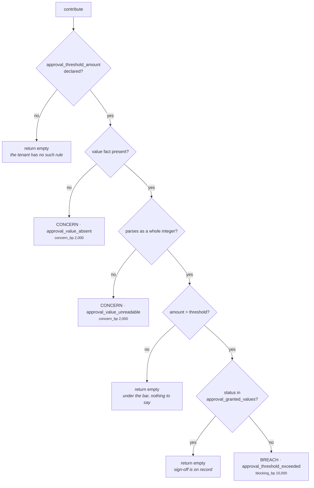

# 03a · Plugin `approval_threshold`

**Class:** `policy_unit.py:ApprovalThresholdPlugin`
**`plugin_id`:** `approval_threshold`
**Observation kinds:** `policy.approval_threshold` (breach) · `policy.approval_unverifiable` (concern)
**Reach:** `_needs_approval_cover` — plays that commit the organisation and do *not* already route
through a human
**Observations per run:** 0 or 1

---

## 1 · The claim it makes

> *Above a declared value, the organisation requires a human signature before it commits.*

This is the most common written rule in any business — *"anything over £50,000 needs the VP's
signature"* — and the docstring names why it is the one most expensive to get wrong in both
directions:

> *"acting past it is an unauthorised commitment, and stopping short of it on every deal makes the
> system useless."*

So the rule fires on **exactly one condition**: the value at stake is over the declared bar *and* no
sign-off is recorded against it. Not "is large". Not "looks risky". Over the bar, unsigned.

There is a third state, and inventing it is the plugin's real design decision. Where the tenant
declared a threshold but the value cannot be read, the plugin reports a *concern* rather than a
breach:

> *"'We could not verify this is within the approval limit' is the truthful statement; escalating it
> to a prohibition would block routine work every time a CRM field was blank, and staying silent
> would let an unbounded commitment through unremarked."*

---

## 2 · Config keys

| Key | Reader | Default | Effect |
|---|---|---|---|
| `approval_threshold_amount` | `_config_amount` | **absent → plugin is silent** | the bar, in whole minor units |
| `approval_value_field` | `_config_field` | `"deal.value"` | which fact carries the value at stake |
| `approval_status_field` | `_config_field` | `"deal.approval_status"` | which fact carries the sign-off |
| `approval_granted_values` | `_config_texts` | `("approved", "granted", "signed_off")` | the words that count as a signature |
| `approval_unverifiable_concern_bp` | `_config_bp` | **2,000bp** | severity of "we could not check" |

### Why the threshold is not basis points

```python
def _config_amount(view: UnitView, key: str) -> int | None:
    if key not in view.config:
        return None
    value = view.config[key]
    if isinstance(value, bool) or not isinstance(value, int) or not 0 <= value <= 10 ** 15:
        raise ValueError(f"{key} must be a non-negative whole amount")
    return value
```

> *"Not basis points: an approval threshold of 5,000,000 — fifty thousand pounds in pence — is
> ordinary, and validating it as bp would reject every realistic value."*

The ceiling is `10^15`, which is a thousand trillion minor units. There is no currency on the key:
the threshold and the fact are assumed to be in the same units, and nothing in the unit converts.
That is a real constraint on Layer 2 — a `deal.value` published in pounds against a threshold
authored in pence would be wrong by a factor of a hundred and nothing would catch it.

The `isinstance(value, bool)` guard is not decoration. `isinstance(True, int)` is `True` in Python,
so without it `approval_threshold_amount: True` would validate as the amount `1` and turn into a
rule requiring sign-off on every deal worth more than one penny.

---

## 3 · The mechanism, step by step

```python
def contribute(self, view: UnitView) -> tuple[Observation, ...]:
    threshold = _config_amount(view, "approval_threshold_amount")
    if threshold is None:
        return ()                                        # 1. no rule declared
    value_field = _config_field(view, "approval_value_field", "deal.value")
    raw = fact_value(view.request, value_field)
    if raw is None:
        return (self._unverifiable(view, value_field, threshold, "value_absent"),)   # 2.
    try:
        amount = integer(raw, value_field)
    except ValueError:
        return (self._unverifiable(view, value_field, threshold, "value_unreadable"),)  # 3.
    if amount <= threshold:
        return ()                                        # 4. under the bar
    status_field = _config_field(view, "approval_status_field", "deal.approval_status")
    granted = _config_texts(view, "approval_granted_values",
                            ("approved", "granted", "signed_off"))
    if _text_fact(view, status_field) in granted:
        return ()                                        # 5. signed
    return (Observation(...),)                           # 6. breach
```



Five of the six exits produce either nothing or a concern. Only the last one blocks.

### The comparison is strictly greater-than

`amount <= threshold` returns silence, so a deal worth **exactly** the threshold is *under* the bar.
A threshold of 5,000,000 means "£50,000 and under is fine". Verified: `deal.value = 5_000_000` →
`()`, `deal.value = 5_000_001` → breach.

That is the conventional reading of *"anything over £50,000 needs a signature"*, but it is a reading,
and a tenant who means "£50,000 and above" has to author 4,999,999. Nothing in the config surface
says which convention is in force.

### What `integer()` accepts

`common.py:integer` is the parser, and it is strict by design:

| Input | Result |
|---|---|
| `6_200_000` | `6200000` |
| `"6200000"` | `6200000` — via `Decimal` |
| `"6200000.00"` | `6200000` — equal to its integral value |
| `"6.2e6"` | `6200000` — `Decimal` accepts scientific notation |
| `Decimal("6200000")` | `6200000` |
| `Decimal("6200000.50")` | **ValueError** → concern |
| `"about sixty grand"` | **ValueError** → concern |
| `"62,00,000"` | **ValueError** → concern |
| `True` | **ValueError** — `bool` rejected first |
| a mapping without a `"value"` key | **ValueError** → concern |

A float can never appear: `ContextSnapshot` freezes facts through `contracts/reasoning.py:_freeze`,
which calls `platform/canonical.py:canonicalize`, which rejects floats outright —
*"floats are forbidden in semantic artifacts; use integer basis points or Decimal"*. Verified: the
snapshot refuses to build.

### The sign-off comparison

`_text_fact` normalises: `str(value).strip().lower()`, with `""` for an absent fact. So `"Approved"`,
`" approved "` and `"APPROVED"` all match the default vocabulary. `_config_texts` lowercases and
strips the tenant's side too, so the comparison is symmetric.

An absent status field yields `""`, which is not in any granted vocabulary, so **absence of a
signature is treated as no signature** — not as a concern, and not as a reason to soften the breach.
That asymmetry with the *value* field is deliberate: an unreadable value means we do not know
whether the rule applies at all; an unreadable status means we cannot show the rule was satisfied,
which is the same position as it not being satisfied.

---

## 4 · What it emits

### Breach

```python
Observation(
    plugin_id="approval_threshold",
    kind="policy.approval_threshold",
    metrics={"blocking_bp": BLOCKING_SEVERITY_BP,      # 10,000, a module constant
             "value_amount": amount,                   # NOT basis points
             "threshold_amount": threshold},           # NOT basis points
    evidence_ids=evidence_ids(view.request, value_field, status_field),
    reason_codes=("approval_threshold_exceeded",),
)
```

Both fields are cited — the value that crossed the bar *and* the status field that failed to show a
signature — because the rule genuinely consulted both.

`value_amount` and `threshold_amount` carry no `_bp` suffix, which matters twice: `build()` does not
clamp them, and `Finding.__post_init__` does not range-check them. A value of 6,200,000 survives
into the finding and into the `CandidateCheck.detail` intact. If either had been named `*_bp`, the
contract layer would have rejected the whole result.

### Concern

```python
def _unverifiable(self, view, field, threshold, detail) -> Observation:
    return Observation(
        plugin_id=self.plugin_id,
        kind="policy.approval_unverifiable",
        metrics={"concern_bp": _config_bp(view, "approval_unverifiable_concern_bp", 2_000),
                 "threshold_amount": threshold},
        evidence_ids=evidence_ids(view.request, field),
        reason_codes=(f"approval_{detail}",),
    )
```

One kind, two reason codes: `approval_value_absent` and `approval_value_unreadable`. The concern
carries **no `value_amount`** — there is no value to report, which is the whole point. It does carry
`threshold_amount`, so a reader can see *which* rule could not be checked.

---

## 5 · When it stays silent

| Situation | Emits |
|---|---|
| `approval_threshold_amount` not in config | **nothing** — the tenant declared no approval rule |
| value at or under the threshold | **nothing** — *"under the bar: the org has nothing to say here"* |
| value over the bar, status in `approval_granted_values` | **nothing** — *"sign-off is on record; the rule is satisfied"* |
| negative value | **nothing** — `−10 <= 5_000_000` |

Silence on the "signed" path is worth pausing on. The rule asks for a signature, not for silence;
*"once it exists the rule is done"*. A plugin that emitted a "checked and cleared" observation here
would push `rules_triggered` up on every large signed deal in the tenant's book, and the counts are
what a reviewer scans first.

---

## 6 · Worked examples

### 6.1 · The unsigned Acme renewal — a breach

```text
config   approval_threshold_amount = 5_000_000        # £50,000 in pence
facts    deal.value            = 6_200_000            # £62,000 in pence
         deal.approval_status  = "pending"
evidence ev_value  → field "deal.value"
         ev_status → field "deal.approval_status"
```

```text
threshold = 5_000_000                         not None → the rule exists
raw       = 6_200_000
amount    = integer(6_200_000) = 6_200_000
6_200_000 <= 5_000_000 ?                      no → over the bar
granted   = ("approved", "granted", "signed_off")
_text_fact(deal.approval_status) = "pending"  not in granted → unsigned

→ Observation(kind="policy.approval_threshold",
              metrics={blocking_bp: 10_000,
                       value_amount: 6_200_000,
                       threshold_amount: 5_000_000},
              evidence_ids=("ev_status", "ev_value"),
              reason_codes=("approval_threshold_exceeded",))
```

Through the unit: `compliance_bp = 0`, `policy_violations = 1`, `matched = True`, and one
`ELIMINATE` row per play that `_needs_approval_cover` reaches. Verified.

### 6.2 · The same renewal, signed — silence

```text
facts    deal.value = 6_200_000, deal.approval_status = "Approved"
```

```text
_text_fact("deal.approval_status") = "approved"     ← lowercased
"approved" in ("approved", "granted", "signed_off") → True
→ ()
```

`test_a_recorded_sign_off_satisfies_the_threshold` pins this, including the capitalisation.

### 6.3 · A blank CRM field — a concern, and never a breach

```text
config   approval_threshold_amount = 5_000_000
facts    {}                                    # deal.value was never captured
```

```text
raw = fact_value(request, "deal.value") = None
→ Observation(kind="policy.approval_unverifiable",
              metrics={concern_bp: 2_000, threshold_amount: 5_000_000},
              evidence_ids=(),                    # nothing to cite for an absence
              reason_codes=("approval_value_absent",))
```

Through the unit:

```text
breaches 0 · concerns 1 · penalty 2,000
compliance_bp = max(2_500, clamp_bp(10_000 − 2_000)) = 8_000
matched       = 8_000 < 8_000 ? no  →  False        ← the exact boundary, see 05 §3
checks        = one WARN per reachable play
```

Verified. Note the result: the play stays fully in contention with the reason attached, and
`matched` is `False`. A single default-severity approval concern lands *exactly* on the threshold.

### 6.4 · A value nobody can parse

```text
config   approval_threshold_amount = 5_000_000
facts    deal.value = "about sixty grand"
```

```text
integer("about sixty grand", "deal.value") raises ValueError
→ caught → Observation(kind="policy.approval_unverifiable",
                       metrics={concern_bp: 2_000, threshold_amount: 5_000_000},
                       reason_codes=("approval_value_unreadable",))
```

`test_an_unreadable_deal_value_is_a_concern_and_never_a_breach` asserts
`"blocking_bp" not in observation.metrics` explicitly — the assertion is written as the *absence* of
the blocking key, not as the presence of the concern key, because collapsing the two is the failure
this test exists to catch.

### 6.5 · A tenant redirects the fields

```text
config   approval_threshold_amount = 25_000_000
         approval_value_field      = "contract.annual_value"
         approval_status_field     = "contract.legal_sign_off"
         approval_granted_values   = ["Counsel Approved", "CFO Signed"]
facts    contract.annual_value  = 40_000_000
         contract.legal_sign_off = "cfo signed"
```

```text
_config_texts lowercases and sorts the tenant's vocabulary
  → ("cfo signed", "counsel approved")
_text_fact("contract.legal_sign_off") = "cfo signed"   ∈ vocabulary
→ ()
```

The rule is identical; only the field names and the words changed. That is the whole reason those
four keys exist — *"the same rule sits over differently named facts in different capabilities, while
the rule itself is identical."*

### 6.6 · Malformed config — a deployment fault

```text
config   approval_threshold_amount = "fifty thousand"
→ ValueError("approval_threshold_amount must be a non-negative whole amount")
→ ResultStatus.FAILED
```

Not a concern, not a breach. Bad tenant config *"must fail loudly rather than become a policy nobody
can account for."*

---

## 7 · Known limits

**The threshold reaches nothing in the shipped roster.** `_needs_approval_cover` requires
`not play.read_only`. All three plays in `sales.deal_cooling_full` are `read_only=True` drafts, so a
tenant who configures an approval threshold on that capability gets `compliance_bp = 0`,
`policy_violations = 1`, `matched = True` — and **zero checks**. Verified. The breach reaches the
decision as a metric and a finding, not as an elimination. Whether that is right depends on what a
"read-only draft for human approval" is: it commits nothing by itself, so arguably the threshold
should not govern it; but the card a human approves is the commitment, and the human approving it is
exactly the signature the rule wanted. The code takes the first reading and does not say so.

**Currency is unmodelled.** The threshold and the fact must be in the same minor units and nothing
checks. A multi-currency tenant needs one capability spec per currency.

**Both `_carries_human_approval` signals are trusted equally.** `metadata["execution_boundary"]` and
the `human_approval` tag are ORed. A play tagged `human_approval` with no boundary declared is
exempt from the threshold on the strength of a free-text tag.

---

| ← | → |
|---|---|
| [03 · Analyzer](03-Analyzer.md) | [03b · contact_permission](03b-plugin-contact_permission.md) |
