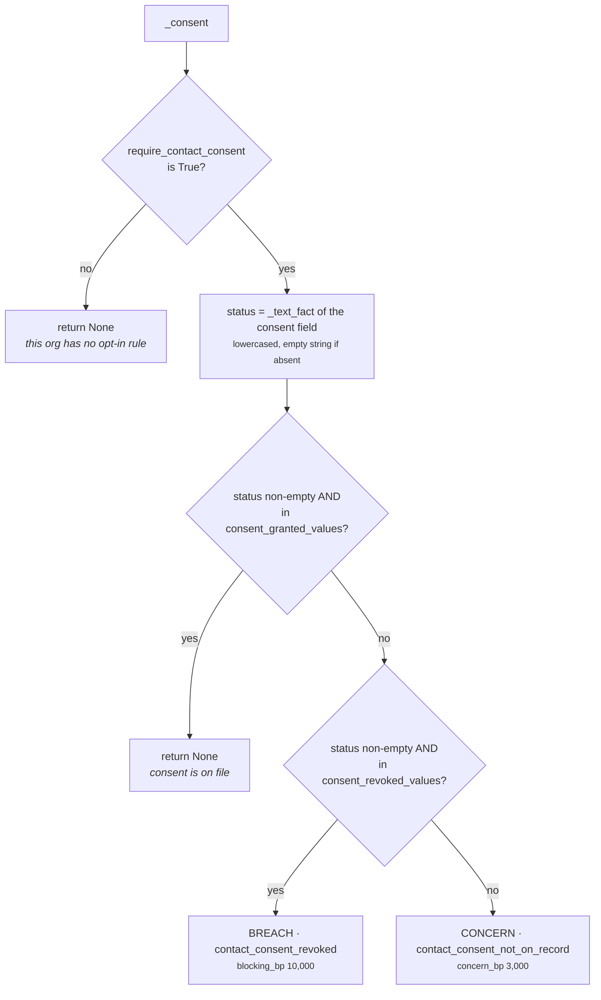

# 03b · Plugin `contact_permission`

**Class:** `policy_unit.py:ContactPermissionPlugin`
**`plugin_id`:** `contact_permission`
**Observation kinds:** `policy.do_not_contact` · `policy.consent_revoked` (breaches) ·
`policy.consent_missing` (concern)
**Reach:** `_reaches_outside` — plays that put something in front of the counterparty
**Observations per run:** 0, 1 or 2

---

## 1 · The claim it makes

> *Are we allowed to talk to this counterparty at all?*

Two rules behind one question, and they are graded differently on purpose:

> *"A do-not-contact record is absolute — somebody has asked us to stop, and no amount of deal value
> makes ignoring that acceptable. Consent is softer and depends on the org: a tenant under an opt-in
> regime turns the consent rule on, and a withdrawn consent then reads exactly like a
> do-not-contact, while a consent nobody has recorded reads as a concern because 'not on file' is
> usually a data-quality gap rather than a refusal."*

The plugin returns both rules' verdicts from one call:

```python
def contribute(self, view: UnitView) -> tuple[Observation, ...]:
    return tuple(item for item in (self._do_not_contact(view), self._consent(view))
                 if item is not None)
```

`_do_not_contact` always runs. `_consent` runs only where the tenant declared an opt-in regime. Both
can fire in the same evaluation, which produces two breaches and two `ELIMINATE` rows per reachable
play — verified.

---

## 2 · Config keys

| Key | Reader | Default | Effect |
|---|---|---|---|
| `do_not_contact_field` | `_config_field` | `"contact.do_not_contact"` | which fact carries the flag |
| `require_contact_consent` | `_config_flag` | **`False` → the consent rule is off entirely** | opt-in regime switch |
| `consent_status_field` | `_config_field` | `"contact.consent_status"` | which fact carries consent |
| `consent_granted_values` | `_config_texts` | `("granted", "opt_in", "subscribed")` | words that mean yes |
| `consent_revoked_values` | `_config_texts` | `("revoked", "opt_out", "unsubscribed", "withdrawn")` | words that mean no |
| `missing_consent_concern_bp` | `_config_bp` | **3,000bp** | severity of "not on file" |

`_config_flag` accepts a `bool` and nothing else — `"true"`, `1` and `"yes"` are all rejected with
`ValueError("require_contact_consent must be a boolean")`. The switch that decides whether a whole
rule family exists is not a place for type coercion.

**The do-not-contact rule has no switch.** It is always evaluated. That is right: no organisation
opts out of honouring a stop request, and a config key to disable it would be a key somebody could
set by accident.

---

## 3 · Rule one — the do-not-contact record

```python
def _do_not_contact(self, view: UnitView) -> Observation | None:
    field = _config_field(view, "do_not_contact_field", "contact.do_not_contact")
    raw = fact_value(view.request, field)
    if raw is None:
        return None                     # no record; not evidence of a record saying "yes"
    flagged = raw is True or (isinstance(raw, str) and raw.strip().lower() in _TRUE_TEXT)
    if not flagged:
        return None                     # an evidenced "no": the rule has nothing to add
    return Observation(
        plugin_id=self.plugin_id,
        kind="policy.do_not_contact",
        metrics={"blocking_bp": BLOCKING_SEVERITY_BP},
        evidence_ids=evidence_ids(view.request, field),
        reason_codes=("do_not_contact_on_record",),
    )
```

### `_TRUE_TEXT`

```python
_TRUE_TEXT = frozenset({"true", "yes", "y", "1"})
```

> *"Source systems export booleans as strings far more often than as booleans; a 'true' in a CRM
> export is a do-not-contact flag and must not be read as an absent one."*

`test_a_string_exported_do_not_contact_flag_still_blocks` pins the uppercase `"TRUE"` case
specifically, because the failure it guards is silent: reading a real stop request as "no record"
produces a system that emails somebody who asked it not to, with a clean audit trail saying nothing
was wrong.

### The three states, and why absence produces nothing

| `raw` | Reading | Emits |
|---|---|---|
| `None` — fact not in the snapshot | *no record* | nothing |
| `False`, `"no"`, `""`, `"n"`, anything not in `_TRUE_TEXT` | *an evidenced "no"* | nothing |
| `True`, `"true"`, `"TRUE"`, `"yes"`, `"Y"`, `"1"` | *a record saying stop* | breach |

> *"Absence of a do-not-contact flag produces nothing at all. The overwhelming majority of accounts
> have no such record, and a 'we checked and it was fine' observation on every one of them would
> bury the handful that matter."*

Note that the first two rows produce the *same* output for two different reasons. The plugin does
not distinguish *"nobody has ever asked"* from *"we asked and they said it was fine"*, even though
Layer 2 could tell them apart — `raw is None` versus `raw is False`. Compare `core.resource`, which
*does* make that distinction for the owner field. Here it does not matter, because neither state
constrains anything.

---

## 4 · Rule two — consent under an opt-in regime

```python
def _consent(self, view: UnitView) -> Observation | None:
    if not _config_flag(view, "require_contact_consent", False):
        return None                     # this org does not operate an opt-in rule
    field = _config_field(view, "consent_status_field", "contact.consent_status")
    status = _text_fact(view, field)
    if status and status in _config_texts(view, "consent_granted_values", (...)):
        return None
    revoked = _config_texts(view, "consent_revoked_values", (...))
    if status and status in revoked:
        return Observation(kind="policy.consent_revoked",
                           metrics={"blocking_bp": BLOCKING_SEVERITY_BP}, ...)
    return Observation(kind="policy.consent_missing",
                       metrics={"concern_bp": _config_bp(view, "missing_consent_concern_bp", 3_000)},
                       ...)
```



The three-way split is the plugin's argument in code form:

| Consent state | Reading | Outcome |
|---|---|---|
| in the granted vocabulary | they said yes | silence |
| in the revoked vocabulary | **they said no** | breach — *"a withdrawn consent is a refusal on the record, which is the do-not-contact rule wearing a different field name"* |
| absent, empty, or an unrecognised word | **we cannot show they said yes** | concern — *"missing consent is usually a data-quality gap, and a gap is not a customer saying no"* |

The third row is the interesting one, because it is a **catch-all**. A status of `"pending"`,
`"unknown"`, `"double_opt_in_sent"` or a typo all land in the same place: a 3,000bp concern with
`contact_consent_not_on_record`. That is the fail-soft reading and it is correct — an unrecognised
word is not a refusal — but it does mean a tenant who misspells one of their own revoked values
silently downgrades a refusal to a concern. The two vocabularies are the only thing standing between
those outcomes, and nothing validates that they are disjoint or that they cover the source system's
actual value set.

### Both `status and status in ...` guards

The `status and` prefix on both membership tests exists because `_text_fact` returns `""` for an
absent fact, and `""` cannot be in either vocabulary (`_config_texts` rejects empty items). The
guard is therefore redundant as written — but it makes the intent explicit at the point of reading:
*an empty string here always means "we did not see one", never "we saw an empty policy value"*,
which is what `_text_fact`'s own docstring says.

---

## 5 · When it stays silent

| Situation | Emits |
|---|---|
| `contact.do_not_contact` absent **and** consent rule off | **nothing at all** — the ordinary case |
| `contact.do_not_contact` present and false-ish | nothing from rule one |
| `require_contact_consent` absent or `False` | nothing from rule two, whatever the status says |
| consent status in the granted vocabulary | nothing from rule two |

`test_consent_is_only_examined_where_the_organisation_operates_an_opt_in_rule` uses
`contact.consent_status = "unknown"` with the flag off and asserts `()`. *"Not every tenant is under
an opt-in regime; imposing one on them would block their business."*

---

## 6 · Worked examples

### 6.1 · A stop request on record — the absolute case

```text
config   {}
facts    contact.do_not_contact = True
plays    send_nudge  read_only=False external=True
```

```text
_do_not_contact: raw = True → flagged
  → Observation(kind="policy.do_not_contact",
                metrics={blocking_bp: 10_000},
                reason_codes=("do_not_contact_on_record",))
_consent: require_contact_consent defaults False → None

calculate  breaches 1 → compliance_bp = 0        (the cliff)
           policy_violations 1 · policy_concerns 0 · rules_triggered 1
_checks    _reaches_outside(send_nudge) = True → 1 × ELIMINATE
           reason_code "do_not_contact_on_record", stage "policy",
           detail {"blocking_bp": 10000, "rule": "policy.do_not_contact"}
```

Verified by `test_a_breached_rule_eliminates_every_play_it_reaches`. *"Somebody asked us to stop. No
deal value makes ignoring that a trade-off worth weighing."*

### 6.2 · The same record, an internal play — no check at all

```text
plays    log_note    read_only=True                     ← no external declaration
         send_nudge  read_only=False external=True
```

```text
_reaches_outside(log_note)   : metadata has no external_recipient_required
                               → falls back to `not read_only` = False → not reached
_reaches_outside(send_nudge) : declared True → reached

checks → [("send_nudge", ELIMINATE, "do_not_contact_on_record")]
```

`log_note` gets **no row**, not a `PASS`. *"Compliance work does not stop during a do-not-contact;
logging a note reaches nobody."* And the audit trail does not claim the unit examined a question it
never asked.

### 6.3 · Two rules, two breaches, one call

```text
config   require_contact_consent = True
facts    contact.do_not_contact = True
         contact.consent_status = "revoked"
```

```text
contribute → ( policy.do_not_contact  blocking_bp 10,000,
               policy.consent_revoked blocking_bp 10,000 )

calculate  breaches 2 → compliance_bp = 0
           policy_violations 2 · rules_triggered 2
_checks    both rules use _reaches_outside → 2 × ELIMINATE on send_nudge,
           sorted by kind: consent_revoked before do_not_contact
```

Verified. `policy.consent_revoked` sorts before `policy.do_not_contact` on `kind`, which is why the
`contact_consent_revoked` row is emitted first even though `_do_not_contact` ran first inside the
plugin.

### 6.4 · A stop request plus a missing consent — one breach and one concern

```text
config   require_contact_consent = True
facts    contact.do_not_contact = True         # consent_status is absent
```

```text
_do_not_contact → breach   blocking_bp 10,000
_consent        → concern  concern_bp   3,000

calculate  breaches 1 → compliance_bp = 0        the cliff, not 10,000 − 3,000
           policy_violations 1 · policy_concerns 1 · rules_triggered 2
```

`test_one_breach_takes_compliance_to_zero_whatever_else_is_true` asserts exactly this, including
`policy_concerns == 1` with the comment *"consent is missing as well"*. The concern is **counted and
reported** even though it cannot move the number — it still becomes a finding, a reason code, and a
`WARN` row alongside the `ELIMINATE`. Nothing is swallowed by the breach.

### 6.5 · Consent not on file — the ordinary data-quality gap

```text
config   require_contact_consent = True
facts    {}
```

```text
status = _text_fact("contact.consent_status") = ""
  → not granted, not revoked → concern

Observation(kind="policy.consent_missing",
            metrics={concern_bp: 3_000},
            evidence_ids=(),                     # nothing to cite for an absence
            reason_codes=("contact_consent_not_on_record",))

calculate  compliance_bp = max(2_500, 10_000 − 3_000) = 7_000
           matched = 7_000 < 8_000 → True
_checks    1 × WARN on send_nudge
```

Verified: `test_a_concern_warns_and_leaves_the_play_in_contention` asserts both
`check.outcome is CheckOutcome.WARN` and `check.outcome is not CheckOutcome.ELIMINATE` — the second
assertion is redundant to a type checker and is there to make the intent unmistakable to a reader.

### 6.6 · A CRM exporting the flag as an integer — **fails open**

```text
facts    contact.do_not_contact = 1
```

```text
raw is True                        → False   (1 is not the True singleton)
isinstance(1, str)                 → False
flagged                            → False
→ return None                      → NO OBSERVATION
```

Verified. `_TRUE_TEXT` contains the *string* `"1"`, but an integer `1` never reaches the membership
test because the guard requires `isinstance(raw, str)` first. A source system that exports the flag
as a JSON number rather than a string silently fails **open** — the one direction this plugin exists
to prevent.

The fix is one clause: `raw is True or raw == 1 or (isinstance(raw, str) and …)`. It is not written.
The same hole applies to `raw = Decimal("1")`.

---

## 7 · Known limits

1. **Integer `1` is not read as a flag.** §6.6. The only silent fail-open path in the unit.
2. **The two consent vocabularies are not checked for overlap.** A value in both lists resolves as
   *granted*, because the granted test runs first. Nothing warns.
3. **An unrecognised status downgrades to a concern.** A tenant whose source system writes
   `"opted-out"` (hyphen) against a default vocabulary containing `"opt_out"` (underscore) gets a
   3,000bp concern where they meant a prohibition.
4. **Consent is read from one field.** Channel-specific consent — email yes, phone no — has no
   representation. A tenant with per-channel rules needs one capability per channel.

---

| ← | → |
|---|---|
| [03a · approval_threshold](03a-plugin-approval_threshold.md) | [03c · timing_rules](03c-plugin-timing_rules.md) |
