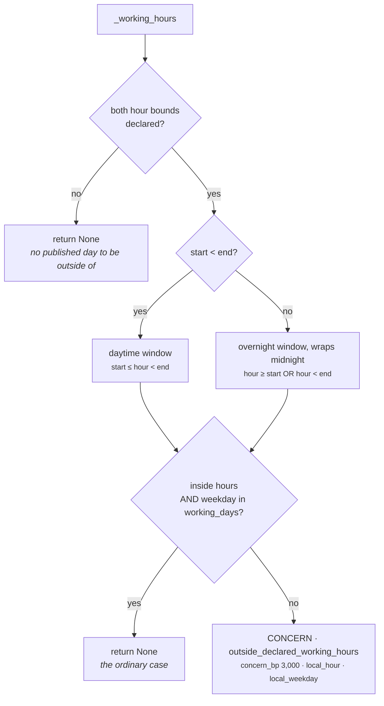

# 03c · Plugin `timing_rules`

**Class:** `policy_unit.py:TimingRulePlugin`
**`plugin_id`:** `timing_rules`
**Observation kinds:** `policy.blackout` (breach) · `policy.outside_working_hours` (concern)
**Reach:** `_reaches_outside` — plays that put something in front of the counterparty
**Observations per run:** 0, 1 or 2
**Facts read:** **none**

---

## 1 · The claim it makes

> *The organisation has declared when it does and does not communicate.*

This is the rule family with no fact dependency at all. Everything it needs is the tenant's config
and `request.evaluation_time`.

### Why this is not `core.scheduling`

The two both reason about time and they are answering different questions:

| | `core.scheduling` | `core.policy` · `timing_rules` |
|---|---|---|
| Reads timing out of | the **situation** | the **business's own declaration** |
| Facts | `calendar.next_meeting_at`, `deal.close_date`, `deal.last_outbound`, `schedule.quiet_until` | none |
| Example | *"their call is tomorrow, do not pre-empt it"* | *"we do not communicate during the close period"* |
| May eliminate | never | **yes**, on a declared blackout |

> *"These are constraints the business imposes on itself regardless of what the counterparty is
> doing: a close-period communications freeze, a company shutdown week, the working hours it
> publishes."*

### Why one rule blocks and the other does not

> *"A declared blackout is a breach, because somebody in the business took the trouble to write the
> date down and the whole point of doing so is that nothing goes out on it. Being outside working
> hours is a concern: a message drafted at 21:00 is not misconduct, it is a thing that should
> usually wait until morning, and turning it into a prohibition would silently make the system inert
> for two-thirds of every day."*

That last clause is the arithmetic argument. A 9–17 working day is 8 of 24 hours, 5 of 7 days —
23.8% of the week. A prohibition on the rest would stop the engine 76% of the time.

---

## 2 · Config keys

| Key | Reader | Default | Effect |
|---|---|---|---|
| `blackout_dates` | `_config_texts` + `date.fromisoformat` | `()` → **rule off** | ISO-8601 calendar dates the business does not communicate on |
| `working_hours_start_hour` | `_config_hour` | absent → **rule off** | first hour of the published day, `0..23` |
| `working_hours_end_hour` | `_config_hour` | absent → **rule off** | exclusive last hour, `0..23` |
| `working_days` | `_config_weekdays` | `(0, 1, 2, 3, 4)` | Monday = 0 through Sunday = 6 |
| `outside_hours_concern_bp` | `_config_bp` | **3,000bp** | severity of acting out of hours |
| `org_utc_offset_minutes` | `_config_offset_minutes` | `0` | the business's offset from UTC, `−720..840` |

`working_days` alone has no effect: it is only consulted inside `_working_hours`, which returns early
unless **both** hour bounds are declared. A tenant who sets `working_days` and neither hour gets no
rule and no warning.

---

## 3 · The organisation's own calendar

```python
def _local_time(view: UnitView) -> datetime:
    return view.request.evaluation_time + timedelta(minutes=_config_offset_minutes(
        view, "org_utc_offset_minutes"))
```

Two properties in one line, and both are load-bearing.

**`evaluation_time` is an input, not a clock read.** *"That is what lets a decision be replayed in a
year and reach the same answer."* `tests/test_unit_roster.py` scans this module for `datetime.now`
and `time.time`; neither appears.

**The offset is declared because the rule is about the business's calendar, not UTC.**

> *"A blackout date and a working hour are statements about the business's calendar, not about
> UTC."*

Noon UTC on 6 August is already 7 August in Sydney.
`test_a_blackout_is_judged_in_the_organisations_own_calendar` pins it:

```text
evaluation_time        2026-08-06 12:00 UTC
org_utc_offset_minutes 720                       (+12h)
_local_time            2026-08-07 00:00
blackout_dates         ["2026-08-07"]
→ inside_declared_blackout
```

The bounds `−720..840` are −12:00 to +14:00, which is the real range of civil UTC offsets (Baker
Island to Kiritimati). Note the consequence at the lower bound: with `evaluation_time` at 12:00 UTC,
the most negative legal offset lands local time at exactly 00:00 **the same day** — verified, an
offset of −720 does not move the date back. A blackout on the previous calendar day cannot be
reached from a midday-UTC evaluation.

There is no daylight-saving handling. The offset is a fixed integer, so a tenant on British Summer
Time must edit their config twice a year or accept an hour of drift in the working-hours rule. Since
the rule produces a soft concern, an hour of drift is a 3,000bp difference at the boundary and
nothing more.

---

## 4 · Rule one — declared blackout dates

```python
def _blackout(self, view: UnitView) -> Observation | None:
    declared = _config_texts(view, "blackout_dates", ())
    if not declared:
        return None
    for item in declared:
        try:
            date.fromisoformat(item)
        except ValueError as exc:
            raise ValueError("blackout_dates must be ISO-8601 calendar dates") from exc
    today = _local_time(view).date().isoformat()
    if today not in declared:
        return None
    return Observation(
        plugin_id=self.plugin_id,
        kind="policy.blackout",
        metrics={"blocking_bp": BLOCKING_SEVERITY_BP},
        reason_codes=("inside_declared_blackout",),
    )
```

Four things worth reading carefully.

**Every date is validated before any is compared.** The loop runs to completion first, so a
malformed entry fails the run even when it could not have fired. `test_a_malformed_blackout_date_is_a_deployment_fault`
uses `["christmas eve"]` on 6 August and expects a raise. *"A freeze nobody can parse is a freeze
that silently does not happen."*

**The parse result is thrown away.** `date.fromisoformat(item)` is called for its exception only;
the comparison is string-to-string against `today.isoformat()`. That is what produces the compact-form
gap in §6.

**No evidence ids.** A blackout is not a fact about the counterparty. There is nothing in
`context.evidence` to point at; the rule is in the config snapshot, which is hashed into the request
separately.

**The observation carries no date.** `metrics` is `{"blocking_bp": 10_000}` and nothing else, so a
reader of the finding learns *that* a blackout applied, not *which* one. `local_hour` and
`local_weekday` are on the working-hours observation but the blackout carries no equivalent. That is
an asymmetry with no argument behind it in the source.

---

## 5 · Rule two — the published working day

```python
def _working_hours(self, view: UnitView) -> Observation | None:
    start = _config_hour(view, "working_hours_start_hour")
    end = _config_hour(view, "working_hours_end_hour")
    if start is None or end is None:
        return None                     # no published working day to be outside of
    moment = _local_time(view)
    working_days = _config_weekdays(view, "working_days", (0, 1, 2, 3, 4))
    inside_hours = start <= moment.hour < end if start < end else (
        moment.hour >= start or moment.hour < end)
    if inside_hours and moment.weekday() in working_days:
        return None
    return Observation(
        plugin_id=self.plugin_id,
        kind="policy.outside_working_hours",
        metrics={"concern_bp": _config_bp(view, "outside_hours_concern_bp", 3_000),
                 "local_hour": moment.hour,
                 "local_weekday": moment.weekday()},
        reason_codes=("outside_declared_working_hours",),
    )
```



**The window is half-open:** `start <= hour < end`. A 9–17 declaration covers 09:00–16:59. The hour
17 is outside. That is the conventional reading of "we work nine to five" and it is not stated
anywhere in the config surface.

**Overnight windows wrap rather than failing shut.**

> *"An overnight window — 22:00–06:00, e.g. an operations desk — is a legitimate working day and
> wraps past midnight, so the comparison flips rather than failing shut."*

Without the flip, `22 <= hour < 6` would be false at every hour of the day and the rule would warn
permanently. `test_an_overnight_working_window_wraps_past_midnight` pins the 22–6 case at noon and
asserts `local_hour == 12`, i.e. outside.

**The working week is part of the working day.** Both conditions are ANDed, so noon on a day the
organisation does not work is outside its hours even though the hour is right.
`test_a_day_the_organisation_does_not_work_is_outside_its_hours` uses `working_days: [0, 1, 2]` —
Monday to Wednesday — against a Thursday and asserts `local_weekday == 3`.

**The observation reports where it landed.** `local_hour` and `local_weekday` are on the metrics, so
the finding and the `CandidateCheck.detail` both carry the actual reading. Neither is `_bp`-suffixed,
so nothing clamps them — `local_weekday` of 6 stays 6.

---

## 6 · When it stays silent — and two ways that goes wrong

| Situation | Emits |
|---|---|
| no `blackout_dates` declared | nothing from rule one |
| today is not in the declared list | nothing from rule one |
| either hour bound absent | nothing from rule two |
| inside the window on a working day | nothing from rule two |
| **`start == end`** | **nothing, at every hour — see below** |
| **a compact-form ISO date** | **nothing, ever — see below** |

### Gap 1 · a zero-length window is always "inside"

```python
inside_hours = start <= moment.hour < end if start < end else (
    moment.hour >= start or moment.hour < end)
```

With `start == end == 9`, the ternary condition `start < end` is **false**, so the overnight branch
runs and evaluates `hour >= 9 or hour < 9` — a tautology. Verified: `working_hours_start_hour: 9,
working_hours_end_hour: 9` produces `()` at noon, and would at any hour.

A tenant who authors a zero-length window presumably means "we never work" or has made a typo.
Either way they get "we always work", which is the opposite. The overnight branch is doing the right
thing for 22–6 and the wrong thing for 9–9; the two cases are indistinguishable to `start < end`
alone. A `start == end` guard is one line and is not there.

### Gap 2 · a compact-form blackout date validates and never fires

```text
date.fromisoformat("20260806")   → date(2026, 8, 6)      ← accepted on Python 3.12
today                            = "2026-08-06"          ← always hyphenated
"20260806" in ("20260806",)      → the comparison is against `today`, so: no match
```

Verified: `blackout_dates: ["20260806"]` on 6 August 2026 produces **nothing**. The date passed
validation, so nothing warns, and the freeze silently does not happen — the exact failure the
validation loop exists to prevent, arriving through the door the validation loop left open.

The fix is to compare the *parsed* dates rather than the strings, which also removes the pointless
`.lower()` that `_config_texts` applies to what is supposed to be a date.

For completeness, `date.fromisoformat` on Python 3.12 **rejects** `"2026-8-6"` and
`"2026-08-06T00:00"`, so those two fail loudly as intended.

---

## 7 · Worked examples

All at `evaluation_time = 2026-08-06 12:00 UTC`, a Thursday, `weekday() == 3`.

### 7.1 · Inside the working day — silence

```text
config   working_hours_start_hour = 9, working_hours_end_hour = 17
```

```text
_blackout       no dates declared                              → None
_working_hours  start 9 < end 17 → daytime branch
                9 <= 12 < 17                                   → inside_hours True
                weekday 3 ∈ (0,1,2,3,4)                        → True
                                                               → None
contribute → ()
```

### 7.2 · Outside the window — a concern

```text
config   working_hours_start_hour = 13, working_hours_end_hour = 17
```

```text
13 <= 12 < 17     → False → outside
→ Observation(kind="policy.outside_working_hours",
              metrics={concern_bp: 3_000, local_hour: 12, local_weekday: 3},
              reason_codes=("outside_declared_working_hours",))
```

Through the unit alone:

```text
breaches 0 · concerns 1 · penalty 3,000
compliance_bp = max(2_500, clamp_bp(10_000 − 3_000)) = 7_000
matched       = 7_000 < 8_000 → True
checks        = 1 × WARN per play that _reaches_outside
```

### 7.3 · A declared blackout — a breach

```text
config   blackout_dates = ["2026-08-06", "2026-12-25"]
```

```text
_config_texts → ("2026-08-06", "2026-12-25")    lowercased, deduped, sorted
validation    → both parse
today         = (2026-08-06 12:00 + 0min).date().isoformat() = "2026-08-06"
"2026-08-06" ∈ declared                          → breach

→ Observation(kind="policy.blackout",
              metrics={blocking_bp: 10_000},
              evidence_ids=(),
              reason_codes=("inside_declared_blackout",))
```

`compliance_bp = 0`, and one `ELIMINATE` row per play that `_reaches_outside`.

### 7.4 · The Sydney close period — the offset earns its keep

```text
config   blackout_dates = ["2026-08-07"], org_utc_offset_minutes = 720
```

```text
_local_time = 2026-08-06 12:00 UTC + 12h = 2026-08-07 00:00
today       = "2026-08-07"                       ∈ declared → breach
```

Without the offset the same config would produce nothing, and the Sydney finance team's freeze would
be honoured twelve hours late.

### 7.5 · An operations desk — the overnight window

```text
config   working_hours_start_hour = 22, working_hours_end_hour = 6
```

```text
start 22 < end 6 ?  no → overnight branch
hour 12 >= 22 ?     no
hour 12 < 6 ?       no
inside_hours        False → concern, local_hour 12
```

Noon is outside a 22:00–06:00 working day, which is correct and is what the test asserts. At 23:00
the first clause holds; at 03:00 the second does; at 07:00 neither, and the desk is warned.

### 7.6 · Both rules at once

```text
config   blackout_dates            = ["2026-08-06"]
         working_hours_start_hour  = 13
         working_hours_end_hour    = 17
```

```text
contribute → ( policy.blackout               blocking_bp 10,000,
               policy.outside_working_hours  concern_bp   3,000 )

calculate  breaches 1 → compliance_bp = 0    the cliff; the 3,000bp concern cannot move it
           policy_violations 1 · policy_concerns 1 · rules_triggered 2
_checks    both reach the same plays → per reachable play:
             ELIMINATE  inside_declared_blackout
             WARN       outside_declared_working_hours
           sorted by kind: "policy.blackout" before "policy.outside_working_hours"
```

Both rows are emitted on the same play. The `ELIMINATE` is what decides the candidate's fate; the
`WARN` still travels with it, because the record of *why* is not conditional on the outcome.

---

## 8 · Known limits

1. **A zero-length window is always inside.** §6, gap 1.
2. **A compact-form blackout date never fires.** §6, gap 2.
3. **No daylight-saving handling.** `org_utc_offset_minutes` is a fixed integer.
4. **A blackout observation does not say which date.** No `metrics` beyond `blocking_bp`.
5. **`working_days` is silently inert without both hour bounds.** A tenant declaring only a
   four-day week gets no rule at all.
6. **`_config_texts` lowercases blackout dates.** Harmless for ISO dates, but it is a vocabulary
   reader being used on a date list, which is how the string comparison in gap 2 came to be.

---

| ← | → |
|---|---|
| [03b · contact_permission](03b-plugin-contact_permission.md) | [04 · Calculator](04-Calculator.md) |
