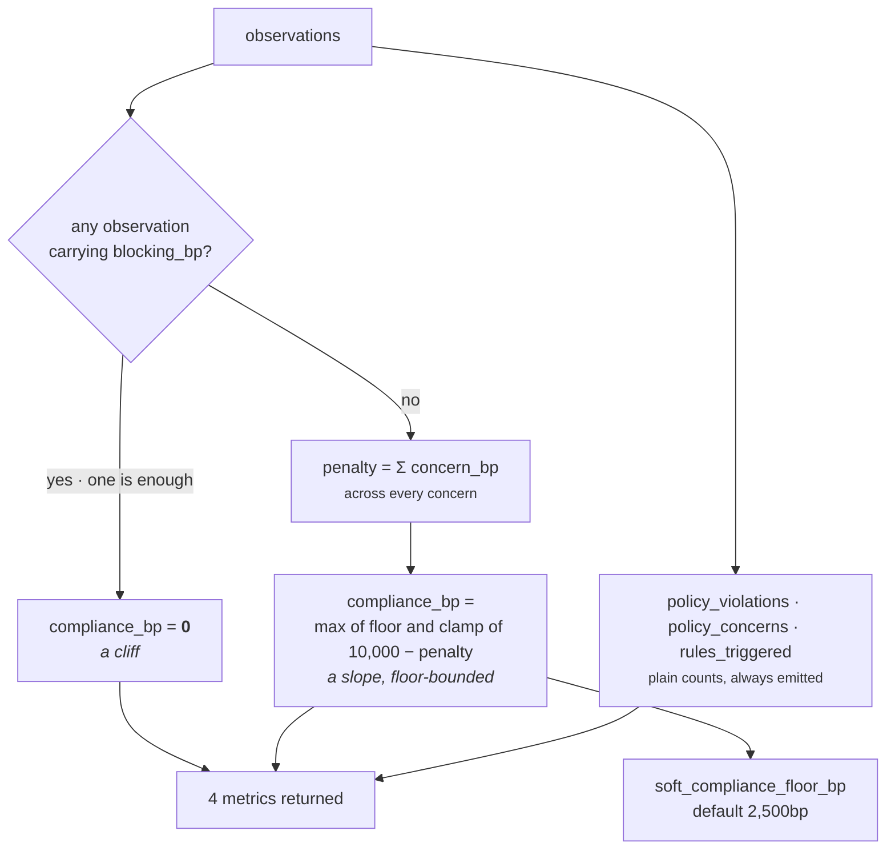

# 04 · Calculator

**Stage 5 of 8** — pure integer arithmetic over the evidence
**Source:** `policy_unit.py:PolicyUnit.calculate` — `@abstractmethod` on the base, implemented here

---

## 1 · What it is for

Turn a bag of observations into the four numbers this unit publishes. Nothing else: no play is
looked at, no threshold is applied, no meaning is assigned. That is `evaluate_meaning`'s job, and
keeping the split sharp is what makes the arithmetic reviewable on its own.

```python
def calculate(self, view: UnitView,
              observations: Sequence[Observation]) -> Mapping[str, int]:
    breaches = [item for item in observations if "blocking_bp" in item.metrics]
    concerns = [item for item in observations if "concern_bp" in item.metrics]
    floor = _config_bp(view, "soft_compliance_floor_bp", 2_500)
    if breaches:
        compliance = 0
    else:
        penalty = sum(int(item.metrics["concern_bp"]) for item in concerns)
        compliance = max(floor, clamp_bp(10_000 - penalty))
    return {"compliance_bp": compliance,
            "policy_violations": len(breaches),
            "policy_concerns": len(concerns),
            "rules_triggered": len(observations)}
```

Eleven lines. Every branch is argued in the docstring, and this file mines that argument rather than
inventing a new one.

---

## 2 · The arithmetic

```text
breaches = observations carrying "blocking_bp"
concerns = observations carrying "concern_bp"
floor    = soft_compliance_floor_bp                    default 2,500bp

compliance_bp = 0                                              if breaches
              = max(floor, clamp_bp(10,000 − Σ concern_bp))    otherwise

policy_violations = |breaches|
policy_concerns   = |concerns|
rules_triggered   = |observations|
```

Note that the partition is by **metric key presence**, not by an enum or a flag. An observation
carries either `blocking_bp` or `concern_bp` and never both, so the two lists are disjoint and
`rules_triggered == policy_violations + policy_concerns` holds for every shipped plugin. Nothing
enforces that invariant: an observation carrying both keys would be counted twice, once in each
list, and `rules_triggered` would then be *less* than their sum. No plugin does this, and no test
checks it.



---

## 3 · Why that shape

The docstring argues it in two paragraphs, and both are answering *"why not the obvious thing?"*

### 3.1 · A cliff, because policy is not a score

> *"A single breached rule takes `compliance_bp` to zero outright. Organisation policy is not a
> score to be traded against upside — being 70% compliant with a do-not-contact record is not a
> softer version of complying with it, so nothing else in the ledger may dilute it."*

The obvious alternative is to subtract a large number and let the rest of the ledger carry on.
Consider what that would produce. If a breach were, say, −8,000bp, then:

```text
one breach, no concerns          10,000 − 8,000 = 2,000bp
```

and 2,000bp is a number. Numbers get weighed. A capability with enough impact and opportunity
elsewhere could out-score it, and the moment that happens `compliance_bp` has stopped meaning
*"permitted"* and started meaning *"how much permission we have"*, which is not a quantity that
exists.

The cliff also makes the metric **unambiguous at the bottom**: `compliance_bp == 0` means, and can
only mean, *at least one organisation rule is broken*. A downstream reader needs no threshold to
interpret it.

The severity constant reinforces the same point from the plugin side:

```python
BLOCKING_SEVERITY_BP = 10_000
```

> *"A hard organisation rule has no gradient — it is either broken or it is not — so the number is a
> constant rather than a knob somebody can quietly soften."*

Notice that the constant is never actually *used* in the arithmetic. `calculate` tests for the
**presence** of the key, not its value. A plugin emitting `blocking_bp: 1` would produce exactly the
same cliff. The constant is documentation and a consistency guarantee for readers of the finding
detail; the mechanism is the key name.

### 3.2 · A slope, because evidential positions differ

> *"Concerns accumulate, because three unverifiable things are a worse evidential position than
> one."*

Three separate rules the tenant wrote, none of which we can show is satisfied, is a worse place to
be than one. A `max` over concerns would flatten that; the sum preserves it.

The sum is deliberately **unweighted and uncapped before the floor**. Each plugin sets its own
`concern_bp` through its own config key, so the tenant controls the relative weights by authoring
them, not by a mixing formula in the unit.

### 3.3 · A floor, because a stack of doubts is not a prohibition

> *"…but they stop at a configured floor. That floor is the line between 'we cannot fully show this
> is allowed' and 'this is forbidden': only a real breach is permitted to reach the bottom, so a
> stack of soft concerns can never impersonate a prohibition downstream."*

This is the sharpest decision in the unit. Without the floor, an over-tuned capability — two
concerns at 9,000bp each — would drive `compliance_bp` to 0, which is the exact value that means
*"a rule is broken"*. A downstream reader keying off zero would then treat a data-quality gap as a
prohibition.

`test_the_soft_floor_holds_when_concerns_would_otherwise_bottom_out` pins it: two 9,000bp concerns
produce **2,500bp**, not 0, and `policy_violations` stays 0.

The bottom `[0, floor)` of the scale is reserved. Only the cliff can reach it.

---

## 4 · The floor is a `max`, and that cuts both ways

```python
compliance = max(floor, clamp_bp(10_000 - penalty))
```

The floor raises a low reading. It also **raises a reading that was not low**, which is the
non-obvious half.

| `soft_compliance_floor_bp` | penalty | `10,000 − penalty` | `compliance_bp` | effect |
|---|---|---|---|---|
| 2,500 (default) | 0 | 10,000 | **10,000** | — |
| 2,500 | 3,000 | 7,000 | **7,000** | floor does not bind |
| 2,500 | 18,000 | −8,000 → clamp → 0 | **2,500** | floor binds, as designed |
| **9,000** | 3,000 | 7,000 | **9,000** | **floor overrides the concern entirely** |
| **10,000** | anything | anything | **10,000** | **concerns are fully disarmed** |

Verified: `soft_compliance_floor_bp: 9_000` with one 3,000bp missing-consent concern yields
`compliance_bp = 9,000`, which is above `compliance_threshold_bp` (8,000), so `matched` flips to
`False` — while a `WARN` check is still emitted against every reachable play.

A tenant raising the floor to "be less harsh about concerns" gets a unit that reports full
compliance with concerns attached. That is a defensible reading of "raise the floor" and it is not
what the name suggests. The floor is documented as a *lower bound on the slope*; the code makes it a
lower bound on the whole result.

`clamp_bp` — `min(10_000, max(0, int(value)))` — is applied *inside* the `max`, so a penalty larger
than 10,000 saturates at 0 before the floor lifts it. Both guards are needed: without `clamp_bp` a
penalty of 18,000 would produce −8,000, and `max(2_500, −8_000)` would still be 2,500, but the
negative would have reached the `_bp` clamp in `build()` and been silently corrected there instead
of here.

---

## 5 · What `calculate` does *not* know: the play roster

This is the unit's most consequential unresolved question, and it lives exactly here.

`calculate` receives `observations` and `view`. It never looks at `view.request.capability.plays`
and never consults `_RULE_REACH`. So **every triggered rule moves `compliance_bp`, including rules
that govern no play in the roster.**

Verified, two ways:

```text
plays    log_note  read_only=True                    ← nothing reaches outside, nothing commits
config   approval_threshold_amount = 5_000_000
facts    {}                                          ← deal.value absent

metrics  compliance_bp 8,000 · policy_concerns 1 · rules_triggered 1
checks   ()                                          ← zero
```

```text
plays    the three shipped sales.deal_cooling_full plays, all read_only=True
config   approval_threshold_amount = 5_000_000
facts    deal.value = 6_200_000                      ← a real breach

metrics  compliance_bp 0 · policy_violations 1 · rules_triggered 1
matched  True
checks   ()                                          ← zero
```

A compliance score of **zero** with **nothing eliminated**. Whether that is a bug depends entirely
on what `compliance_bp` means, and the code does not say:

| Reading | Is the behaviour right? |
|---|---|
| *"how well-evidenced is this organisation's position in this situation"* | **yes** — the org is in breach; that the current roster happens not to contain a play the rule governs does not un-breach it |
| *"how compliant is the field of candidates we are about to rank"* | **no** — nothing in the field is affected, and a zero here will mislead any consumer that reads it as a gate |

Both readings are defensible and the metric name supports either. The two are only distinguishable
by reading `rules_triggered` alongside the check list, and no downstream consumer does that today
(see [06](06-Builder-and-Metrics.md) §4 — nothing outside `core.policy` reads these metrics at all).

If the second reading is the intended one, the fix is to filter observations by reach before
counting — which would mean `calculate` needs the roster, which would mean moving `_RULE_REACH` out
of `evaluate_meaning`. That is a real design change, not a patch.

---

## 6 · Worked combinations

All at `evaluation_time = 2026-08-06 12:00 UTC`, Thursday, with default severities and default
floor.

### 6.1 · Nothing fired

```text
observations  ()
breaches      []            concerns []
compliance    max(2_500, clamp_bp(10_000 − 0)) = 10_000

→ {compliance_bp: 10_000, policy_violations: 0, policy_concerns: 0, rules_triggered: 0}
```

Verified. Note the metrics are still emitted. A silent unit and a clear unit are different
assurances, and this is the arithmetic that keeps them distinguishable.

### 6.2 · One concern — the exact `matched` boundary

```text
config        approval_threshold_amount = 5_000_000
facts         {}
observations  (policy.approval_unverifiable  concern_bp 2,000)

breaches []   concerns [1]   penalty 2,000
compliance    max(2_500, clamp_bp(10_000 − 2_000)) = max(2_500, 8_000) = 8_000

→ {compliance_bp: 8_000, policy_violations: 0, policy_concerns: 1, rules_triggered: 1}
```

8,000 is exactly `compliance_threshold_bp`. See [05](05-Evaluator.md) §3 for what that does to
`matched`.

### 6.3 · Two concerns — the documented stack

```text
config        require_contact_consent = True
              working_hours_start_hour = 13, working_hours_end_hour = 17
observations  (policy.consent_missing         concern_bp 3,000)
              (policy.outside_working_hours   concern_bp 3,000)

penalty       3,000 + 3,000 = 6,000
compliance    max(2_500, clamp_bp(10_000 − 6_000)) = max(2_500, 4_000) = 4_000

→ {compliance_bp: 4_000, policy_violations: 0, policy_concerns: 2, rules_triggered: 2}
```

Verified by `test_stacked_concerns_erode_compliance_but_can_never_impersonate_a_prohibition`, whose
docstring spells out the same arithmetic:

> *"3,000bp of missing consent plus 3,000bp of out-of-hours leaves 4,000bp — above the 2,500bp floor
> that keeps the bottom of the scale reserved for rules the business actually forbids."*

### 6.4 · The floor holding against an over-tuned capability

```text
config        require_contact_consent   = True
              missing_consent_concern_bp = 9_000
              working_hours_start_hour   = 13
              working_hours_end_hour     = 17
              outside_hours_concern_bp   = 9_000

penalty       9,000 + 9,000 = 18,000
10,000 − 18,000 = −8,000 → clamp_bp → 0
compliance    max(2_500, 0) = 2_500

→ {compliance_bp: 2_500, policy_violations: 0, policy_concerns: 2, rules_triggered: 2}
```

Verified. Two things a tenant could not achieve by tuning: they cannot reach 0 without a breach, and
they cannot make `policy_violations` non-zero without one.

### 6.5 · One breach and one concern — the cliff wins outright

```text
config        require_contact_consent = True
facts         contact.do_not_contact = True
observations  (policy.do_not_contact   blocking_bp 10,000)
              (policy.consent_missing  concern_bp   3,000)

breaches [1] → compliance = 0
              the penalty is computed in neither branch; the concern never enters the arithmetic

→ {compliance_bp: 0, policy_violations: 1, policy_concerns: 1, rules_triggered: 2}
```

Verified by `test_one_breach_takes_compliance_to_zero_whatever_else_is_true`. The concern is
**counted** but does not participate: `policy_concerns` is 1, and the concern still becomes a
finding, a reason code and a `WARN` row. Nothing is swallowed — it simply cannot make a zero any
lower.

### 6.6 · Two breaches — no double cliff

```text
observations  (policy.approval_threshold  blocking_bp 10,000)
              (policy.blackout            blocking_bp 10,000)

breaches [2] → compliance = 0

→ {compliance_bp: 0, policy_violations: 2, policy_concerns: 0, rules_triggered: 2}
```

`compliance_bp` cannot distinguish one breach from two. `policy_violations` is the metric that
carries that, which is why the count is published separately rather than folded into the score. In
the Acme scenario the difference is visible in the check list — four `ELIMINATE` rows rather than
two.

---

## 7 · Determinism and purity

- **Integer arithmetic only.** `sum`, `max`, `clamp_bp`, `len`. No division, so no rounding, so no
  need for `divide_half_up` — this is the only calculator in Category 3 that avoids it entirely.
- **Order-independent.** `sum` over concerns and `len` over lists do not depend on the observation
  sequence. `calculate` would produce identical output from a shuffled input, which is why the
  ordering discipline lives in `_checks` and `analyze` rather than here.
- **No clock, no IO, no prior results.** `view` is used for exactly one thing: reading
  `soft_compliance_floor_bp` out of config.

`test_the_same_situation_reasons_to_the_same_bytes_twice` asserts equal `semantic_hash` across two
evaluations of the same request. With this calculator that is close to a tautology; the real content
of that test is the `_checks` ordering.

---

| ← | → |
|---|---|
| [03c · timing_rules](03c-plugin-timing_rules.md) | [05 · Evaluator](05-Evaluator.md) |
