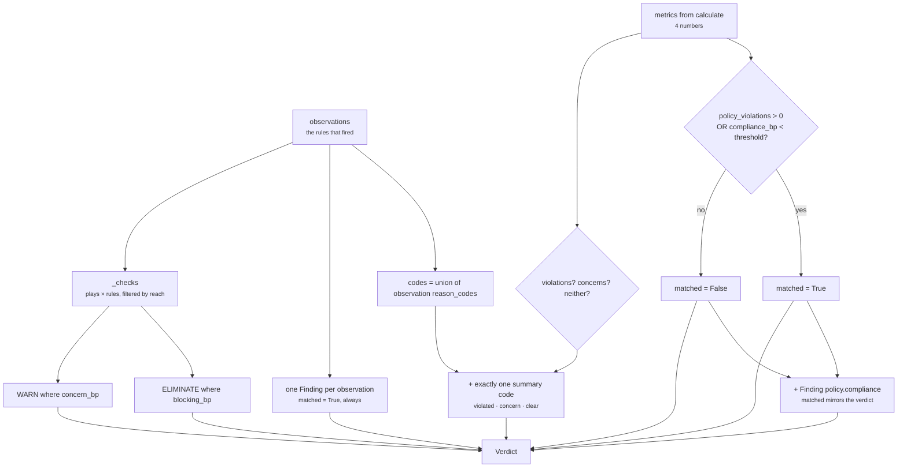

# 05 · Evaluator

**Stage 6 of 8** — turn numbers into meaning
**Source:** `policy_unit.py:PolicyUnit.evaluate_meaning` — `@abstractmethod` on the base, implemented
here — plus its private helper `PolicyUnit._checks`

---

## 1 · What it is for

Three jobs, in one method:

1. Decide `matched` — *does organisation policy have something to say about this situation?*
2. Assemble the findings and the reason codes a human will read.
3. Attach each triggered rule to the plays it actually governs, as `CandidateCheck` rows.

The third is the one that makes this unit different from every other in Category 3. It is the only
place in Part 2 where a unit removes an option.

```python
def evaluate_meaning(self, view, metrics, observations) -> Verdict:
    threshold = _config_bp(view, "compliance_threshold_bp", 8_000)
    constrained = metrics["policy_violations"] > 0 or metrics["compliance_bp"] < threshold
    codes = {code for item in observations for code in item.reason_codes}
    if metrics["policy_violations"]:
        codes.add("organisation_policy_violated")
    elif metrics["policy_concerns"]:
        codes.add("organisation_policy_concern")
    else:
        codes.add("organisation_policy_clear")
    findings = [Finding(finding_id=f"policy.{item.kind.split('.', 1)[1]}", kind="policy",
                        matched=True, metrics=item.metrics,
                        evidence_ids=item.evidence_ids, reason_codes=item.reason_codes)
                for item in observations]
    findings.append(Finding(finding_id="policy.compliance", kind="policy", matched=constrained,
                            metrics=dict(metrics), reason_codes=tuple(sorted(codes))))
    return Verdict(matched=constrained, metrics=dict(metrics), findings=tuple(findings),
                   checks=self._checks(view, observations), reason_codes=tuple(sorted(codes)))
```



The three outputs are computed independently and can disagree in a way that is easy to miss: a
finding says `matched=True` because a rule fired, the verdict says `matched=False` because the
number stayed above the threshold, and a `WARN` row is emitted regardless. They are answering three
different questions — *did this rule fire*, *is this situation constrained*, and *what should travel
with this candidate* — and §3 and §7.2 work through the case where all three diverge.

---

## 2 · What `matched` means here

> *"`matched` means organisation policy has something to say about this situation. It is not an
> instruction and not a verdict on the work: a matched policy unit alongside a matched opportunity
> unit is the ordinary case where a genuinely valuable action needs a signature first."*

That sentence is the whole semantics. `matched = True` does **not** mean "stop", and it does not
mean the recommendation is bad. It means: *there is a rule here and the reader needs to see it.*

The unit always returns a `bool` — never `None`. Compare `core.resource`, which uses `None` for
*"we did not measure"*. `core.policy` has no unmeasured state: either the tenant declared rules or
they did not, and both are knowable from config alone.

---

## 3 · The threshold, and the boundary nothing tests

```python
threshold   = _config_bp(view, "compliance_threshold_bp", 8_000)
constrained = metrics["policy_violations"] > 0 or metrics["compliance_bp"] < threshold
```

| Config key | Reader | Default | Validation |
|---|---|---|---|
| `compliance_threshold_bp` | `_config_bp` | **8,000bp** | int `0..10_000`, `bool` rejected |

Two disjuncts, and the first is redundant in the default configuration: a violation forces
`compliance_bp = 0`, which is below any threshold above zero. It becomes load-bearing only if a
tenant sets `compliance_threshold_bp: 0`, at which point the second disjunct can never fire and the
first is the only thing keeping `matched` honest.

### The boundary

The comparison is **strictly less than**. A single default-severity approval concern lands
compliance at exactly 8,000:

```text
config   approval_threshold_amount = 5_000_000
facts    {}                                       # deal.value absent

compliance_bp = max(2_500, 10_000 − 2_000) = 8_000
constrained   = 0 > 0  or  8_000 < 8_000  →  False or False  →  False
```

Verified: `matched = False`, **and a `WARN` check is emitted** against `send_nudge` carrying
`approval_value_absent`.

So `matched=False` and a non-empty check list coexist. That is defensible — `matched` is a reading,
checks are the record — but it means a downstream consumer that gates on `matched` will miss the
warning, while a consumer that reads `result.checks` will see it. Nothing in the test suite pins the
boundary, and it is exactly the kind of off-by-one that survives a refactor.

The reverse also holds via the floor (see [04](04-Calculator.md) §4): `soft_compliance_floor_bp:
9_000` with a 3,000bp concern gives `compliance_bp = 9,000`, `matched = False`, and a `WARN` row.

### The threshold table

| `compliance_bp` | `policy_violations` | `matched` (default threshold 8,000) |
|---|---|---|
| 10,000 | 0 | `False` — nothing fired |
| 9,000 | 0 | `False` — floor-raised concern |
| **8,000** | 0 | **`False`** — one 2,000bp concern, exactly on the line |
| 7,999 | 0 | `True` |
| 7,000 | 0 | `True` — one 3,000bp concern |
| 4,000 | 0 | `True` — two 3,000bp concerns |
| 2,500 | 0 | `True` — the floor |
| 0 | ≥ 1 | `True` — a breach |

---

## 4 · Reason codes

The set is the union of every observation's codes, plus **exactly one** summary code:

```python
if   metrics["policy_violations"]: codes.add("organisation_policy_violated")
elif metrics["policy_concerns"]:   codes.add("organisation_policy_concern")
else:                              codes.add("organisation_policy_clear")
```

`if / elif / else` — the three are mutually exclusive, and a run with both a breach and a concern
reports only `organisation_policy_violated`. The count metrics still carry both.

The `else` branch is the deliberate one:

> *"Say it out loud. A silent result is otherwise indistinguishable from a unit that was never
> configured with any rules, and those are very different assurances."*

This is where `core.policy` gets it right and `core.tradeoff` does not. Under the shipped manifest —
`core.policy` declared with no config — the result carries
`reason_codes = ("organisation_policy_clear",)`, so a reader can tell *"we checked the rulebook and
it had nothing to say"* apart from *"the unit did not run"*. `core.tradeoff` in the analogous empty
state publishes `reason_codes = ()` and is indistinguishable from a crash.

The full code vocabulary this unit can emit:

| Code | Source | Severity |
|---|---|---|
| `approval_threshold_exceeded` | `approval_threshold` | breach |
| `approval_value_absent` | `approval_threshold` | concern |
| `approval_value_unreadable` | `approval_threshold` | concern |
| `do_not_contact_on_record` | `contact_permission` | breach |
| `contact_consent_revoked` | `contact_permission` | breach |
| `contact_consent_not_on_record` | `contact_permission` | concern |
| `inside_declared_blackout` | `timing_rules` | breach |
| `outside_declared_working_hours` | `timing_rules` | concern |
| `organisation_policy_violated` | the unit | summary |
| `organisation_policy_concern` | the unit | summary |
| `organisation_policy_clear` | the unit | summary |

`tuple(sorted(codes))` — a set, sorted on the way out, so the sequence is byte-stable and free of
duplicates.

---

## 5 · Findings

`N + 1` findings for `N` observations. All carry `kind = "policy"`.

### One per observation

```python
Finding(finding_id=f"policy.{item.kind.split('.', 1)[1]}",
        kind="policy", matched=True,
        metrics=item.metrics, evidence_ids=item.evidence_ids,
        reason_codes=item.reason_codes)
```

The id is the observation's kind with its `policy.` prefix stripped and re-added — so
`kind="policy.approval_threshold"` becomes `finding_id="policy.approval_threshold"`. The round trip
looks pointless and is not: it would rename a kind of `"timing.blackout"` to `"policy.blackout"`,
enforcing the namespace. Every shipped kind already starts with `policy.`, so today it is an
identity transform.

`matched=True` on **every** rule finding, unconditionally:

> *"What the reader needs is the rule, its severity, and the evidence — which is why every triggered
> rule becomes a finding whether or not the threshold was crossed."*

A rule that fired is a rule that fired. Suppressing the finding when `compliance_bp` happened to
land above the threshold would hide the concern that produced the number.

**Possible id collision.** Two observations of the same `kind` would produce two findings with the
same `finding_id`. No shipped plugin can do this — every kind is unique across the five rules — but
nothing enforces it, and `ReasonerResult` does not deduplicate findings.

### One summary

```python
Finding(finding_id="policy.compliance", kind="policy",
        matched=constrained, metrics=dict(metrics),
        reason_codes=tuple(sorted(codes)))
```

Always present, even on an empty run. It carries the four published metrics and no evidence ids —
there is nothing to cite for a summary. Its `matched` mirrors the verdict's, so a consumer reading
findings alone sees the same reading as one reading `result.matched`.

`Finding.__post_init__` range-checks any metric whose name ends in `_bp`. `compliance_bp` and
`blocking_bp` and `concern_bp` all pass. `value_amount = 6_200_000` and `threshold_amount` do not
end in `_bp` and are therefore **not** range-checked — which is what lets a money amount survive
into a finding intact. Had they been named `value_bp`, the contract layer would have rejected the
whole result.

---

## 6 · `_checks` — the fail-closed path

```python
def _checks(self, view, observations) -> tuple[CandidateCheck, ...]:
    ordered = sorted(observations, key=lambda item: (item.plugin_id, item.kind))
    checks: list[CandidateCheck] = []
    for play in sorted(view.request.capability.plays, key=lambda item: item.play_id):
        for item in ordered:
            if not _RULE_REACH[item.plugin_id](play):
                continue
            breach = "blocking_bp" in item.metrics
            detail = dict(item.metrics)
            detail["rule"] = item.kind
            checks.append(CandidateCheck(
                play_id=play.play_id,
                stage=POLICY_STAGE,                      # "policy"
                outcome=CheckOutcome.ELIMINATE if breach else CheckOutcome.WARN,
                reason_code=item.reason_codes[0],
                evaluator_id=self.unit_id,               # "core.policy"
                evaluator_version=self.version,          # "1.0.0"
                detail=detail,
            ))
    return tuple(checks)
```

### The three decisions

**Breaches eliminate.**

> *"That is the whole reason this unit exists, and it is the one place in Part 2 where a unit is
> allowed to remove an option, because 'the business forbids this' is not a trade-off the Decision
> Maker gets to weigh."*

**Concerns warn and leave the play in contention.** *"'We cannot show this is allowed' must not
quietly do the work of 'this is forbidden'."*

**A play a rule does not reach gets no row at all — not a `PASS`.**

> *"A do-not-contact record is silent about logging an internal note, and recording a pass would
> suggest this unit had examined a question it never asked."*

A `PASS` is an affirmative claim: *this play was checked against this rule and cleared it.* For a
play the rule does not govern, that claim is false, and a later reader could not tell *"the rule
cleared this"* from *"the rule never applied"*. Compare `core.resource`, which does emit a `PASS`:
there the rule applies to every play, so the pass is true.

`test_a_contact_rule_leaves_internal_record_keeping_alone` pins it by asserting the *play id list*,
not by asserting an outcome — `[item.play_id for item in checks] == ["send_nudge"]` — because the
property being tested is the absence of a row, not its content.

### Ordering

```text
outer  sorted(capability.plays, key=play_id)
inner  sorted(observations, key=(plugin_id, kind))
```

> *"Plays are iterated in play_id order and rules in plugin order so the emitted sequence — and
> every hash taken over it — is a property of the manifest, not of iteration order."*

Both sorts are total. `play_id` is unique within a manifest, and `(plugin_id, kind)` is unique
across the five shipped rules. `test_checks_are_emitted_in_play_id_order` declares `zeta_send`
before `alpha_send` and asserts the reverse comes out.

The inner sort is a *re-sort*: `analyze` already produced observations in `plugin_id` order, but
within a plugin the sub-rules run in written order (`_do_not_contact` before `_consent`). Sorting on
`kind` normalises that too, which is why `contact_consent_revoked` precedes `do_not_contact_on_record`
in the emitted rows even though the do-not-contact rule ran first. Verified.

### `reason_code = item.reason_codes[0]`

`Observation.__post_init__` sorts and deduplicates `reason_codes`, so `[0]` is the **alphabetically
first** code, not a designated primary. Every policy observation currently carries exactly one code,
so this is correct today and silently wrong the day a plugin emits two — the row would carry
whichever code sorted first, with no signal that another existed.

### `detail`

`dict(item.metrics)` plus `detail["rule"] = item.kind`. So an elimination row carries the full
arithmetic that produced it:

```text
{"blocking_bp": 10000, "value_amount": 6200000, "threshold_amount": 5000000,
 "rule": "policy.approval_threshold"}
```

*"A rejection without its reason is indistinguishable from an oversight"* —
`decision_maker.py:evaluate_candidates`. The `detail` is what makes the rejection legible six months
later. Note it is a copy: mutating it cannot reach the `Observation`, whose `metrics` are a
`MappingProxyType`.

`decision_maker.py:ordered_checks` re-sorts every check on a candidate by
`(stage, evaluator_id, evaluator_version, reason_code, semantic_hash(detail))` — so `detail` reaches
the audit ordering, and two rows differing only in their arithmetic still order deterministically.

---

## 7 · Worked examples

### 7.1 · Nothing fired — the clear result

```text
observations  ()
metrics       {compliance_bp: 10_000, policy_violations: 0, policy_concerns: 0, rules_triggered: 0}

constrained = 0 > 0 or 10_000 < 8_000  →  False
codes       = {} ∪ {"organisation_policy_clear"}
findings    = [Finding("policy.compliance", matched=False, metrics=<the four>)]
checks      = ()                                    ← the loop runs, no observation to pair
```

Verified by `test_a_situation_no_rule_touches_reads_as_fully_compliant_and_says_so`, which asserts
`result.checks == ()` explicitly.

### 7.2 · One concern, `matched=False`, one `WARN`

```text
config        approval_threshold_amount = 5_000_000
facts         {}
plays         send_nudge  read_only=False external=True

observations  (policy.approval_unverifiable  concern_bp 2,000  threshold_amount 5,000,000)
metrics       {compliance_bp: 8_000, policy_violations: 0, policy_concerns: 1, rules_triggered: 1}

constrained = 0 > 0 or 8_000 < 8_000  →  False                    ← the boundary
codes       = {"approval_value_absent", "organisation_policy_concern"}
findings    = [Finding("policy.approval_unverifiable", matched=True,  ...),
               Finding("policy.compliance",            matched=False, ...)]
checks      = [CandidateCheck(send_nudge, "policy", WARN, "approval_value_absent",
                              "core.policy", "1.0.0",
                              {"concern_bp": 2000, "threshold_amount": 5000000,
                               "rule": "policy.approval_unverifiable"})]
```

Verified. The rule finding says `matched=True` while the summary says `matched=False`; those are
answering different questions, which is why both exist.

### 7.3 · A breach — elimination, and the reach limit

```text
facts         contact.do_not_contact = True
plays         log_note    read_only=True                    ← undeclared, read-only
              send_nudge  read_only=False external=True

observations  (policy.do_not_contact  blocking_bp 10,000)
metrics       {compliance_bp: 0, policy_violations: 1, policy_concerns: 0, rules_triggered: 1}

constrained = 1 > 0  →  True
codes       = {"do_not_contact_on_record", "organisation_policy_violated"}

_checks loop, plays sorted → log_note, send_nudge
  log_note    _reaches_outside → metadata absent → not read_only → False → skip
  send_nudge  _reaches_outside → declared True                    → ELIMINATE

checks = [CandidateCheck(send_nudge, "policy", ELIMINATE, "do_not_contact_on_record", ...)]
```

Verified by two tests: `test_a_breached_rule_eliminates_every_play_it_reaches` for the row's shape,
`test_a_contact_rule_leaves_internal_record_keeping_alone` for `log_note`'s absence.

### 7.4 · A breach the roster does not reach

```text
config        approval_threshold_amount = 5_000_000
facts         deal.value = 6_200_000
plays         draft_for_vp  read_only=False external=True
                            metadata["execution_boundary"] = "human_approval_required"

observations  (policy.approval_threshold  blocking_bp 10,000)
metrics       {compliance_bp: 0, policy_violations: 1, ...}

constrained = True
_needs_approval_cover(draft_for_vp)
  = not read_only(True) and not _carries_human_approval(True)
  = True and False = False                                        → skip

checks = ()
```

`test_a_play_that_already_routes_through_a_human_satisfies_the_approval_threshold` asserts both
halves in the same test: `policy_violations == 1` with the comment *"the org rule is still
breached"*, and `result.checks == ()` with *"but this play is not the breach"*. The organisation is
in breach; this particular play is not the thing that breaches it.

### 7.5 · The Acme run — two rules, three plays, four rows

```text
observations sorted by (plugin_id, kind):
  ("approval_threshold", "policy.approval_threshold")   blocking_bp 10,000
  ("timing_rules",       "policy.blackout")             blocking_bp 10,000

plays sorted by play_id:
  email_champion      external=True   → both rules reach
  log_note            external=False  → neither reaches
  send_renewal_quote  external=True   → both rules reach
```

```text
email_champion      ELIMINATE  approval_threshold_exceeded   detail carries the amounts
email_champion      ELIMINATE  inside_declared_blackout      detail {"blocking_bp", "rule"}
send_renewal_quote  ELIMINATE  approval_threshold_exceeded
send_renewal_quote  ELIMINATE  inside_declared_blackout
```

Verified, including that `test_the_unsigned_acme_renewal_during_the_close_period_is_blocked_with_its_reasons`
asserts the check set as `{(play_id, reason_code)}` and `all(outcome is ELIMINATE)`, and the finding
ids as `{"policy.approval_threshold", "policy.blackout", "policy.compliance"}`.

---

## 8 · The `publishes` guard, on this unit

Between `evaluate_meaning` and `build`, the framework checks:

```python
undeclared = sorted(set(verdict.metrics) - set(self.publishes)) if self.publishes else []
if undeclared:
    raise ValueError(f"{self.unit_id} published undeclared metrics: {', '.join(undeclared)}")
```

`Verdict.metrics` is `dict(metrics)` straight from `calculate` — exactly
`{compliance_bp, policy_violations, policy_concerns, rules_triggered}` — and `publishes` is exactly
those four names. `undeclared` is always empty and the guard always passes.

It would fire if a plugin's metric ever leaked into the verdict's top-level metrics. It cannot:
`blocking_bp`, `concern_bp`, `value_amount`, `threshold_amount`, `local_hour` and `local_weekday`
live only on observations, findings and check details, none of which the guard inspects.

That is worth naming as a limit of the guard rather than a property of the unit: **`value_amount`
reaches the persisted decision record through `Finding.metrics` and `CandidateCheck.detail` without
ever being declared anywhere.** The guard governs the metrics namespace, not the finding namespace.

---

| ← | → |
|---|---|
| [04 · Calculator](04-Calculator.md) | [06 · Builder and Metrics](06-Builder-and-Metrics.md) |
