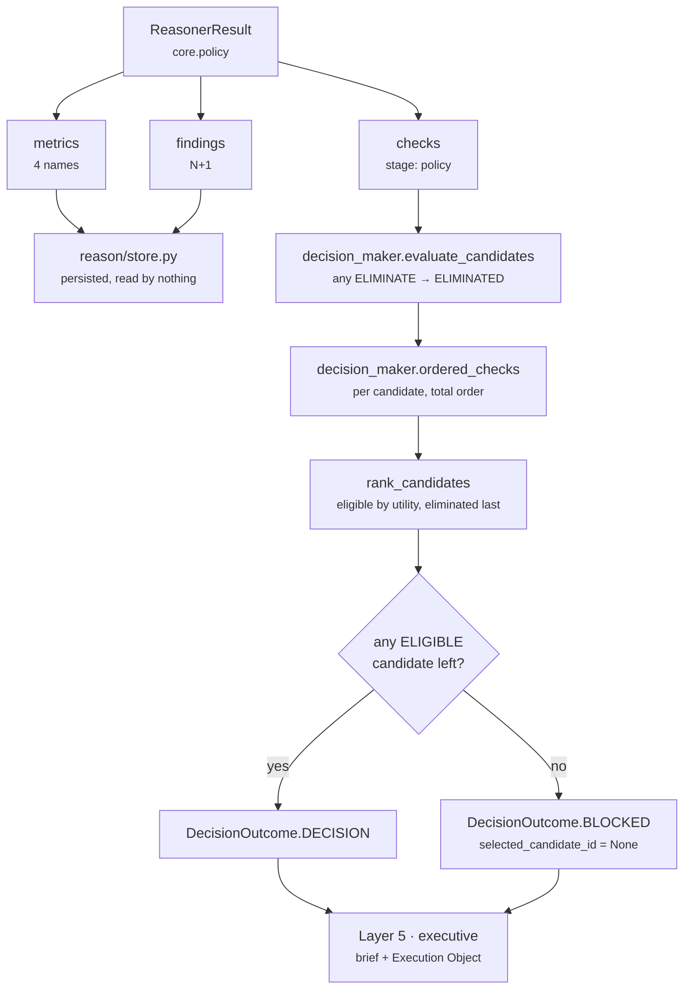

# 06 · Builder and Metrics

**Stage 7 of 8** — assemble the one object shape every unit returns
**Stage 8 of 8** — what this unit publishes, declared rather than discovered
**Source:** `genios_engine/reason/unit.py:ReasoningUnit.build` (base, **not overridden**)

---

## 1 · The Builder — base implementation, unchanged

`PolicyUnit` does not define `build`. Of the seventeen framework units only `core.confidence`
overrides it, and it does so to work around a metric-name collision that does not exist here. The
base is correct for `core.policy`:

```python
def build(self, view: UnitView, verdict: Verdict,
          observations: Sequence[Observation]) -> ReasonerResult:
    evidence = set(view.evidence_ids)
    for observation in observations:
        evidence.update(observation.evidence_ids)
    return ReasonerResult(
        reasoner_id=self.unit_id,                      # "core.policy"
        reasoner_version=self.version,                 # "1.0.0"
        status=ResultStatus.COMPLETED,
        matched=verdict.matched,
        metrics={name: clamp_bp(value) if name.endswith("_bp") else value
                 for name, value in verdict.metrics.items()},
        findings=verdict.findings,
        adjustments=verdict.adjustments,               # always () for this unit
        checks=verdict.checks,
        evidence_ids=tuple(sorted(evidence)),
        reason_codes=verdict.reason_codes,
    )
```

Three things it does for this unit:

**Clamps `compliance_bp`.** The only `_bp`-suffixed metric in the verdict. `calculate` already
guarantees `0 ≤ compliance_bp ≤ 10_000` — it is `max(floor, clamp_bp(...))` and `_config_bp` bounds
the floor at 10,000 — so the clamp is belt and braces. It matters anyway, because `clamp_bp` is what
`guards.py:validate_candidate_effects` would otherwise catch as a contract violation.

The other three metrics — `policy_violations`, `policy_concerns`, `rules_triggered` — do **not** end
in `_bp` and pass through untouched. That is correct: they are counts, not basis points, and a
clamp at 10,000 would be meaningless. It also means they are unbounded above; a manifest with
enough plays and rules could publish `rules_triggered = 5` and nothing would object, which is right.

**Unions the evidence.** `view.evidence_ids` (empty for this unit under the shipped spec — see
[02-Retriever](02-Retriever.md)) plus every observation's `evidence_ids`. Sorted, deduplicated by the
set.

**Stamps `COMPLETED`.** The base always does. A unit may not decide it is irrelevant: if it returned
`ResultStatus.SKIPPED`, `orchestrator.py` overwrites the result with `FAILED` carrying
`reasoner_returned_skipped`, because skipping is a scheduling decision and scheduling belongs to
Part 1.

---

## 2 · What the result carries

| Field | Value for `core.policy` |
|---|---|
| `reasoner_id` | `"core.policy"` |
| `reasoner_version` | `"1.0.0"` |
| `status` | `ResultStatus.COMPLETED` — always, on any non-raising path |
| `matched` | `bool` — never `None`. See [05](05-Evaluator.md) §2 |
| `metrics` | exactly the four declared names, always all four |
| `findings` | `N + 1` — one per observation, plus `policy.compliance` |
| `adjustments` | **always `()`** |
| `checks` | 0 to `plays × observations`, at stage `policy` |
| `evidence_ids` | union of the observations' citations, sorted |
| `missing_fields` | `()` — the unit never raises `MissingContextError` |
| `reason_codes` | union of observation codes plus exactly one summary code, sorted |

### Why no adjustments, ever

`CandidateAdjustment` moves a score component — `impact`, `success`, `urgency`, `effort`, `risk` —
by a signed `delta_bp`. `core.policy` emits none, and the reason is the same argument that gives it
the elimination authority in the first place: a rule is not a score modifier. Nudging a play's
`risk` component downward because a do-not-contact record exists would be exactly the "70% compliant"
reading the calculator's docstring rejects. The unit either removes the play or attaches a warning;
it never quietly reprices it.

`core.cost` in the same category does emit adjustments, on the `effort` component, because effort
*is* a score and cost *is* a voice at the table.

### The two guards at the orchestrator boundary

`orchestrator.py:_evaluate` applies both the moment the unit returns:

```python
validate_candidate_effects(result, play_ids)      # every check.play_id is declared;
                                                  # every check.stage ∈ CHECK_STAGES;
                                                  # every _bp metric is an int in 0..10_000
validate_evidence_references(result, request)     # every cited id resolves in context.evidence
```

`POLICY_STAGE = "policy"` is a member of `guards.py:CHECK_STAGES`, which is a closed set of seven:
`precondition`, `constraint`, `policy`, `permission`, `safety`, `cost_benefit`, `ranking`. The
constant exists so *"the string that must match the frozen contract's vocabulary lives in exactly
one place"*.

Both guards raise `ValueError` on violation, which the orchestrator turns into a typed `FAILED`
result — *"never an exception out of the kernel"*. Neither can fire for this unit as written: check
play ids come from `capability.plays` by construction, and evidence ids come from
`context.evidence` by construction.

---

## 3 · `publishes` — the metric contract

```python
publishes = ("compliance_bp", "policy_concerns", "policy_violations", "rules_triggered")
```

| Metric | Type | Range | Meaning | Emitted on an empty run |
|---|---|---|---|---|
| `compliance_bp` | basis points | `0..10,000` | How this situation stands against the tenant's written rules. `10,000bp` = 1.00 = nothing to say. `0` means, and can only mean, **at least one rule is breached** — the cliff reserves the value. Values in `[0, soft_compliance_floor_bp)` are unreachable without a breach. | yes, as `10,000` |
| `policy_violations` | count | `≥ 0` | How many rules are breached. The only metric that distinguishes one breach from two, since `compliance_bp` saturates at 0. | yes, as `0` |
| `policy_concerns` | count | `≥ 0` | How many rules could not be shown satisfied. Counted even when a breach makes them numerically irrelevant. | yes, as `0` |
| `rules_triggered` | count | `≥ 0` | How many rules had anything to say. Equals `violations + concerns` for every shipped plugin. **This is the metric that distinguishes "we checked and found nothing" from "no rule applies"** when read alongside `compliance_bp`. | yes, as `0` |

Practical ceiling on the counts: five, because the three plugins carry five rules between them.

### What it deliberately does not publish

```python
def test_the_unit_never_claims_authority_over_shared_metrics():
    reserved = {"confidence_bp", "urgency_bp", "priority_override_bp"}
    assert reserved.isdisjoint(PolicyUnit().publishes)
    result = PolicyUnit().evaluate(_request(), {})
    assert reserved.isdisjoint(result.metrics)
```

Two assertions, and the second is the one with teeth: the declaration *and* the actual emitted
metrics are both checked.

> *"It never publishes `confidence_bp`, `urgency_bp` or `priority_override_bp` — those belong to
> `core.confidence` and `core.priority`, and a policy unit that moved them would re-score every
> capability in the roster every time a customer edited their handbook."*

`tests/test_unit_roster.py` enforces the same rule across all seventeen units, plus the broader
one-publisher-per-metric invariant. None of `compliance_bp`, `policy_concerns`, `policy_violations`
or `rules_triggered` is claimed by any other unit.

`decision_maker.py:calculate_confidence` scans results in plan order and **breaks** at
`CONFIDENCE_AUTHORITY = "core.confidence"`; `priority_metrics` does the same at
`PRIORITY_AUTHORITY = "core.priority"` and reads `priority_override_bp` *only* from the authority.
So even if this unit published one of those names, the authority's value would win — but the run
would be non-deterministic in ordering terms, and the invariant exists so nobody has to reason about
that.

---

## 4 · Who consumes these metrics

**Nothing does.** Verified by grep across `genios_engine/` and `tests/`: outside `policy_unit.py` and
its own test file, the strings `compliance_bp`, `policy_violations`, `policy_concerns` and
`rules_triggered` appear nowhere. No unit reads them via `prior_metric`, no scoring path weighs them,
no card renders them.

That is not a defect. This unit's influence on a decision travels entirely through its
`CandidateCheck` rows, and the metrics exist for three other purposes:

1. **The audit record.** `reason/store.py` persists the whole result into
   `reasoning_reasoner_results`, with `metrics` inside the `output` JSONB column, so
   `compliance_bp = 0` is queryable evidence that the run knew the org was in breach.
2. **A reader.** The finding `policy.compliance` carries all four, and a brief or a debugging session
   can show *how many* rules fired without re-deriving them.
3. **A future consumer.** `publishes` is a claim on the namespace: no other unit may take these
   names, so lighting them up later is a deliberate change rather than a collision.

### What *does* consume this unit's output



The path that matters is the check path:

```python
# decision_maker.py:evaluate_candidates
play_checks = ordered_checks([item for item in checks if item.play_id == proposal.play.play_id])
eliminated = any(item.outcome == CheckOutcome.ELIMINATE for item in play_checks)
```

**`any`, over all checks on that play, from all units.** One `ELIMINATE` from `core.policy` is
enough, and it is indistinguishable in effect from one emitted by `core.constraint` or
`core.validation`. Elimination runs *before* `rank_candidates`, which is the safety property: *"a
play eliminated by policy never competes on score, so it can never win and then be quietly
demoted."*

`WARN` rows change no disposition. They travel with the candidate into
`ProposedCandidate.checks` and reach the audit record and the human, which is the entire point of
distinguishing them from eliminations.

---

## 5 · Sharing the `policy` stage with `core.constraint`

Both units stamp `stage = "policy"`. `core.constraint` uses it for the capability-declared
`read_only` and `evidence_required` policies; `core.policy` uses it for every tenant rule it emits.

That collision is currently harmless because the one place the stage is used as an *identifier* also
filters on the author. `reason/store.py`, verifying that a persisted decision's selected play carries
its policy proofs:

```python
matches = [
    check for check in prepared_checks
    if check["candidate_id"] == selected_id
    and check["stage"] == stage
    and check["reason_code"] == reason_code
    and check["evaluator_id"] == "core.constraint"          # ← the disambiguator
    and check["evaluator_version"] == constraint_spec.get("version")
    and check["outcome"] == "pass"
]
if len(matches) != 1:
    raise ReasoningStoreError(f"selected play lacks one exact passing check for policy {policy}")
```

`_POLICY_CHECK_REQUIREMENTS` maps `read_only → ("policy", "read_only_policy_pass")` and
`evidence_required → ("policy", "evidence_policy_pass")`. A `core.policy` row can never satisfy one
of those, because it never emits `PASS` and never uses those reason codes — and even if it did, the
`evaluator_id` clause excludes it. `reason/authority.py` re-proves the same mapping in SQL on every
downstream read.

The residual risk is small but real: **the stage string alone does not identify the author.** Any
future consumer that groups checks by `stage` to answer "what did policy say about this play?" will
merge two units with two different authorities and two different blast radii. The fix, if one is
ever wanted, is a distinct stage — but `CHECK_STAGES` is closed and adding to it is a contract
change with a replay break attached.

---

## 6 · Worked results, in full

### 6.1 · The shipped run — no tenant rules

```text
ReasonerResult(
    reasoner_id       = "core.policy",
    reasoner_version  = "1.0.0",
    status            = COMPLETED,
    matched           = False,
    metrics           = {compliance_bp: 10_000, policy_violations: 0,
                         policy_concerns: 0, rules_triggered: 0},
    findings          = (Finding("policy.compliance", kind="policy", matched=False,
                                 metrics=<the four>,
                                 reason_codes=("organisation_policy_clear",)),),
    adjustments       = (),
    checks            = (),
    evidence_ids      = (),
    missing_fields    = (),
    reason_codes      = ("organisation_policy_clear",),
)
```

Verified. This is what `sales.deal_cooling_full` produces today on every run.

### 6.2 · A breach with evidence attached

```text
config   approval_threshold_amount = 5_000_000
facts    deal.value = 6_200_000, deal.approval_status = "pending"
evidence ev_value  → "deal.value"
         ev_status → "deal.approval_status"
plays    send_nudge  read_only=False external=True
```

```text
build:  evidence = set(view.evidence_ids)          = set()          ← retriever selected nothing
                 ∪ observation.evidence_ids        = {"ev_status", "ev_value"}
                 → sorted → ("ev_status", "ev_value")

ReasonerResult(
    matched      = True,
    metrics      = {compliance_bp: 0, policy_violations: 1,
                    policy_concerns: 0, rules_triggered: 1},
    findings     = (Finding("policy.approval_threshold", matched=True,
                            metrics={blocking_bp: 10_000, value_amount: 6_200_000,
                                     threshold_amount: 5_000_000},
                            evidence_ids=("ev_status", "ev_value"),
                            reason_codes=("approval_threshold_exceeded",)),
                    Finding("policy.compliance", matched=True, metrics=<the four>,
                            reason_codes=("approval_threshold_exceeded",
                                          "organisation_policy_violated"))),
    checks       = (CandidateCheck("send_nudge", "policy", ELIMINATE,
                                   "approval_threshold_exceeded", "core.policy", "1.0.0",
                                   {"blocking_bp": 10000, "value_amount": 6200000,
                                    "threshold_amount": 5000000,
                                    "rule": "policy.approval_threshold"}),),
    evidence_ids = ("ev_status", "ev_value"),
    reason_codes = ("approval_threshold_exceeded", "organisation_policy_violated"),
)
```

Verified. Both fields are cited: the value that crossed the bar and the status field that failed to
show a signature. `value_amount = 6,200,000` reaches both the finding and the check detail intact
because it carries no `_bp` suffix and therefore no range check — see [05](05-Evaluator.md) §8.

### 6.3 · Determinism

```python
def test_the_same_situation_reasons_to_the_same_bytes_twice():
    request = _request(config={"approval_threshold_amount": 5_000_000,
                               "require_contact_consent": True,
                               "working_hours_start_hour": 13,
                               "working_hours_end_hour": 17},
                       facts={"deal.value": 6_200_000})

    first = PolicyUnit().evaluate(request, {})
    second = PolicyUnit().evaluate(request, {})

    assert first.semantic_hash == second.semantic_hash
```

Everything that reaches the hash is sorted at construction: `Observation` sorts its
`evidence_ids` and `reason_codes`; `Finding` does the same; `Verdict.reason_codes` is
`tuple(sorted(codes))`; `_checks` sorts plays by `play_id` and observations by `(plugin_id, kind)`;
`build` sorts the evidence union.

*"Config round-trips through JSON in the audit store and comes back re-sorted, and a hash taken over
an iteration-ordered sequence would not survive that trip."*

The Acme run's hash, computed against the frozen fixture:

```text
8e3c2f4c6da75bad8d3025d6283913fa3f4845ac59ebb6787617c10e70741e5d
```

That number is a property of the fixture, not a contract — it will move if any field name, sort
order or arithmetic changes, which is exactly what makes it useful as a canary.

---

## 7 · Summary — what this unit is entitled to say

| It may | It may not |
|---|---|
| publish four metrics about the tenant's rulebook | publish `confidence_bp`, `urgency_bp` or `priority_override_bp` |
| emit `ELIMINATE` on a rule the tenant declared and that reaches the play | emit `ELIMINATE` on a rule the capability declared — that is `core.constraint`'s |
| emit `WARN` on a rule it could not show satisfied | emit `PASS` on a play a rule does not reach |
| attach evidence for the facts a rule consulted | cite a row outside the frozen snapshot |
| say nothing at all when the tenant declared no rules | invent a default rule |
| — | emit any `CandidateAdjustment` |
| — | rank, choose, or weigh a play against another |

---

| ← | → |
|---|---|
| [05 · Evaluator](05-Evaluator.md) | [README](README.md) |
