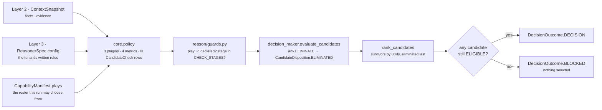
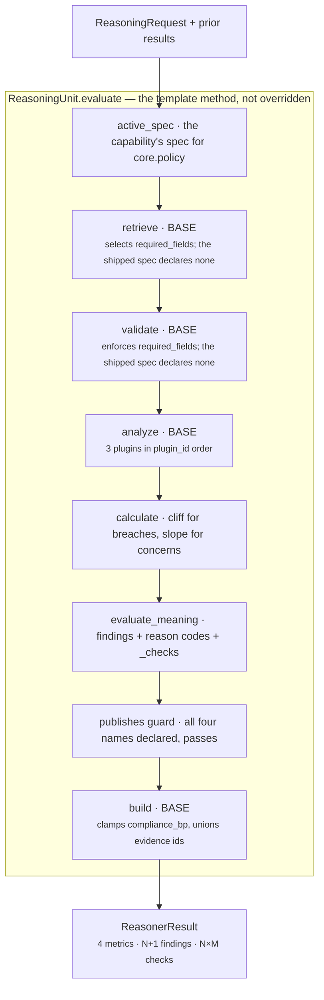
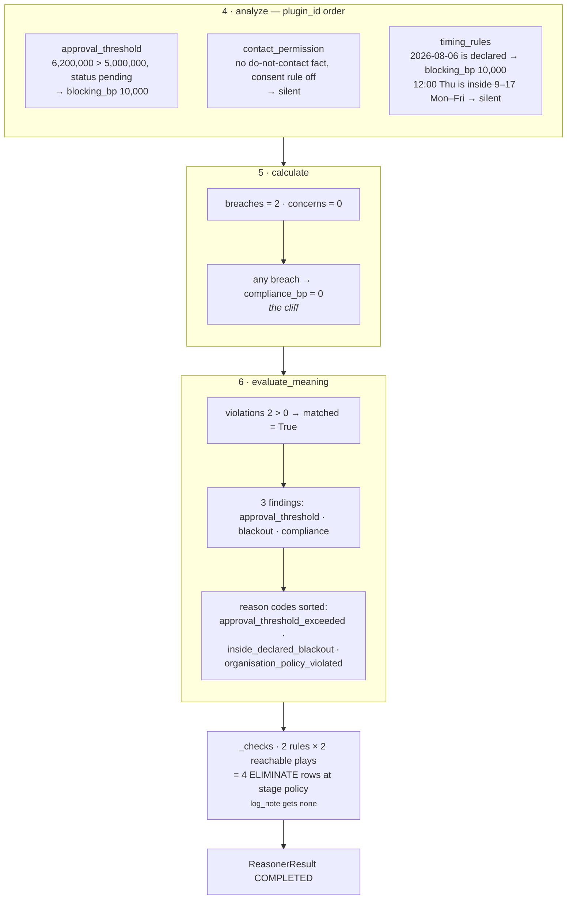

# `core.policy` — the organisation's own rulebook

**Module:** `genios_engine/reason/reasoners/policy_unit.py` (531 lines, 3 plugins)
**Tests:** `tests/test_unit_policy_unit.py` — 531 lines, **37 passing**
**Identity:** `unit_id = "core.policy"` · `version = "1.0.0"`
**Category:** `UnitCategory.OPTIMIZATION`
**Registered as:** `reasoners/__init__.py:OPTIMIZATION` — `PolicyUnit`, fifth of five
**Check stage it claims:** `POLICY_STAGE = "policy"` — a member of `guards.py:CHECK_STAGES`

---

## 1 · What it is for

**The business question:** *what does this organisation forbid or require here?*

Every other unit in Part 2 reasons about the situation — how late, how big, how risky, how feasible.
This one reasons about the rules the business has written down *around* the situation: the sentences
that exist in a compliance handbook rather than in a CRM.

> *"anything over £50,000 needs the VP's signature"*
> *"we do not email this account, ever"*
> *"no external communication during the close period"*

It is the **only unit in Category 3 permitted to remove a play from the field**, and one of only
three in the whole roster (`core.constraint` and `core.validation` are the others). That authority
is narrow on purpose: it fires only on a rule the tenant wrote into config, and only against the
plays that rule actually reaches.

### Why this is not `core.constraint`

The two look like duplicates. They are separated by **who owns the rule and what its blast radius
is**, argued in the module docstring:

| | `core.constraint` | `core.policy` |
|---|---|---|
| Reads | `capability.policies`, `play.preconditions` | `ReasonerSpec.config` for `core.policy` |
| Owned by | the expertise pack (Layer 3) | the tenant |
| Changes when | the pack is re-versioned | the business changes its handbook |
| Blast radius | every deployment of that pack | one capability, one customer |

Nothing in `policy_unit.py` reads `capability.policies` or play preconditions. Duplicating that
reading *"would mean two different answers to the same question"*, with no way to tell which was
correct. One deliberate exception: `_carries_human_approval` reads the same two signals
`core.constraint` uses for `human_approval_required`, precisely so a play cannot satisfy one
approval authority and fail the other because the two look at different fields.

---

## 2 · Its place in the pipeline



Elimination happens **before** ranking. That ordering is the safety property: a play the tenant
forbids never competes on score, so it can never win and then be quietly demoted. If every play in
the roster is eliminated, `decision_maker.py:DecisionMaker.decide` produces
`DecisionOutcome.BLOCKED` with `selected_candidate_id = None` — the run reaches a human as *"we had
options and the rules removed all of them"*, not as silence.

### Deployment status

`packs/capabilities/deal_cooling_v2.py:_full_roster` — `sales.deal_cooling_full` — declares
`_spec("core.policy")` with **no dependencies, no `required_fields`, and no config**, at
`FailurePolicy.OPTIONAL` with a 60 ms latency budget. `core.policy` is not in that module's
`_REQUIRED` set, so the optional policy is the shipped one.

> **Correction to [../README.md](../README.md) §2.** That document states the manifest ships with
> `live_delivery_enabled=False` and *"advises nobody yet"*. As of the current source it ships
> `live_delivery_enabled=True` with `metadata["activation"] = "live"`, and the comment beside the
> flag explains why flipping it changes the capability's content address. So this unit is live in a
> delivery-enabled capability — it is dormant because it is unconfigured, not because the capability
> is in shadow.

A rule the tenant has not configured is not a rule, so the unit is presently **dormant in
production**: it reports `compliance_bp = 10,000`, `rules_triggered = 0`, `matched = False`,
`reason_codes = ("organisation_policy_clear",)` and emits no checks. Category 3's elimination
authority does not exist until somebody writes rules into capability config.

Two things about that shipped roster are worth knowing before somebody does — both verified against
the real `deal_cooling.py` play definitions:

| Shipped play | `read_only` | `external_recipient_required` | `_reaches_outside` | `_needs_approval_cover` |
|---|---|---|---|---|
| `restore_momentum` | True | True | **True** | False |
| `multithread_account` | True | True | **True** | False |
| `clarify_next_step` | True | False | False | False |

1. A tenant do-not-contact record would eliminate `restore_momentum` and `multithread_account` and
   leave `clarify_next_step` untouched. That is correct — a draft for human approval is a message
   intended to leave the building, and the third play is declared internal.
2. A tenant **approval threshold would eliminate nothing at all**. All three plays are
   `read_only=True`, so `_needs_approval_cover` is `False` for every one of them. The breach is
   still counted — `policy_violations = 1`, `compliance_bp = 0` — but the check list is empty. See
   §8, gap 1.

---

## 3 · The plugins

Three separable rule families, one plugin each, because they are evidenced by different facts and
are not interchangeable. `analyze()` runs them in `plugin_id` order, which here is also alphabetical
and also the order they are declared in.

| # | Plugin | `plugin_id` | Observation kinds | Observations per run | Doc |
|---|---|---|---|---|---|
| 1 | `ApprovalThresholdPlugin` | `approval_threshold` | `policy.approval_threshold`, `policy.approval_unverifiable` | 0 or 1 | [03a](03a-plugin-approval_threshold.md) |
| 2 | `ContactPermissionPlugin` | `contact_permission` | `policy.do_not_contact`, `policy.consent_revoked`, `policy.consent_missing` | 0, 1 or 2 | [03b](03b-plugin-contact_permission.md) |
| 3 | `TimingRulePlugin` | `timing_rules` | `policy.blackout`, `policy.outside_working_hours` | 0, 1 or 2 | [03c](03c-plugin-timing_rules.md) |

Maximum five observations in one run: threshold, do-not-contact, consent, blackout, working hours.

Every observation carries exactly one of two metric names, and that single choice decides everything
downstream:

| Metric on the observation | Means | Compliance effect | Check outcome |
|---|---|---|---|
| `blocking_bp` = `BLOCKING_SEVERITY_BP` = **10,000** | the rule is *breached* | `compliance_bp → 0` | `ELIMINATE` |
| `concern_bp` = a configured value | the rule is *unsatisfied on the evidence available* | subtracts, floor-bounded | `WARN` |

`BLOCKING_SEVERITY_BP` is a module constant, not a config key:

> *"A hard organisation rule has no gradient — it is either broken or it is not — so the number is a
> constant rather than a knob somebody can quietly soften."*

### Published metrics

`publishes = ("compliance_bp", "policy_concerns", "policy_violations", "rules_triggered")`

| Metric | Range | Meaning | Always emitted |
|---|---|---|---|
| `compliance_bp` | 0–10,000 | how well this situation stands against the tenant's rules. `10,000bp` = 1.00 | yes |
| `policy_violations` | ≥ 0 | how many rules are breached | yes |
| `policy_concerns` | ≥ 0 | how many rules could not be shown satisfied | yes |
| `rules_triggered` | ≥ 0 | how many rules had anything to say — `violations + concerns` | yes |

All four are published on **every** completed run, including the run where nothing fired. That is
deliberate and it is the opposite choice from `core.tradeoff`, which goes mute on an empty run: a
result carrying `compliance_bp = 10,000, rules_triggered = 0` is distinguishable from a unit that
never ran, and a `organisation_policy_clear` reason code says so in words.

The unit publishes **none** of `confidence_bp`, `urgency_bp` or `priority_override_bp`, asserted
directly by `test_the_unit_never_claims_authority_over_shared_metrics`. Those have named authorities
in `decision_maker.py`, and *"a policy unit that moved them would re-score every capability in the
roster every time a customer edited their handbook."*

---

## 4 · Internal flow



**The unit overrides nothing.** `validate`, `retrieve`, `analyze` and `build` are all the base
implementations from `unit.py:ReasoningUnit`; only the two `@abstractmethod` stages — `calculate`
and `evaluate_meaning` — are written here, plus one private helper, `_checks`, called from
`evaluate_meaning`. Each stage file below says explicitly what the base does for this unit.

The one non-obvious consequence: because the shipped spec declares no `required_fields`, the base
`retrieve` selects **nothing**, and `view.facts` and `view.evidence_ids` are both empty. Every
plugin reads `view.request.context.facts` directly through `common.py:fact_value` instead. See
[02-Retriever](02-Retriever.md).

---

## 5 · Configuration — all nineteen keys

Every key is read from `ReasonerSpec.config` for `core.policy`, exposed as `view.config`. Every
reader **refuses rather than coerces**: a malformed value raises `ValueError`, which the
orchestrator turns into a typed `FAILED` result. *"Silently accepting a malformed rule would let a
capability believe it had a policy it does not actually have."*

### Rule switches — absent means the rule does not exist

| Key | Reader | Absent behaviour | Accepted |
|---|---|---|---|
| `approval_threshold_amount` | `_config_amount` | **rule off, plugin silent** | whole int, `0 ≤ n ≤ 10^15`, not `bool` |
| `blackout_dates` | `_config_texts` | `()` → **rule off** | list/tuple of ISO-8601 calendar dates |
| `working_hours_start_hour` | `_config_hour` | **rule off** | int `0..23`, not `bool` |
| `working_hours_end_hour` | `_config_hour` | **rule off** | int `0..23`, not `bool` |
| `require_contact_consent` | `_config_flag` | `False` → **consent rule off** | `bool` only |

The do-not-contact rule has no switch. It is always on, and it is silent unless the fact is present
and reads true.

### Fact names — the same rule over differently named fields

| Key | Reader | Default | Accepted |
|---|---|---|---|
| `approval_value_field` | `_config_field` | `"deal.value"` | non-empty string, stripped |
| `approval_status_field` | `_config_field` | `"deal.approval_status"` | non-empty string, stripped |
| `do_not_contact_field` | `_config_field` | `"contact.do_not_contact"` | non-empty string, stripped |
| `consent_status_field` | `_config_field` | `"contact.consent_status"` | non-empty string, stripped |

### Vocabularies — declared status words, normalised for comparison

`_config_texts` lowercases, strips, deduplicates and sorts. A bare string is rejected, because a
string is iterable and would silently become a vocabulary of single characters.

| Key | Reader | Default |
|---|---|---|
| `approval_granted_values` | `_config_texts` | `("approved", "granted", "signed_off")` |
| `consent_granted_values` | `_config_texts` | `("granted", "opt_in", "subscribed")` |
| `consent_revoked_values` | `_config_texts` | `("revoked", "opt_out", "unsubscribed", "withdrawn")` |

### Severities and thresholds — all basis points, all untuned

| Key | Reader | Default | Used by |
|---|---|---|---|
| `approval_unverifiable_concern_bp` | `_config_bp` | **2,000bp** | `approval_threshold`, unverifiable branch |
| `missing_consent_concern_bp` | `_config_bp` | **3,000bp** | `contact_permission`, consent-not-on-file |
| `outside_hours_concern_bp` | `_config_bp` | **3,000bp** | `timing_rules`, outside the published day |
| `soft_compliance_floor_bp` | `_config_bp` | **2,500bp** | `calculate` — the lower bound on a concerns-only reading |
| `compliance_threshold_bp` | `_config_bp` | **8,000bp** | `evaluate_meaning` — the `matched` line |

`_config_bp` requires an `int` in `0..10_000` and rejects `bool` explicitly, because
`isinstance(True, int)` is `True` in Python.

> Every one of these five numbers was authored from domain reasoning. None has been fitted to
> outcome data. `Rohit_Updates/Layer 4.md` lists `soft_compliance_floor_bp` among the first knobs
> that will need calibrating.

### Calendar

| Key | Reader | Default | Accepted |
|---|---|---|---|
| `working_days` | `_config_weekdays` | `(0, 1, 2, 3, 4)` — Monday to Friday | non-empty list of ints `0..6`, `0` = Monday |
| `org_utc_offset_minutes` | `_config_offset_minutes` | `0` | int `−720..840` |

`_local_time` shifts `request.evaluation_time` — an *input*, never a clock read — by
`org_utc_offset_minutes`. A blackout date and a working hour are statements about the business's
calendar, not about UTC: noon UTC on 6 August is already 7 August in Sydney, and
`test_a_blackout_is_judged_in_the_organisations_own_calendar` pins exactly that.

---

## 6 · Silence semantics

Silence is this unit's most-repeated decision. It is stated in the module docstring as a rule:

> *"A rule the tenant has not configured is not a rule. This unit says nothing about it rather than
> inventing a default, because a fabricated policy is indistinguishable from a real one
> downstream."*

| Situation | What the unit does |
|---|---|
| No config at all | metrics `{10,000, 0, 0, 0}`, `matched=False`, code `organisation_policy_clear`, **no checks** |
| Threshold declared, value under the bar | plugin returns `()` — no observation, not a zero |
| Threshold declared, sign-off on record | plugin returns `()` — the rule is satisfied and done |
| `contact.do_not_contact` absent | **nothing** — absence of a record is not a record saying "no" |
| `contact.do_not_contact` present and `False` | **nothing** — an evidenced "no"; the rule has nothing to add |
| Consent rule off | **nothing**, whatever the consent field says |
| No blackout dates declared | **nothing** |
| Only one of the two working-hour bounds declared | **nothing** — no published day to be outside of |
| A play a rule does not reach | **no check at all** — not a `PASS` |
| Nothing fired at all | metrics still published, and `organisation_policy_clear` said out loud |

That last row is the deliberate asymmetry. A silent result would be indistinguishable from a unit
nobody configured, *"and those are very different assurances."*

The **no-`PASS`** rule is the subtlest one in the unit:

> *"A do-not-contact record is silent about logging an internal note, and recording a pass would
> suggest this unit had examined a question it never asked."*

A `PASS` is an affirmative claim — *this play was checked against this rule and cleared it*. For a
play the rule does not govern, that claim is false. Compare `core.resource`, which *does* emit a
`PASS`: there the rule genuinely applies to every play, so the pass is true.

---

## 7 · Ordering — and why it is total

Two nested sorts, both explicit, because the emitted sequence reaches
`ReasonerResult.semantic_hash` and a hash taken over iteration order would not survive the config
round-trip through JSON in the audit store.

```text
observations:  sorted(plugins, key=plugin_id)          — by the framework, in analyze()
checks:        for play in sorted(plays, key=play_id)
                   for observation in sorted(obs, key=(plugin_id, kind))
```

`test_checks_are_emitted_in_play_id_order` pins the outer loop with plays named `zeta_send` and
`alpha_send` declared in that order and asserts `["alpha_send", "zeta_send"]` comes out.

---

## 8 · Known gaps and compromises

Every one of these was reproduced against the shipped code; the file named opens it up.

| # | Gap | Where |
|---|---|---|
| 1 | **Reach filters checks, not metrics.** `calculate` counts every observation; `_checks` filters by reach. A read-only roster with a declared threshold and a blank `deal.value` reports `compliance_bp = 8,000, policy_concerns = 1, rules_triggered = 1` while emitting **zero** checks — a compliance score moved by a rule that governs nothing in the roster. On the *shipped* manifest the stronger version holds: a breached approval threshold gives `compliance_bp = 0, policy_violations = 1` and still eliminates nothing, because all three plays are `read_only`. | [04](04-Calculator.md) §5, [05](05-Evaluator.md) §6 |
| 2 | **`matched` can be `False` while checks are emitted.** A single 2,000bp approval concern lands compliance at exactly 8,000, which is not `< 8,000`, so `matched = False` while a `WARN` travels with the play. Verified. The boundary is exact and no test pins it. | [05](05-Evaluator.md) §3 |
| 3 | **`reason_code = item.reason_codes[0]` takes the alphabetically first code.** `Observation.__post_init__` sorts and dedupes, so `[0]` is not a designated primary. Correct today because every policy observation carries exactly one code; silently wrong the day a plugin emits two. | [05](05-Evaluator.md) §5 |
| 4 | **`_RULE_REACH[item.plugin_id]` is an unguarded dict lookup.** A fourth plugin added without a reach entry raises `KeyError` inside `evaluate_meaning`, which becomes a typed `FAILED` result. Fail-closed and arguably intended, but the message names a dict key rather than the missing registration. | [03](03-Analyzer.md) §5 |
| 5 | **An integer `1` is not read as a do-not-contact flag.** `_TRUE_TEXT` covers the string `"1"` but the check is `raw is True or isinstance(raw, str) and …`. A source exporting `do_not_contact: 1` fails **open**. Verified. | [03b](03b-plugin-contact_permission.md) §6 |
| 6 | **A zero-length working window is always "inside".** With `start == end` the `start < end` test is false, so the overnight branch runs and evaluates `hour >= 9 or hour < 9`, which is a tautology. Verified: `start=9, end=9` produces no observation at any hour. | [03c](03c-plugin-timing_rules.md) §6 |
| 7 | **A compact-form blackout date validates and never fires.** `date.fromisoformat("20260806")` succeeds on Python 3.12, but the comparison is against `today.isoformat()`, which is always hyphenated. Verified: `blackout_dates: ["20260806"]` on 6 August 2026 produces **nothing**. | [03c](03c-plugin-timing_rules.md) §6 |
| 8 | **A high `soft_compliance_floor_bp` silently disarms concerns.** The floor is a `max`, so `soft_compliance_floor_bp: 9_000` with a 3,000bp concern yields `compliance_bp = 9,000` — above the 8,000bp threshold — and `matched` flips to `False` while the WARN check is still emitted. Verified. | [04](04-Calculator.md) §4 |
| 9 | **`core.constraint` also stamps stage `policy`.** Two units share the stage string. Harmless today because `store.py`'s policy proof additionally filters `evaluator_id == "core.constraint"`, verified in `store.py` around line 893 — but the stage alone does not identify the author. | [06](06-Builder-and-Metrics.md) §5 |

---

## 9 · Worked run — the Acme renewal during the close period

The scenario the unit was built for, taken from
`test_the_unsigned_acme_renewal_during_the_close_period_is_blocked_with_its_reasons` and re-run
here. Acme's renewal is worth £62,000 against a £50,000 approval bar with
`deal.approval_status = "pending"`, and finance declared 6 August a communications blackout. Three
plays: two outbound, one internal note.

```text
config   approval_threshold_amount 5_000_000        # £50,000 in pence
         blackout_dates            ["2026-08-06"]
         working_hours_start_hour  9
         working_hours_end_hour    17
facts    deal.value            6_200_000            # £62,000 in pence
         deal.approval_status  "pending"
plays    send_renewal_quote  read_only=False external=True
         log_note            read_only=True  external=False
         email_champion      read_only=False external=True
time     2026-08-06 12:00 UTC, a Thursday, offset 0
```



Verified output:

| Output | Value |
|---|---|
| `compliance_bp` | **0** — the cliff, twice over |
| `policy_violations` | 2 |
| `policy_concerns` | 0 |
| `rules_triggered` | 2 |
| `matched` | `True` |
| `reason_codes` | `("approval_threshold_exceeded", "inside_declared_blackout", "organisation_policy_violated")` |
| findings | `policy.approval_threshold`, `policy.blackout`, `policy.compliance` |
| checks | 4 × `ELIMINATE` at stage `policy` |
| `log_note` | **no check at all** |

Emitted check order, byte-stable:

```text
email_champion      ELIMINATE  approval_threshold_exceeded
email_champion      ELIMINATE  inside_declared_blackout
send_renewal_quote  ELIMINATE  approval_threshold_exceeded
send_renewal_quote  ELIMINATE  inside_declared_blackout
```

Two rules × two reachable plays = four elimination rows, and the account team can still record what
happened. That last row is the design working: compliance work does not stop during a blackout.
Downstream, `decision_maker.evaluate_candidates` marks both outbound plays `ELIMINATED` on these
rows alone. `log_note` carries no policy row, so as far as *this* unit is concerned it stays
`ELIGIBLE` — whether it survives the whole check set is another unit's business, and if it does not,
the run ends `BLOCKED` rather than silent.

---

## 10 · The files

| File | Covers |
|---|---|
| [01-Input-and-Validator.md](01-Input-and-Validator.md) | What arrives, why `required_fields` is empty, the base `validate()`, and the two error paths that are not `MissingContextError` |
| [02-Retriever.md](02-Retriever.md) | The base `retrieve()`, why `view.facts` is empty, and where the plugins actually read from |
| [03-Analyzer.md](03-Analyzer.md) | The plugin seam: composition, execution order, `_RULE_REACH`, and how the three families interact |
| [03a-plugin-approval_threshold.md](03a-plugin-approval_threshold.md) | The signature the business requires before it commits |
| [03b-plugin-contact_permission.md](03b-plugin-contact_permission.md) | Do-not-contact records and consent state |
| [03c-plugin-timing_rules.md](03c-plugin-timing_rules.md) | Declared blackout dates and the published working day |
| [04-Calculator.md](04-Calculator.md) | `calculate()` — the cliff, the slope, the floor, and why that shape |
| [05-Evaluator.md](05-Evaluator.md) | `evaluate_meaning()` — thresholds, `matched`, findings, and `_checks` |
| [06-Builder-and-Metrics.md](06-Builder-and-Metrics.md) | The base `build()`, the exact result shape, evidence attachment, and who consumes it |

## Related

| Document | Covers |
|---|---|
| [../README.md](../README.md) | Category 3 as a whole; §4.5 is the summary this folder expands |
| [../../README.md](../../README.md) | The unit framework — the eight stages this unit overrides none of |
| [../../01-Situation-Understanding/core.constraint/README.md](../../01-Situation-Understanding/core.constraint/README.md) | The *other* policy authority, and what it owns instead |
| [../../../03-Decision-Maker/README.md](../../../03-Decision-Maker/README.md) | How an `ELIMINATE` row removes a candidate before ranking |
| [../../../_reference/Contracts-and-Dataflow.md](../../../_reference/Contracts-and-Dataflow.md) | `CandidateCheck`, `Finding`, `ReasonerResult`, `ReasonerSpec` |
| [../../../_reference/Determinism-Audit-Replay.md](../../../_reference/Determinism-Audit-Replay.md) | Why `evaluation_time` is an input and every ordering is total |
