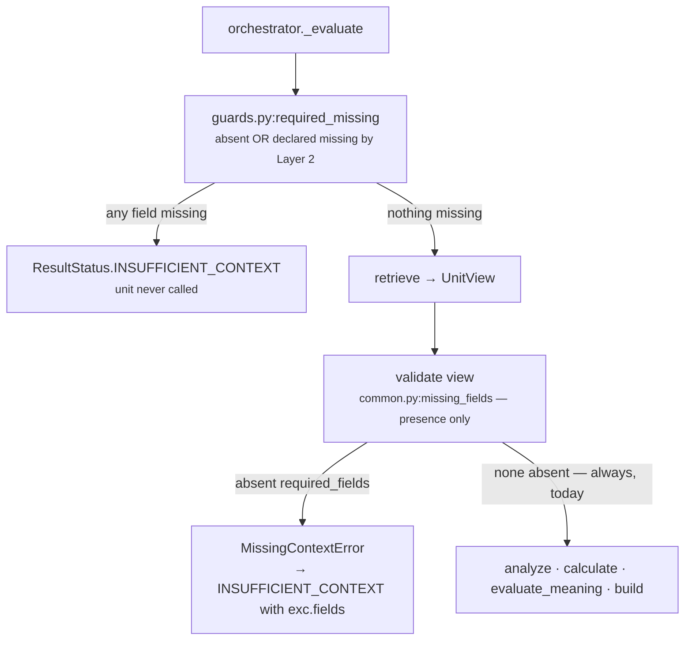

# 01 · Input and Validator — `core.resource`

**Stage 1 (Input):** `unit.py:ReasoningUnit.evaluate(request, prior_results)` — fixed by the framework
**Stage 2 (Validator):** `unit.py:ReasoningUnit.validate(view)` — **base implementation, not overridden**

---

## 1 · What it is for

The Validator's job in the framework is to refuse inputs that cannot support a conclusion, so a unit
never fabricates an answer out of a snapshot that could not carry one. `core.resource` declines that
job on purpose: **there is no input this unit refuses.** Every fact it reads is optional, and the
absence of all of them is itself a reportable finding — *nobody measured capacity* — which is
strictly more useful to a human than a typed abstention that leaves the play with no capacity row at
all.

That decision is not written as an override. It is written as an empty `required_fields` declaration
in Layer 3, which the base validator then enforces to nothing.

---

## 2 · What exists

### 2.1 · Stage 1 — the input pair

```python
def evaluate(self, request: ReasoningRequest,
             prior_results: Mapping[str, ReasonerResult]) -> ReasonerResult:
```

| Argument | Type | What `core.resource` does with it |
|---|---|---|
| `request` | `contracts/reasoning.py:ReasoningRequest` | reads `request.context.facts` (via `common.py:fact_value`), `request.context.evidence` (via `common.py:evidence_ids`), `request.evaluation_time`, and `request.capability.plays` |
| `prior_results` | `Mapping[str, ReasonerResult]` — **declared dependencies only** | **nothing.** The module never calls `view.prior_metric` and `spec.dependencies` is `()` |

The parts of the request this unit never touches: `context.neighbor_facts`, `context.missing_fields`,
`capability.policies`, `capability.goal`, `trigger_kind`, `org_id`, `config_snapshot_id`. It reads
`capability.plays` only for their `play_id`, in `evaluate_meaning`, and never for `read_only`,
`preconditions`, `tags` or `metadata`.

Taking no prior results is what makes this unit safe to place anywhere in a plan. It cannot be
switched off by a missing dependency declaration the way `core.opportunity`'s `stalled_but_open`
plugin can — see the framework README §4.3 for that failure mode.

### 2.2 · Stage 2 — the validator, verbatim from the base class

```python
def validate(self, view: UnitView) -> None:
    absent = missing_fields(view.request, view.spec.required_fields)
    if absent:
        raise MissingContextError(*absent)
```

`ResourceUnit` defines no `validate`. `common.py:missing_fields` returns the sorted subset of
`spec.required_fields` that is absent from `request.context.facts` — or, for a `neighbor:`-prefixed
field, absent from `request.context.neighbor_facts`.

### 2.3 · What the capability declares

`packs/capabilities/deal_cooling_v2.py`:

```python
_spec("core.resource"),
```

which expands, through the module's `_spec` helper, to:

| Field | Value |
|---|---|
| `reasoner_id` | `"core.resource"` |
| `version` | `REASONER_VERSION` |
| `dependencies` | `()` |
| **`required_fields`** | **`()`** |
| `latency_budget_ms` | `60` |
| `failure_policy` | `FailurePolicy.OPTIONAL` — `"core.resource"` is not in `_REQUIRED` |
| `config` | `{}` |

`required_fields` is empty, therefore `missing_fields` returns `()`, therefore `validate` never
raises. **In the shipped system this unit cannot produce `INSUFFICIENT_CONTEXT`.**

`FailurePolicy.OPTIONAL` matters too: if a config typo makes `evaluate_meaning` raise, the
orchestrator records a `FAILED` result for this unit and the run continues without capacity rows,
rather than the whole capability going dark. Compare `core.constraint`, which is `REQUIRED` — there,
a fault takes the decision with it.

---

## 3 · How it works



Two definitions of *missing* coexist, and the stricter one runs first.

| Predicate | Where | Counts a field missing when |
|---|---|---|
| `guards.py:required_missing` | orchestrator, **before** `evaluate` is called | it is absent from the facts **or** Layer 2 published it in `context.missing_fields` |
| `common.py:missing_fields` | the unit's own `validate` | it is absent from the facts |

In the orchestrated path the unit's own validator is therefore unreachable — the orchestrator has
already pre-empted the call for any field it would have rejected. The unit's validator matters only
when the unit is constructed and evaluated directly, which is exactly what
`tests/test_unit_resource_unit.py:_evaluate` does. Both paths agree today because both see an empty
tuple.

### Why the validator is empty rather than emptied

`core.constraint` faces the same question and answers it by *overriding* `validate` to a no-op, with
a written argument: *"a unit that returned INSUFFICIENT_CONTEXT here would silently drop the gate
rather than close it."* `core.resource` reaches the same place by a different route — it simply
declares nothing — and the argument is the same in shape but weaker in stakes:

- A gate that abstains lets a blocked play through. That is a safety failure.
- A resource unit that abstains produces **no capacity row at all** for any play. That is an
  information failure: the card would show nothing about capacity, which reads identically to
  *capacity was fine*.

The unknown branch of `evaluate_meaning` exists precisely to avoid that. It emits a WARN carrying
`resource_capacity_unknown` on every play, so *no facts* produces a visible statement rather than a
silence. Abstaining would throw that statement away, so the unit is built never to abstain.

---

## 4 · Examples and edge cases

### 4.1 · The shipped configuration — nothing declared

```text
spec.required_fields = ()
context.facts        = {"deal.status": "open", "deal.last_inbound": "..."}   # no resource facts

missing_fields(request, ()) == ()      → validate returns
analyze                                → 0 observations
calculate                              → {"resource_signal_count": 0}
evaluate_meaning                       → matched None, WARN resource_capacity_unknown per play
```

`test_unknown_capacity_warns_rather_than_inventing_a_shortfall` asserts exactly this on a snapshot of
`{"deal.status": "open"}`.

### 4.2 · A capability that *did* declare a required field

Nothing in the roster does, but the behaviour is worth stating because it is one line of manifest
away. With `required_fields=("deal.owner",)` and a snapshot that has no `deal.owner`:

```text
missing_fields → ("deal.owner",)
validate       → raise MissingContextError("deal.owner")
orchestrator   → ReasonerResult(status=INSUFFICIENT_CONTEXT, missing_fields=("deal.owner",))
```

and, because `ReasonerResult.__post_init__` forbids a non-`COMPLETED` result from carrying anything:
**no metrics, no findings, no checks.** Every play loses its capacity row. That is the outcome the
empty declaration is avoiding, and it is why adding a `required_field` to this spec is a behavioural
change dressed as a configuration change.

### 4.3 · Layer 2 declaring a fact known-absent

If Layer 2 published `context.missing_fields = ("deal.owner",)` while `required_fields` stayed empty,
`required_missing` returns `()` — it only inspects the declared fields — so the unit runs normally
and `deal.owner` is simply not in `facts`. `OwnerAvailabilityPlugin` sees `"deal.owner" not in
request.context.facts`, treats it as never captured, and contributes nothing. The known-absent signal
Layer 2 took the trouble to publish is **not** read by this unit, and the `owner_unassigned`
observation — which is the closest thing it has to a *we looked and found nobody* claim — is reached
only through an empty-string value, not through `missing_fields`. A small, real gap between the two
vocabularies for absence.

### 4.4 · Malformed input is not a validator concern

The validator checks presence, never shape. A `deal.owner` of `12345`, an `owner.availability_bp` of
`"plenty"`, a `commitment.due_at` of `"soon"` — all pass validation and are handled by the plugins,
each of which degrades to silence rather than to a value:

| Input | Validator | Plugin |
|---|---|---|
| `{"owner.availability_bp": "plenty"}` | passes | `basis_points` raises, caught, returns `None` → no observation |
| `{"commitment.due_at": "soon"}` | passes | `parse_time` raises, caught → no observation |
| `{"owner.open_items": "many"}` | passes | `_optional_int` catches, returns `None` → no observation |
| `{"owner.availability_bp": 12_000}` | passes | `basis_points` rejects out-of-range → no observation |
| `{"budget.total_minor": 0}` | passes | `total <= 0` → no observation |

The one place malformed input *does* raise is `spec.config`, not `context.facts` — see
[README §5](README.md#5--configuration). The split is deliberate: facts come from the world and may be
dirty, config comes from an author and a dirty one is a bug that should stop.

---

## Related

| Document | Covers |
|---|---|
| [README.md](README.md) | The unit's map |
| [02-Retriever.md](02-Retriever.md) | Why an empty `required_fields` also empties `view.facts` |
| [05-Evaluator.md](05-Evaluator.md) | The unknown branch that makes abstention unnecessary |
| [../../README.md](../../README.md) | §4.1 — the two definitions of *missing* and why retrieve runs before validate |
