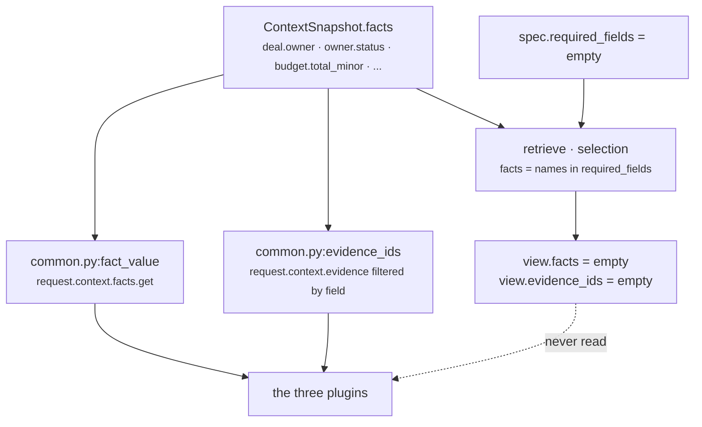

# 02 · Retriever — `core.resource`

**Stage 3:** `unit.py:ReasoningUnit.retrieve(request, spec, prior)` — **base implementation, not overridden**

---

## 1 · What it is for

The Retriever's job is to select the slice of the frozen snapshot this unit is allowed to look at, so
a reviewer can answer *what did this unit see?* without reading its body. It never fetches: Layer 2
already froze the `ContextSnapshot` and Layer 4 hashed its content into the request id, so any unit
that reached for a database would be reading state the decision was never hashed against.

`core.resource` uses the base implementation unchanged, and the effect is unusual enough to be worth
stating up front: **the selected slice is empty, and every plugin reads around it.**

---

## 2 · What exists

The inherited body, in full:

```python
def retrieve(self, request: ReasoningRequest, spec: ReasonerSpec,
             prior: Mapping[str, ReasonerResult]) -> UnitView:
    wanted = tuple(field for field in spec.required_fields
                   if not field.startswith("neighbor:"))
    facts = {name: request.context.facts[name]
             for name in wanted if name in request.context.facts}
    evidence = tuple(sorted(item.evidence_id for item in request.context.evidence
                            if item.field in facts))
    return UnitView(request=request, spec=spec, prior=prior,
                    facts=MappingProxyType(facts), evidence_ids=evidence)
```

`ResourceUnit` defines no `retrieve`. What the base gives it:

| `UnitView` field | Value for `core.resource` | Used by the unit |
|---|---|---|
| `request` | the whole `ReasoningRequest`, unmodified | **yes** — every plugin, through `view.request` |
| `spec` | the capability's `ReasonerSpec` for `core.resource` | **yes** — through the `view.config` property |
| `prior` | `{}` — `spec.dependencies` is `()` | no |
| `facts` | `MappingProxyType({})` — `required_fields` is `()`, so `wanted` is empty | **no** |
| `evidence_ids` | `()` — derived from `facts`, which is empty | yes, but vacuously: `build` unions an empty set |

---

## 3 · How it works, and the consequence



Every plugin reaches past the view to the raw snapshot:

```python
owner = str(fact_value(request, "deal.owner") or "").strip()          # OwnerAvailabilityPlugin
declared = fact_value(request, load_field)                            # WorkloadSaturationPlugin
raw = fact_value(view.request, field)                                 # HeadroomPlugin._deadline
```

`common.py:fact_value` reads `request.context.facts`, not `view.facts`. So does
`common.py:evidence_ids`, which scans `request.context.evidence` directly.

**This is a real gap, not a designed asymmetry.** The stated purpose of `UnitView` is that *"a unit's
inputs are visible in one place and a reviewer can see exactly what it was allowed to look at"*. For
`core.resource` that promise does not hold: the view says the unit looked at nothing, and the unit in
fact reads ten fact names. The bounded window is bounded only by what the code happens to ask for.

It is not, however, a *correctness* problem, for two reasons that are worth separating:

1. **Determinism is unaffected.** `request.context.facts` is as frozen as `view.facts` is. Reading
   around the selection changes nothing about replayability.
2. **Evidence citation is still constrained.** The unit's evidence ids come from each plugin's
   `evidence_ids(request, ...)` call, which resolves ids out of the same frozen
   `context.evidence` tuple, and `guards.py:validate_evidence_references` re-checks at the
   orchestrator boundary that every cited id exists in the snapshot. A plugin cannot cite a row it
   invented.

The cost is reviewability, and one avenue that stays closed: because `required_fields` is empty,
adding a field to it would *both* populate `view.facts` **and** create an abstention path
([01 §4.2](01-Input-and-Validator.md#42--a-capability-that-did-declare-a-required-field)). The two
behaviours are welded to the same declaration, so the unit cannot get a documented input surface
without also getting a failure mode it does not want. Untangling that would need either a separate
`selected_fields` declaration on `ReasonerSpec` or a `retrieve` override on this unit. Neither
exists.

### What an override would look like, and why it was not written

A three-line override selecting the ten optional fact names would populate `view.facts` and
`view.evidence_ids` honestly:

```text
_READS = ("deal.owner", "owner.availability_bp", "owner.status",
          "owner.load_bp", "owner.open_items", "team.load_bp", "team.open_items",
          "budget.remaining_minor", "budget.total_minor", <deadline_field>)
```

The complication is the last entry: the deadline field name is **configurable** and is only known
from `spec.config["deadline_field"]`, so the selection is not a constant. That is presumably why the
plugins read the snapshot directly. It is solvable — `retrieve` receives `spec` and could read the
config key itself — but it was not solved, and the deadline field would also have to be validated in
two places instead of one.

---

## 4 · Where the evidence actually comes from

Since `view.evidence_ids` is always empty, **all** of the result's evidence is contributed by
observations, and `build` unions it:

```python
evidence = set(view.evidence_ids)                 # empty
for observation in observations:
    evidence.update(observation.evidence_ids)     # everything
...
evidence_ids=tuple(sorted(evidence))
```

Each plugin cites exactly the fields its claim stood on:

| Observation `kind` | `evidence_ids(request, ...)` called with |
|---|---|
| `resource.owner_unassigned` | `"deal.owner"` |
| `resource.owner_availability` | `"deal.owner"`, `"owner.availability_bp"`, `"owner.status"` |
| `resource.owner_workload` | `"owner.load_bp"`, `"owner.open_items"` |
| `resource.team_workload` | `"team.load_bp"`, `"team.open_items"` |
| `resource.budget_headroom` | `"budget.remaining_minor"`, `"budget.total_minor"` |
| `resource.deadline_headroom` | the configured deadline field name |

`common.py:evidence_ids` matches on `EvidenceRef.field` and **ignores `EvidenceRef.context_scope`** —
the same limitation the framework README §3.1 records for the base retriever. A neighbour-scoped
evidence row whose field is named `owner.status` would be attached to this unit's result as though
the unit had observed it. Harmless today because no shipped capability produces a colliding name.

Note the citation is *by field*, not *by value used*. `resource.owner_availability` cites all three
owner field names whenever any of them produced the reading, so a run that derived capacity from
`owner.status` still cites `owner.availability_bp` if an evidence row for that field happens to
exist. Over-citation, never under-citation — which is the safe direction for an audit trail, but it
does mean an evidence id on this result is *"a fact the claim was drawn from the neighbourhood of"*
rather than *"the fact that produced this number"*.

---

## 5 · Examples and edge cases

### 5.1 · The evidence test, traced

`test_the_unit_cites_the_evidence_its_observations_stood_on`:

```text
facts    = {"deal.owner": "dana_whitfield", "owner.availability_bp": 1000}
evidence = (EvidenceRef("ev_owner", "deal.owner", "dana_whitfield"),
            EvidenceRef("ev_avail", "owner.availability_bp", 1000))

retrieve  → view.facts = {}          view.evidence_ids = ()
analyze   → owner_availability emits one observation
            evidence_ids(request, "deal.owner", "owner.availability_bp", "owner.status")
            → fields present in evidence: deal.owner, owner.availability_bp
            → sorted → ("ev_avail", "ev_owner")
build     → set(()) | {"ev_avail", "ev_owner"} → ("ev_avail", "ev_owner")
```

`assert result.evidence_ids == ("ev_avail", "ev_owner")`. Note the sort is on the **evidence id**,
not on the field name — `ev_avail` precedes `ev_owner` alphabetically, which happens to be the
reverse of the field order the plugin asked for. Any ordering that depended on argument order would
be a hash instability, so the sort is load-bearing.

### 5.2 · Facts with no evidence rows

Every test in the suite except the one above passes `evidence=()`. The plugins still fire, still
produce metrics, and `evidence_ids(...)` returns `()`. The result carries
`evidence_ids == ()` while asserting real numbers — a capacity claim standing on nothing citable.

Nothing in Layer 4 rejects that. `guards.py:validate_evidence_references` only checks that cited ids
*exist*; it does not require that a claim cite anything. If evidence-backing for resource claims ever
becomes a requirement, it has to be added — this unit does not enforce it, and the
`evidence_required` capability policy is checked by `core.constraint` against plays, not against
reasoner findings.

### 5.3 · A fact stored as a record rather than a scalar

`common.py:fact_value` unwraps one level:

```python
record.get("value") if isinstance(record, Mapping) and "value" in record else record
```

So `{"deal.owner": {"value": "dana_whitfield", "captured_at": "..."}}` reads as
`"dana_whitfield"`. But `OwnerAvailabilityPlugin` decides *captured-ness* with a raw key check —
`"deal.owner" in request.context.facts` — which is unaffected by the wrapping. The two reads are
consistent for every shape a fact can take, including `{"value": None}`, which unwraps to `None`,
becomes `""` after `str(None or "")`, and is therefore read as *captured and empty* →
`resource.owner_unassigned`. That is the right reading: Layer 2 published a record for the field and
the record's value is nothing.

---

## Related

| Document | Covers |
|---|---|
| [README.md](README.md) | The unit's map; gap 6 is this document's §3 |
| [01-Input-and-Validator.md](01-Input-and-Validator.md) | Why `required_fields` is empty in the first place |
| [06-Builder-and-Metrics.md](06-Builder-and-Metrics.md) | How `build` unions observation evidence into the result |
| [../../README.md](../../README.md) | §3.1 — the base retriever's two known limitations |
